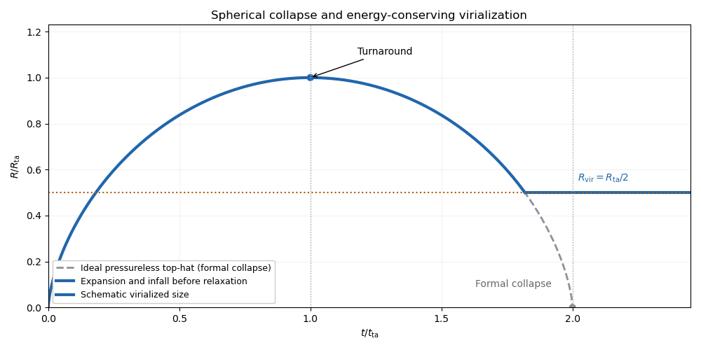
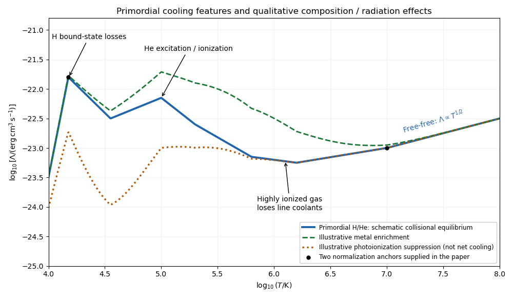
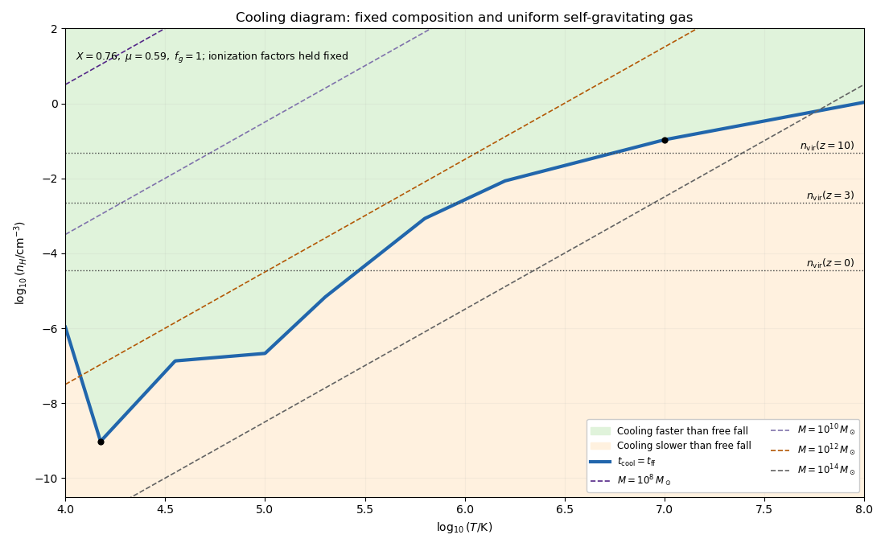
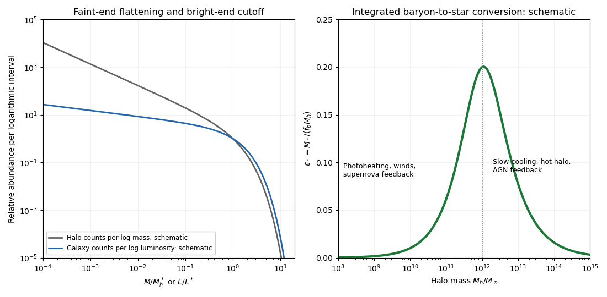

# Paper 60

↑ **Parent:** [Iii](../iii.md)

[https://www.maths.cam.ac.uk/postgrad/part-iii/files/pastpapers/2012/paper_60.pdf](https://www.maths.cam.ac.uk/postgrad/part-iii/files/pastpapers/2012/paper_60.pdf)

**Table of contents**

- [1](#1)
  - [i](#1/i)
    - [Solution](#1/i/solution)
  - [ii](#1/ii)
    - [Solution](#1/ii/solution)
- [2](#2)
  - [i](#2/i)
    - [Solution](#2/i/solution)
  - [ii](#2/ii)
    - [Solution](#2/ii/solution)
- [3](#3)
  - [i](#3/i)
    - [Solution](#3/i/solution)
  - [ii](#3/ii)
    - [Solution](#3/ii/solution)
  - [iii](#3/iii)
    - [Solution](#3/iii/solution)
- [4](#4)
  - [i](#4/i)
    - [Solution](#4/i/solution)
  - [ii](#4/ii)
    - [Solution](#4/ii/solution)
  - [iii](#4/iii)
    - [Solution](#4/iii/solution)

## 1

↑ **Parent:** [Paper 60](paper-60.md)

<h3 id="1/i">i</h3>

↑ **Parent:** [1](#1)

<h4 id="1/i/solution">Solution</h4>

↑ **Parent:** [I](#1/i)

In the [spherical-collapse model](../../../large-scale-structure-of-the-universe.md#spherical-collapse-model), a bound overdense region initially expands with the background, but its additional [Newtonian gravity](../../../classical-mechanics.md#gravitational-acceleration) slows that expansion. Its outer shell reaches a maximum [turnaround radius](../../../large-scale-structure-of-the-universe.md#turnaround-radius), where its radial velocity is zero, and then falls inward. A perfectly spherical pressureless solution formally collapses to zero radius. In a realistic collisionless system, deviations from that idealization, [shell crossing](../../../large-scale-structure-of-the-universe.md#shell-crossing) and [violent relaxation](../../../galaxy.md#violent-relaxation) convert coherent infall into random motions, producing a roughly stationary bound object.

**[Figure 1](#1/i/image-spherical-expansion-turnaround-formal-collapse-and-a-schematic-virialized-radius). Spherical expansion, turnaround, formal collapse and a schematic virialized radius**.

Let the [Newtonian gravitational potential energy](../../../classical-mechanics.md#newtonian-gravitational-potential-energy) of the homologous sphere be $U=-aGM^2/R$, where $a=3/5$ for a uniform sphere. At [spherical-collapse turnaround](../../../large-scale-structure-of-the-universe.md#turnaround-of-spherical-collapse), the [kinetic energy](../../../classical-mechanics.md#kinetic-energy) of the bulk motion vanishes, so $E=U_{\rm ta}$. For the settled object, the [virial theorem](../../../classical-mechanics.md#virial-theorem) gives $2K_{\rm vir}+U_{\rm vir}=0$ and hence $E=U_{\rm vir}/2$. If energy and mass are conserved and the structure coefficient is unchanged,

$$
-\frac{aGM^2}{R_{\rm ta}}=-\frac{aGM^2}{2R_{\rm vir}},\qquad \boxed{R_{\rm vir}=\frac12R_{\rm ta}.}
$$

This is the [virial radius from turnaround energy](../../../large-scale-structure-of-the-universe.md#virial-radius-from-turnaround-energy). It assumes negligible external pressure, mass loss and energy exchange. If the final structure coefficient differs, $R_{\rm vir}=(a_{\rm vir}/2a_{\rm ta})R_{\rm ta}$ instead. **Half the turnaround radius is an idealized equilibrium size, not the radius at which each collisionless particle stops moving.** The plotted settling time is schematic; the usual collapse-time convention is $t_{\rm coll}=2t_{\rm ta}$.

<h3 id="1/ii">ii</h3>

↑ **Parent:** [1](#1)

<h4 id="1/ii/solution">Solution</h4>

↑ **Parent:** [Ii](#1/ii)

Use the [Einstein-de Sitter universe](../../../large-scale-structure-of-the-universe.md#einstein-de-sitter-universe) relations $H=2/(3t)$ and $\bar\rho\propto t^{-2}$. Write $H_{\rm ta}=H(t_{\rm ta})$ and $R_{\rm ta}=R(t_{\rm ta})$. Since $M=(4\pi/3)\Delta_{\rm ta}\bar\rho_{\rm ta}R_{\rm ta}^3$,

$$
\frac{GM}{H_{\rm ta}^2R_{\rm ta}^3}=\frac{\Delta_{\rm ta}}2,\qquad \frac{d^2y}{d\tau^2}=-\frac{\Delta_{\rm ta}}{2y^2}.
$$

The dimensionless first integral with zero velocity at $y=1$ is $(dy/d\tau)^2=\Delta_{\rm ta}(1/y-1)$. On the expanding branch this gives

$$
\tau(y)=\frac1{\sqrt{\Delta_{\rm ta}}}\int_0^y\sqrt{\frac{u}{1-u}}\,du.
$$

Evaluating the integral gives the inverse-trigonometric expression in the source. Alternatively, differentiate it: $d\tau/dy=\Delta_{\rm ta}^{-1/2}\sqrt{y/(1-y)}$, so differentiation of the first integral gives exactly the required [equation of motion](../../../classical-mechanics.md#equation-of-motion). At $y=1$, the integral equals $\pi/2$. Thus $\tau_{\rm ta}=2/3$ fixes $\sqrt{\Delta_{\rm ta}}=3\pi/4$. The collapsing branch is $\tau=4/3-\tau_{\rm expand}(y)$, not the same increasing inverse function.

For the early-time [density contrast](../../../linear-cosmological-density-perturbation.md#density-contrast), expand the integral directly:

$$
\boxed{\tau=\frac{8}{9\pi}y^{3/2}\left(1+\frac{3y}{10}+O(y^2)\right).}
$$

**The leading coefficient in the printed small-radius approximation needs correction to $8/(9\pi)$.** The printed coefficient is inconsistent with both the exact integral and approach to the homogeneous background. Indeed, the nonlinear [density contrast](../../../linear-cosmological-density-perturbation.md#density-contrast) satisfies

$$
1+\delta_{\rm NL}=\Delta_{\rm ta}\frac{(t/t_{\rm ta})^2}{y^3}=\Delta_{\rm ta}\frac{9\tau^2}{4y^3}=1+\frac35y+O(y^2).
$$

Hence $\delta_{\rm L}\sim3y/5$. In the [Einstein-de Sitter universe](../../../large-scale-structure-of-the-universe.md#einstein-de-sitter-universe) the growing [linear cosmological density perturbation](../../../linear-cosmological-density-perturbation.md) is proportional to $t^{2/3}$, so its extrapolation is

$$
\delta_{\rm L}(\tau)=\frac35\left(\frac{9\pi\tau}{8}\right)^{2/3}.
$$

The formal collapse occurs at $\tau_{\rm coll}=4/3$, giving the [linear spherical-collapse threshold](../../../large-scale-structure-of-the-universe.md#linear-spherical-collapse-threshold)

$$
\boxed{\delta_{\rm L}(t_{\rm coll})=\frac35\left(\frac{3\pi}{2}\right)^{2/3}\simeq1.686.}
$$

The actual nonlinear [density contrast](../../../linear-cosmological-density-perturbation.md#density-contrast) diverges at collapse; the finite number is the extrapolated linear amplitude. Equivalently, the full [spherical-collapse model](../../../large-scale-structure-of-the-universe.md#spherical-collapse-model) has $y=(1-\cos\theta)/2$ and $\tau=2(\theta-\sin\theta)/(3\pi)$, with turnaround at $\theta=\pi$ and formal collapse at $2\pi$. Combining the half-radius estimate with the background-density decrease up to $2t_{\rm ta}$ gives $\rho_{\rm vir}/\bar\rho(t_{\rm coll})=32\Delta_{\rm ta}=18\pi^2$.

## 2

↑ **Parent:** [Paper 60](paper-60.md)

<h3 id="2/i">i</h3>

↑ **Parent:** [2](#2)

<h4 id="2/i/solution">Solution</h4>

↑ **Parent:** [I](#2/i)

The physical radius comes from the [angular diameter distance](../../../cosmology.md#angular-diameter-distance), not the luminosity distance. In the specified flat cosmology,

$$
D_A(z)=\frac{c}{1+z}\int_0^z\frac{dz'}{H(z')}.
$$

Using the supplied distance-integral approximation at $z=1$ and $c\simeq3.00\times10^5\,\mathrm{km\,s^{-1}}$ gives $D_A\simeq(c/70)(0.8/2)=1714\,\mathrm{Mpc}$. The angular radius in radians is $(7/12)\pi/(180\times3600)=2.828\times10^{-6}$. Thus

$$
\boxed{R_d=D_A\theta\simeq4.85\,\mathrm{kpc}.}
$$

This is a proper radius at the observation epoch; its comoving counterpart would be twice as large. The supplied approximate integral is sufficient here; integrating the specified [Hubble parameter](../../../cosmology.md#hubble-parameter) numerically gives a slightly smaller radius, about $4.82\,\mathrm{kpc}$.

<h3 id="2/ii">ii</h3>

↑ **Parent:** [2](#2)

<h4 id="2/ii/solution">Solution</h4>

↑ **Parent:** [Ii](#2/ii)

Take the retained disc mass to be the [cosmic baryon fraction](../../../cosmology.md#cosmic-baryon-fraction) of the total [dark matter halo](../../../large-scale-structure-of-the-universe.md#dark-matter-halo) mass: $M_d=f_bM_h$, where $f_b=0.05/0.25=0.2$. Adopt $v_{\rm vir}^2=GM_h/r_{\rm vir}$ and describe the disc gravity by $v_d^2=C_dGM_d/R_d$. The structure coefficient $C_d$ must be stated: the scale-free [Mestel disc](../../../astrophysics.md#mestel-disk) gives $C_d=1$ when its flat rotation speed and enclosed mass are used, while a finite disc requires boundary and thickness information. The equality of edge [specific angular momentum](../../../classical-mechanics.md#specific-angular-momentum) gives $R_dv_d=q r_{\rm vir}v_{\rm vir}$, with $q=0.1$. Combining these relations gives the [angular-momentum-conserving self-gravitating disc radius](../../../astrophysics.md#angular-momentum-conserving-self-gravitating-disc-radius):

$$
\frac{v_d}{v_{\rm vir}}=\frac{C_df_b}{q}=2C_d,\qquad \frac{r_{\rm vir}}{R_d}=\frac{C_df_b}{q^2}=20C_d.
$$

With the commonly intended $C_d\simeq1$ approximation,

$$
\boxed{v_{\rm vir}\simeq105\,\mathrm{km\,s^{-1}},\qquad r_{\rm vir}\simeq97.0\,\mathrm{kpc}.}
$$

The corresponding masses are $M_h\simeq2.49\times10^{11}M_\odot$ and $M_d\simeq4.97\times10^{10}M_\odot$, where $M_\odot$ is the [solar mass](../../../stellar-astrophysics.md#solar-mass).

For a definite formation estimate, assume the [dark matter halo](../../../large-scale-structure-of-the-universe.md#dark-matter-halo) acquired this mass and radius at [virial equilibrium](../../../classical-mechanics.md#virial-equilibrium), retained them afterward, and had mean density $\Delta_v\bar\rho_m(z_f)$ with $\Delta_v=18\pi^2$. This uses the matter-dominated [spherical-collapse model](../../../large-scale-structure-of-the-universe.md#spherical-collapse-model) as an approximation to the specified matter-plus-vacuum cosmology. Since $\bar\rho_m(z_f)=3H_0^2\Omega_{m0}(1+z_f)^3/(8\pi G)$,

$$
\left(\frac{v_{\rm vir}}{r_{\rm vir}}\right)^2=\frac{\Delta_v}{2}H_0^2\Omega_{m0}(1+z_f)^3,
\qquad \boxed{z_f\simeq1.21.}
$$

The approximate distance therefore gives formation modestly before observation. Using the numerical rather than approximate distance integral gives $z_f\simeq1.22$, within the accuracy of these structural assumptions. The calculation also assumes inclination-corrected spectroscopy, negligible disc pressure support, conserved edge [specific angular momentum](../../../classical-mechanics.md#specific-angular-momentum), no substantial later accretion or mergers, and no significant baryon loss.

**This formation redshift is model-dependent, not uniquely fixed by the stated disc data.** Keeping $C_d$ explicit gives $1+z_f\simeq2.209C_d^{-4/3}(\Delta_v/18\pi^2)^{-1/3}$. In particular, replacing the mean-density convention by $200$ times the [critical density](../../../cosmology.md#critical-density) gives $H(z_f)=v_{\rm vir}/(10r_{\rm vir})$ and $z_f\simeq0.87$, later than the observation. That inconsistent chronological result cannot be silently used as the formation epoch.

There is a further idealization in applying $C_d=1$ exactly at the edge: an abruptly truncated [razor-thin disc](../../../astrophysics.md#razor-thin-disk-approximation) with nonzero edge [surface density of a disk](../../../astrophysics.md#surface-density-of-a-disk) has a logarithmically divergent in-plane force at that edge. Locally the available mass occupies a half-plane, and its radial contribution is proportional to $G\Sigma_d\int_{\epsilon}^{\ell}ds/s$, with no opposite exterior half-plane to cancel it. Finite thickness or a smooth taper removes that [sharp-edge force singularity of a thin disk](../../../astrophysics.md#sharp-edge-force-singularity-of-a-thin-disk). Thus $C_d=1$ is an explicitly qualified [Mestel disc](../../../astrophysics.md#mestel-disk) or monopole-scale approximation, not an exact finite-disc calculation; [enclosed mass does not determine a disc rotation curve](../../../galaxy.md#enclosed-mass-does-not-determine-a-disc-rotation-curve).

## 3

↑ **Parent:** [Paper 60](paper-60.md)

<h3 id="3/i">i</h3>

↑ **Parent:** [3](#3)

<h4 id="3/i/solution">Solution</h4>

↑ **Parent:** [I](#3/i)

For an optically thin low-density gas in [collisional ionization equilibrium](../../../physics.md#collisional-ionization-equilibrium), the [astrophysical cooling function](../../../thermodynamics.md#astrophysical-cooling-function) collects losses per pair of hydrogen nuclei into $\mathcal C=n_H^2\Lambda(T)$. Its units are $\mathrm{erg\,cm^3\,s^{-1}}$; the time unit is missing from the printed guide to the vertical-axis labels. For the [primordial atomic cooling curve](../../../thermodynamics.md#primordial-atomic-cooling-curve), only [hydrogen](../../../chemistry.md#hydrogen) and [helium](../../../chemistry.md#helium) provide bound-state coolants.

**[Figure 2](#3/i/image-schematic-primordial-cooling-function-with-hydrogen-and-helium-features-metal-enrichment-and-photoionization-effects). Schematic primordial cooling function with hydrogen and helium features, metal enrichment and photoionization effects**.

Near $10^4\,\mathrm K$, [collisional excitation](../../../physics.md#collisional-excitation) of [hydrogen](../../../chemistry.md#hydrogen) becomes effective and subsequent photon emission removes thermal energy. The excitation rate is exponentially suppressed below the atomic energy threshold. [Atomic line cooling](../../../thermodynamics.md#atomic-line-cooling) and [collisional ionization](../../../physics.md#collisional-ionization) generate a strong hydrogen feature around a few $10^4\,\mathrm K$; helium excitation and ionization produce further structure around $10^5\,\mathrm K$. [Radiative recombination](../../../physics.md#radiative-recombination) also contributes. Once the gas is highly ionized, these bound-state losses weaken. At $T\gtrsim10^6$–$10^7\,\mathrm K$, [thermal bremsstrahlung](../../../astrophysics.md#thermal-bremsstrahlung) dominates, with approximately $\Lambda\propto T^{1/2}$ apart from slowly varying factors. The figure is an original qualitative sketch anchored to the two supplied values, not an atomic-rate calculation.

Increasing [galactic metallicity](../../../galaxy.md#galactic-metallicity) adds many ionic transitions, producing [metal-line cooling](../../../thermodynamics.md#metal-line-cooling) and substantially enhancing cooling, particularly in the $10^5$–$10^7\,\mathrm K$ range. Metals also provide low-energy fine-structure transitions below $10^4\,\mathrm K$. The change is not a uniform vertical shift: the positions and strengths of features depend on the elemental abundances and ionization state.

[Photoionization](../../../physics.md#photoionization) removes bound electrons even where collisions alone would leave atoms neutral, often suppressing the hydrogen and helium line peaks and changing the metal-ion population. It also adds [photoionization heating](../../../physics.md#photoionization-heating). The net thermal loss is then $\mathcal C-\mathcal H$, with possible heating-cooling equilibrium near $10^4\,\mathrm K$. A single density-independent $\Lambda(T)$ no longer describes every irradiated cloud: the answer also depends on radiation intensity, spectrum, shielding and density. The illustrative photoionized curve denotes altered cooling alone, not the net loss including heating.

Below $10^4\,\mathrm K$, primordial gas can use [molecular line cooling](../../../thermodynamics.md#molecular-line-cooling), especially rotational and vibrational transitions of [molecular hydrogen](../../../chemistry.md#molecular-hydrogen) and, in suitable chemical conditions, [hydrogen deuteride](../../../chemistry.md#hydrogen-deuteride). Molecule formation and protection against photodissociation are essential. Enriched gas can additionally use [metal-line cooling](../../../thermodynamics.md#metal-line-cooling), other molecular species and [dust thermal emission](../../../thermodynamics.md#dust-thermal-emission), with gas-dust energy exchange important at high density. At high [cosmological redshift](../../../cosmology.md#cosmological-redshift), residual free electrons can transfer energy to the [cosmic microwave background](../../../cosmology.md#cosmic-microwave-background) through [Compton cooling by the cosmic microwave background](../../../thermodynamics.md#compton-cooling-by-the-cosmic-microwave-background) if the gas is hotter than the radiation. Expansion can also cool gas adiabatically, but neither that process nor [Compton cooling by the cosmic microwave background](../../../thermodynamics.md#compton-cooling-by-the-cosmic-microwave-background) is an $n_H^2$ atomic loss law. **The atomic threshold is a cooling-channel limitation, not a universal minimum gas temperature.**

<h3 id="3/ii">ii</h3>

↑ **Parent:** [3](#3)

<h4 id="3/ii/solution">Solution</h4>

↑ **Parent:** [Ii](#3/ii)

Let $X$ be the [hydrogen mass fraction](../../../stellar-astrophysics.md#hydrogen-mass-fraction), $f_g=\rho_g/\rho_{\rm tot}$ the gravitating gas fraction, and $\chi=n_{\rm tot}/n_H$ the total-particle-to-hydrogen ratio. The [optically thin gas cooling time](../../../thermodynamics.md#optically-thin-gas-cooling-time) and [free-fall time of a uniform sphere](../../../astrophysics.md#free-fall-time-of-a-uniform-sphere) are

$$
t_{\rm cool}=\frac{(3/2)n_{\rm tot}k_BT}{n_H^2\Lambda}=\frac{3\chi k_BT}{2n_H\Lambda},\qquad t_{\rm ff}=\sqrt{\frac{3\pi Xf_g}{32Gm_pn_H}},
$$

where $\rho_{\rm tot}=m_pn_H/(Xf_g)$. Equating them gives the [cooling-to-free-fall equality curve](../../../thermodynamics.md#cooling-to-free-fall-equality-curve):

$$
\boxed{n_{H,{\rm crit}}(T)=\frac{32Gm_p}{3\pi Xf_g}\left(\frac{3\chi k_BT}{2\Lambda(T)}\right)^2.}
$$

At fixed composition, its shape is $n_{\rm crit}\propto T^2/\Lambda^2$. **Gas above this curve cools faster than it falls; gas below it cools more slowly.** Strong line cooling produces a deep low-density trough. In the high-temperature free-free regime, $\Lambda\propto T^{1/2}$ gives $n_{\rm crit}\propto T$.

**[Figure 3](#3/ii/image-cooling-versus-free-fall-diagram-with-uniform-cloud-virial-mass-contours-and-illustrative-virial-densities). Cooling versus free-fall diagram with uniform-cloud virial mass contours and illustrative virial densities**.

The displayed uniform self-gravitating-cloud example uses $f_g=1$, $X=0.76$, $\mu\simeq0.59$ and $\chi\simeq2.24$. Holding these ionized-gas factors fixed makes the diagram transparent, but near the atomic threshold their actual temperature dependence changes numerical normalizations. With these conventions the supplied cooling values imply $n_{\rm crit}(1.5\times10^4\,\mathrm K)\simeq9.6\times10^{-10}\,\mathrm{cm^{-3}}$ and $n_{\rm crit}(10^7\,\mathrm K)\simeq0.107\,\mathrm{cm^{-3}}$. For gas supported in a dark-matter-dominated [dark matter halo](../../../large-scale-structure-of-the-universe.md#dark-matter-halo), take $f_g<1$: at fixed $n_H$ the [free-fall time of a uniform sphere](../../../astrophysics.md#free-fall-time-of-a-uniform-sphere) is shorter and the critical curve shifts upward by $1/f_g$.

To add [virial mass contours in a cooling diagram](../../../classical-mechanics.md#virial-mass-contours-in-a-cooling-diagram), use the uniform self-gravitating sphere consistently. Its [Newtonian gravitational potential energy](../../../classical-mechanics.md#newtonian-gravitational-potential-energy) is $-3GM^2/(5R)$ and its thermal [kinetic energy](../../../classical-mechanics.md#kinetic-energy) is $(3/2)Mk_BT/(\mu m_p)$. The [virial theorem](../../../classical-mechanics.md#virial-theorem) gives $k_BT_{\rm vir}=\mu m_pGM/(5R)$, while $M=(4\pi/3)R^3\rho_{\rm tot}$. Eliminating $R$ gives

$$
\boxed{n_H=\frac{375Xf_gk_B^3T_{\rm vir}^3}{4\pi G^3\mu^3m_p^4M^2}.}
$$

Thus constant total gravitating mass gives slope three in the logarithmic density-temperature plane, with larger mass contours lying at smaller density. A different density profile changes the structural coefficient; the customary halo temperature scale $k_BT_{\rm vir}=\mu m_pGM/(2R)$ shifts the mass contours but preserves their slopes. The horizontal illustrative formation-density lines are $n_{H,{\rm vir}}\simeq\Delta_v(2\times10^{-7})(1+z)^3\,\mathrm{cm^{-3}}$, using $\Delta_v=18\pi^2$. They show why increasing formation [cosmological redshift](../../../cosmology.md#cosmological-redshift) helps gas reach the rapid-cooling region.

At the low-mass end, a [dark matter halo](../../../large-scale-structure-of-the-universe.md#dark-matter-halo)'s [virial temperature](../../../classical-mechanics.md#virial-temperature) may not reach the atomic threshold. The [atomic and molecular cooling thresholds for galaxy formation](../../../large-scale-structure-of-the-universe.md#atomic-and-molecular-cooling-thresholds-for-galaxy-formation) therefore favor an atomic-cooling mass of order $10^8M_\odot$ at early formation epochs, with its precise value varying as approximately $(1+z)^{-3/2}$. Smaller primordial systems require molecules; [photoheating](../../../physics.md#photoionization-heating) and [stellar feedback](../../../galaxy.md#stellar-feedback) further suppress their luminous output.

At the high-mass end, the [virial temperature](../../../classical-mechanics.md#virial-temperature) at a fixed assembly density scales as $M^{2/3}$. Beyond the line-cooling interval the gas becomes increasingly hot, while [thermal bremsstrahlung](../../../astrophysics.md#thermal-bremsstrahlung) improves only as $T^{1/2}$. Hence at fixed assembly density $t_{\rm cool}/t_{\rm ff}\propto T^{1/2}\propto M^{1/3}$ in that regime. Large systems can remain pressure-supported hot atmospheres for many dynamical times, instead of promptly fragmenting into one stellar object. This is the [upper galaxy mass from gas cooling](../../../large-scale-structure-of-the-universe.md#upper-galaxy-mass-from-gas-cooling): it associates efficient condensation with roughly galactic, rather than group or cluster, masses and motivates the broad $10^8$–$10^{12}M_\odot$ interval.

**The diagram gives characteristic cooling scales, not exact universal mass bounds.** Density profiles, gas fraction, enrichment and formation epoch move the boundaries; the two supplied values alone do not determine a complete numerical cutoff. Some gas can cool in dense cores of larger [dark-matter haloes](../../../large-scale-structure-of-the-universe.md#dark-matter-halo), early smaller progenitors can form stars before merging, and subsequent [galaxy mergers](../../../galaxy.md#galaxy-merger) can assemble more massive galaxies. Long-lived hot atmospheres also require heating to prevent excessive late-time cooling. These qualifications explain why the [cooling criterion for galaxy formation](../../../large-scale-structure-of-the-universe.md#cooling-criterion-for-galaxy-formation) is useful without equating each dark [dark matter halo](../../../large-scale-structure-of-the-universe.md#dark-matter-halo) to one galaxy.

<h3 id="3/iii">iii</h3>

↑ **Parent:** [3](#3)

<h4 id="3/iii/solution">Solution</h4>

↑ **Parent:** [Iii](#3/iii)

The [dark matter halo](../../../large-scale-structure-of-the-universe.md#dark-matter-halo) population follows gravitational [hierarchical galaxy formation](../../../large-scale-structure-of-the-universe.md#hierarchical-galaxy-formation): many low-mass [dark-matter haloes](../../../large-scale-structure-of-the-universe.md#dark-matter-halo) and an exponentially rare high-mass tail. The [Press-Schechter halo mass function](../../../large-scale-structure-of-the-universe.md#press-schechter-halo-mass-function) captures this broad form. A constant conversion from [dark matter halo](../../../large-scale-structure-of-the-universe.md#dark-matter-halo) mass to luminosity would simply rescale that distribution and predict too much light from both very small and very large systems. The [luminosity function](../../../astrophysics.md#luminosity-function-astronomy) instead has a shallower faint end and a sharp bright-end decline, often described by a [Schechter function](../../../galaxy.md#schechter-function),

$$
\phi(L)\,dL=\frac{\phi_*}{L_*}\left(\frac L{L_*}\right)^{\alpha_{\rm LF}}e^{-L/L_*}\,dL.
$$

Define the [halo star-formation efficiency](../../../large-scale-structure-of-the-universe.md#halo-baryon-to-star-conversion-efficiency) as $\epsilon_*(M_h)=M_*/(f_bM_h)$, distinguishing this integrated baryon conversion from the [star-formation efficiency per free-fall time](../../../stellar-astrophysics.md#star-formation-efficiency-per-free-fall-time). If the stellar [mass-to-light ratio](../../../galaxy.md#mass-to-light-ratio) is $\Upsilon_*$, a simple one-central-galaxy mapping is $L=\epsilon_*f_bM_h/\Upsilon_*$. For a monotone mapping without scatter,

$$
\frac{dn_{\rm gal}}{d\ln L}=\frac{dn_h}{d\ln M_h}\left|\frac{d\ln M_h}{d\ln L}\right|.
$$

Thus a mass-dependent conversion efficiency and its Jacobian change the shape, not just the horizontal scale, of the [luminosity function](../../../astrophysics.md#luminosity-function-astronomy). Scatter, satellites and the stellar [mass-to-light ratio](../../../galaxy.md#mass-to-light-ratio) add further differences.

**[Figure 4](#3/iii/image-schematic-halo-and-galaxy-abundance-shapes-and-the-integrated-baryon-to-star-efficiency-versus-halo-mass). Schematic halo and galaxy abundance shapes and the integrated baryon-to-star efficiency versus halo mass**.

In shallow potential wells, [photoheating](../../../physics.md#photoionization-heating) can prevent gas accretion, while [stellar feedback](../../../galaxy.md#stellar-feedback) from radiation, stellar winds and [supernovae](../../../stellar-astrophysics.md#supernova) heats or ejects gas. These effects lower [halo star-formation efficiency](../../../large-scale-structure-of-the-universe.md#halo-baryon-to-star-conversion-efficiency) toward low mass, helping flatten the faint end. The need for atomic or [molecular line cooling](../../../thermodynamics.md#molecular-line-cooling) also affects the smallest systems. Intermediate-mass [dark-matter haloes](../../../large-scale-structure-of-the-universe.md#dark-matter-halo) retain gas and cool efficiently, so the integrated conversion reaches a maximum around galactic [dark matter halo](../../../large-scale-structure-of-the-universe.md#dark-matter-halo) masses.

In massive [dark-matter haloes](../../../large-scale-structure-of-the-universe.md#dark-matter-halo), long [optically thin gas cooling times](../../../thermodynamics.md#optically-thin-gas-cooling-time) and stable hot atmospheres reduce fresh cold-gas supply. [Active-galactic-nucleus feedback](../../../astrophysics.md#active-galactic-nucleus-feedback) can replenish the thermal energy lost in cooling and suppress a cooling flow, reducing [halo star-formation efficiency](../../../large-scale-structure-of-the-universe.md#halo-baryon-to-star-conversion-efficiency) and sharpening the bright cutoff. Massive group or cluster [dark-matter haloes](../../../large-scale-structure-of-the-universe.md#dark-matter-halo) contain many distinct galaxies rather than one object with luminosity proportional to their entire mass. [Galaxy mergers](../../../galaxy.md#galaxy-merger) redistribute stars and can grow already formed bright galaxies, but do not turn all hot [dark matter halo](../../../large-scale-structure-of-the-universe.md#dark-matter-halo) gas into new stars. **The [luminosity function](../../../astrophysics.md#luminosity-function-astronomy) is the gravitational [dark matter halo](../../../large-scale-structure-of-the-universe.md#dark-matter-halo) population filtered through strongly mass-dependent baryonic physics.** The plotted abundance and efficiency curves are qualitative examples, not observational fits or calibrated mass-to-light relations.

## 4

↑ **Parent:** [Paper 60](paper-60.md)

<h3 id="4/i">i</h3>

↑ **Parent:** [4](#4)

<h4 id="4/i/solution">Solution</h4>

↑ **Parent:** [I](#4/i)

Let $\delta_{\rm sc}\simeq1.686$ be the [linear spherical-collapse threshold](../../../large-scale-structure-of-the-universe.md#linear-spherical-collapse-threshold) and let $D(t)$ be the [linear growth factor](../../../linear-cosmological-density-perturbation.md#linear-growth-factor), normalized to one at the epoch to which the random density field has been extrapolated. The time-dependent barrier is $\delta_c(t)=\delta_{\rm sc}/D(t)$. The [smoothed matter density variance](../../../linear-cosmological-density-perturbation.md#smoothed-matter-density-variance) $\sigma^2(M)$ is the variance of the linear [density contrast](../../../linear-cosmological-density-perturbation.md#density-contrast) smoothed with a [spherical top-hat window function](../../../linear-cosmological-density-perturbation.md#spherical-top-hat-window-function) whose comoving mass is $M$. Both quantities must refer to the same linear normalization; equivalently use $\nu=\delta_{\rm sc}/\sigma(M,t)$.

Let $N$ denote the comoving number density and write $\mathcal N(M,t)=dN/dM$ for the positive differential [Press-Schechter halo mass function](../../../large-scale-structure-of-the-universe.md#press-schechter-halo-mass-function). With $\bar\rho_0$ the mean comoving mass density, the mass fraction obeys

$$
f(>M,t)=\frac1{\bar\rho_0}\int_M^\infty M'\mathcal N(M',t)\,dM',\qquad \mathcal N(M,t)=-\frac{\bar\rho_0}M\frac{\partial f}{\partial M}.
$$

Differentiating the [complementary error function](../../../calculus.md#complementary-error-function) and using $\nu=\delta_c/\sigma$ gives

$$
\boxed{\frac{dN}{dM}=\sqrt{\frac2\pi}\frac{\bar\rho_0}{M^2}\nu e^{-\nu^2/2}\left|\frac{d\ln\sigma}{d\ln M}\right|.}
$$

This is the requested mass function; $M\,dN/dM$ is the abundance per unit natural logarithmic mass. For physical rather than [comoving number density](../../../cosmology.md#comoving-number-density), multiply by $(1+z)^3$. The normalization in the [Press-Schechter formalism](../../../large-scale-structure-of-the-universe.md#press-schechter-formalism) includes its factor of two relative to the positive Gaussian tail, so $f(>M)$ tends to one as the smoothing mass tends to zero when $\sigma$ diverges. It is a collapse prescription, not the probability that an arbitrary already nonlinear density field stays Gaussian.

<h3 id="4/ii">ii</h3>

↑ **Parent:** [4](#4)

<h4 id="4/ii/solution">Solution</h4>

↑ **Parent:** [Ii](#4/ii)

Assume matter-dominated growth over the two epochs, so $D(z)\propto(1+z)^{-1}$. A fixed definition of the characteristic mass selects fixed peak height $\nu_*$. Therefore $D(z)\sigma(M_*)$ is constant. With $\sigma(M)\propto M^{-s}$, the observed ratios give

$$
16=\frac{M_*(3)}{M_*(7)}=\left(\frac{D(3)}{D(7)}\right)^{1/s}=2^{1/s},\qquad s=\frac14.
$$

Since a [spherical top-hat window function](../../../linear-cosmological-density-perturbation.md#spherical-top-hat-window-function) has $M\propto R^3$, the rms slope is

$$
\boxed{m=-3s=-\frac34.}
$$

For a [cosmological density power spectrum](../../../linear-cosmological-density-perturbation.md#matter-power-spectrum) $P(k)\propto k^n$, the [smoothed matter density variance](../../../linear-cosmological-density-perturbation.md#smoothed-matter-density-variance) is

$$
\sigma^2(R)=\frac1{2\pi^2}\int_0^\infty k^2P(k)W(kR)^2\,dk\propto R^{-(n+3)},\qquad W(q)=\frac{3(\sin q-q\cos q)}{q^3}.
$$

The dimensionless integral converges for $-3<n<1$. Thus $m=-(n+3)/2$, and

$$
\boxed{n=-2m-3=-\frac32.}
$$

For reference, substituting $s=1/4$ into the differential [Press-Schechter halo mass function](../../../large-scale-structure-of-the-universe.md#press-schechter-halo-mass-function) gives a low-mass prefactor $M^{-7/4}$ and an exponential argument proportional to $M^{1/2}$, so its displayed-form exponents are $\alpha=-7/4$, $\beta=1/2$. The prefactor normalization varies with epoch.

The effective galactic-scale index $-3/2$ need not equal the primordial nearly scale-invariant index one. The [cosmological transfer function](../../../linear-cosmological-perturbation-theory.md#cosmological-transfer-function) modifies perturbations between the primordial epoch and galaxy formation: modes entering the horizon in the radiation-dominated era grow differently from larger modes. Schematically $P_m(k,z)\propto D(z)^2k^{n_s}T(k)^2$, with $n_s\simeq1$, while the [cold-dark-matter transfer function](../../../linear-cosmological-perturbation-theory.md#cold-dark-matter-transfer-function) decreases toward small scales. The result is a much redder late-time [cosmological density power spectrum](../../../linear-cosmological-density-perturbation.md#matter-power-spectrum), with a scale-dependent slope. **The inferred $-3/2$ is a local power-law approximation to the processed matter spectrum, not a measurement of the primordial index.**

<h3 id="4/iii">iii</h3>

↑ **Parent:** [4](#4)

<h4 id="4/iii/solution">Solution</h4>

↑ **Parent:** [Iii](#4/iii)

Interpret the requested abundance as [comoving number density](../../../cosmology.md#comoving-number-density) and use this question's mean density, rather than importing the different cosmology of Question 2. The mass-to-radius relation for a [spherical top-hat window function](../../../linear-cosmological-density-perturbation.md#spherical-top-hat-window-function) gives

$$
R=\left(\frac{3M}{4\pi\bar\rho_0}\right)^{1/3}=0.2568\,\mathrm{Mpc}\qquad (M=10^{10}M_\odot).
$$

The normalization radius $7h^{-1}\,\mathrm{Mpc}$ is $10\,\mathrm{Mpc}$, not $4.9\,\mathrm{Mpc}$. Using $m=-3/4$,

$$
\sigma(M,3)=0.25\left(\frac{0.2568}{10}\right)^{-3/4}\simeq3.897,\qquad \sigma(M,z)\simeq\frac{4(3.897)}{1+z}.
$$

These are linearly extrapolated rms amplitudes, even when the numerical value at late times exceeds one. The high-redshift matter-dominated approximation is appropriate to the crossing sought below.

For $s=1/4$, the [Press-Schechter halo mass function](../../../large-scale-structure-of-the-universe.md#press-schechter-halo-mass-function) yields

$$
M\frac{dN}{dM}=\sqrt{\frac2\pi}\frac{\bar\rho_0}{4M}\nu e^{-\nu^2/2}=2.8125\,\nu e^{-\nu^2/2}\,\mathrm{Mpc^{-3}},\qquad \nu=\frac{1.68647(1+z)}{15.5893}.
$$

Equating this to $10^{-4}\,\mathrm{Mpc^{-3}}$ gives $\nu e^{-\nu^2/2}=3.5555\times10^{-5}$. On the rare-object branch, solving $\nu^2/2-\ln\nu=\ln(2.8125\times10^4)$ gives $\nu\simeq4.8634$. Hence

$$
\boxed{1+z\simeq44.96,\qquad z\simeq44.}
$$

This is the first crossing as the Universe evolves from very early times. It retains the supplied scale-free extrapolation across a substantial range of scales; it is not a precision prediction using a full matter spectrum.

The abundance factor $\nu e^{-\nu^2/2}$ peaks at $\nu=1$. Therefore the same target has a second mathematical root, $\nu\simeq3.56\times10^{-5}$, corresponding to $z\simeq-0.99967$ if matter-dominated growth is extrapolated indefinitely. This extremely remote future branch is not the formation epoch and would not be physically justified by that growth approximation in a universe with late vacuum domination. This illustrates the [two abundance crossings of the Press-Schechter mass function](../../../large-scale-structure-of-the-universe.md#two-abundance-crossings-of-the-press-schechter-mass-function).

There is also an input-normalization qualification. If the characteristic cutoff is defined exactly by $\nu^2/2=(M/M_*)^{1/2}$, the variance normalization here gives $M_*(3)=10^{10}[\sqrt2(3.897)/1.68647]^4\simeq1.14\times10^{12}M_\odot$, rather than the earlier approximate quoted cutoff. **The numerical estimate uses the explicit rms normalization in this part and the mass-scaling exponent from the preceding part; both cutoff normalizations cannot be imposed as exact simultaneously.**

## ↑ Ancestors (8)

1. [Iii](../iii.md)
2. [2012](../../2012.md)
3. [Past exam of the mathematics course of the University of Cambridge](../../../past-exam-of-the-mathematics-course-of-the-university-of-cambridge.md)
4. [Mathematics course of the University of Cambridge](../../../university-of-cambridge.md#mathematics-course-of-the-university-of-cambridge)
5. [Course of the University of Cambridge](../../../university-of-cambridge.md#course-of-the-university-of-cambridge)
6. [University of Cambridge](../../../university-of-cambridge.md)
7. [List of universities](../../../README.md#list-of-universities)
8. [Codex Wiki](../../../README.md)
