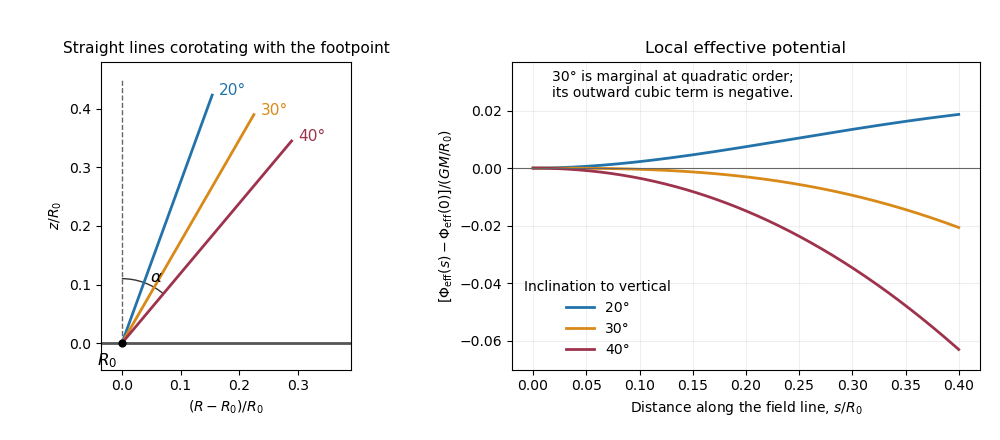

<h1 id="3/solution">Solution</h1>

↑ **Parent:** [3](../3.md)

The flux representation gives $B_R=-\psi_z/R$ and $B_z=\psi_R/R$. Therefore $\nabla\cdot\mathbf B=0$ and $\mathbf B\cdot\nabla\psi=0$. With [magnetohydrodynamic mass loading](../../../../../magnetohydrodynamic-mass-loading.md) $k=k(\psi)$,

$$
\nabla\cdot(\rho\mathbf u)=\nabla\cdot(k\mathbf B)+\nabla\cdot(\rho v\mathbf e_\phi)
=k\nabla\cdot\mathbf B+k'(\psi)\mathbf B\cdot\nabla\psi+R^{-1}\partial_\phi(\rho v)=0.
$$

Thus the steady [continuity equation](../../../../../continuity-equation.md) is satisfied.

The cross product in the [ideal magnetohydrodynamic induction equation](../../../../../ideal-magnetohydrodynamic-induction-equation.md) simplifies to

$$
\mathbf u\times\mathbf B=v\mathbf e_\phi\times\mathbf B
=\frac vR\nabla\psi,\qquad
\nabla\times(\mathbf u\times\mathbf B)
=\nabla(v/R)\times\nabla\psi
=R\mathbf e_\phi\,\mathbf B\cdot\nabla(v/R).
$$

Hence steady induction requires $\mathbf B\cdot\nabla(v/R)=0$. On a regular connected [poloidal flux surface](../../../../../axisymmetric-magnetic-flux-surface.md), this integrates locally to

$$
\boxed{\frac vR=\omega(\psi).}
$$

This is the [field-line angular velocity of an axisymmetric wind](../../../../../field-line-angular-velocity-of-an-axisymmetric-wind.md). It need not equal the gas angular [velocity](../../../../../velocity.md) when $B_\phi\ne0$, because $u_\phi=R\omega+kB_\phi/\rho$. The regular-surface qualification matters: if $\psi$ is constant and the field is purely toroidal, induction alone cannot turn an arbitrary $v(R,z)/R$ into a function of $\psi$.

Put $\mathbf F=(\nabla\times\mathbf B)\times\mathbf B$ and $E=|\mathbf u|^2/2+\Phi$. Dot the pressure-free momentum equation with $\mathbf u$. Since $\mathbf B\cdot\mathbf F=0$, axisymmetry gives

$$
\frac{k\mathbf B}{\rho}\cdot\nabla E=\frac{R\omega}{\mu_0\rho}F_\phi.
$$

The azimuthal momentum equation in [cylindrical coordinates](../../../../../cylindrical-coordinate-system.md) similarly gives

$$
u_R\partial_R(Ru_\phi)+u_z\partial_z(Ru_\phi)
=\frac R{\mu_0\rho}F_\phi,
\quad\text{or}\quad
\frac{k\mathbf B}{\rho}\cdot\nabla(Ru_\phi)=\frac R{\mu_0\rho}F_\phi.
$$

Subtracting $\omega$ times the second relation from the first, and using $\mathbf B\cdot\nabla\omega=0$, proves that $E-\omega Ru_\phi$ is constant along a flowing regular [poloidal flux surface](../../../../../axisymmetric-magnetic-flux-surface.md). For nonzero mass loading its [corotating energy invariant of an axisymmetric magnetic wind](../../../../../corotating-energy-invariant-of-an-axisymmetric-magnetic-wind.md) is

$$
\boxed{\frac12\bigl(u_R^2+u_z^2+(u_\phi-R\omega)^2\bigr)
+\Phi-\frac12R^2\omega^2=\epsilon_J(\psi).}
$$

This is the invariant labeled $\epsilon$ in the question. It is a corotating mechanical energy, distinct from the total [magnetohydrodynamic Bernoulli invariant](../../../../../magnetohydrodynamic-bernoulli-invariant.md), which includes electromagnetic energy flux. In standard notation it equals total specific energy minus $\omega$ times the total specific angular-momentum invariant.

Near the footpoint, negligible $kB_\phi/\rho$ gives $u_\phi\simeq R\omega$, while the poloidal [velocity](../../../../../velocity.md) is parallel to the [poloidal magnetic field](../../../../../poloidal-magnetic-field.md). The gas approximately corotates and slides along a rotating field line as a bead on a wire, with [effective potential](../../../../../effective-potential.md)

$$
\Phi_{\mathrm{eff}}=\Phi-\frac12\omega^2R^2.
$$

A decreasing [effective potential](../../../../../effective-potential.md) converts corotating potential energy into poloidal kinetic energy. This is the mechanism of [magnetocentrifugal acceleration](../../../../../magnetocentrifugal-acceleration.md); local launching does not alone guarantee global escape.

For an attractive point mass, take $\Phi=-GM/(R^2+z^2)^{1/2}$ and $\omega^2=GM/R_0^3$. Parameterize the outward straight line by $R=R_0+s\sin\alpha$, $z=s\cos\alpha$. The first derivative of $\Phi_{\mathrm{eff}}$ vanishes at $s=0$ because the footpoint is in circular radial balance. The meridional Hessian there is $\omega^2\operatorname{diag}(-3,1)$, so

$$
\left.\frac{d^2\Phi_{\mathrm{eff}}}{ds^2}\right|_0
=\omega^2(\cos^2\alpha-3\sin^2\alpha)
=\omega^2(1-4\sin^2\alpha).
$$

Thus the [thirty-degree magnetocentrifugal launching criterion](../../../../../thirty-degree-magnetocentrifugal-launching-criterion.md) in its strict negative-curvature form is

$$
\boxed{\alpha>\pi/6,\qquad 0\le\alpha\le\pi/2.}
$$

Above this angle the equilibrium is unstable to an outward displacement; below it the near-footpoint potential initially rises. The source's proportionality constant must be negative to describe attraction.

The [marginal straight-line launch at thirty degrees](../../../../../marginal-straight-line-launch-at-thirty-degrees.md) has zero quadratic curvature. For precisely the straight line and point-mass potential here, let $x=s/R_0$ and $a=\sin\alpha$. Direct expansion gives

$$
\frac{\Phi_{\mathrm{eff}}(s)-\Phi_{\mathrm{eff}}(0)}{GM/R_0}
=\left(\frac12-2a^2\right)x^2
+\left(\frac52a^3-\frac32a\right)x^3+O(x^4).
$$

At $\alpha=\pi/6$, this is $-7x^3/16+O(x^4)$, so the outward direction is downhill at cubic order. Consequently the strict inequality is the nondegenerate quadratic criterion; it should not be interpreted as excluding every one-sided nonlinear marginal launch at equality. An exactly resting bead remains an equilibrium until displaced.

**[Figure 1](#3/image-effective-potential-along-straight-magnetic-field-lines-below-at-and-above-the-thirty-degree-launching-threshold). Effective potential along straight magnetic field lines below, at and above the thirty-degree launching threshold**.

## ↑ Ancestors (10)

1. [3](../3.md)
2. [Paper 62](../../paper-62-split.md)
3. [Iii](../../split.md)
4. [2012](../../../split.md)
5. [Past exam of the mathematics course of the University of Cambridge](../../../../split.md)
6. [Mathematics course of the University of Cambridge](../../../../../mathematics-course-of-the-university-of-cambridge.md)
7. [Course of the University of Cambridge](../../../../../course-of-the-university-of-cambridge.md)
8. [University of Cambridge](../../../../../university-of-cambridge-split.md)
9. [List of universities](../../../../../list-of-universities.md)
10. [Codex Wiki](../../../../../split.md)
