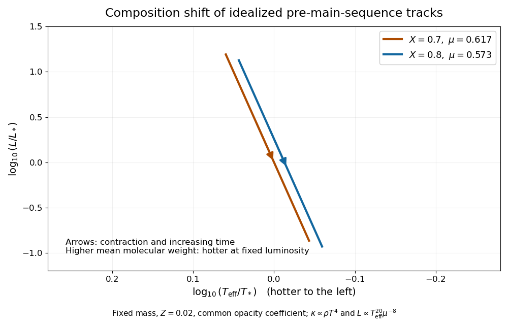

# Paper 63

↑ **Parent:** [Iii](../iii.md)

[https://www.maths.cam.ac.uk/postgrad/part-iii/files/pastpapers/2012/paper_63.pdf](https://www.maths.cam.ac.uk/postgrad/part-iii/files/pastpapers/2012/paper_63.pdf)

**Table of contents**

- [1](#1)
  - [a](#1/a)
    - [Solution](#1/a/solution)
  - [b](#1/b)
    - [Solution](#1/b/solution)
  - [c](#1/c)
    - [Solution](#1/c/solution)
- [2](#2)
  - [Solution](#2/solution)
- [3](#3)
  - [Solution](#3/solution)
- [4](#4)
  - [Solution](#4/solution)

## 1

↑ **Parent:** [Paper 63](paper-63.md)

<h3 id="1/a">a</h3>

↑ **Parent:** [1](#1)

<h4 id="1/a/solution">Solution</h4>

↑ **Parent:** [A](#1/a)

Efficient [convection](../../../fluid-mechanics.md#convection) makes the interior follow a nearly [adiabatic process](../../../thermodynamics.md#adiabatic-process) and maintains uniform [specific entropy](../../../thermodynamics.md#specific-entropy). For the fully ionized monatomic [ideal gas](../../../thermodynamics.md#ideal-gas), the [specific-heat ratio](../../../thermodynamics.md#heat-capacity-ratio) is $5/3$, so the [adiabatic temperature gradient](../../../exoplanet.md#adiabatic-temperature-gradient) gives $d\log T/d\log P=2/5$. Integrating at a fixed time gives

$$
\boxed{P=K(t)T^{5/2}.}
$$

The coefficient is spatially constant because the composition and [specific entropy](../../../thermodynamics.md#specific-entropy) are uniform. It can change as the star loses energy. Equivalently the gas is an [adiabatic stellar polytrope](../../../stellar-structure.md#adiabatic-stellar-polytrope) with $P=K_\rho\rho^{5/3}$ and [polytropic index](../../../stellar-structure.md#polytropic-index) $n=3/2$; $K_\rho$ and the pressure-temperature coefficient $K$ are different quantities.

This fixes the dimensionless [Lane-Emden equation](../../../nonlinear-analysis.md#lane-emden-equation) profile throughout a [stellar homology](../../../stellar-structure.md#stellar-homology) sequence. Writing $\rho(r)=\rho_cf(r/R)$ in the mass integral gives $\rho_c=C_\rho M/R^3$, with a fixed positive shape constant $C_\rho$. Integrating the [stellar hydrostatic equation](../../../stellar-structure.md#hydrostatic-pressure-support-equation) through the same profile, with negligible surface pressure compared with central pressure, gives $P_c=C_PGM^2/R^4$. Hence

$$
\boxed{\rho_c\propto M/R^3,\qquad P_c\propto GM^2/R^4,\qquad
T_c=\frac{\mu P_c}{\mathcal R\rho_c}\propto\frac{\mu GM}{\mathcal R R}.}
$$

These are [homology scalings of central stellar pressure](../../../stellar-structure.md#homology-scaling-of-central-stellar-pressure). Substituting the central quantities into $K=P_c/T_c^{5/2}$ yields

$$
\boxed{K=K_0\mu^{-5/2}M^{-1/2}R^{-3/2},\qquad
K_0=C_\rho^{5/2}C_P^{-3/2}\mathcal R^{5/2}G^{-3/2}.}
$$

Thus $K_0$ is constant for the fixed [stellar polytrope](../../../stellar-structure.md#stellar-polytrope) family.

At the approximate [photosphere](../../../stellar-structure.md#photosphere), take $T=T_e$ and use the [ideal gas](../../../thermodynamics.md#ideal-gas) relation $\rho=\mu P/(\mathcal RT)$. The prescribed [opacity](../../../stellar-structure.md#opacity) gives

$$
\kappa P=\frac{\kappa_0\mu}{\mathcal R}P^2T^3
=\frac{\kappa_0\mu}{\mathcal R}K^2T^8.
$$

The [stellar surface boundary condition](../../../stellar-structure.md#stellar-surface-boundary-condition) and [surface gravity of a star](../../../stellar-structure.md#surface-gravity-of-a-star) therefore imply

$$
\boxed{T_e^8=\frac{2G\mathcal R}{3\kappa_0K_0^2}\,\mu^4M^2R.}
$$

This is the temperature-four special case of [convective contraction with power-law opacity](../../../stellar-astrophysics.md#convective-contraction-with-power-law-opacity).

Using the [Stefan–Boltzmann law](../../../thermodynamics.md#stefan-boltzmann-law), the [luminosity](../../../astrophysics.md#luminosity) is

$$
L=4\pi\sigma\left(\frac{2G\mathcal R}{3\kappa_0}\right)^{1/2}
K_0^{-1}\mu^2M R^{5/2}.
$$

For $n=3/2$, the supplied gravitational-energy formula is $\Omega=-6GM^2/(7R)$. The [stellar virial theorem](../../../stellar-structure.md#stellar-virial-theorem) for a monatomic gas gives $2U+\Omega=0$, so the total energy is $E=U+\Omega=-3GM^2/(7R)$. During [Kelvin-Helmholtz contraction](../../../stellar-astrophysics.md#kelvin-helmholtz-mechanism), with constant mass and no significant nuclear source, $L=-dE/dt$. Thus

$$
\dot R=-\frac{28\pi\sigma}{3}
\left(\frac{2\mathcal R}{3\kappa_0G}\right)^{1/2}
K_0^{-1}\mu^2M^{-1}R^{9/2}.
$$

Multiplying by $-(7/2)R^{-9/2}$ and integrating gives

$$
\boxed{R^{-7/2}-R_0^{-7/2}
=\frac{98\pi\sigma}{3}
\left(\frac{2\mathcal R}{3\kappa_0G}\right)^{1/2}
K_0^{-1}\mu^2M^{-1}(t-t_0).}
$$

The sign makes the radius decrease as time increases.

When the accumulated contraction term dominates the initial-radius term, this yields $R\propto\mu^{-4/7}M^{2/7}(t-t_0)^{-2/7}$. Combining it with the central [ideal gas](../../../thermodynamics.md#ideal-gas) temperature gives the **late-time central-temperature scaling**

$$
\boxed{T_c\propto\mu^{11/7}M^{5/7}(t-t_0)^{2/7}.}
$$

Replacing $t-t_0$ by $t$ gives the stated late-time form. The asymptotic step also requires a time long enough to forget the initial radius, not merely a choice of zero for the age.

<h3 id="1/b">b</h3>

↑ **Parent:** [1](#1)

<h4 id="1/b/solution">Solution</h4>

↑ **Parent:** [B](#1/b)

The [helium mass fraction](../../../stellar-astrophysics.md#helium-mass-fraction) is $Y=1-X-Z$. For the two compositions, $Y_1=0.28$ and $Y_2=0.18$. The [mean molecular weight](../../../thermodynamics.md#mean-molecular-weight) is therefore

$$
\mu_1^{-1}=1.62,\quad \mu_1=\frac{50}{81}\simeq0.6173,\qquad
\mu_2^{-1}=1.745,\quad \mu_2=\frac{200}{349}\simeq0.5731.
$$

At fixed mass and with the same prescribed opacity coefficient, part (a) gives $T_e\propto\mu^{1/2}R^{1/8}$ and $L\propto\mu^2R^{5/2}$. Eliminating radius gives

$$
\boxed{L\propto\mu^{-8}T_e^{20},\qquad
T_e\big|_L\propto\mu^{2/5}.}
$$

This is the [composition shift of a convective pre-main-sequence track](../../../stellar-astrophysics.md#composition-shift-of-a-convective-pre-main-sequence-track). The higher-[helium mass fraction](../../../stellar-astrophysics.md#helium-mass-fraction) case $X_1=0.7$ is hotter at a given [luminosity](../../../astrophysics.md#luminosity), lying to the left of the $X_2=0.8$ case in a [Hertzsprung-Russell diagram](../../../stellar-astrophysics.md#hertzsprung-russell-diagram). Its fixed-luminosity temperature ratio is $(349/324)^{2/5}\simeq1.030$.

Both stars contract, so both $L$ and $T_e$ decrease in this particular opacity model. Their nearly vertical [Hayashi tracks](../../../stellar-astrophysics.md#hayashi-track) therefore run **downward and slightly to the right**, with arrows in that direction:

**[Figure 1](#1/b/image-composition-dependent-pre-main-sequence-tracks-with-contraction-arrows). Composition-dependent pre-main-sequence tracks with contraction arrows**.

The plotted [luminosity](../../../astrophysics.md#luminosity) and [effective temperature](../../../stellar-structure.md#effective-temperature) are normalized to arbitrary common references; no opacity normalization or absolute age was specified. The comparison holds the given opacity coefficient fixed.

These paths cease to apply when their assumptions fail. [Deuterium-burning energy-generation rate](../../../stellar-astrophysics.md#deuterium-burning-energy-generation-rate) can temporarily slow contraction; sustained [hydrogen burning](../../../stellar-astrophysics.md#hydrogen-burning) ends the purely gravitational phase. Formation of a [radiative core](../../../stellar-structure.md#radiative-core) breaks the fully convective adiabat and can lead to a [Henyey track](../../../stellar-astrophysics.md#henyey-track) toward hotter [effective temperature](../../../stellar-structure.md#effective-temperature). Partial [ionization](../../../physics.md#ionization), a changing atmospheric [opacity](../../../stellar-structure.md#opacity), and [electron degeneracy pressure](../../../statistical-physics.md#electron-degeneracy-pressure) alter the [equation of state](../../../thermodynamics.md#equation-of-state) or boundary relation. [Accretion luminosity](../../../stellar-astrophysics.md#accretion-luminosity), changing mass, and magnetic inhibition of [convection](../../../fluid-mechanics.md#convection) can also modify a young star's path.

<h3 id="1/c">c</h3>

↑ **Parent:** [1](#1)

<h4 id="1/c/solution">Solution</h4>

↑ **Parent:** [C](#1/c)

Keep the fixed [stellar homology](../../../stellar-structure.md#stellar-homology) profile, so that $\rho_c=C_\rho M/R^3$ and $P_c=C_PGM^2/R^4$. Solving the partially degenerate [equation of state](../../../thermodynamics.md#equation-of-state) for the central [temperature](../../../thermodynamics.md#temperature) gives

$$
T_c=\frac{\mu_i}{\mathcal R}
\left(\frac{P_c}{\rho_c}-K_{\rm nr}\rho_c^{2/3}\right)
=\frac{\mu_i}{\mathcal R}
\left(A\frac{GM}{R}-B K_{\rm nr}\frac{M^{2/3}}{R^2}\right),
$$

where $A=C_P/C_\rho$ and $B=C_\rho^{2/3}$ are positive constants. The [ion mean molecular weight](../../../thermodynamics.md#mean-molecular-weight-per-ion) is distinct from the total-particle [mean molecular weight](../../../thermodynamics.md#mean-molecular-weight) used in part (a).

Set $y=1/R$. The expression in parentheses is a concave quadratic in $y$. Its maximum occurs at

$$
y_{\max}=\frac{AG}{2BK_{\rm nr}}M^{1/3},\qquad
R_{\max}=\frac{2BK_{\rm nr}}{AG}M^{-1/3}.
$$

Substitution gives the **contraction-limited central temperature**

$$
\boxed{T_{\max}=\frac{A^2G^2}{4BK_{\rm nr}\mathcal R}\,\mu_iM^{4/3}
\ \propto\ \mu_iM^{4/3}.}
$$

At this point [electron degeneracy pressure](../../../statistical-physics.md#electron-degeneracy-pressure) supplies half the required central pressure. Further contraction increasingly goes into the density-dependent degeneracy term rather than heating the ions. The formula applies along the positive-temperature part of the idealized homologous sequence; a negative value beyond it is not a physical temperature.

For sufficiently small mass, this maximum never reaches the temperature needed for sustained [hydrogen burning](../../../stellar-astrophysics.md#hydrogen-burning). Such an object stays below the [hydrogen-burning minimum mass](../../../stellar-astrophysics.md#hydrogen-burning-minimum-mass) and becomes a cooling [brown dwarf](../../../stellar-astrophysics.md#brown-dwarf), rather than an ordinary [main sequence](../../../stellar-astrophysics.md#main-sequence) star. Some such objects burn their initial [deuterium](../../../chemistry.md#deuterium), but that finite reservoir does not provide lasting [hydrogen burning](../../../stellar-astrophysics.md#hydrogen-burning).

## 2

↑ **Parent:** [Paper 63](paper-63.md)

<h3 id="2/solution">Solution</h3>

↑ **Parent:** [2](#2)

Write $u=\cos\theta$, $S=j/\kappa$ and use axial symmetry. The [radiative flux](../../../astrophysics.md#radiative-flux) is $F=2\pi\int_{-1}^1uI\,du$. Integrating the [radiative transfer equation](../../../astrophysics.md#radiative-transfer-equation) over directions gives

$$
\frac{dF}{d\tau}=4\pi(J-S).
$$

There are no energy sources in the atmosphere, so [radiative equilibrium](../../../thermodynamics.md#radiative-equilibrium) makes $F$ constant. Consequently

$$
\boxed{J=S=\frac{j}{\kappa}=\frac{\sigma T^4}{\pi}.}
$$

For the linear angular approximation $I=A+Cu$, the [radiation-field moments](../../../astrophysics.md#radiation-field-moment) are

$$
J=A,\qquad F=\frac{4\pi}{3}C,\qquad
cP_r=2\pi\int_{-1}^1u^2(A+Cu)\,du=\frac{4\pi}{3}A.
$$

Thus it satisfies the [Eddington closure approximation](../../../astrophysics.md#eddington-closure-approximation), and

$$
\boxed{cP_r=\frac{4\pi}{3}J,\qquad C=\frac{3F}{4\pi}.}
$$

Since $F$ is constant, $C'=0$. Substitution in the [radiative transfer equation](../../../astrophysics.md#radiative-transfer-equation), using $S=A$, gives $uA'=Cu$, hence $\boxed{A'=C}$.

In this moment approximation, the inward hemispheric flux at the surface is

$$
F_{\rm in}=-2\pi\int_{-1}^0u(A_0+Cu)\,du
=\pi A_0-\frac{2\pi}{3}C.
$$

Setting this boundary moment to zero gives $A_0=2C/3$. Therefore

$$
A(\tau)=\frac{3F}{4\pi}\left(\tau+\frac23\right).
$$

Combining it with the thermal [source function](../../../astrophysics.md#radiative-transfer-source-function) and $F=\sigma T_e^4$ gives the [grey atmosphere](../../../astrophysics.md#grey-atmosphere) temperature law:

$$
\boxed{T^4=\frac34T_e^4\left(\tau+\frac23\right),\qquad
T_0=2^{-1/4}T_e.}
$$

**The surface condition is an approximate angular-moment condition.** If the affine intensity were interpreted as an exact nonnegative boundary radiation field, no incident radiation would require $I(0,u)=0$ for every $u<0$; a linear polynomial vanishing on that interval would have $A_0=C=0$ and no outward flux either. The derived formal profile indeed has $I(0,-1)=-F/(4\pi)<0$. This [positivity limitation of a linear Eddington intensity](../../../astrophysics.md#positivity-limitation-of-a-linear-eddington-intensity) is why one uses the [Eddington surface boundary condition](../../../astrophysics.md#eddington-surface-boundary-condition) as a moment closure, not the affine ansatz as an exact emergent angular intensity. An outward direction-independent intensity with no inward intensity gives the same boundary moments.

For the gas-pressure-dominated atmosphere, combine $dP/dz=-\rho g$ with $d\tau/dz=-\kappa\rho$. Thus the [hydrostatic equilibrium in optical depth](../../../stellar-structure.md#hydrostatic-equilibrium-in-optical-depth) is $dP/d\tau=g/\kappa$. Let $w=T^4$. The [grey atmosphere](../../../astrophysics.md#grey-atmosphere) law implies $dw/d\tau=3T_0^4/2$. With the specified power-law [opacity](../../../stellar-structure.md#opacity),

$$
\frac{d(P^\alpha)}{dw}
=\frac{2\alpha g}{3\kappa_0T_0^4}\,w^{\beta-1}.
$$

At the outer vacuum limit take $P=0$ and $T=T_0$. Since $\alpha,\beta>0$, integration gives

$$
\boxed{P^\alpha=\frac{2\alpha g}{3\beta\kappa_0T_0^4}
\left(T^{4\beta}-T_0^{4\beta}\right).}
$$

This is the [grey-atmosphere pressure with power-law opacity](../../../stellar-structure.md#grey-atmosphere-pressure-with-power-law-opacity) relation.

At the matching radius the local [radiative flux](../../../astrophysics.md#radiative-flux) is $L_r/(4\pi r^2)=\sigma T^4$. In the thin [plane-parallel atmosphere](../../../astrophysics.md#plane-parallel-atmosphere) approximation this equals $F=\sigma T_e^4$, so $T=T_e$ and $T^4=2T_0^4$. Multiplying the pressure relation by $\kappa_0T^{4-4\beta}/g$ yields the required **surface pressure-opacity relation**

$$
\boxed{\frac{P\kappa}{g}
=\frac{2\alpha}{3\beta}\frac{T^4}{T_0^4}
\left[1-\left(\frac{T_0}{T}\right)^{4\beta}\right]
=\frac{4\alpha}{3\beta}(1-2^{-\beta}).}
$$

Here $P\kappa$ is a product, not a pressure subscript.

## 3

↑ **Parent:** [Paper 63](paper-63.md)

<h3 id="3/solution">Solution</h3>

↑ **Parent:** [3](#3)

Let $\Psi$ be the [gravitational potential](../../../classical-mechanics.md#newtonian-potential-of-a-point-mass), with $\nabla^2\Psi=4\pi G\rho$, and let $\varpi^2=x^2+y^2$ measure distance from the rotation axis. Uniform [solid-body rotation](../../../classical-mechanics.md#solid-body-rotation) contributes the [centrifugal potential](../../../physics.md#centrifugal-potential) $-\Omega^2\varpi^2/2$. In the corotating frame, static force balance therefore gives the [uniformly rotating stellar hydrostatic equilibrium](../../../stellar-structure.md#uniformly-rotating-stellar-hydrostatic-equilibrium) equations

$$
\boxed{\phi=\Psi-\frac12\Omega^2\varpi^2,\qquad
\nabla P=-\rho\nabla\phi,\qquad
\nabla^2\phi=4\pi G\rho-2\Omega^2.}
$$

The final coefficient follows because $\nabla^2(x^2+y^2)=4$.

A tangent displacement along a regular connected [equipotential surface](../../../classical-mechanics.md#equipotential-surface) has zero dot product with $\nabla\phi$, and hence with $\nabla P$. Thus $P=P(\phi)$ locally. Taking the curl of the [hydrostatic equilibrium](../../../statistical-physics.md#hydrostatic-equilibrium) equation gives $\nabla\rho\times\nabla\phi=0$, so $\rho=\rho(\phi)$ on such surfaces as well. The [Poisson equation](../../../partial-differential-equation.md#poisson-equation) then shows that $\nabla^2\phi$ is constant on each [equipotential surface](../../../classical-mechanics.md#equipotential-surface).

**The magnitude $g=|\nabla\phi|$ need not be constant.** For instance $\phi=A(x^2+y^2)+Bz^2$, with positive $A\ne B$, has constant Laplacian but different pole and equator gradient magnitudes on an ellipsoidal equipotential. In a rotating star, flattening and [centrifugal acceleration](../../../physics.md#centrifugal-acceleration) likewise make the effective gravity latitude dependent.

With uniform composition, an [equation of state](../../../thermodynamics.md#equation-of-state) determines $T$ from $P$ and $\rho$; for the supplied [ideal gas](../../../thermodynamics.md#ideal-gas) plus [radiation pressure](../../../thermodynamics.md#radiation-pressure) law its right side increases monotonically with $T$. Hence $T=T(\phi)$, and the [radiative conductivity](../../../stellar-structure.md#radiative-conductivity) $\chi(\rho,T)$ is also constant on an [equipotential surface](../../../classical-mechanics.md#equipotential-surface). Put $f(\phi)=-\chi\,dT/d\phi$. Then $\mathbf F=f(\phi)\nabla\phi$. On the stellar surface, below mass shedding, the outward normal is $\nabla\phi/g$, so

$$
F_n=f(\phi_s)g,\qquad
\boxed{T_e=\left(\frac{f(\phi_s)}{\sigma}\right)^{1/4}g^{1/4}.}
$$

This is the [radiative gravity-darkening law](../../../stellar-structure.md#radiative-gravity-darkening-law). The [effective temperature](../../../stellar-structure.md#effective-temperature) measures emergent flux; it is not the same quantity as the interior material temperature that was constant on an equipotential.

A rapidly rotating star is oblate, with reduced effective gravity and cooler [effective temperature](../../../stellar-structure.md#effective-temperature) around the equator. **The poles are hottest.** The original sketch uses a [Roche model of a uniformly rotating star](../../../stellar-structure.md#roche-model-of-a-uniformly-rotating-star) only to illustrate the shape and surface-flux variation:

**[Figure 2](#3/image-oblate-rotating-star-with-hotter-poles-and-cooler-equator). Oblate rotating star with hotter poles and cooler equator**.

The obstruction to purely local [radiative equilibrium](../../../thermodynamics.md#radiative-equilibrium) is visible by taking the divergence:

$$
\nabla\cdot\mathbf F=f'(\phi)|\nabla\phi|^2
+f(\phi)(4\pi G\rho-2\Omega^2).
$$

On an [equipotential surface](../../../classical-mechanics.md#equipotential-surface), $\rho\epsilon$, $f$, $f'$ and the second term are constant, but $g^2$ generally varies. Unless $f'=0$ or another special circumstance removes the mismatch, $\nabla\cdot\mathbf F=\rho\epsilon$ cannot hold at every latitude. This is the [radiative-equilibrium obstruction in a rotating barotropic star](../../../stellar-structure.md#radiative-equilibrium-obstruction-in-a-rotating-barotropic-star); heat advection by [stellar meridional circulation](../../../stellar-structure.md#meridional-circulation-in-a-star) resolves the missing energy transport in the leading hydrostatic treatment.

For the steady circulation, [mass conservation](../../../continuum-mechanics.md#mass-conservation) gives $\nabla\cdot(\rho\mathbf v)=0$. The [specific enthalpy](../../../thermodynamics.md#specific-enthalpy) identity and [hydrostatic equilibrium](../../../statistical-physics.md#hydrostatic-equilibrium) give

$$
T\nabla s=\nabla h-\frac1\rho\nabla P=\nabla(h+\phi).
$$

Consequently

$$
\rho\mathbf v\cdot T\nabla s
=\nabla\cdot[\rho\mathbf v(h+\phi)].
$$

Both $h$ and $\phi$ are constant on the bounding [equipotential surface](../../../classical-mechanics.md#equipotential-surface). By the [divergence theorem](../../../calculus.md#divergence-theorem) and steady [continuity equation](../../../physics.md#continuity-equation),

$$
\int_V\rho\mathbf v\cdot T\nabla s\,dV
=(h+\phi)_S\int_S\rho\mathbf v\cdot d\mathbf S=0.
$$

Integrating the given thermal energy equation therefore gives [equipotential luminosity conservation with stellar circulation](../../../stellar-structure.md#equipotential-luminosity-conservation-with-stellar-circulation):

$$
\boxed{L=\int_S\mathbf F\cdot d\mathbf S=\int_V\rho\epsilon\,dV.}
$$

Individual circulation streams can cross the surface; only their net steady mass flux has to vanish.

Since $f$ is constant on that surface, integrating the [Poisson equation](../../../partial-differential-equation.md#poisson-equation) gives

$$
L=f\int_S\nabla\phi\cdot d\mathbf S
=f(4\pi Gm-2\Omega^2V).
$$

Thus $dT/d\phi=-L/[\chi(4\pi Gm-2\Omega^2V)]$, while $dP/d\phi=-\rho$. Dividing these derivatives and inserting $\chi=4acT^3/(3\kappa\rho)$ yields the [radiative gradient in a uniformly rotating star](../../../stellar-structure.md#radiative-gradient-in-a-uniformly-rotating-star):

$$
\boxed{\frac{d\log T}{d\log P}
=\frac{3\kappa PL}{16\pi acGmT^4}
\left(1-\frac{\Omega^2V}{2\pi Gm}\right)^{-1}.}
$$

The bracket must be positive for the regular outward-gravity configuration being used.

**For an interior equipotential, both mass factors must be the enclosed mass $m$.** The printed final bracket uses $M$, but its derivation gives $m$; at the outer surface $m=M$ and the printed bracket is recovered. For a direct check, a uniform-density model has $m=\rho V$, so the true correction $\Omega^2V/(2\pi Gm)=\Omega^2/(2\pi G\rho)$ is independent of the chosen enclosed volume. Replacing $m$ by a fixed total mass would incorrectly make it volume dependent.

## 4

↑ **Parent:** [Paper 63](paper-63.md)

<h3 id="4/solution">Solution</h3>

↑ **Parent:** [4](#4)

[Stellar nucleosynthesis](../../../physics.md#stellar-nucleosynthesis) and the subsequent return of matter explain most elements heavier than the primordial [hydrogen](../../../chemistry.md#hydrogen) and [helium](../../../chemistry.md#helium). [Big Bang nucleosynthesis](../../../cosmology.md#big-bang-nucleosynthesis) supplied predominantly those two elements, with small light-isotope abundances; stars do not make every element from an initially metal-free mixture. Different stellar masses reach different central temperatures and leave different remnants. The mass comparisons below describe representative isolated, near-solar-composition stars; mass loss and binary interaction can alter the final core. A nucleus contributes to later generations only if it is eventually expelled into the [interstellar medium](../../../galaxy.md#interstellar-medium), rather than remaining locked in a remnant.

**A $1M_\odot$ star** spends its [main sequence](../../../stellar-astrophysics.md#main-sequence) life converting [hydrogen](../../../chemistry.md#hydrogen) to [helium](../../../chemistry.md#helium), predominantly through the [proton–proton chain](../../../stellar-astrophysics.md#proton-proton-chain). After core [hydrogen burning](../../../stellar-astrophysics.md#hydrogen-burning) ends, a [hydrogen-burning shell](../../../stellar-astrophysics.md#hydrogen-burning-shell) supplies an expanding [red giant](../../../stellar-astrophysics.md#red-giant) envelope and builds an electron-degenerate helium core. [First dredge-up](../../../stellar-astrophysics.md#first-dredge-up) exposes material whose [CNO cycle](../../../stellar-astrophysics.md#cno-cycle) has redistributed the original carbon and nitrogen abundances. The [helium flash](../../../stellar-astrophysics.md#helium-flash) starts [core helium burning](../../../stellar-astrophysics.md#core-helium-burning): the [Triple-alpha process](../../../stellar-astrophysics.md#triple-alpha-process) makes [carbon](../../../chemistry.md#carbon), and [carbon-12 alpha capture](../../../physics.md#carbon-12-alpha-capture) makes [oxygen](../../../chemistry.md#oxygen). Once core helium is exhausted, the [Asymptotic giant branch](../../../stellar-astrophysics.md#asymptotic-giant-branch) has a [carbon-oxygen core](../../../stellar-astrophysics.md#carbon-oxygen-core) with [helium-burning shell](../../../stellar-astrophysics.md#helium-burning-shell) and [hydrogen-burning shell](../../../stellar-astrophysics.md#hydrogen-burning-shell). Shell instability causes [AGB thermal pulses](../../../stellar-astrophysics.md#thermal-pulse-of-an-asymptotic-giant-branch-star); subsequent [third dredge-up](../../../stellar-astrophysics.md#third-dredge-up), where efficient enough, can bring carbon and neutron-capture products into the envelope. Its efficiency at such low mass depends on composition and mixing. The star does not ordinarily ignite core [carbon burning](../../../stellar-astrophysics.md#carbon-burning). [Stellar winds](../../../stellar-astrophysics.md#stellar-wind) remove the envelope, a hot remnant may illuminate a [planetary nebula](../../../stellar-astrophysics.md#planetary-nebula), and a [carbon-oxygen white dwarf](../../../stellar-astrophysics.md#carbon-oxygen-white-dwarf) retains much of the core's synthesized matter.

**A $5M_\odot$ star** generally uses the more temperature-sensitive [CNO cycle](../../../stellar-astrophysics.md#cno-cycle) for main-sequence [hydrogen burning](../../../stellar-astrophysics.md#hydrogen-burning), with a substantial convective core. Its hotter helium core ignites [core helium burning](../../../stellar-astrophysics.md#core-helium-burning) without the low-mass degeneracy-driven [helium flash](../../../stellar-astrophysics.md#helium-flash), producing [carbon](../../../chemistry.md#carbon) and [oxygen](../../../chemistry.md#oxygen). After core helium exhaustion it develops double-shell [Asymptotic giant branch](../../../stellar-astrophysics.md#asymptotic-giant-branch) burning and a degenerate [carbon-oxygen core](../../../stellar-astrophysics.md#carbon-oxygen-core). [Second dredge-up](../../../stellar-astrophysics.md#second-dredge-up) and repeated [third dredge-up](../../../stellar-astrophysics.md#third-dredge-up) alter the envelope composition. In sufficiently hot models, [hot-bottom burning](../../../stellar-astrophysics.md#hot-bottom-burning) at the base of the convective envelope converts dredged-up [carbon](../../../chemistry.md#carbon) into [nitrogen](../../../chemistry.md#nitrogen) through the [CNO cycle](../../../stellar-astrophysics.md#cno-cycle); consequently a carbon-producing shell need not produce a carbon-rich final envelope. Hot helium-shell pulses can activate the $^{22}\mathrm{Ne}(\alpha,n){}^{25}\mathrm{Mg}$ neutron source. Strong [stellar winds](../../../stellar-astrophysics.md#stellar-wind) expel these processed layers. A conventional isolated five-solar-mass model ends as a [carbon-oxygen white dwarf](../../../stellar-astrophysics.md#carbon-oxygen-white-dwarf), below the mass range that normally develops sustained core [carbon burning](../../../stellar-astrophysics.md#carbon-burning); mass loss and mixing govern the exact boundaries between outcomes.

**A $32M_\odot$ star** has core [CNO cycle](../../../stellar-astrophysics.md#cno-cycle) [hydrogen burning](../../../stellar-astrophysics.md#hydrogen-burning), followed by [core helium burning](../../../stellar-astrophysics.md#core-helium-burning). The core then contracts through [carbon burning](../../../stellar-astrophysics.md#carbon-burning), [neon burning](../../../stellar-astrophysics.md#neon-burning), [oxygen burning](../../../stellar-astrophysics.md#oxygen-burning) and [silicon burning](../../../stellar-astrophysics.md#silicon-burning), with active shells outside the successive exhausted cores. [Carbon burning](../../../stellar-astrophysics.md#carbon-burning) produces chiefly nuclei such as [neon](../../../chemistry.md#neon) and [magnesium](../../../chemistry.md#magnesium). [Neon burning](../../../stellar-astrophysics.md#neon-burning) combines [photodisintegration](../../../physics.md#nuclear-photodisintegration) and alpha capture; [oxygen burning](../../../stellar-astrophysics.md#oxygen-burning) makes silicon-group nuclei. [Silicon burning](../../../stellar-astrophysics.md#silicon-burning) is a network of captures and [photodisintegration](../../../physics.md#nuclear-photodisintegration) approaching [nuclear statistical equilibrium](../../../physics.md#nuclear-statistical-equilibrium), rather than simply fusion of pairs of silicon nuclei. It produces an iron-group mixture governed by temperature, density and weak reactions. The maximum in [nuclear binding energy](../../../physics.md#nuclear-binding-energy) per nucleon near the iron group prevents continued exothermic fusion from supplying ordinary hydrostatic support. [Stellar neutrino energy loss](../../../stellar-structure.md#stellar-neutrino-energy-loss) accelerates the advanced stages; [electron capture](../../../physics.md#electron-capture) and [photodisintegration](../../../physics.md#nuclear-photodisintegration) help remove support during iron-core collapse.

The massive star can return products both before and during collapse. Radiation-driven [stellar winds](../../../stellar-astrophysics.md#stellar-wind) may expose and expel layers enriched in [helium](../../../chemistry.md#helium), [nitrogen](../../../chemistry.md#nitrogen), [carbon](../../../chemistry.md#carbon) and [oxygen](../../../chemistry.md#oxygen). A successful [core-collapse supernova](../../../stellar-astrophysics.md#core-collapse-supernova) ejects additional hydrostatic products and creates further nuclei by shock-driven explosive burning, including alpha-rich and iron-group products. The [nickel-56 decay chain](../../../chemistry.md#nickel-56-decay-chain) converts radioactive [nickel](../../../chemistry.md#nickel) into [iron](../../../chemistry.md#iron) through [cobalt](../../../chemistry.md#cobalt). Initial mass alone does not fix the explosion or remnant: substantial fallback or a [failed supernova](../../../stellar-astrophysics.md#failed-supernova) can leave a [black hole](../../../general-relativity.md#black-hole) and retain much of the core material. Thus the possible [core-collapse supernova](../../../stellar-astrophysics.md#core-collapse-supernova) contribution is not a guarantee that a thirty-two-solar-mass star ejects every element it made.

For nuclei well beyond the iron group, [neutron capture](../../../physics.md#neutron-capture) is a principal assembly mechanism, avoiding the large [Coulomb barrier](../../../physics.md#coulomb-barrier) for charged-particle fusion. [Beta-minus decay](../../../physics.md#beta-minus-decay) converts captured neutrons into protons and raises the atomic number. In the [s-process](../../../stellar-astrophysics.md#s-process), captures are slower than relevant beta decays, so the sequence usually follows nuclei near stability. The main site is the [Asymptotic giant branch](../../../stellar-astrophysics.md#asymptotic-giant-branch): $^{13}\mathrm C(\alpha,n){}^{16}\mathrm O$ is an important neutron source in low-mass intershell material, while $^{22}\mathrm{Ne}(\alpha,n){}^{25}\mathrm{Mg}$ becomes important in hotter pulses and in massive-star helium/carbon burning. [Third dredge-up](../../../stellar-astrophysics.md#third-dredge-up) and [stellar winds](../../../stellar-astrophysics.md#stellar-wind) make these products available to the [interstellar medium](../../../galaxy.md#interstellar-medium). [Barium](../../../chemistry.md#barium) and [lead](../../../chemistry.md#lead) illustrate heavy products; the detailed yield depends on seed abundance, neutron exposure and branching at unstable nuclei.

In the [r-process](../../../physics.md#r-process), neutron captures outrun beta decays, building very neutron-rich nuclei before they decay toward stable heavy isotopes. This needs much larger neutron densities than the [s-process](../../../stellar-astrophysics.md#s-process) and can produce very heavy nuclei, including [uranium](../../../chemistry.md#uranium). Neutron-rich ejecta from [neutron star mergers](../../../stellar-astrophysics.md#neutron-star-merger) provide an established site: observed [kilonova](../../../stellar-astrophysics.md#kilonova) emission and spectroscopy support heavy-element synthesis in such ejecta. Rare magnetically driven stellar-collapse outflows are additional candidate sites. An ordinary [core-collapse supernova](../../../stellar-astrophysics.md#core-collapse-supernova) cannot automatically be assumed to supply a complete heavy r-process pattern.

Not every heavy isotope belongs to the two capture sequences. [Gamma-process nucleosynthesis](../../../physics.md#gamma-process-nucleosynthesis) in hot supernova material uses [photodisintegration](../../../physics.md#nuclear-photodisintegration) on pre-existing heavy seed nuclei through neutron, proton and alpha-emission channels, helping produce proton-rich isotopes bypassed by the main capture paths. This is distinct from simply using charged-particle fusion to build every element beyond the iron group.

Finally, [binary stars](../../../stellar-astrophysics.md#binary-star) change both production and delivery. [Roche-lobe overflow](../../../stellar-astrophysics.md#roche-lobe-overflow) and [wind mass transfer in a binary star](../../../stellar-astrophysics.md#wind-mass-transfer-in-a-binary-star) strip envelopes, change subsequent core growth, and expose processed layers. Mass transfer from an [Asymptotic giant branch](../../../stellar-astrophysics.md#asymptotic-giant-branch) donor can enrich a surviving companion in carbon and [s-process](../../../stellar-astrophysics.md#s-process) products, as in a [barium star](../../../stellar-astrophysics.md#barium-star); this redistributes existing yields rather than creating them in the recipient. Accretion onto a [white dwarf](../../../stellar-astrophysics.md#white-dwarf) can trigger a [classical nova](../../../stellar-astrophysics.md#classical-nova) with explosive hydrogen-burning products. Thermonuclear disruption of a [carbon-oxygen white dwarf](../../../stellar-astrophysics.md#carbon-oxygen-white-dwarf) in a [Type Ia supernova](../../../stellar-astrophysics.md#type-ia-supernova), through suitable accretion or the [Double-degenerate Type Ia supernova scenario](../../../stellar-astrophysics.md#double-degenerate-type-ia-supernova-scenario), supplies a major delayed iron-group contribution, including [iron](../../../chemistry.md#iron); it is not the same event as collapse of a massive iron core. Compact binaries containing two [neutron stars](../../../stellar-astrophysics.md#neutron-star) can later merge and eject [r-process](../../../physics.md#r-process) material. Thus binaries affect stellar mass histories, enrich companions, open thermonuclear explosion channels, and create heavy-element-producing compact-remnant mergers.

**The key distinction is between making nuclei and ejecting them:** ordinary low/intermediate-mass stars mainly return processed envelopes, massive stars add advanced and explosive burning products when those layers escape, and neutron-capture environments supply much of the material beyond [iron](../../../chemistry.md#iron).

## ↑ Ancestors (8)

1. [Iii](../iii.md)
2. [2012](../../2012.md)
3. [Past exam of the mathematics course of the University of Cambridge](../../../past-exam-of-the-mathematics-course-of-the-university-of-cambridge.md)
4. [Mathematics course of the University of Cambridge](../../../university-of-cambridge.md#mathematics-course-of-the-university-of-cambridge)
5. [Course of the University of Cambridge](../../../university-of-cambridge.md#course-of-the-university-of-cambridge)
6. [University of Cambridge](../../../university-of-cambridge.md)
7. [List of universities](../../../README.md#list-of-universities)
8. [Codex Wiki](../../../README.md)
