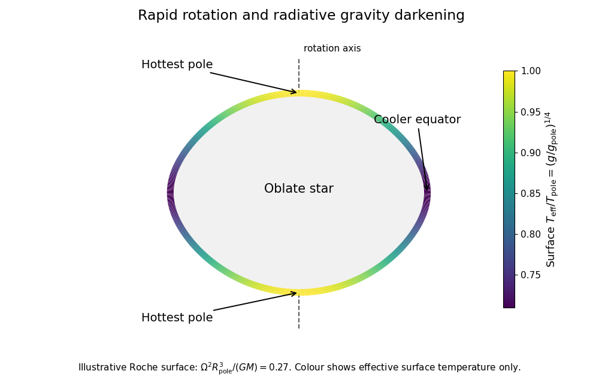

<h1 id="3/solution">Solution</h1>

↑ **Parent:** [3](../3.md)

Let $\Psi$ be the [gravitational potential](../../../../../newtonian-potential-of-a-point-mass.md), with $\nabla^2\Psi=4\pi G\rho$, and let $\varpi^2=x^2+y^2$ measure distance from the rotation axis. Uniform [solid-body rotation](../../../../../solid-body-rotation.md) contributes the [centrifugal potential](../../../../../centrifugal-potential.md) $-\Omega^2\varpi^2/2$. In the corotating frame, static force balance therefore gives the [uniformly rotating stellar hydrostatic equilibrium](../../../../../uniformly-rotating-stellar-hydrostatic-equilibrium.md) equations

$$
\boxed{\phi=\Psi-\frac12\Omega^2\varpi^2,\qquad
\nabla P=-\rho\nabla\phi,\qquad
\nabla^2\phi=4\pi G\rho-2\Omega^2.}
$$

The final coefficient follows because $\nabla^2(x^2+y^2)=4$.

A tangent displacement along a regular connected [equipotential surface](../../../../../equipotential-surface.md) has zero dot product with $\nabla\phi$, and hence with $\nabla P$. Thus $P=P(\phi)$ locally. Taking the curl of the [hydrostatic equilibrium](../../../../../hydrostatic-equilibrium.md) equation gives $\nabla\rho\times\nabla\phi=0$, so $\rho=\rho(\phi)$ on such surfaces as well. The [Poisson equation](../../../../../poisson-equation.md) then shows that $\nabla^2\phi$ is constant on each [equipotential surface](../../../../../equipotential-surface.md).

**The magnitude $g=|\nabla\phi|$ need not be constant.** For instance $\phi=A(x^2+y^2)+Bz^2$, with positive $A\ne B$, has constant Laplacian but different pole and equator gradient magnitudes on an ellipsoidal equipotential. In a rotating star, flattening and [centrifugal acceleration](../../../../../centrifugal-acceleration.md) likewise make the effective gravity latitude dependent.

With uniform composition, an [equation of state](../../../../../equation-of-state.md) determines $T$ from $P$ and $\rho$; for the supplied [ideal gas](../../../../../ideal-gas.md) plus [radiation pressure](../../../../../radiation-pressure.md) law its right side increases monotonically with $T$. Hence $T=T(\phi)$, and the [radiative conductivity](../../../../../radiative-conductivity.md) $\chi(\rho,T)$ is also constant on an [equipotential surface](../../../../../equipotential-surface.md). Put $f(\phi)=-\chi\,dT/d\phi$. Then $\mathbf F=f(\phi)\nabla\phi$. On the stellar surface, below mass shedding, the outward normal is $\nabla\phi/g$, so

$$
F_n=f(\phi_s)g,\qquad
\boxed{T_e=\left(\frac{f(\phi_s)}{\sigma}\right)^{1/4}g^{1/4}.}
$$

This is the [radiative gravity-darkening law](../../../../../radiative-gravity-darkening-law.md). The [effective temperature](../../../../../effective-temperature.md) measures emergent flux; it is not the same quantity as the interior material temperature that was constant on an equipotential.

A rapidly rotating star is oblate, with reduced effective gravity and cooler [effective temperature](../../../../../effective-temperature.md) around the equator. **The poles are hottest.** The original sketch uses a [Roche model of a uniformly rotating star](../../../../../roche-model-of-a-uniformly-rotating-star.md) only to illustrate the shape and surface-flux variation:

**[Figure 2](#3/image-oblate-rotating-star-with-hotter-poles-and-cooler-equator). Oblate rotating star with hotter poles and cooler equator**.

The obstruction to purely local [radiative equilibrium](../../../../../radiative-equilibrium.md) is visible by taking the divergence:

$$
\nabla\cdot\mathbf F=f'(\phi)|\nabla\phi|^2
+f(\phi)(4\pi G\rho-2\Omega^2).
$$

On an [equipotential surface](../../../../../equipotential-surface.md), $\rho\epsilon$, $f$, $f'$ and the second term are constant, but $g^2$ generally varies. Unless $f'=0$ or another special circumstance removes the mismatch, $\nabla\cdot\mathbf F=\rho\epsilon$ cannot hold at every latitude. This is the [radiative-equilibrium obstruction in a rotating barotropic star](../../../../../radiative-equilibrium-obstruction-in-a-rotating-barotropic-star.md); heat advection by [stellar meridional circulation](../../../../../meridional-circulation-in-a-star.md) resolves the missing energy transport in the leading hydrostatic treatment.

For the steady circulation, [mass conservation](../../../../../mass-conservation.md) gives $\nabla\cdot(\rho\mathbf v)=0$. The [specific enthalpy](../../../../../specific-enthalpy.md) identity and [hydrostatic equilibrium](../../../../../hydrostatic-equilibrium.md) give

$$
T\nabla s=\nabla h-\frac1\rho\nabla P=\nabla(h+\phi).
$$

Consequently

$$
\rho\mathbf v\cdot T\nabla s
=\nabla\cdot[\rho\mathbf v(h+\phi)].
$$

Both $h$ and $\phi$ are constant on the bounding [equipotential surface](../../../../../equipotential-surface.md). By the [divergence theorem](../../../../../divergence-theorem.md) and steady [continuity equation](../../../../../continuity-equation.md),

$$
\int_V\rho\mathbf v\cdot T\nabla s\,dV
=(h+\phi)_S\int_S\rho\mathbf v\cdot d\mathbf S=0.
$$

Integrating the given thermal energy equation therefore gives [equipotential luminosity conservation with stellar circulation](../../../../../equipotential-luminosity-conservation-with-stellar-circulation.md):

$$
\boxed{L=\int_S\mathbf F\cdot d\mathbf S=\int_V\rho\epsilon\,dV.}
$$

Individual circulation streams can cross the surface; only their net steady mass flux has to vanish.

Since $f$ is constant on that surface, integrating the [Poisson equation](../../../../../poisson-equation.md) gives

$$
L=f\int_S\nabla\phi\cdot d\mathbf S
=f(4\pi Gm-2\Omega^2V).
$$

Thus $dT/d\phi=-L/[\chi(4\pi Gm-2\Omega^2V)]$, while $dP/d\phi=-\rho$. Dividing these derivatives and inserting $\chi=4acT^3/(3\kappa\rho)$ yields the [radiative gradient in a uniformly rotating star](../../../../../radiative-gradient-in-a-uniformly-rotating-star.md):

$$
\boxed{\frac{d\log T}{d\log P}
=\frac{3\kappa PL}{16\pi acGmT^4}
\left(1-\frac{\Omega^2V}{2\pi Gm}\right)^{-1}.}
$$

The bracket must be positive for the regular outward-gravity configuration being used.

**For an interior equipotential, both mass factors must be the enclosed mass $m$.** The printed final bracket uses $M$, but its derivation gives $m$; at the outer surface $m=M$ and the printed bracket is recovered. For a direct check, a uniform-density model has $m=\rho V$, so the true correction $\Omega^2V/(2\pi Gm)=\Omega^2/(2\pi G\rho)$ is independent of the chosen enclosed volume. Replacing $m$ by a fixed total mass would incorrectly make it volume dependent.

## ↑ Ancestors (10)

1. [3](../3.md)
2. [Paper 63](../../paper-63-split.md)
3. [Iii](../../split.md)
4. [2012](../../../split.md)
5. [Past exam of the mathematics course of the University of Cambridge](../../../../split.md)
6. [Mathematics course of the University of Cambridge](../../../../../mathematics-course-of-the-university-of-cambridge.md)
7. [Course of the University of Cambridge](../../../../../course-of-the-university-of-cambridge.md)
8. [University of Cambridge](../../../../../university-of-cambridge-split.md)
9. [List of universities](../../../../../list-of-universities.md)
10. [Codex Wiki](../../../../../split.md)
