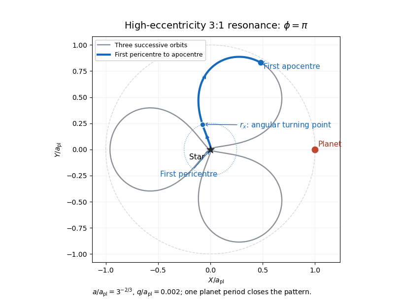
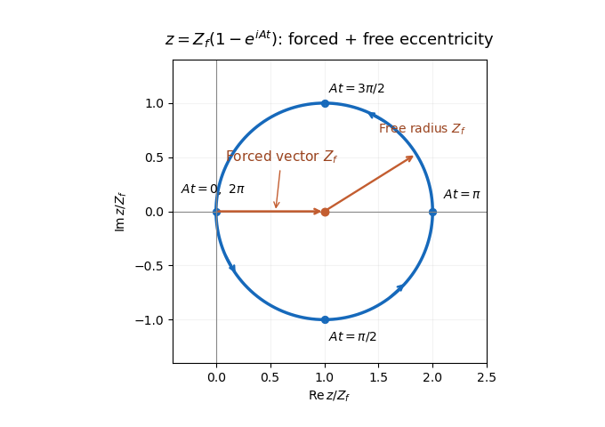

# Paper 64

↑ **Parent:** [Iii](../iii.md)

[https://www.maths.cam.ac.uk/postgrad/part-iii/files/pastpapers/2012/paper_64.pdf](https://www.maths.cam.ac.uk/postgrad/part-iii/files/pastpapers/2012/paper_64.pdf)

**Table of contents**

- [1](#1)
  - [Solution](#1/solution)
- [2](#2)
  - [Solution](#2/solution)
- [3](#3)
  - [Solution](#3/solution)
- [4](#4)
  - [Solution](#4/solution)

## 1

↑ **Parent:** [Paper 64](paper-64.md)

<h3 id="1/solution">Solution</h3>

↑ **Parent:** [1](#1)

Put $k=p+1$, $\mu=GM_\star$ and $n_{\rm pl}=\sqrt{\mu/a_{\rm pl}^3}$. To leading order the [mean-motion resonance](../../../classical-mechanics.md#mean-motion-resonance) fixes $a=a_{\rm pl}k^{-2/3}$. The [specific angular momentum](../../../classical-mechanics.md#specific-angular-momentum) is

$$
h^2=\mu q(1+e)\simeq2\mu q.
$$

The [asteroid](../../../planetary-science.md#asteroid)'s instantaneous [angular speed](../../../classical-mechanics.md#angular-speed) is $h/r^2$. Thus the [high-eccentricity angular-speed crossover](../../../classical-mechanics.md#high-eccentricity-angular-speed-crossover) satisfies $h/r_x^2=n_{\rm pl}$, giving

$$
\boxed{r_x=a_{\rm pl}\left(\frac{2q}{a_{\rm pl}}\right)^{1/4}},\qquad \dot\theta<n_{\rm pl}\quad\hbox{for }r>r_x.
$$

Here $q\ll r_x\ll a$, so a [parabolic Kepler orbit](../../../classical-mechanics.md#parabolic-trajectory) gives the local motion accurately. Its polar equation is $r=2q/(1+\cos f)$. Write $f_x=\pi-\epsilon_x$. Since $1+\cos f_x\simeq\epsilon_x^2/2$,

$$
\boxed{f_x\simeq\pi-2\sqrt{q/r_x}=\pi-2^{7/8}(q/a_{\rm pl})^{3/8}}.
$$

This is the outward crossing; the inward crossing has [true anomaly](../../../classical-mechanics.md#true-anomaly) $-f_x$ modulo $2\pi$.

For the [pericentre-to-crossover flight time](../../../classical-mechanics.md#pericentre-to-crossover-flight-time) use $D=\tan(f/2)$. The [parabolic Kepler orbit](../../../classical-mechanics.md#parabolic-trajectory) has $r=q(1+D^2)$ and $dt=r^2\,df/h$, whence direct integration gives the [Barker equation](../../../classical-mechanics.md#barker-equation)

$$
t(f)-t(0)=\sqrt{\frac{2q^3}{\mu}}\left(D+\frac{D^3}{3}\right).
$$

At the crossover $D_x\simeq\sqrt{r_x/q}\gg1$. Consequently the [planet](../../../planetary-science.md#planet)'s angular displacement is

$$
n_{\rm pl}t_x\simeq\frac{\sqrt2}{3}\left(\frac{r_x}{a_{\rm pl}}\right)^{3/2}
=\boxed{\frac{2^{7/8}}3\left(\frac{q}{a_{\rm pl}}\right)^{3/8}}.
$$

The error tends to zero as $q/a_{\rm pl}\to0$ at fixed $k$; it includes the finite binding energy of the elliptic [Kepler orbit](../../../classical-mechanics.md#kepler-orbit) as well as the subleading term in the [Barker equation](../../../classical-mechanics.md#barker-equation).

At the $j$th [pericentre](../../../classical-mechanics.md#periapsis) passage the [asteroid](../../../planetary-science.md#asteroid)'s unwrapped [mean longitude](../../../classical-mechanics.md#mean-longitude) is $\lambda=\varpi+2\pi j$. The [resonant argument](../../../classical-mechanics.md#resonant-argument) therefore gives

$$
\lambda_{\rm pl}-\varpi=\frac{\phi+2\pi j}{k}\pmod {2\pi}.
$$

Thus $\phi/k$ specifies the [planet](../../../planetary-science.md#planet)'s direction relative to the [asteroid](../../../planetary-science.md#asteroid)'s [longitude of pericentre](../../../classical-mechanics.md#longitude-of-periapsis) when the [asteroid](../../../planetary-science.md#asteroid) passes [pericentre](../../../classical-mechanics.md#periapsis), with $k$ branches separated by $2\pi/k$. It is not the instantaneous true-longitude separation throughout the orbit. At high [orbital eccentricity](../../../classical-mechanics.md#orbital-eccentricity) the [asteroid](../../../planetary-science.md#asteroid) quickly sweeps to a direction nearly opposite [pericentre](../../../classical-mechanics.md#periapsis), while the [planet](../../../planetary-science.md#planet) scarcely moves. During the long outer excursion the [asteroid](../../../planetary-science.md#asteroid)'s direction changes slowly and the [planet](../../../planetary-science.md#planet) advances substantially. This makes an [astronomical conjunction](../../../planetary-science.md#conjunction-astronomy) during the outer excursion much more dangerous than an [astronomical conjunction](../../../planetary-science.md#conjunction-astronomy) close to [pericentre](../../../classical-mechanics.md#periapsis).

At the following [apocentre](../../../classical-mechanics.md#apoapsis), the [planet](../../../planetary-science.md#planet) has advanced $\pi/k$. The [asteroid](../../../planetary-science.md#asteroid)'s direction in the [rotating reference frame](../../../physics.md#rotating-reference-frame) is consequently

$$
\psi_{{\rm apo},j}=\pi-\frac{\phi+(2j+1)\pi}{k}.
$$

These $k$ [apocentre](../../../classical-mechanics.md#apoapsis) directions are equally spaced. [Phase protection of interior integer resonances](../../../classical-mechanics.md#phase-protection-of-interior-integer-resonances) places the [planet](../../../planetary-science.md#planet) in the largest gap between them, rather than at an [apocentre](../../../classical-mechanics.md#apoapsis) direction. For $k=2$, $\phi=\pi$ puts an [apocentre](../../../classical-mechanics.md#apoapsis) toward the [planet](../../../planetary-science.md#planet), whereas $\phi=0$ puts the [apocentres](../../../classical-mechanics.md#apoapsis) at $\pm\pi/2$. For $k=3$, $\phi=0$ puts an [apocentre](../../../classical-mechanics.md#apoapsis) toward the [planet](../../../planetary-science.md#planet), whereas $\phi=\pi$ puts the [apocentres](../../../classical-mechanics.md#apoapsis) at $\pi/3,\pi,5\pi/3$. Hence the geometrically favored [resonant-argument libration](../../../classical-mechanics.md#resonant-argument-libration) centres in this regime of high [orbital eccentricity](../../../classical-mechanics.md#orbital-eccentricity) are

$$
\boxed{\phi\simeq0\quad(2:1),\qquad \phi\simeq\pi\quad(3:1)}\pmod {2\pi}.
$$

This is an encounter-avoidance argument for likely stability, not a calculation of a resonant [Hamiltonian](../../../classical-mechanics.md#hamiltonian) or a claim that every orbit near either centre is stable at arbitrary [orbital eccentricity](../../../classical-mechanics.md#orbital-eccentricity).

The following rotating-frame drawing uses $a_{\rm pl}=1$, $a=3^{-2/3}$, $q=0.002$ and $\phi=\pi$. It follows three successive [Kepler orbits](../../../classical-mechanics.md#kepler-orbit), which fill one [planet](../../../planetary-science.md#planet) [orbital period](../../../classical-mechanics.md#orbital-period) and close the pattern. The blue segment is just the first outward half-orbit. The marked crossover is a maximum of its rotating-frame polar angle, since $d\psi/dt=h/r^2-n_{\rm pl}$ changes from positive to negative there. The [planet](../../../planetary-science.md#planet) stays at $(1,0)$; the three [apocentres](../../../classical-mechanics.md#apoapsis) avoid that direction.

**[Figure 1](#1/image-phase-protected-high-eccentricity-3-1-orbit-in-the-planet-s-rotating-frame). Phase-protected high-eccentricity 3:1 orbit in the planet's rotating frame**.

To estimate [angular-momentum kicks to nearly radial orbits](../../../planetary-science.md#angular-momentum-kicks-to-nearly-radial-orbits), note that $q\simeq h^2/(2\mu)$, so an order-one fractional change in $q$ requires $|\Delta h|$ of order $h$. A characteristic distant encounter at radii of order $a_{\rm pl}$ has tangential acceleration of order $GM_{\rm pl}/a_{\rm pl}^2$ and duration of order $n_{\rm pl}^{-1}$. Its [torque](../../../classical-mechanics.md#torque) per unit [asteroid](../../../planetary-science.md#asteroid) [mass](../../../classical-mechanics.md#mass) therefore produces

$$
|\delta h|\sim\frac{GM_{\rm pl}}{a_{\rm pl}n_{\rm pl}}
=\frac{M_{\rm pl}}{M_\star}\sqrt{GM_\star a_{\rm pl}}.
$$

With the most favorable coherent signs, the crude encounter count is

$$
\boxed{N_{\rm coherent}\sim\max\left[1,\frac{M_\star}{M_{\rm pl}}\sqrt{\frac{q}{a_{\rm pl}}}\right]}.
$$

Order-one factors depend on $p$ and encounter geometry. Uncorrelated signs instead give a [random walk](../../../markov-process.md#random-walk) count of order $(M_\star/M_{\rm pl})^2q/a_{\rm pl}$ when this is large. A librating phase-protected orbit can suppress the kicks even further.

There is an important limit to calling this a minimum. The question does not specify an encounter [impact parameter](../../../classical-mechanics.md#impact-parameter). For a weak close encounter with [impact parameter](../../../classical-mechanics.md#impact-parameter) $b$ and relative speed $u\sim\sqrt{GM_\star/a_{\rm pl}}$, the [impulse](../../../classical-mechanics.md#impulse) estimate gives $|\delta h|\sim GM_{\rm pl}a_{\rm pl}/(bu)$ and hence $N\sim(M_\star/M_{\rm pl})(b/a_{\rm pl})\sqrt{q/a_{\rm pl}}$, capped below by one. In the 2:1 case the [Kepler orbit](../../../classical-mechanics.md#kepler-orbit) can cross the [planet](../../../planetary-science.md#planet)'s orbit, so one suitably close encounter can suffice: there is no impact-parameter-independent large lower bound. For $k\ge3$, $Q\simeq2a_{\rm pl}k^{-2/3}<a_{\rm pl}$ bounds the separation below by $a_{\rm pl}-Q$, and supplies a geometric factor at fixed $k$. The boxed count is the usual orbital-scale, maximally coherent estimate; the assumptions are essential.

## 2

↑ **Parent:** [Paper 64](paper-64.md)

<h3 id="2/solution">Solution</h3>

↑ **Parent:** [2](#2)

The central equation must be read as $\ddot{\mathbf r}=-\mu\mathbf r/r^3$; its printed left-hand expression lacks $=0$. Initially $\mu$ is constant. Dotting this equation with the velocity gives

$$
\frac{d}{dt}\left(\frac{v^2}{2}-\frac{\mu}{r}\right)=0.
$$

Taking its cross product with $\mathbf r$ gives $d(\mathbf r\times\mathbf v)/dt=0$. In the fixed orbital plane the magnitude is $h=r^2\dot\theta$. These are conservation of [specific orbital energy](../../../classical-mechanics.md#specific-orbital-energy) and [specific angular momentum](../../../classical-mechanics.md#specific-angular-momentum).

Let $f=\theta-\varpi$. Differentiating the polar equation of the [Kepler orbit](../../../classical-mechanics.md#kepler-orbit), with its elements initially constant, gives

$$
\dot r=\frac{\mu}{h}e\sin f,\qquad r\dot\theta=\frac{\mu}{h}(1+e\cos f).
$$

Substitution into the [specific orbital energy](../../../classical-mechanics.md#specific-orbital-energy) yields

$$
C=\frac{\mu^2}{2h^2}\left[e^2\sin^2f+(1+e\cos f)^2-2(1+e\cos f)\right]
=\boxed{\frac{\mu^2}{2h^2}(e^2-1)}.
$$

For [isotropic stellar mass loss](../../../planetary-science.md#isotropic-stellar-mass-loss) with no recoil or drag, the force is still central, so $\mathbf h$ remains exactly constant, although $C$ does not. Now

$$
\dot C=-\frac{\dot\mu}{r}.
$$

The same algebraic relation between $C,h,e$ holds for the instantaneous [osculating orbital elements](../../../classical-mechanics.md#osculating-orbital-element). Differentiating it and using $h^2/(\mu r)=1+e\cos f$ gives

$$
e\dot e=\frac{h^2}{\mu^2}\dot C-\frac{2Ch^2}{\mu^3}\dot\mu
=-\frac{\dot\mu}{\mu}e(e+\cos f),
$$

and, for $e>0$,

$$
\boxed{\dot e=-\frac{\dot\mu}{\mu}(e+\cos f)}.
$$

A particularly useful nonsingular description uses the [eccentricity vector](../../../classical-mechanics.md#eccentricity-vector)

$$
\mathbf e=\frac{\mathbf v\times\mathbf h}{\mu}-\widehat{\mathbf r},\qquad
\boxed{\dot{\mathbf e}=-\frac{\dot\mu}{\mu}(\mathbf e+\widehat{\mathbf r})}.
$$

The vector equation remains meaningful at a circular orbit, where a [longitude of pericentre](../../../classical-mechanics.md#longitude-of-periapsis) is undefined. Its components along and perpendicular to $\mathbf e$ give the scalar formula above and

$$
\boxed{\dot\varpi=-\frac{\dot\mu}{\mu}\frac{\sin f}{e}}.
$$

The osculating [pericentre](../../../classical-mechanics.md#periapsis) is $q=h^2/[\mu(1+e)]$. Therefore

$$
\boxed{\frac{\dot q}{q}=-\frac{\dot\mu}{\mu}\frac{1-\cos f}{1+e}}.
$$

For [mass](../../../classical-mechanics.md#mass) loss, $\dot\mu<0$, this is nonnegative: [pericentre](../../../classical-mechanics.md#periapsis) does not decrease. It is positive except at [pericentre](../../../classical-mechanics.md#periapsis) itself, where $\cos f=1$ and $\dot q=0$. Thus a strictly opposite sign at every instant is not literally true; a [pericentre](../../../classical-mechanics.md#periapsis) passage with nonzero [mass](../../../classical-mechanics.md#mass)-loss rate is a counterexample to the strict wording. The intended monotonicity follows exactly, without requiring slow [mass](../../../classical-mechanics.md#mass) loss.

For [adiabatic orbital expansion under isotropic mass loss](../../../planetary-science.md#adiabatic-orbital-expansion-under-isotropic-mass-loss), average over the unperturbed [Kepler orbit](../../../classical-mechanics.md#kepler-orbit) and hold $\dot\mu/\mu$ constant to leading order during that orbit. If $E$ is the [eccentric anomaly](../../../classical-mechanics.md#eccentric-anomaly) and $n=\sqrt{\mu/a^3}$, then

$$
\cos f=\frac{\cos E-e}{1-e\cos E},\qquad dt=\frac{1-e\cos E}{n}\,dE,\qquad P=\frac{2\pi}{n}.
$$

It follows immediately that

$$
\langle\cos f\rangle=\frac1{2\pi}\int_0^{2\pi}(\cos E-e)\,dE=-e,
\qquad \boxed{\langle\dot e\rangle=0}.
$$

Averaging with uniform [true anomaly](../../../classical-mechanics.md#true-anomaly) instead of uniform time would give the wrong result. Since $\mu a(1-e^2)=h^2$, conserved $h$ and constant secular [orbital eccentricity](../../../classical-mechanics.md#orbital-eccentricity) give

$$
\boxed{\mu a=\text{constant},\qquad a\propto\mu^{-1}}.
$$

The [pericentre](../../../classical-mechanics.md#periapsis) and [apocentre](../../../classical-mechanics.md#apoapsis) expand in the same secular proportion. These are leading [adiabatic invariants](../../../classical-mechanics.md#adiabatic-invariant), rather than exact invariants for arbitrary time-dependent $\mu$.

For the instantaneous precession fraction write $\theta=f+\varpi$ and $\dot\theta=h/r^2$. The [adiabatic apsidal condition](../../../planetary-science.md#adiabatic-apsidal-condition) is controlled by

$$
\boxed{\frac{\dot\varpi}{\dot\theta}
=-\frac{\dot\mu}{\mu}\frac{r^2}{he}\sin f
=-\frac{\dot\mu}{\mu n}\frac{(1-e^2)^{3/2}\sin f}{e(1+e\cos f)^2}}.
$$

It is a signed fraction: apsidal advance contributes positively on the outward leg during [mass](../../../classical-mechanics.md#mass) loss, and negatively on the inward leg. Let $\tau_\mu=|\mu/\dot\mu|$. Ordinary [orbit averaging](../../../planetary-science.md#orbit-averaging) requires $\tau_\mu\gg P$, together with negligible variation of the [mass](../../../classical-mechanics.md#mass)-loss law over one orbit. If the [pericentre](../../../classical-mechanics.md#periapsis) direction is also to vary negligibly relative to the instantaneous azimuthal motion, the maximum absolute fraction must be small. A precise condition for $0<e<1$ is

$$
n\tau_\mu\gg F(e),\qquad F(e)=\frac{(1-e^2)^{3/2}}e\max_f\frac{|\sin f|}{(1+e\cos f)^2}.
$$

The maximizing cosine is $c=(1-\sqrt{1+8e^2})/(2e)$: differentiating the last factor gives $c+2e-ec^2=0$. Thus one can evaluate $F(e)$ explicitly by putting $\sqrt{1-c^2}/(1+ec)^2$ into the formula. Its useful limits are

$$
F(e)\sim e^{-1}\quad(e\to0),\qquad F(e)\to\frac{3\sqrt3}{4}\quad(e\to1).
$$

**For [orbital eccentricity](../../../classical-mechanics.md#orbital-eccentricity) of order unity, [mass](../../../classical-mechanics.md#mass) loss much slower than an [orbital period](../../../classical-mechanics.md#orbital-period) suffices; near a circular orbit, keeping the [pericentre](../../../classical-mechanics.md#periapsis) direction slowly varying additionally requires $n\tau_\mu e\gg1$.** The latter divergence is a singularity of the [pericentre](../../../classical-mechanics.md#periapsis) coordinate, not a divergence of the [eccentricity vector](../../../classical-mechanics.md#eccentricity-vector) dynamics. Indeed, at frozen $\dot\mu/\mu$, integrating the scalar evolution to first order gives $\delta e=-(\dot\mu/\mu)(1-e^2)\sin E/n$ up to an integration constant. Its absolute amplitude stays small for slow [mass](../../../classical-mechanics.md#mass) loss even when the scalar [longitude of pericentre](../../../classical-mechanics.md#longitude-of-periapsis) becomes unsuitable.

## 3

↑ **Parent:** [Paper 64](paper-64.md)

<h3 id="3/solution">Solution</h3>

↑ **Parent:** [3](#3)

Use rotating barycentric coordinates $\mathbf R=(x,y,z)$, rotating velocity $\mathbf w$, and $\boldsymbol\Omega=\widehat{\mathbf z}$. Multiplying the three equations by the corresponding velocity components and adding cancels the [Coriolis force](../../../physics.md#coriolis-force) terms:

$$
\frac{d}{dt}\frac{|\mathbf w|^2}{2}=\nabla U\cdot\mathbf w=\frac{dU}{dt}.
$$

Thus the [Jacobi constant](../../../classical-mechanics.md#jacobi-constant) is $C=2U-|\mathbf w|^2$. The inertial barycentric velocity is $\mathbf V=\mathbf w+\boldsymbol\Omega\times\mathbf R$. If $H_z=(\mathbf R\times\mathbf V)_z$ and $E_b=|\mathbf V|^2/2-\mu_1/r_1-\mu_2/r_2$, then

$$
|\mathbf w|^2=|\mathbf V|^2+x^2+y^2-2H_z,
\qquad \boxed{C=-2E_b+2H_z}.
$$

The inertial energy $E_b$ and inertial [angular momentum](../../../classical-mechanics.md#angular-momentum) $H_z$ need not separately be constant. Their combination is constant because the two gravitational sources rotate steadily at unit [angular speed](../../../classical-mechanics.md#angular-speed).

For the [Tisserand parameter](../../../planetary-science.md#tisserand-parameter) take $\mu_2\ll\mu_1\simeq1$, and compare the [osculating orbital elements](../../../classical-mechanics.md#osculating-orbital-element) well outside a close encounter, where $\mu_2/r_2$ and barycentre-to-primary corrections are negligible. Then

$$
C=\frac{\mu_1}{a}+2\sqrt{\mu_1a(1-e^2)}\cos I+\text{small corrections}
\simeq\boxed{T=\frac1a+2\sqrt{a(1-e^2)}\cos I}.
$$

This requires a circular secondary orbit, the [restricted three-body problem](../../../classical-mechanics.md#restricted-three-body-problem) approximation, and no dissipative force or other perturber. $T$ is conserved to leading order between encounter episodes; the osculating $T$ during a close encounter need not be constant. The exact invariant is $C$.

For clarity the exact two-body energy relation is $a=\mu_1/(2\mu_1/r_1-v_1^2)$, rather than the printed formula without the numerator $\mu_1$. At the leading order $\mu_1=1$ used for $T$, the two agree; retaining finite $\mu_1$ in just part of that formula is inconsistent.

At a close encounter put the secondary radius and speed equal to one at leading order, and denote the particle's incoming relative speed outside the secondary's strong-deflection region by $u$. Conservation of relative speed in the short gravitational encounter gives

$$
|\Delta\mathbf v_1|\le2u.
$$

An incoming orbit with $a=1$ has $|\mathbf v_1|=1$ at $r_1=1$ by the [vis-viva equation](../../../classical-mechanics.md#vis-viva-equation); escape there requires an outgoing speed exceeding $\sqrt2$. The triangle inequality therefore gives the necessary [single-encounter escape velocity bound](../../../planetary-science.md#single-encounter-escape-velocity-bound)

$$
\sqrt2<|\mathbf v_{1,\rm out}|\le1+2u,
\qquad \boxed{u>\frac{\sqrt2-1}{2}}.
$$

Equality only gives a marginal parabolic limit. This argument deliberately gives a weak necessary bound, not a sufficient scattering criterion.

The [planet-encounter relative velocity](../../../planetary-science.md#planet-encounter-relative-velocity) is related to the [Tisserand parameter](../../../planetary-science.md#tisserand-parameter) by

$$
u^2=v_1^2+1-2v_{1,\rm tangential}=3-T.
$$

Here $v_{1,\rm tangential}=h_z$ at the encounter radius, and the formula also applies to inclined passages at the [planet](../../../planetary-science.md#planet)'s orbital plane. For the intended prograde coplanar incoming orbit, $I=0$ and $a=1$, so $u^2=2-2\sqrt{1-e^2}$. Applying the preceding necessary bound gives

$$
\sqrt{1-e^2}<1-\frac{3-2\sqrt2}{8}=\frac{5+2\sqrt2}{8},
\qquad \boxed{e>\frac18\sqrt{31-20\sqrt2}}.
$$

Coplanar alone also allows $I=\pi$. For that retrograde case $u^2=2+2\sqrt{1-e^2}$, and even a circular incoming orbit can be scattered onto an escaping orbit; the [orbital eccentricity](../../../classical-mechanics.md#orbital-eccentricity) restriction therefore presumes prograde motion. Also, retaining the outgoing relative-velocity geometry gives the sharper necessary condition $|\mathbf v_{1,\rm out}|\le1+u$, hence $u>\sqrt2-1$ and $e>\sqrt{4\sqrt2-5}/2$ for the same prograde incoming orbit. This stronger bound is consistent with, and implies, the weaker bound above.

For the [Tisserand periapsis bound](../../../planetary-science.md#tisserand-periapsis-bound), first write

$$
a=\frac{q+Q}{2},\qquad a(1-e^2)=\frac{2qQ}{q+Q},\qquad
\boxed{T=\frac2{q+Q}+2\sqrt{\frac{2qQ}{q+Q}}\cos I}.
$$

A bound orbit capable of another close encounter must intersect the secondary's circular radius, so $q\le1\le Q$. For fixed $q<1$, the largest possible $T$ occurs at $I=0$. The remaining expression decreases with $Q\ge1$, since

$$
\frac{\partial T(q,Q,0)}{\partial Q}
=\frac2{(q+Q)^2}\left[-1+\frac{q^2}{\sqrt{2qQ/(q+Q)}}\right]<0.
$$

Thus every such orbit obeys

$$
T\le g(q)=\frac2{1+q}+2\sqrt{\frac{2q}{1+q}}.
$$

On $0<q<1$, $g(q)$ increases monotonically from $2$ to $3$. For $2<T<3$ the least accessible [pericentre](../../../classical-mechanics.md#periapsis) is the unique root of $T=g(q)$: the limiting orbit is prograde and coplanar, with [apocentre](../../../classical-mechanics.md#apoapsis) just at the [planet](../../../planetary-science.md#planet). Introduce $s=\sqrt{3-T}$. Its tangential speed at this [apocentre](../../../classical-mechanics.md#apoapsis) is $1-s$, and its [vis-viva equation](../../../classical-mechanics.md#vis-viva-equation) gives the particularly well-behaved answer

$$
\boxed{q_{\min}=\frac{(1-\sqrt{3-T})^2}{1+2\sqrt{3-T}-(3-T)}}\qquad(2<T<3).
$$

Equivalently, setting $w=\sqrt{2q/(1+q)}$ gives $T=2-w^2+2w$ and $w=1-s$, with $q=w^2/(2-w^2)$. Rationalizing the previous result yields

$$
\boxed{q_{\min}=\frac{4+2T-T^2-4\sqrt{3-T}}{T^2-8}}.
$$

The apparent singularity at $T=\sqrt8$ is removable; the first form gives $q_{\min}=(\sqrt2-1)/2$ there. The limits are $q_{\min}\to0$ as $T\downarrow2$ and $q_{\min}\to1$ as $T\uparrow3$. The same lower envelope also excludes a smaller [pericentre](../../../classical-mechanics.md#periapsis) on an escaping trajectory when $2<T<3$. To see this without introducing an [apocentre](../../../classical-mechanics.md#apoapsis), use the [planet](../../../planetary-science.md#planet)-frame velocity sphere: $u=\sqrt{3-T}<1$ forces the tangential component at an encounter to be at least $w=1-u>0$, so total [specific angular momentum](../../../classical-mechanics.md#specific-angular-momentum) obeys $h\ge w$. At [pericentre](../../../classical-mechanics.md#periapsis) the stellar energy obeys $h^2=2q+2E q^2$, while $E=h_z-T/2\le h-T/2$. Thus

$$
h^2-2hq^2\le2q-Tq^2.
$$

If $q<q_{\min}=w^2/(2-w^2)$, then $q^2<w\le h$, and the left side is increasing with $h$. Hence $w^2\le2q+(2w-T)q^2$. But $2w-T=w^2-2$, and the right side is smaller than $w^2$ for $0\le q<q_{\min}$, a contradiction. This establishes the barrier for all Kepler trajectories that reach the encounter radius, including unbound ones.

For $0<T\le2$, bound encounter-crossing orbits can approach $q=0$ (take $Q\to2/T$), so the positive root extrapolated from the displayed expression is not a universal barrier. For $T>3$ there is no trajectory reaching a close encounter in this approximation, since $u^2=3-T$ would be negative. Multiple encounters can approach the derived lower envelope by changing energy, [angular momentum](../../../classical-mechanics.md#angular-momentum) and inclination while preserving the [Tisserand parameter](../../../planetary-science.md#tisserand-parameter); the invariant alone does not guarantee a particular encounter history reaches it.

## 4

↑ **Parent:** [Paper 64](paper-64.md)

<h3 id="4/solution">Solution</h3>

↑ **Parent:** [4](#4)

At each fixed [semimajor axis](../../../classical-mechanics.md#semi-major-axis), let $B=b_{3/2}^{2}(\alpha)/b_{3/2}^{1}(\alpha)$ and $Z_f=B e_{\rm pl}$. The [planet](../../../planetary-science.md#planet)'s [longitude of pericentre](../../../classical-mechanics.md#longitude-of-periapsis) is the zero of longitude. The [secular perturbation](../../../planetary-science.md#secular-perturbation) equation becomes $\dot z=iA(z-Z_f)$. Integrating it with the initial condition $z(0)=0$ gives

$$
\boxed{z(t)=Z_f[1-e^{iAt}]}.
$$

The [forced eccentricity](../../../planetary-science.md#forced-eccentricity) vector is the constant real $Z_f$; the [free eccentricity](../../../planetary-science.md#proper-eccentricity) vector is $-Z_f e^{iAt}$. Consequently the [complex eccentricity](../../../planetary-science.md#complex-eccentricity) follows a circle in the [Argand plane](../../../complex-analysis.md#complex-plane) centered at $Z_f$, with radius $Z_f$, starting at the origin and moving counterclockwise. Its initial velocity is downward, $\dot z(0)=-iAZ_f$. The secular period is $2\pi/A$, and

$$
e(t)=|z(t)|=2Z_f|\sin(At/2)|,\quad e_{\max}=2Z_f,\quad
\overline e=\frac{4Z_f}{\pi},\quad \sqrt{\overline{e^2}}=\sqrt2Z_f.
$$

The [longitude of pericentre](../../../classical-mechanics.md#longitude-of-periapsis) is undefined at the origin, but the [complex eccentricity](../../../planetary-science.md#complex-eccentricity) passes smoothly through it. At $At=\pi$, $z=2Z_f$ and the orbit is maximally eccentric and aligned with the [planet](../../../planetary-science.md#planet).

**[Figure 2](#4/image-forced-and-free-eccentricity-vectors-tracing-a-secular-circle-in-the-argand-plane). Forced and free eccentricity vectors tracing a secular circle in the Argand plane**.

Using the small-$\alpha$ [Laplace coefficient](../../../planetary-science.md#laplace-coefficient) expansion gives

$$
b_{3/2}^{1}=3\alpha+O(\alpha^3),\qquad
b_{3/2}^{2}=\frac{15}{4}\alpha^2+O(\alpha^4),\qquad
Z_f=\frac54\alpha e_{\rm pl}[1+O(\alpha^2)].
$$

Also $n=n_{\rm pl}\alpha^{-3/2}$ to leading order in the [planet](../../../planetary-science.md#planet)-to-[star](../../../stellar-astrophysics.md#star) [mass](../../../classical-mechanics.md#mass) ratio. The [secular forcing by a distant outer planet](../../../planetary-science.md#secular-forcing-by-a-distant-outer-planet) is therefore

$$
A=\frac34n_{\rm pl}\frac{M_{\rm pl}}{M_\star}\alpha^{3/2}[1+O(\alpha^2)],
\qquad
\boxed{z(t)\simeq\frac54\alpha e_{\rm pl}\left[1-\exp\left(i\frac34n_{\rm pl}\frac{M_{\rm pl}}{M_\star}\alpha^{3/2}t\right)\right]}.
$$

A relative $O(\alpha^2)$ correction to $A$ can accumulate a phase error at very long times; the leading-frequency formula is not a uniform-in-time expansion.

If $a_2=a_1(1+\delta)$ with $\delta=\delta a/a_1\ll1$, then $Z_{f,2}/Z_{f,1}=1+\delta+O(\delta^2)$ and $A_2/A_1=1+3\delta/2+O(\delta^2)$. The outer [planetesimal](../../../planetary-science.md#planetesimal) therefore has a slightly larger [forced eccentricity circle](../../../planetary-science.md#forced-eccentricity-circle) and a shorter secular period. Its accumulated secular phase lead is $\Delta(At)\simeq3A_1t\delta/2$. Initially both circles start at the origin, but their [eccentricity vectors](../../../classical-mechanics.md#eccentricity-vector) progressively lose alignment. Linearizing the exponential in $\delta$ additionally requires $|A_1t\delta|\ll1$.

The [orbit crossing](../../../planetary-science.md#orbit-crossing) is caused by this accumulating differential secular phase, even though individual [orbital eccentricities](../../../classical-mechanics.md#orbital-eccentricity) remain small. To first order in [orbital eccentricity](../../../classical-mechanics.md#orbital-eccentricity), the radius of an orbit at fixed inertial longitude $\theta$ is

$$
r(a,\theta,t)=a\left[1-\operatorname{Re}(z(a,t)e^{-i\theta})\right]+O(ae^2).
$$

For an infinitesimally neighboring orbit,

$$
\frac{\delta r}{\delta a}\simeq1-\operatorname{Re}\left[(z+a\partial_a z)e^{-i\theta}\right].
$$

This derivative is evaluated within the first-order orbital-shape model; derivatives of the neglected quadratic terms give relative $O(Z_f)$ corrections near crossing. The least separation over longitude is consequently $\delta a[1-|z+a\partial_a z|]$. The [differential secular orbit-crossing criterion](../../../planetary-science.md#differential-secular-orbit-crossing-criterion) is $|z+a\partial_a z|=1$. Since $Z_f\propto a$ and $A\propto a^{3/2}$,

$$
z+a\partial_a z=2Z_f(1-e^{iAt})-\frac32iZ_fAt\,e^{iAt}.
$$

The first term stays bounded by $4Z_f\ll1$, whereas the second grows in proportion to time. To leading order in $Z_f$, crossing begins when $(3/2)Z_fAt=1$. Thus

$$
\boxed{t_{\rm cross}\simeq\frac{2}{3Z_fA}
=\frac{32}{45}n_{\rm pl}^{-1}\frac{M_\star}{M_{\rm pl}}e_{\rm pl}^{-1}\left(\frac{a_1}{a_{\rm pl}}\right)^{-5/2}}.
$$

More precisely, in this first-order orbital-shape approximation the exact first crossing lies within a fractional $O(Z_f)$ window of this value, since the magnitude differs from $(3/2)Z_fAt$ by at most $4Z_f$. Higher-order [Laplace coefficients](../../../planetary-science.md#laplace-coefficient) give additional corrections. The local derivation takes the neighboring-orbit limit before the long-time limit; for a finite separation it requires $\delta a/a_1\ll Z_f$ near crossing. A broad continuous disk contains such neighboring orbits. The crossings first appear in directions selected by the phase of $z+a\partial_a z$, not simultaneously at every longitude.

For the [collision](../../../classical-mechanics.md#collision) energy estimate adopt the phase-averaged mean [orbital eccentricity](../../../classical-mechanics.md#orbital-eccentricity) $\overline e=4Z_f/\pi\simeq5\alpha e_{\rm pl}/\pi$. The specified velocity estimate gives

$$
v_{\rm col}\sim\overline e\sqrt{\frac{GM_\star}{a_1}},\qquad
v_{\rm col}^2\sim\frac{25}{\pi^2}\alpha e_{\rm pl}^2\frac{GM_\star}{a_{\rm pl}}.
$$

Using the projectile [kinetic energy](../../../classical-mechanics.md#kinetic-energy) per target [mass](../../../classical-mechanics.md#mass) convention for [specific impact energy](../../../planetary-science.md#specific-impact-energy), equal-size and equal-density bodies have equal [masses](../../../classical-mechanics.md#mass) and $Q=\tfrac12v_{\rm col}^2$. A [catastrophic planetesimal collision](../../../planetary-science.md#catastrophic-planetesimal-collision) requires $Q\gtrsim Q_D^*$, so

$$
\boxed{\frac{a_1}{a_{\rm pl}}\gtrsim\frac{2\pi^2}{25}\frac{Q_D^*a_{\rm pl}}{GM_\star e_{\rm pl}^2}}.
$$

The numerical coefficient is only illustrative because the [collision](../../../classical-mechanics.md#collision) speed was specified only to order of magnitude. If the disruption threshold is instead defined using the [centre of mass](../../../classical-mechanics.md#center-of-mass) [kinetic energy](../../../classical-mechanics.md#kinetic-energy) per combined [mass](../../../classical-mechanics.md#mass), equal [masses](../../../classical-mechanics.md#mass) give $Q_R=v_{\rm col}^2/8$ and the coefficient becomes $8\pi^2/25$ for a threshold expressed in that convention. The robust result is a lower bound of order $Q_D^*a_{\rm pl}/(GM_\star e_{\rm pl}^2)$.

**Within the inner-disk approximation, catastrophic [collisions](../../../classical-mechanics.md#collision) require sufficiently large $a_1/a_{\rm pl}$, not arbitrarily small radii.** Although the Keplerian speed rises inward, the secularly induced [orbital eccentricity](../../../classical-mechanics.md#orbital-eccentricity) falls faster: $v_{\rm col}^2\propto\alpha$. The lower bound must be much smaller than one to leave a domain compatible with $\alpha\ll1$. A small [planet](../../../planetary-science.md#planet) [orbital eccentricity](../../../classical-mechanics.md#orbital-eccentricity), a large disruption threshold, or a distant [planet](../../../planetary-science.md#planet) can eliminate that domain. The [planet](../../../planetary-science.md#planet) [mass](../../../classical-mechanics.md#mass) controls the time to crossing but cancels from the eventual [forced eccentricity](../../../planetary-science.md#forced-eccentricity) amplitude and this [collision](../../../classical-mechanics.md#collision)-energy criterion. The threshold alone does not ensure that crossing has occurred within the disk's available lifetime.

## ↑ Ancestors (8)

1. [Iii](../iii.md)
2. [2012](../../2012.md)
3. [Past exam of the mathematics course of the University of Cambridge](../../../past-exam-of-the-mathematics-course-of-the-university-of-cambridge.md)
4. [Mathematics course of the University of Cambridge](../../../university-of-cambridge.md#mathematics-course-of-the-university-of-cambridge)
5. [Course of the University of Cambridge](../../../university-of-cambridge.md#course-of-the-university-of-cambridge)
6. [University of Cambridge](../../../university-of-cambridge.md)
7. [List of universities](../../../README.md#list-of-universities)
8. [Codex Wiki](../../../README.md)
