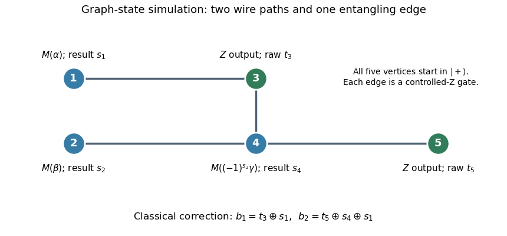

<h1 id="3/a/solution">Solution</h1>

↑ **Parent:** [A](../a.md)

Use five resource [qubits](../../../../../../qubit.md), all initially $|+\rangle$, and prepare the [graph state](../../../../../../graph-state.md) with edges $\{1,3\}$, $\{2,4\}$, $\{3,4\}$, $\{4,5\}$. The labels here identify resource [vertices](../../../../../../vertex-graph-theory.md); logical wire 1 travels from vertex 1 to 3, and logical wire 2 travels from 2 to 4 to 5. Each edge is a [Controlled-Z gate](../../../../../../controlled-z-gate.md), and these entangling gates commute, so all can be applied when preparing the resource.

**[Figure 1](#3/a/image-five-vertex-graph-resource-adaptive-measurement-angle-and-classical-output-corrections-for-the-two-qubit-circuit). Five-vertex graph resource, adaptive measurement angle, and classical output corrections for the two-qubit circuit**.

Measure vertex 1 in the [equatorial qubit measurement](../../../../../../equatorial-qubit-measurement.md) basis at angle $\alpha$, with outcome $s_1$, and vertex 2 at angle $\beta$, with outcome $s_2$. These measurements can be simultaneous. The [one-bit teleportation](../../../../../../one-bit-teleportation.md) lemma leaves the state on vertices 3 and 4, before the last teleportation, equal up to [global phase](../../../../../../global-phase.md) to

$$
X_3^{s_1}Z_3^{s_2}X_4^{s_2}Z_4^{s_1}E_{34}(J(\alpha)\otimes J(\beta))|++\rangle.
$$

Indeed commuting the two initial $X$ byproducts through $E_{34}$ creates precisely the crossed $Z$ factors. The unused edge from 4 to the fresh vertex 5 is the last [one-bit teleportation](../../../../../../one-bit-teleportation.md) link.

Measure vertex 4 at angle $\theta=(-1)^{s_2}\gamma$, with outcome $s_4$. By the printed [J gate](../../../../../../j-gate-in-measurement-based-quantum-computation.md) propagation identities,

$$
X^{s_4}J(\theta)X^{s_2}Z^{s_1}=e^{is_2\theta}X^{s_4\oplus s_1}Z^{s_2}J(\gamma).
$$

Thus the remaining two-qubit [quantum state](../../../../../../quantum-state.md) is

$$
\left(X_3^{s_1}Z_3^{s_2}\right)\otimes\left(X_5^{s_4\oplus s_1}Z_5^{s_2}\right)|\psi_C\rangle,
$$

up to [global phase](../../../../../../global-phase.md), where $|\psi_C\rangle$ is the desired circuit output relabelled onto vertices 3 and 5. The sign choice cancels the unwanted angle reversal caused by the $X$ frame on vertex 4.

Finally measure vertices 3 and 5 in the [computational basis](../../../../../../computational-basis.md), obtaining raw results $t_3,t_5$. The [Pauli Z gate](../../../../../../pauli-z-gate.md) affects only phases, while the [Pauli X gate](../../../../../../pauli-x-gate.md) flips a computational result. The [five-vertex graph-state circuit simulation](../../../../../../five-vertex-graph-state-circuit-simulation.md) therefore outputs

$$
\boxed{b_1=t_3\oplus s_1,\qquad b_2=t_5\oplus s_4\oplus s_1.}
$$

This deterministic classical correction reproduces the ideal joint [probability distribution](../../../../../../probability-distribution.md) for every preceding measurement branch. The final fixed-basis measurements may share the second layer with the adaptive measurement of vertex 4, because their projectors act on different [vertices](../../../../../../vertex-graph-theory.md); measuring them afterwards is also valid.

## ↑ Ancestors (11)

1. [A](../a.md)
2. [3](../../3.md)
3. [Paper 67](../../../paper-67-split.md)
4. [Iii](../../../split.md)
5. [2012](../../../../split.md)
6. [Past exam of the mathematics course of the University of Cambridge](../../../../../split.md)
7. [Mathematics course of the University of Cambridge](../../../../../../mathematics-course-of-the-university-of-cambridge.md)
8. [Course of the University of Cambridge](../../../../../../course-of-the-university-of-cambridge.md)
9. [University of Cambridge](../../../../../../university-of-cambridge-split.md)
10. [List of universities](../../../../../../list-of-universities.md)
11. [Codex Wiki](../../../../../../split.md)
