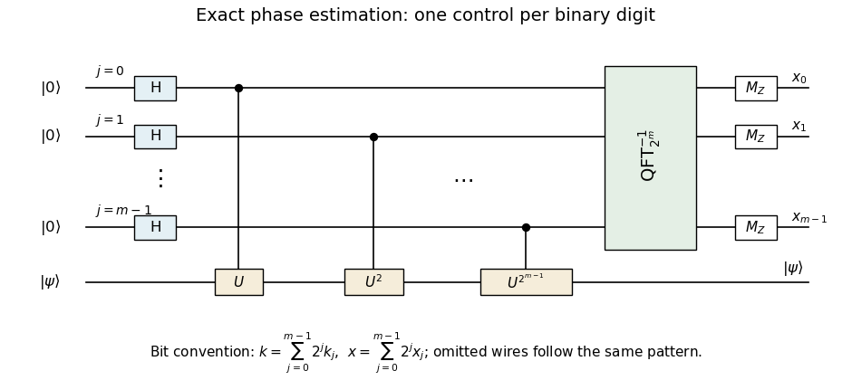

<h1 id="4/b/solution">Solution</h1>

↑ **Parent:** [B](../b.md)

The [quantum circuit](../../../../../../quantum-circuit-split.md) has one control wire per binary digit and one target [quantum register](../../../../../../quantum-register.md). Every control starts in $|0\rangle$, receives a [Hadamard gate](../../../../../../hadamard-gate.md), controls the corresponding power $U^{2^j}$, and then enters the collective inverse [quantum Fourier transform](../../../../../../quantum-fourier-transform.md). Only the control register is measured; the target stays in $|\psi\rangle$.

**[Figure 2](#4/b/image-exact-dyadic-phase-estimation-circuit-with-controlled-powers-inverse-fourier-transform-and-little-endian-output-bits). Exact dyadic phase-estimation circuit with controlled powers, inverse Fourier transform, and little-endian output bits**.

The omitted intermediate wires continue the pattern $j=0,1,\ldots,m-1$. The inverse [quantum Fourier transform](../../../../../../quantum-fourier-transform.md) black box is defined on the integer basis $|k\rangle$ with $k=\sum_j2^jk_j$, so the displayed ordering introduces no hidden bit reversal. The measured bits satisfy

$$
\boxed{x=\sum_{j=0}^{m-1}2^jx_j,\qquad\phi=x/2^m.}
$$

Each controlled power box represents $2^j$ sequential controlled-$U$ uses when only that primitive is available.

## ↑ Ancestors (11)

1. [B](../b.md)
2. [4](../../4.md)
3. [Paper 67](../../../paper-67-split.md)
4. [Iii](../../../split.md)
5. [2012](../../../../split.md)
6. [Past exam of the mathematics course of the University of Cambridge](../../../../../split.md)
7. [Mathematics course of the University of Cambridge](../../../../../../mathematics-course-of-the-university-of-cambridge.md)
8. [Course of the University of Cambridge](../../../../../../course-of-the-university-of-cambridge.md)
9. [University of Cambridge](../../../../../../university-of-cambridge-split.md)
10. [List of universities](../../../../../../list-of-universities.md)
11. [Codex Wiki](../../../../../../split.md)
