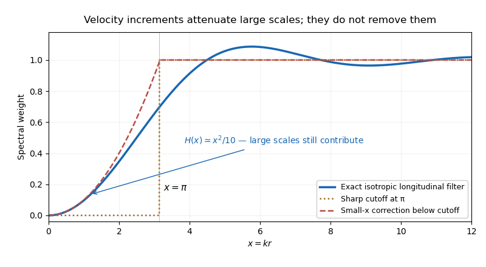

<h1 id="2/iv/solution">Solution</h1>

↑ **Parent:** [Iv](../iv.md)

Write $S_2(r)=\langle(\Delta v)^2\rangle$ and normalize the [turbulent energy spectrum](../../../../../../turbulent-energy-spectrum.md) by $\int_0^\infty E(k)\,dk=\langle|\mathbf u|^2\rangle/2$. In isotropic incompressible [turbulence](../../../../../../turbulence-split.md) the [longitudinal velocity correlation](../../../../../../longitudinal-velocity-correlation.md) is

$$
Q_{LL}(r)=2\int_0^\infty E(k)\frac{\sin(kr)-kr\cos(kr)}{(kr)^3}\,dk.
$$

Combining $S_2=2[Q_{LL}(0)-Q_{LL}(r)]$ with $Q_{LL}(0)=2\int E\,dk/3$ gives the exact spectral filter

$$
\boxed{\frac34S_2(r)=\int_0^\infty E(k)H(kr)\,dk},\qquad
H(x)=1+\frac{3\cos x}{x^2}-\frac{3\sin x}{x^3}.
$$

The expression has a smooth removable limit at $x=0$. Its asymptotic forms are

$$
H(x)=\frac{x^2}{10}-\frac{x^4}{280}+O(x^6)\quad(x\ll1),\qquad
H(x)=1+O(x^{-2})\quad(x\gg1).
$$

An eddy much larger than $r$ contributes nearly the same velocity at the two points and mostly cancels in the increment. An eddy much smaller than $r$ contributes decorrelated velocities and does not cancel. Replacing the smooth transition of $H$ by a step at $kr=\pi$ therefore gives the common estimate $3S_2/4\simeq\int_{\pi/r}^\infty E(k)\,dk$. The cutoff corresponds roughly to a half wavelength equal to the point separation; its exact numerical location is conventional.

Keeping the leading nonzero low-wavenumber term gives the improved estimate

$$
\boxed{\frac34S_2(r)\simeq\int_{\pi/r}^\infty E(k)\,dk+
\frac{r^2}{10}\int_0^{\pi/r}k^2E(k)\,dk}.
$$

It remains imperfect because $kr$ is not small throughout the whole low-wavenumber interval and the exact kernel oscillates above the transition. The data sheet's alternative coefficient $1/\pi^2$ is a nearby approximate matching prescription; $1/10$ is the exact Taylor coefficient. Neither piecewise filter is an exact identity.

**[Figure 1](#2/iv/image-exact-longitudinal-structure-function-spectral-filter-and-two-cutoff-approximations). Exact longitudinal structure-function spectral filter and two cutoff approximations**.

Higher-order [longitudinal structure functions](../../../../../../longitudinal-velocity-structure-function.md) also retain large-scale information. Decompose $\mathbf u=\mathbf U+\mathbf u_s$, where $\mathbf U$ varies on a length much larger than $r$. Its longitudinal increment is $\Delta U_L\simeq r\,\partial_LU_L$, which is small but not zero. Expanding $(\Delta U_L+\Delta u_{s,L})^p$ gives its own [moments](../../../../../../moment.md) and mixed [moments](../../../../../../moment.md) with the small-scale increment. Rare large gradients or correlated amplitude modulation can matter particularly strongly at large $p$.

Thus **a velocity increment is not an exact scale-local bandpass filter**. Its [moments](../../../../../../moment.md) may retain large-scale strain and forcing information, undermining an unqualified claim of universal small-scale statistics determined by one local parameter. This observation alone does not refute an asymptotic [inertial range](../../../../../../inertial-range.md) theory: for a three-dimensional $k^{-5/3}$ spectrum, the low-wavenumber correction is mainly supplied by wavenumbers of order $1/r$, while an isolated integral-scale smooth contribution behaves as $r^2$ and is subleading to $r^{2/3}$. The issue is whether large-scale contamination and mixed [moments](../../../../../../moment.md) actually become negligible in the regime and [moment](../../../../../../moment.md) order being used.

## ↑ Ancestors (11)

1. [Iv](../iv.md)
2. [2](../../2.md)
3. [Paper 73](../../../paper-73-split.md)
4. [Iii](../../../split.md)
5. [2012](../../../../split.md)
6. [Past exam of the mathematics course of the University of Cambridge](../../../../../split.md)
7. [Mathematics course of the University of Cambridge](../../../../../../mathematics-course-of-the-university-of-cambridge.md)
8. [Course of the University of Cambridge](../../../../../../course-of-the-university-of-cambridge.md)
9. [University of Cambridge](../../../../../../university-of-cambridge-split.md)
10. [List of universities](../../../../../../list-of-universities.md)
11. [Codex Wiki](../../../../../../split.md)
