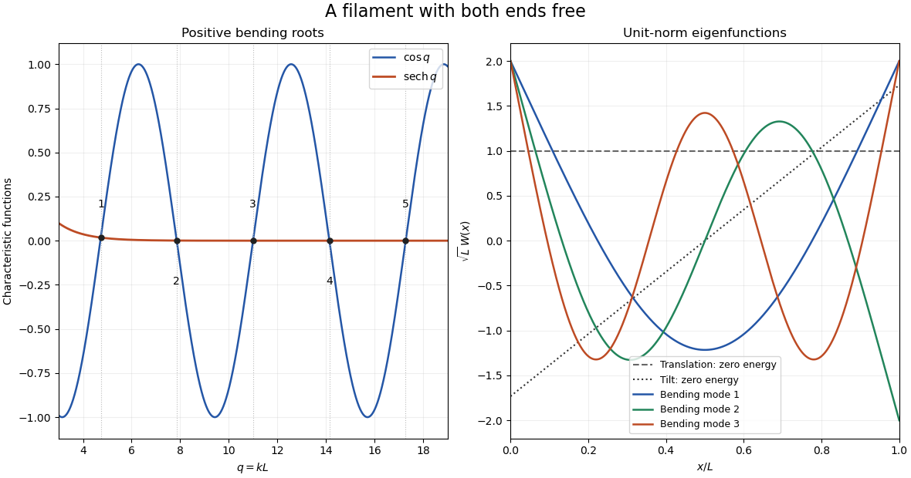

# Paper 74

↑ **Parent:** [Iii](../iii.md)

[https://www.maths.cam.ac.uk/postgrad/part-iii/files/pastpapers/2012/paper_74.pdf](https://www.maths.cam.ac.uk/postgrad/part-iii/files/pastpapers/2012/paper_74.pdf)

**Table of contents**

- [1](#1)
  - [Solution](#1/solution)
- [2](#2)
  - [a](#2/a)
    - [Solution](#2/a/solution)
  - [b](#2/b)
    - [Solution](#2/b/solution)
  - [c](#2/c)
    - [Solution](#2/c/solution)
  - [d](#2/d)
    - [Solution](#2/d/solution)
- [3](#3)
  - [a](#3/a)
    - [Solution](#3/a/solution)
  - [b](#3/b)
    - [Solution](#3/b/solution)

## 1

↑ **Parent:** [Paper 74](paper-74.md)

<h3 id="1/solution">Solution</h3>

↑ **Parent:** [1](#1)

For the [optical trap](../../../optics.md#optical-tweezers), use the trap-frame coordinate $y=x-v_Tt$ and the force-induced speed $u(y)=F(y)/\zeta$. Then $\dot y=u(y)-v_T$. The particle first enters the support at $y=X_R$ and exits at $y=-X_L$. Thus the actual support width is $w=X_R+X_L$. The printed difference $X_R-X_L$ is inconsistent with those endpoints and would give zero width for the symmetric example; below use the geometrically correct $w=2X_0$.

A [sufficient escape condition for a translating trap](../../../optics.md#sufficient-escape-condition-for-a-translating-trap) is

$$
\boxed{v_T>\sup_y u(y).}
$$

For a bounded continuous force this makes the relative velocity strictly negative and bounded away from zero, ensuring finite passage. For an ordinary smooth well, a root of $u(y)=v_T$ met from the incident side instead prevents passage: the trajectory approaches a trap-frame equilibrium. At the limiting maximum-speed equality, the passage time can diverge. Under the strict condition, [passage through a translating optical trap](../../../optics.md#passage-through-a-translating-optical-trap) gives

$$
\boxed{\Delta t=\int_{-X_L}^{X_R}\frac{dy}{v_T-u(y)},\qquad
\Delta x=\int_{-X_L}^{X_R}\frac{u(y)}{v_T-u(y)}\,dy
=v_T\Delta t-w.}
$$

The time is the support-crossing time; gaps where the force vanishes inside that interval are included.

There is an essential qualification to the direction claim. [Compact support](../../../function.md#compact-support) of $F$ alone does not imply positive displacement. For example, $F=-F_0<0$ throughout the support gives $\Delta x=-w(F_0/\zeta)/(v_T+F_0/\zeta)<0$ and satisfies the strict passing condition. A smooth negative bump is also a counterexample. The intended [optical trap](../../../optics.md#optical-tweezers) is a localized conservative well with $F=-U'$ and equal outside potential values. This additional assumption gives $\int u\,dy=0$. Now

$$
\frac{u}{v_T-u}=\frac{u}{v_T}+\frac{u^2}{v_T(v_T-u)},\qquad
\boxed{\Delta x=\int_{-X_L}^{X_R}\frac{u(y)^2}{v_T[v_T-u(y)]}\,dy\geq0.}
$$

It is strictly positive for a nonzero force on a set of positive measure. This is [forward displacement from a translating localized potential](../../../optics.md#forward-displacement-from-a-translating-localized-potential). During motion in the trap direction, the relative passage is slower, so the positive-force side acts longer; opposite motion speeds passage through the negative-force side. A complementary energy argument makes the sign transparent:

$$
\frac{dU}{dt}=-\zeta\dot x^2+v_T\zeta\dot x,
\qquad U_{\rm exit}=U_{\rm entry}
\quad\Longrightarrow\quad
v_T\Delta x=\int\dot x^2dt\geq0.
$$

The moving well must supply the viscous energy loss.

For the [high-speed passage expansion of a localized trap](../../../optics.md#high-speed-passage-expansion-of-a-localized-trap), require $\|u\|_\infty/v_T\ll1$. Expanding the denominator uniformly gives

$$
\Delta x=\frac1{v_T}\int u\,dy+\frac1{v_T^2}\int u^2\,dy+O(v_T^{-3}).
$$

Therefore the localized conservative well has

$$
\boxed{\Delta x\sim\frac1{\zeta^2v_T^2}\int F(y)^2dy,\qquad
\Delta t=\frac{w}{v_T}+\frac1{\zeta^2v_T^3}\int F(y)^2dy+O(v_T^{-4}).}
$$

For a symmetric well the force is odd, the cubic moment vanishes, and the displacement remainder improves to $O(v_T^{-4})$. For an arbitrary compact force without equal outside potential levels, its signed area instead gives the leading $v_T^{-1}$ displacement.

For circular motion, let $C=2\pi R$ and use the local arclength model, with nonoverlapping support $w<C$. In each encounter the relative position traverses $w$, while the particle advances $\Delta x$. Outside the support the particle is stationary and the trap must traverse the remaining relative arclength $C-w$. Hence the time between kicks and the [repeated kicks from a circular optical trap](../../../optics.md#repeated-kicks-from-a-circular-optical-trap) response are

$$
T_{\rm kick}=\Delta t+\frac{C-w}{v_T},\qquad
\boxed{f_p=\frac{\Delta x}{C[\Delta t+(C-w)/v_T]}
=f_T\frac{\Delta x}{C-w+v_T\Delta t}
=f_T\frac{\Delta x}{C+\Delta x}.}
$$

The last equality uses the single-passage identity. Equivalently, kicks arrive at the relative lap frequency $f_T-f_p$.

The precise small-correction condition for the [large-speed approximation for circular-trap kicks](../../../optics.md#large-speed-approximation-for-circular-trap-kicks) is $\Delta x/C\ll1$. A sufficient high-speed regime for a localized well is $v_T\gg\|F\|_\infty/\zeta$, with $w<C$ fixed: writing $\epsilon=\|u\|_\infty/v_T<1$, the positive-displacement integral bounds $\Delta x/C\leq(w/C)\epsilon^2/(1-\epsilon)$. Thus

$$
\boxed{f_p\simeq\frac{\Delta x}{2\pi R}f_T.}
$$

The locally straight force profile on a real circular track also presumes a trap width small relative to the radius; $R\gg a$ supplies the particle-size part of that approximation.

For the [triangular optical-trap response](../../../optics.md#triangular-optical-trap-response), put $v_c=F/\zeta=Cf_c$, $\beta=v_T/v_c$ and $\alpha=w/C=X_0/(\pi R)$. In the passing regime $\beta>1$, the two constant-force halves give

$$
\Delta t=\frac{X_0}{v_T+v_c}+\frac{X_0}{v_T-v_c}
=\frac{wv_T}{v_T^2-v_c^2},\qquad
\Delta x=\frac{wv_c^2}{v_T^2-v_c^2}=\frac{w}{\beta^2-1}.
$$

Substitution into the circular formula yields

$$
\boxed{\frac{f_p}{f_c}=\frac{\alpha\beta}{\beta^2-1+\alpha}\quad(\beta>1).}
$$

For $0<\beta\leq1$, the particle remains locked to the trap and $f_p/f_c=\beta$. At the ideal triangular cusp this is understood as sticking, or as the limit of a rounded well; it is not a finite passing kick. The passing branch tends continuously to one at $\beta\downarrow1$, while at large $\beta$ it behaves as $\alpha/\beta$. The zero-speed limiting response is zero. These branches apply to separated kicks, $0<\alpha<1$.

## 2

↑ **Parent:** [Paper 74](paper-74.md)

<h3 id="2/a">a</h3>

↑ **Parent:** [2](#2)

<h4 id="2/a/solution">Solution</h4>

↑ **Parent:** [A](#2/a)

For the [elastic filament](../../../continuum-mechanics.md#elastic-filament), apply a variation $\eta(x)$. Two [integration by parts](../../../calculus.md#integration-by-parts) operations give

$$
\delta\mathcal E=A\int_0^L h''\eta''dx
=A\int_0^L h^{(4)}\eta\,dx
+A[h''\eta'-h^{(3)}\eta]_0^L.
$$

At a free endpoint both $\eta$ and $\eta'$ are arbitrary. The [free-end bending boundary conditions](../../../continuum-mechanics.md#free-end-bending-boundary-conditions) and the unloaded [Euler-Lagrange equation](../../../analysis.md#euler-lagrange-equation) are therefore

$$
\boxed{h^{(4)}=0\quad(0<x<L),\qquad
h''=h^{(3)}=0\quad\text{at }x=0,L.}
$$

Here $Ah''$ is the bending moment and $-Ah^{(3)}$ the transverse shear-force convention. The equilibrium shapes are affine, reflecting free translation and tilt.

On $L^2(0,L)$ define $K=A\partial_x^4$ on $H^4$ functions obeying those endpoints. The [self-adjoint endpoint conditions for filament bending](../../../continuum-mechanics.md#self-adjoint-endpoint-conditions-for-filament-bending) annul the boundary form

$$
\langle u,Kv\rangle-\langle Ku,v\rangle
=A[\overline u v^{(3)}-\overline{u'}v''+\overline{u''}v'-\overline{u^{(3)}}v]_0^L.
$$

This proves symmetry. To establish actual [self-adjointness](../../../linear-operator-theory.md#self-adjoint-operator), the adjoint-domain boundary form must vanish for every free-end $u$. The endpoint values $u,u'$ can be varied independently, forcing $v''=v^{(3)}=0$ at both ends. The regular fourth-order expression then gives the same $H^4$ domain for the adjoint. Thus the domains coincide and $K$ is [self-adjoint](../../../linear-operator-theory.md#self-adjoint-operator). Also $\langle h,Kh\rangle=A\int|h''|^2dx\geq0$.

<h3 id="2/b">b</h3>

↑ **Parent:** [2](#2)

<h4 id="2/b/solution">Solution</h4>

↑ **Parent:** [B](#2/b)

A positive-eigenvalue [normal mode](../../../wave-equation.md#normal-mode) satisfies $KW_n=Ak_n^4W_n$. Solving the constant-coefficient equation gives the [sine](../../../geometry-and-topology.md#sine), [cosine](../../../geometry-and-topology.md#cosine), [hyperbolic sine](../../../calculus.md#hyperbolic-sine) and [hyperbolic cosine](../../../calculus.md#hyperbolic-cosine) family. To avoid confusing modal coefficients with the [filament bending modulus](../../../mathematical-biology.md#filament-bending-modulus), write those coefficients as $c_1,c_2,c_3,c_4$.

The free conditions at zero require $c_3=c_1$ and $c_4=c_2$. With $q=kL$, the remaining conditions are

$$
\begin{pmatrix}
\cosh q-\cos q&\sinh q-\sin q\\
\sinh q+\sin q&\cosh q-\cos q
\end{pmatrix}\binom{c_1}{c_2}=0.
$$

Its determinant is $2(1-\cos q\cosh q)$. Therefore the [free-free bending spectrum](../../../continuum-mechanics.md#free-free-bending-spectrum) is

$$
\boxed{\cos q_n\cosh q_n=1,\qquad k_n=q_n/L\quad(n\geq1).}
$$

A convenient corresponding [eigenfunction](../../../linear-operator-theory.md#eigenfunction) is

$$
W_n(x)=N_n\left[\cos(k_nx)+\cosh(k_nx)
-\gamma_n(\sin(k_nx)+\sinh(k_nx))\right],\qquad
\gamma_n=\frac{\cosh q_n-\cos q_n}{\sinh q_n-\sin q_n},
$$

where $N_n$ gives unit $L^2$ norm. The [stable characteristic equation for free-free bending modes](../../../continuum-mechanics.md#stable-characteristic-equation-for-free-free-bending-modes) is $\cos q=\operatorname{sech}q$. Intersections or numerical bracketing give

$$
\boxed{q_1\simeq4.730040745,\quad q_2\simeq7.853204624,\quad
q_3\simeq10.995607838,\quad q_4\simeq14.137165491,\quad q_5\simeq17.278759657,\ldots.}
$$

For the entire positive sequence, let $q_n^0=(n+\tfrac12)\pi$. Expanding $\cos q_n$ near its zero and using $\operatorname{sech}q_n\sim2e^{-q_n}$ gives

$$
\boxed{q_n=(n+\tfrac12)\pi+2(-1)^{n+1}e^{-(n+1/2)\pi}
+O(e^{-2(n+1/2)\pi}).}
$$

There are also two [zero-energy filament modes](../../../continuum-mechanics.md#zero-energy-filament-mode), not captured by substituting $k=0$ into the finite-coefficient trigonometric expression. Solving $W^{(4)}=0$ with free endpoints gives the affine kernel. An [orthonormal basis](../../../linear-algebra.md#orthonormal-basis) of that kernel is

$$
W_{\rm tr}(x)=L^{-1/2},\qquad
W_{\rm tilt}(x)=\sqrt{12/L^3}(x-L/2).
$$

The positive [normal modes](../../../wave-equation.md#normal-mode) are [orthogonal](../../../linear-algebra.md#orthogonal-vectors) to both. Including these two rigid-motion modes is essential for completeness; the regular [self-adjoint operator](../../../linear-operator-theory.md#self-adjoint-operator) on a finite interval has a complete discrete eigenbasis.

**[Figure 1](#2/b/image-characteristic-roots-and-bending-shapes-of-a-filament-with-two-free-ends). Characteristic roots and bending shapes of a filament with two free ends**.

<h3 id="2/c">c</h3>

↑ **Parent:** [2](#2)

<h4 id="2/c/solution">Solution</h4>

↑ **Parent:** [C](#2/c)

Choose real normalized [eigenfunctions](../../../linear-operator-theory.md#eigenfunction), including the two [zero-energy filament modes](../../../continuum-mechanics.md#zero-energy-filament-mode). The expansion is

$$
h=a_{\rm tr}W_{\rm tr}+a_{\rm tilt}W_{\rm tilt}+\sum_{n\geq1}a_nW_n.
$$

[Integration by parts](../../../calculus.md#integration-by-parts) with the natural endpoints gives $\int W_m''W_n''dx=k_n^4\delta_{mn}$. Hence

$$
\mathcal E=\frac A2\sum_{n\geq1}k_n^4a_n^2.
$$

For each positive mode, the [equipartition theorem](../../../statistical-physics.md#equipartition-theorem) gives

$$
\boxed{\langle a_n^2\rangle=\frac{k_BT}{Ak_n^4}.}
$$

Distinct modal amplitudes are independent centered [Gaussian random variables](../../../probability-theory.md#gaussian-random-variable) in the canonical bending ensemble.

The rigid translation and tilt amplitudes have no energy cost. Their integrals in the [canonical ensemble](../../../statistical-physics.md#canonical-ensemble) are unbounded, so **a completely free filament has no normalizable equilibrium height distribution and no finite height [variance](../../../variance.md) determined by this energy alone**. This is a physical qualification of the requested [variance](../../../variance.md), not a reason to omit the bending fluctuations.

Fixing translation and tilt, for example by imposing $\int h\,dx=\int(x-L/2)h\,dx=0$, leaves the [rigid-motion-projected thermal covariance of a free filament](../../../continuum-mechanics.md#rigid-motion-projected-thermal-covariance-of-a-free-filament):

$$
\boxed{C(x,y)=\frac{k_BT}{A}\sum_{n\geq1}\frac{W_n(x)W_n(y)}{k_n^4},\qquad
\operatorname{Var}h(x)=\frac{k_BT}{A}\sum_{n\geq1}\frac{W_n(x)^2}{k_n^4}.}
$$

For unnormalized modes, divide each summand by $\int W_n^2dx$. Any prescribed independent [variance](../../../variance.md) of the two rigid amplitudes must be added separately; [equipartition theorem](../../../statistical-physics.md#equipartition-theorem) does not assign it.

The [free-filament variance with fixed translation and tilt](../../../continuum-mechanics.md#free-filament-variance-with-fixed-translation-and-tilt) also has a closed form. Integrate a [white noise](../../../time-series.md#white-noise) curvature field twice, and subtract its affine least-squares projection. With $u=x/L$, $t=s/L$, the dimensionless kernel is

$$
\mathcal K(u,t)=(u-t)_+-\frac{(1-t)^2}{2}
-(1-3t^2+2t^3)(u-\tfrac12).
$$

It has zero mean and first spatial moment, while its second $u$ derivative is the delta source. Since the [covariance](../../../variance.md#covariance) is $(k_BT/A)\delta(s-s')$, integrate its squared kernel to obtain

$$
\boxed{\operatorname{Var}h(x)=\frac{k_BTL^3}{A}P(u),\qquad
P(u)=\frac1{105}-\frac{11u}{105}+\frac{13u^2}{35}-\frac{u^3}{3}
-\frac{u^4}{3}+\frac{3u^5}{5}-\frac{u^6}{5}.}
$$

This conditional profile is symmetric about the midpoint: $P(1-u)=P(u)$, with endpoint value $1/105$ and midpoint value $1/320$. It refers to removing the free rigid motion, not to clamping either end.

<h3 id="2/d">d</h3>

↑ **Parent:** [2](#2)

<h4 id="2/d/solution">Solution</h4>

↑ **Parent:** [D](#2/d)

The [functional derivative](../../../calculus-of-variations.md#functional-derivative) is $\delta\mathcal E/\delta h=Ah^{(4)}$, so the [overdamped filament bending equation](../../../mathematical-biology.md#small-slope-elastohydrodynamic-filament-equation) is $\zeta h_t=-Ah^{(4)}$ with the free-end conditions from (a). Expand the initial shape in the complete [orthonormal basis](../../../linear-algebra.md#orthonormal-basis):

$$
c_j=\int_0^L W_j(x)H(x)\,dx.
$$

The [overdamped relaxation of a free filament](../../../mathematical-biology.md#overdamped-relaxation-of-a-free-filament) is

$$
\boxed{h(x,t)=c_{\rm tr}W_{\rm tr}(x)+c_{\rm tilt}W_{\rm tilt}(x)
+\sum_{n\geq1}c_nW_n(x)e^{-Ak_n^4t/\zeta}.}
$$

Each bending mode relaxes on time $\tau_n=\zeta/(Ak_n^4)$; the two zero modes remain constant. Consequently the long-time shape is the affine projection of $H$,

$$
h_\infty(x)=\frac1L\int_0^L H(s)ds
+\frac{12(x-L/2)}{L^3}\int_0^L(s-L/2)H(s)ds.
$$

The total displacement and its first moment are conserved: integrate $h_t$ and $(x-L/2)h_t$, using $h''=h^{(3)}=0$ at the ends. This also checks why the final affine part cannot generally be set to zero. The series defines the $L^2$ solution for arbitrary square-integrable initial data; a classical solution at time zero additionally requires compatible boundary values.

## 3

↑ **Parent:** [Paper 74](paper-74.md)

<h3 id="3/a">a</h3>

↑ **Parent:** [3](#3)

<h4 id="3/a/solution">Solution</h4>

↑ **Parent:** [A](#3/a)

Adding the two homogeneous reaction rates gives $a-u$, so the unique positive [Brusselator](../../../diffusion-equation.md#brusselator) equilibrium is

$$
\boxed{u_*=a,\qquad v_*=b/a.}
$$

The reaction [Jacobian matrix](../../../calculus.md#jacobian-matrix) at that state is

$$
J=\begin{pmatrix}b-1&a^2\\-b&-a^2\end{pmatrix},\qquad
\tau=\operatorname{tr}J=b-1-a^2,\qquad\Delta=\det J=a^2.
$$

A real two-dimensional linear system has strict [asymptotic stability](../../../dynamical-systems.md#asymptotic-stability) exactly when $\tau<0$ and $\Delta>0$: the [eigenvalues](../../../linear-operator-theory.md#eigenvalue) solve $\lambda^2-\tau\lambda+\Delta=0$. Real [eigenvalues](../../../linear-operator-theory.md#eigenvalue) then have positive product and negative sum; a complex conjugate pair has real part $\tau/2$. Conversely, stable [eigenvalues](../../../linear-operator-theory.md#eigenvalue) require those signs.

Since $a>0$, the [Brusselator](../../../diffusion-equation.md#brusselator) is homogeneously stable precisely for

$$
\boxed{b<1+a^2.}
$$

At $b_H=1+a^2$, the linear [eigenvalues](../../../linear-operator-theory.md#eigenvalue) are $\pm ia$, so strict decay is lost through a homogeneous [Hopf bifurcation](../../../dynamical-systems.md#hopf-bifurcation) threshold. For larger $b$ the equilibrium is unstable. The source's matrix label $A$ is here written $J$ to distinguish it from the filament modulus in the preceding question.

<h3 id="3/b">b</h3>

↑ **Parent:** [3](#3)

<h4 id="3/b/solution">Solution</h4>

↑ **Parent:** [B](#3/b)

For [linear stability analysis](../../../dynamical-systems.md#linear-stability) of a general stable two-species [reaction–diffusion system](../../../diffusion-equation.md#reaction-diffusion-system), take [Fourier modes](../../../fourier-analysis.md#fourier-mode) proportional to $e^{\lambda t+ikx}$. Their matrix is $J_k=J-k^2\operatorname{diag}(D_u,D_v)$. Put $s=k^2$, $\tau=\operatorname{tr}J$, $\Delta=\det J$ and $B=D_va_{11}+D_ua_{22}$. Then

$$
\tau_k=\tau-(D_u+D_v)s,\qquad
\Delta_k=\Delta-Bs+D_uD_vs^2.
$$

The full system is stable precisely when $\tau_k<0$ and $\Delta_k>0$ for every allowed mode. If the homogeneous state is stable, the trace already decreases with $s$; only the determinant can change sign. If $B\leq0$, its minimum for $s\geq0$ is at zero. If $B>0$, it is at $s_*=B/(2D_uD_v)$. Thus the [two-species Turing criterion](../../../diffusion-equation.md#two-species-diffusion-driven-instability-criterion) for instability on a continuum of wavenumbers is

$$
\boxed{\tau<0,\quad\Delta>0,\quad B>0,\quad
B^2>4D_uD_v\Delta.}
$$

Strict stability has $B<2\sqrt{D_uD_v\Delta}$ together with the homogeneous conditions. Equality at positive $B$ marks a stationary neutral mode. At that first onset,

$$
\boxed{k_c^2=\frac{B}{2D_uD_v}=\sqrt{\frac{\Delta}{D_uD_v}},\qquad
k_c=\left(\frac{\Delta}{D_uD_v}\right)^{1/4}.}
$$

Beyond threshold, the growing band lies between the positive roots $s_\pm=[B\pm\sqrt{B^2-4D_uD_v\Delta}]/(2D_uD_v)$, as long as the homogeneous trace stays negative.

For the [Brusselator](../../../diffusion-equation.md#brusselator), $B=D_v(b-1)-D_ua^2$. Write $r=D_u/D_v$. The stationary determinant threshold gives the [Turing threshold of the Brusselator](../../../diffusion-equation.md#turing-threshold-of-the-brusselator) in dimensional diffusivities:

$$
\boxed{b_T=(1+a\sqrt r)^2,\qquad
k_c^2=\frac{a}{\sqrt{D_uD_v}},\qquad
k_c=\frac{\sqrt a}{(D_uD_v)^{1/4}}.}
$$

For this to be a genuine diffusion-driven loss of stability, it must occur before the homogeneous [Hopf bifurcation](../../../dynamical-systems.md#hopf-bifurcation) threshold. The [Brusselator Turing-before-Hopf diffusivity condition](../../../diffusion-equation.md#brusselator-turing-before-hopf-diffusivity-condition) is

$$
\boxed{b_T<1+a^2
\quad\Longleftrightarrow\quad
\frac{D_v}{D_u}>\left(\frac{\sqrt{1+a^2}+1}{a}\right)^2.}
$$

Indeed $a^2r+2a\sqrt r<a^2$ is equivalent to $\sqrt r<(\sqrt{1+a^2}-1)/a$. With this strict inequality, $b_T<b<b_H$ contains a spatially unstable but homogeneously stable interval. If the ratio condition fails, the first linear instability as $b$ increases is homogeneous at $b_H$, rather than a [Turing instability](../../../diffusion-equation.md#turing-instability); equality gives simultaneous neutral homogeneous and finite-wavenumber modes. Equal diffusivities cannot produce a [Turing instability](../../../diffusion-equation.md#turing-instability).

These continuum formulas assume the onset wavenumber is available. On a finite domain with a specified discrete mode set, the [discrete-mode Turing threshold for the Brusselator](../../../diffusion-equation.md#discrete-mode-turing-threshold-for-the-brusselator) is

$$
\boxed{b_T^{\rm discrete}=\min_{k\ne0\ \rm allowed}
\left[1+a^2\frac{D_u}{D_v}+D_uk^2+\frac{a^2}{D_vk^2}\right],}
$$

provided this minimum is below $b_H$. The question supplies no boundary geometry, so the continuous-mode onset above is the usual answer; this last expression states how a finite-size restriction changes it.

## ↑ Ancestors (8)

1. [Iii](../iii.md)
2. [2012](../../2012.md)
3. [Past exam of the mathematics course of the University of Cambridge](../../../past-exam-of-the-mathematics-course-of-the-university-of-cambridge.md)
4. [Mathematics course of the University of Cambridge](../../../university-of-cambridge.md#mathematics-course-of-the-university-of-cambridge)
5. [Course of the University of Cambridge](../../../university-of-cambridge.md#course-of-the-university-of-cambridge)
6. [University of Cambridge](../../../university-of-cambridge.md)
7. [List of universities](../../../README.md#list-of-universities)
8. [Codex Wiki](../../../README.md)
