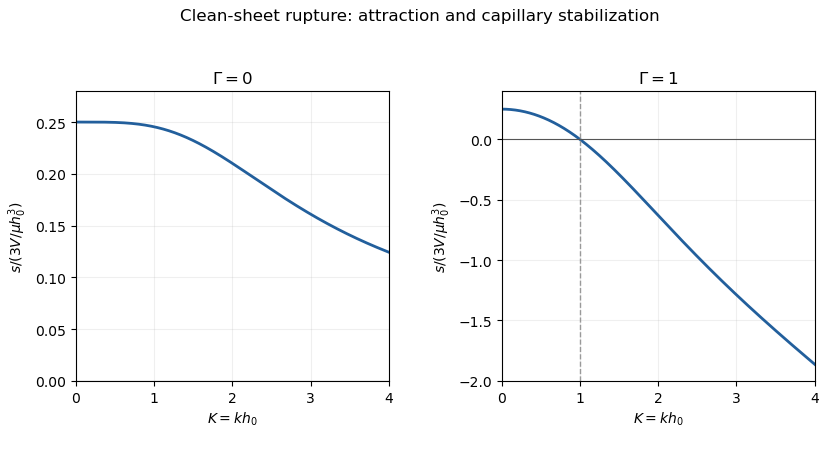
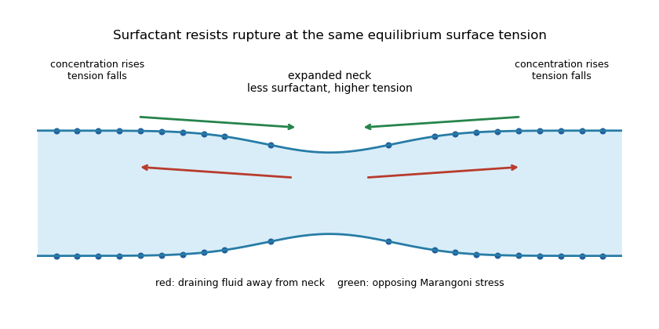

<h1 id="2/solution">Solution</h1>

↑ **Parent:** [2](../2.md)

Take pressure positive in compression, outward normal on the upper interface, and curvature $\kappa\simeq-h_{xx}$. The external-minus-internal traction convention gives the base pressure $p_0=V/h_0^3$. For the symmetric Fourier perturbation, the linearized upper-surface conditions are

$$
\boxed{v(h_0)=s\eta,\qquad
\mu(u_y+v_x)(h_0)=0,\qquad
-p'+2\mu v_y=\left(\frac{3V}{h_0^4}-\gamma k^2\right)\eta.}
$$

Isotropic base stress cancels all terms due merely to rotating the normal. Velocity $u$ is even and $v$ odd in $y$.

Use the same [Papkovich–Neuber representation](../../../../../papkovich-neuber-representation.md) as in Q1, with $\boldsymbol\Phi=(0,\phi)$ and symmetric harmonic potentials

$$
\phi=A\sinh(ky)e^{ikx},\qquad \chi=B\cosh(ky)e^{ikx}.
$$

Suppress the common exponential. They give

$$
u=-\frac{ik}{2}(Ay\sinh ky+B\cosh ky),\qquad
v=\frac A2(\sinh ky-ky\cosh ky)-\frac{kB}{2}\sinh ky,\qquad
p'=-\mu kA\cosh ky.
$$

The zero tangential stress is $Ah_0\cosh K+B\sinh K=0$, where $K=kh_0>0$. Hence $B=-Ah_0\coth K$, $v(h_0)=A\sinh K/2$ and the normal stress becomes $\mu kA(\cosh K+K/\sinh K)$. Eliminating $A$ using the kinematic condition gives **the [Van der Waals rupture instability of a viscous sheet](../../../../../van-der-waals-rupture-instability-of-a-viscous-sheet.md) rate**

$$
\boxed{s=\frac{3V}{\mu h_0^3}
\frac{(1-\Gamma K^2)\sinh^2K}{K(2K+\sinh2K)},\qquad
\Gamma=\frac{\gamma h_0^2}{3V}.}
$$

Attraction destabilizes thickness variations; curvature pressure opposes them.

**[Figure 1](#2/image-clean-sheet-rupture-growth-rates-without-capillarity-and-with-gamma-equal-to-one). Clean-sheet rupture growth rates without capillarity and with Gamma equal to one**.

For the [clean-sheet long-wave rupture plateau](../../../../../clean-sheet-long-wave-rupture-plateau.md), writing $s_0=3V/(\mu h_0^3)$, the rate is $s/s_0\to1/4$. Without capillarity, the curve decreases toward $1/(2K)$ at large $K$; with $\Gamma=1$ it changes sign at $K=1$ and behaves as $-K/2$. Thus short waves are weakly unstable without surface tension, but stabilized by it. The largest clean-sheet rate is approached at long wavelength. The strictly uniform $k=0$ thickness change is not an admissible fixed-volume Fourier mode; this is the limit of nonzero waves. Stress-free surfaces permit extensional, nearly plug-like motion whose mobility compensates the weak long-wave pressure gradient. Unsteady inertia eventually matters in that limit; finite sheet extent, drainage, gravity, surface elasticity/viscosity, surfactant transport and molecular-scale corrections can also modify wavelength selection.

For the comparison with surfactant, keep the same equilibrium tension $\gamma_0$. Flow away from a thinning neck stretches the surface, diluting its [surfactant](../../../../../surfactant.md) and raising tension there. Convergence into thicker regions concentrates surfactant and lowers tension. The resulting [Marangoni stress](../../../../../marangoni-effect.md) points back toward the neck, opposing the draining surface motion. It therefore reduces mobility and the rupture rate relative to the clean constant-$\gamma_0$ sheet. This mechanism needs surface transport to sustain concentration gradients; instantaneous concentration equilibration would remove it.

**[Figure 2](#2/image-surfactant-dilution-at-a-thinning-neck-and-opposing-marangoni-surface-stresses). Surfactant dilution at a thinning neck and opposing Marangoni surface stresses**.

For the supplied strong-surfactant rate, unstable waves satisfy $K<\Gamma^{-1/2}$. When $\Gamma\gg1$, all of them have $K\ll1$. Expanding its mobility factor gives

$$
\frac{\sinh2K-2K}{4K\cosh^2K}=\frac{K^2}{3}+O(K^4),\qquad
s=\frac{s_0}{3}K^2(1-\Gamma K^2)[1+O(K^2)].
$$

Maximizing in $K^2$ yields **the [strong-surfactant long-wave rupture maximum](../../../../../strong-surfactant-long-wave-rupture-maximum.md)**

$$
\boxed{K_m^2=\frac1{2\Gamma}[1+O(\Gamma^{-1})],\qquad
s_{\max}=\frac{s_0}{12\Gamma}[1+O(\Gamma^{-1})]
=\frac{3V^2}{4\mu\gamma h_0^5}[1+O(\Gamma^{-1})].}
$$

Here $\gamma$ is the equilibrium tension $\gamma_0$ in the soap-film comparison. Surface immobilization removes the clean long-wave plateau and selects a finite long wavelength. The growth timescale is lengthened by a factor about $3\Gamma$ compared with the clean maximum. A linear rupture-time estimate is $s_{\max}^{-1}\log(h_0/|\eta_{\rm initial}|)$, not a universal bubble lifetime: drainage and changing thickness, initial defects and nonlinear rupture also matter.

## ↑ Ancestors (10)

1. [2](../2.md)
2. [Paper 75](../../paper-75-split.md)
3. [Iii](../../split.md)
4. [2012](../../../split.md)
5. [Past exam of the mathematics course of the University of Cambridge](../../../../split.md)
6. [Mathematics course of the University of Cambridge](../../../../../mathematics-course-of-the-university-of-cambridge.md)
7. [Course of the University of Cambridge](../../../../../course-of-the-university-of-cambridge.md)
8. [University of Cambridge](../../../../../university-of-cambridge-split.md)
9. [List of universities](../../../../../list-of-universities.md)
10. [Codex Wiki](../../../../../split.md)
