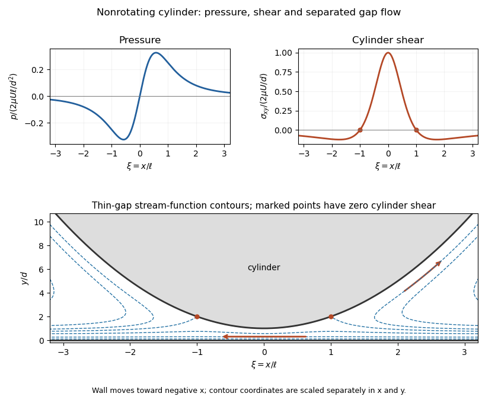
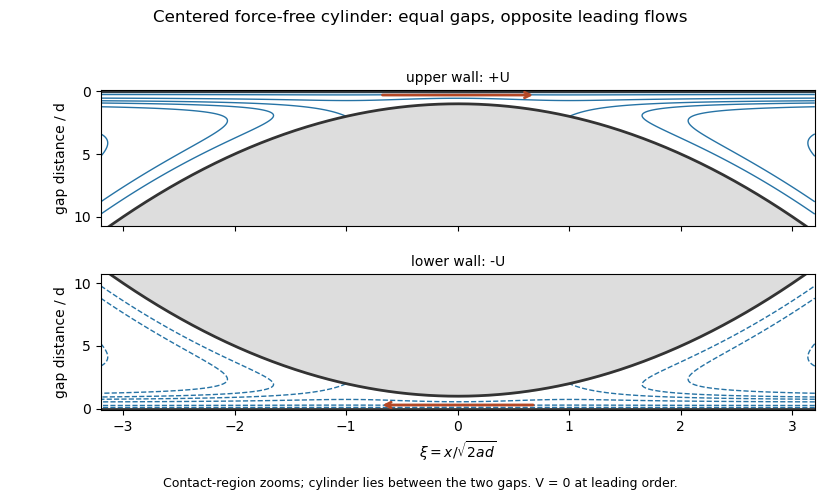

<h1 id="4/solution">Solution</h1>

↑ **Parent:** [4](../4.md)

Take positive $\Omega$ counterclockwise in the $(x,y)$ plane and put $W=\Omega a$, $d=\epsilon a$. The bottom cylinder surface moves locally at $W$; the wall moves at $-U$. In the [lubrication approximation](../../../../../lubrication-theory.md),

$$
h=d+\frac{x^2}{2a}=d(1+\xi^2),\qquad
\xi=\frac{x}{\ell},\qquad\ell=\sqrt{2ad}.
$$

The leading equations are $p_y=0$, $\mu u_{yy}=p_x$ and incompressibility. No slip gives the [Couette-Poiseuille flow in a thin gap](../../../../../couette-poiseuille-flow-in-a-thin-gap.md)

$$
\boxed{u=-U+\frac{U+W}{h}y+\frac{p_x}{2\mu}y(y-h),\qquad
q=\frac h2(W-U)-\frac{h^3p_x}{12\mu}.}
$$

The steady gap flux is independent of $x$. Equal leading pressures at the two matched outer ends require $\int p_x\,dx=0$. Let $J_n=\int h^{-n}dx=\ell d^{-n}I_n$. Then $J_2/J_3=4d/3$, and **$\boxed{q=\tfrac23d(W-U)}$.** The velocity field and flux determine the normal velocity by incompressibility and no penetration.

At the wall and cylinder, respectively,

$$
\boxed{\frac{\tau_0}{\mu}=\frac{4U-2W}{h}+\frac{6q}{h^2},\qquad
\frac{\tau_h}{\mu}=\frac{4W-2U}{h}-\frac{6q}{h^2}.}
$$

Here $\tau=\sigma_{xy}$; the fluid force on the cylinder has the opposite traction sign from that on the wall. Since $J_2=J_1/(2d)$,

$$
\boxed{F_{\rm wall}^{\rm shear}=2\mu UJ_1,\qquad
F_{\rm cylinder}^{\rm shear}=-2\mu WJ_1,\qquad
J_1=\pi\sqrt{\frac{2a}{d}}.}
$$

The [shear and pressure force partition in cylinder lubrication](../../../../../shear-and-pressure-force-partition-in-cylinder-lubrication.md) explains why these two shear forces need not balance: pressure on the sloping cylinder surface supplies an equally important tangential component. Its contribution is

$$
F_{\rm cylinder}^{p}=-\int p h'\,dx=\int hp_x\,dx
=2\mu(W-U)J_1.
$$

Boundary terms vanish under outer matching. Thus the total cylinder force is $-2\mu UJ_1$, and it balances the wall force once pressure is included. Pressure acts normally through the circular cylinder's center and gives no torque; leading shear torque is $aF_{\rm cylinder}^{\rm shear}=-2\mu\Omega a^2J_1$.

The effective weight per unit length is $+\pi a^2\Delta\rho g$ in the falling direction, with zero applied couple. Force and couple balance give **$\boxed{U=\Delta\rho g a^2\sqrt{\epsilon}/(2\sqrt2\mu),\quad\Omega=0\text{ at leading order}}$.** Finite outer-region torque can generate smaller rotation; the leading singular gap resistance is what fixes this result.

For $\Omega=0$, $q=-2dU/3$ and

$$
p_x=\frac{2\mu U}{d^2}\frac{1-3\xi^2}{(1+\xi^2)^3},\qquad
p=\frac{2\mu U\ell}{d^2}\frac{\xi}{(1+\xi^2)^2},\qquad
\tau_h=\frac{2\mu U}{d}\frac{1-\xi^2}{(1+\xi^2)^2}.
$$

The pressure is odd, negative for $x<0$ and positive for $x>0$ with the wall moving toward decreasing $x$, and tends to the common reference pressure at either end. The cylinder shear changes sign at **$\boxed{x=\pm\ell=\pm a\sqrt{2\epsilon}}$**. For $\zeta=y/h$, the velocity is

$$
u/U=(1-\zeta)\left[-1+\left(3-\frac{4}{1+\xi^2}\right)\zeta\right].
$$

Flow is entirely wall-directed near the neck, while a reversed layer next to the cylinder exists for $|\xi|>1$. These changes are the separation and reattachment points shown in the stream-function sketch.

**[Figure 3](#4/image-pressure-cylinder-shear-and-thin-gap-streamlines-for-a-nonrotating-falling-cylinder). Pressure, cylinder shear and thin-gap streamlines for a nonrotating falling cylinder**.

For the final [Couette flow](../../../../../couette-flow.md), the printed center $(\lambda\epsilon a,0)$ is an offset parallel to the walls. Translational invariance removes it; the centered two-gap symmetry gives **the literal answer $\boxed{V=0}$ for every $\lambda$**. A dependence on $\lambda$ requires a transverse position, evidently the intended $(0,\lambda\epsilon a)$. With that repaired interpretation, the lower and upper gaps are $d_b=\epsilon a(1+\lambda)$ and $d_t=\epsilon a(1-\lambda)$.

In the translating cylinder frame the wall velocities are $-U-V$ and $U-V$. Each leading tangential drag is $2\mu J_1$ times its wall velocity, independent of the rotation. Hence zero net force requires $(U-V)J_t-(U+V)J_b=0$, where $J_{t,b}=\pi\sqrt{2a/d_{t,b}}$. **For the intended transverse offset,**

$$
\boxed{V=U\frac{\sqrt{1+\lambda}-\sqrt{1-\lambda}}
{\sqrt{1+\lambda}+\sqrt{1-\lambda}}
=U\frac{\lambda}{1+\sqrt{1-\lambda^2}}.}
$$

This formula assumes both gaps remain lubrication gaps, with fixed $|\lambda|<1$. It gives $V=0$ at $\lambda=0$ and motion toward the faster nearby wall otherwise.

At $\lambda=0$, the lower-gap flow is the previous $-U$ flow and the upper gap its reversed mirror, with fluxes $\mp2dU/3$. Their leading translational shear torques vanish. Any finite outer-fluid Couette torque is $O(\mu Ua)$, while the sum of the gap rotation torques is $O(\mu\Omega a^2/\sqrt\epsilon)$. Balancing them explains **$\boxed{\Omega=O(\sqrt\epsilon\,U/a)}$**. Leading gap analysis alone does not determine its prefactor.

**[Figure 4](#4/image-oppositely-directed-thin-gap-streamlines-around-a-centered-cylinder-in-couette-flow). Oppositely directed thin-gap streamlines around a centered cylinder in Couette flow**.

## ↑ Ancestors (10)

1. [4](../4.md)
2. [Paper 75](../../paper-75-split.md)
3. [Iii](../../split.md)
4. [2012](../../../split.md)
5. [Past exam of the mathematics course of the University of Cambridge](../../../../split.md)
6. [Mathematics course of the University of Cambridge](../../../../../mathematics-course-of-the-university-of-cambridge.md)
7. [Course of the University of Cambridge](../../../../../course-of-the-university-of-cambridge.md)
8. [University of Cambridge](../../../../../university-of-cambridge-split.md)
9. [List of universities](../../../../../list-of-universities.md)
10. [Codex Wiki](../../../../../split.md)
