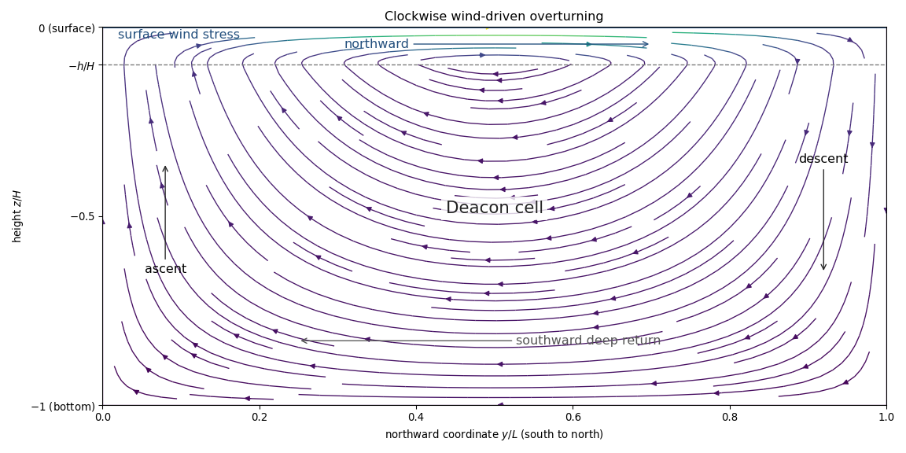

<h1 id="2/solution">Solution</h1>

↑ **Parent:** [2](../2.md)

Let $f(y)$ denote the signed vertical component of the [Coriolis parameter](../../../../../coriolis-parameter.md); it is negative in the southern hemisphere. In the steady, linear, inviscid interior, depth integration of horizontal momentum gives

$$
f\hat{\mathbf z}\times\mathbf U=-\nabla_h\Pi+\boldsymbol\tau^w/\rho_0,
$$

where $\mathbf U=\int_{-H}^0(u,v)dz$ and $\Pi=\int_{-H}^0p\,dz/\rho_0$. Horizontal curl eliminates the pressure. Its left side is $f\nabla_h\cdot\mathbf U+\beta V$. [Incompressibility](../../../../../incompressible-flow.md) and impermeable flat top and bottom imply $\nabla_h\cdot\mathbf U=w(-H)-w(0)=0$, giving

$$
\boxed{\beta V=(\nabla_h\times\boldsymbol\tau^w)_z/\rho_0.}
$$

This is [Sverdrup balance](../../../../../sverdrup-balance.md). It assumes steady small-amplitude motion, a [Boussinesq approximation](../../../../../boussinesq-approximation.md), negligible nonlinear advection, negligible Rayleigh and bottom/lateral drag in the interior, a flat fixed-depth domain and no normal top/bottom flux. The applied surface wind stress remains a forcing, even though interior friction is neglected. With cooling absent, the steady buoyancy equation additionally requires $B_z=0$, if that equation is imposed; the curl balance itself does not depend on the cooling coefficient. In the closed, $x$-independent channel below, depth-integrated $V=0$, so a nonzero wind-stress curl cannot be balanced by an inviscid interior alone.

**Steady forced channel.** Now take $r>0,\alpha>0$. Put $a=\pi/L$, $s=(z+h)_+=\max(z+h,0)$ and write $\tau_0$ for the positive wind-stress amplitude. The prescribed profiles give

$$
b=\frac{B_z}{\alpha}=\frac{B_0}{\alpha h}\cos ay\quad(-h<z<0),\qquad b=0\quad(-H<z<-h),
$$

$$
F=\tau_{x,z}/\rho_0=\frac{2\tau_0s}{\rho_0h^2}\sin ay.
$$

The buoyancy jumps across the sharp forcing interface in this simplified model; pressure and the circulation below are continuous. Let $P=p_y/\rho_0$, $D=f^2+r^2$, and $b_y^{\rm top}=-aB_0\sin ay/(\alpha h)$. Hydrostatic balance gives $P=C(y)+b_y^{\rm top}s$. The horizontal momentum equations and their solution are

$$
ru-fv=F,\qquad fu+rv=-P,\qquad u=\frac{rF-fP}{D},\quad v=\frac{-fF-rP}{D}.
$$

The no-normal-flow conditions imply $\int_{-H}^0v\,dz=0$: this integral is independent of $y$ by [incompressibility](../../../../../incompressible-flow.md) and is zero at the meridional walls. It determines the otherwise free depth-uniform pressure gradient,

$$
C(y)=-\frac{f\tau_0}{\rho_0rH}\sin ay-\frac{h^2}{2H}b_y^{\rm top}.
$$

Define

$$
A(y)=\frac{-f(y)\tau_0/\rho_0+r a B_0h/(2\alpha)}{f(y)^2+r^2},\qquad G(z)=\frac{z+H}{H}-\frac{s^2}{h^2}.
$$

A [meridional overturning streamfunction](../../../../../meridional-overturning-streamfunction.md) satisfying $v=-\Psi_z$, $w=\Psi_y$ is

$$
\boxed{\Psi(y,z)=A(y)\sin ay\,G(z),\qquad v=A(y)\sin ay\left(\frac{2s}{h^2}-\frac1H\right),\qquad w=[A(y)\sin ay]_yG(z).}
$$

It vanishes on all four boundaries. Together with the expressions for $b,P,u$, this solves all the steady equations. The formula permits variable $f(y)$; freezing it at a negative $f_0$ gives the simple schematic $w=aA\cos ay\,G(z)$. No unspecified latitude dependence is silently needed for the sketch.

Since $A>0$, upper-layer meridional transport is northward and the deep return is southward. At constant $f$, the circulation rises on the southern side and sinks on the northern side. The meridional velocity changes sign at $z=-h+h^2/(2H)$, slightly above the forcing interface, not exactly at $-h$. The required schematic follows from this derived field:

**[Figure 1](#2/image-clockwise-deacon-circulation-northward-surface-transport-southward-deep-return-ascent-in-the-south-and-descent-in-the-north). Clockwise Deacon circulation: northward surface transport, southward deep return, ascent in the south and descent in the north**.

**Forcing comparison.** The buoyancy and wind contributions have the same vertical shape and, with these signs, the same circulation sense. Their ratio is

$$
\boxed{\frac{A_B}{A_W}=\frac r\alpha\frac{\pi h}{2L}\frac{B_0}{|f|\tau_0/\rho_0}\simeq\frac{\pi}{2}\,10^{-4}\simeq1.6\times10^{-4}.}
$$

The printed scaling $f\tau_0/\rho_0\simeq B_0$ must be understood in magnitude, since $f<0$ and both forcing amplitudes are positive. Surface confinement supplies the small factor $h/L$, making direct buoyancy forcing negligible in this circulation model.

The missing physical mechanism in the stratified Southern Ocean is [eddy-induced overturning](../../../../../eddy-induced-overturning.md). The wind-driven mean [Deacon cell](../../../../../deacon-cell.md) tilts [isopycnals](../../../../../isopycnal.md) and builds [available potential energy](../../../../../available-potential-energy.md); [baroclinic instability](../../../../../baroclinic-instability.md) produces mesoscale eddies whose buoyancy transport largely opposes the mean overturning. The residual circulation depends on the small net balance and the diabatic buoyancy transformation. Wind energy also enters mean kinetic energy; eddies redistribute momentum through form stress and transfer energy toward dissipative scales and bottom friction. The displayed linear model already balances its wind input by imposed drag, but omits this mean-advection/eddy buoyancy budget, so the necessity of an opposing eddy circulation is a physical extension, not another mathematical constraint on the four given equations.

## ↑ Ancestors (10)

1. [2](../2.md)
2. [Paper 79](../../paper-79-split.md)
3. [Iii](../../split.md)
4. [2012](../../../split.md)
5. [Past exam of the mathematics course of the University of Cambridge](../../../../split.md)
6. [Mathematics course of the University of Cambridge](../../../../../mathematics-course-of-the-university-of-cambridge.md)
7. [Course of the University of Cambridge](../../../../../course-of-the-university-of-cambridge.md)
8. [University of Cambridge](../../../../../university-of-cambridge-split.md)
9. [List of universities](../../../../../list-of-universities.md)
10. [Codex Wiki](../../../../../split.md)
