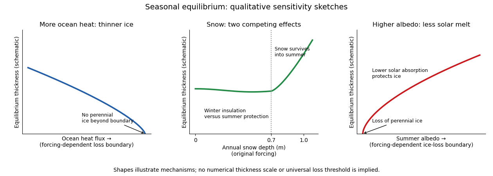

<h1 id="2/solution">Solution</h1>

↑ **Parent:** [2](../2.md)

The [Maykut-Untersteiner model](../../../../../maykut-untersteiner-model.md) solves a seasonally forced, one-dimensional [sea ice thermodynamics](../../../../../sea-ice-thermodynamics.md) problem with a snow layer above saline ice. Let $z$ increase downward from the upper surface, with snow–ice interface $z=h_s$ and ice bottom $z=h_s+h_i$. Write $q=-kT_z$ for conductive [heat flux](../../../../../heat-flux-density.md), positive downward, and $I(z)$ for downward shortwave radiation penetrating the material. Local energy conservation gives

$$
\rho_s c_s\frac{\partial T_s}{\partial t}
=\frac{\partial}{\partial z}\left(k_s\frac{\partial T_s}{\partial z}\right)-\frac{\partial I_s}{\partial z},
\qquad
\rho_i c_{\mathrm{eff}}(T_i,S_i)\frac{\partial T_i}{\partial t}
=\frac{\partial}{\partial z}\left(k_i(T_i,S_i)\frac{\partial T_i}{\partial z}\right)-\frac{\partial I_i}{\partial z}.
$$

For $I=I_0e^{-\kappa z}$, the radiation term is $+\kappa I$: absorption heats the interior. Here $c_{\mathrm{eff}}$ is the derivative of specific [enthalpy](../../../../../enthalpy.md) with temperature at prescribed ice salinity, and includes the [latent heat](../../../../../latent-heat.md) of changing brine fraction. Using only pure-ice [specific heat capacity](../../../../../specific-heat-capacity.md) would omit this storage. A usual approximation has $\rho_i c_{\mathrm{eff}}=\rho_i c_{i,0}+aS_i/T_C^2$ and $k_i=k_{i,0}+bS_i/T_C$, with $T_C<0$ in degrees Celsius and positive, unit-dependent constants $a,b$. Thus warmer saline ice has larger effective heat capacity and lower [thermal conductivity](../../../../../thermal-conductivity.md). Layerwise constant $k_i$ gives the usual finite-layer heat equation; full differentiation retains its spatial variation. Snow uses its own density and [thermal conductivity](../../../../../thermal-conductivity.md), and its stronger extinction can make shortwave penetration negligible beneath it.

Define the net atmospheric input to the upper surface by

$$
F_a=(1-\alpha)S_\downarrow+L_\downarrow-\epsilon\sigma T_0^4-H_\uparrow-E_\uparrow,
$$

where $\alpha$ is [albedo](../../../../../albedo.md), $H_\uparrow$ is turbulent sensible heat loss and $E_\uparrow$ is turbulent latent heat loss. Their signs can reverse. The outgoing longwave term uses the [Stefan–Boltzmann law](../../../../../stefan-boltzmann-law.md). Subtract the penetrating shortwave $I_0$, because it heats the interior rather than the infinitesimal surface. If $M_0\geq0$ is surface ablation speed and $\rho_0$ the density of the material currently exposed, the upper boundary obeys

$$
F_a-I_0-q_0=\rho_0L_f M_0,qquad
T_0\leq T_m,qquad M_0(T_m-T_0)=0.
$$

Below the melting point, $M_0=0$ and the flux balance determines $T_0$. Once it reaches $T_m$, the positive excess produces surface ablation; snow melts first, and only afterwards does that ablation remove ice. At the snow–ice interface, absent interfacial phase change,

$$
T_s(h_s^-)=T_i(h_s^+),\qquad
k_sT_{s,z}(h_s^-)=k_iT_{i,z}(h_s^+).
$$

At the base, $T_i=T_f(S_w)$ and the [Stefan condition](../../../../../stefan-condition.md) is

$$
\boxed{\rho_iL_f G_b=k_iT_{i,z}(h_s+h_i)-F_o=-q_b-F_o}.
$$

Here $G_b$ is signed bottom growth speed, and $F_o>0$ is [ocean heat flux](../../../../../ocean-heat-flux.md) toward the ice. An upward conductive loss $-q_b>0$ freezes ice; an excess $F_o$ melts it. For a prescribed upward turbulent [ocean heat flux](../../../../../ocean-heat-flux.md), the model needs no separate ocean temperature solution. A water-side closure could write $F_o=\rho_wc_{p,w}K_wT_{w,z}$ at the boundary in this downward coordinate. Snowfall is an independent mass input: with snowfall mass flux $P_s$, $\dot h_s=P_s/\rho_s-M_s$ in a constant-density approximation. The ice thickness obeys $\dot h_i=G_b-M_i$. Compaction or refreezing, if added, requires corresponding mass and energy terms rather than counting snowfall directly as ice growth. These boundary conditions and interior equations determine temperature, surface melt and basal growth together.

Under periodically repeated annual forcing, [annual sea-ice thermodynamic equilibrium](../../../../../annual-sea-ice-thermodynamic-equilibrium.md) is a periodic annual state, not constant thickness:

$$
T(z,t+\mathcal T)=T(z,t),\qquad h_i(t+\mathcal T)=h_i(t),\qquad
\boxed{\int_t^{t+\mathcal T}(G_b-M_i)\,dt=0}.
$$

Winter accretion then balances net annual ablation. “Equilibrium thickness” normally denotes a mean or a specified point in this annual cycle. Different forcing can instead eliminate a perennial-ice solution.

Increasing [ocean heat flux](../../../../../ocean-heat-flux.md) reduces bottom growth directly in the [Stefan condition](../../../../../stefan-condition.md), lowering equilibrium thickness and eventually removing perennial ice. The stabilizing winter response is visible in the approximate conductive flux

$$
F_{c,b}\simeq\frac{T_f-T_0}{h_i/k_i+h_s/k_s}:
$$

when ice thins, conductive loss and winter regrowth increase. More snow lowers this flux and inhibits winter growth. However, snow also raises [albedo](../../../../../albedo.md) and delays summer exposure of dark ice. The competing [snow insulation and summer ice protection](../../../../../snow-insulation-and-summer-ice-protection.md) effects mean an annual snow sensitivity cannot be deduced from winter insulation alone. Under the original forcing, the [Maykut-Untersteiner model](../../../../../maykut-untersteiner-model.md) gives an almost flat annual-thickness response below about $0.7\ \mathrm m$ annual snow depth, followed by strong thickening as snow persists into summer. This particular transition is not a universal threshold for other forcing or snowfall timing. Increasing summer [albedo](../../../../../albedo.md) reduces absorbed solar energy, reduces surface and internal melting, and increases equilibrium thickness; sufficiently low [albedo](../../../../../albedo.md) removes perennial ice. The [original thermodynamic sensitivity calculations](https://doi.org/10.1029/JC076i006p01550) establish these three responses.

**[Figure 1](#2/image-three-schematic-equilibrium-thickness-sensitivities-ocean-heat-flux-annual-snow-depth-and-summer-albedo). Three schematic equilibrium-thickness sensitivities: ocean heat flux, annual snow depth and summer albedo**.

The three curves are original qualitative sketches, not a new numerical integration or digitization. The snow marker refers to that historical forcing; the unnumbered loss boundaries and ordinate indicate trends rather than calibrated universal thresholds.

For the summer retreat discussed around the time of this examination, the proposed mechanisms act as follows.

- Warmer air increases sensible heat input when the air is warmer than the surface, often accompanies increased downward longwave radiation, advances spring melt and delays autumn cooling. Air temperature alone does not determine the surface energy balance: cloud, humidity and circulation changes affect the radiative terms as well. It is a broad climatic forcing, but cannot explain all local basal melt without an ocean energy pathway.
- Extra Atlantic-layer heat is a potential subsurface reservoir. A cold, fresh [halocline](../../../../../halocline.md) can isolate it from the surface, so a warmer Atlantic layer does not by itself imply the same heat flux at the ice. Its influence is stronger in regions where warm inflow is shallow or mixed upward, especially toward the Atlantic sector.
- Erosion of the cold [halocline](../../../../../halocline.md) removes that insulation. Reduced [density stratification](../../../../../density-stratification.md) or stronger mixing can bring Atlantic heat upward, producing increased [ocean heat flux](../../../../../ocean-heat-flux.md) and basal melt. This is an enabling mechanism, not an independent creation of heat to be added twice to the Atlantic contribution. [Atlantic-water and stratification measurements](https://doi.org/10.1175/2010JPO4339.1) support the coupling of these changes.
- Pacific inflow through Bering Strait supplies upper-ocean heat to the Chukchi and western Arctic. It can melt ice locally and precondition the Beaufort region for earlier retreat; its importance is regional and seasonal, rather than uniform over the basin. [observations of Pacific summer water and western-Arctic ice retreat](https://doi.org/10.1029/2005GL025624) support this pathway.
- Changes in the [Arctic Oscillation](../../../../../arctic-oscillation.md) alter winds, ice drift, convergence and export through Fram Strait. Enhanced export can remove old thick ice, expose more open water and change the following year's thickness distribution. An index phase is not a direct heat flux, nor does a single phase explain every summer anomaly. [ice-age and drift reconstructions](https://doi.org/10.1029/2004GL019492) show how circulation can precondition summer loss.
- Long-term thinning reduces the [latent heat](../../../../../latent-heat.md) needed to remove a floe and replaces persistent [multi-year sea ice](../../../../../multi-year-sea-ice.md) by vulnerable younger ice. It also makes the cover easier to deform and disperse. This accumulated preconditioning amplifies summer forcing, while faster winter growth of thin ice provides a partial negative feedback.
- Lower [albedo](../../../../../albedo.md) of [melt ponds](../../../../../melt-pond.md), bare ice and open water increases solar absorption. Heating of leads and the upper ocean feeds basal and lateral melt, making [ice-albedo feedback](../../../../../ice-albedo-feedback.md) a strong summer amplifier.

These processes overlap: circulation causes export, export changes thickness and open-water fraction, and those changes alter solar absorption. Without specified regional budgets there is no defensible unique percentage partition. For enhanced Beaufort summer basal melt, upper-ocean solar heating and western-Arctic heat pathways are more directly relevant than invoking unmodified heat from a deep, isolated Atlantic layer. [ice-mass-balance observations of extreme Beaufort melt](https://doi.org/10.1029/2008GL034007) identify increased solar absorption in open water as an important source.

Take $\rho_i=900\ \mathrm{kg\,m^{-3}}$ as an explicit ice-density approximation and use the supplied $L_f=336000\ \mathrm{J\,kg^{-1}}$. The [latent heat](../../../../../latent-heat.md) for $1.5\ \mathrm m$ basal ablation is

$$
E_m=\rho_iL_f\Delta h=4.536\times10^8\ \mathrm{J\,m^{-2}}.
$$

June–September contains about $122$ days, so

$$
\boxed{\overline F_{\mathrm{melt}}=\frac{E_m}{122\times86400}
=43.0\ \mathrm{W\,m^{-2}}}.
$$

Using $917\ \mathrm{kg\,m^{-3}}$ would give $43.8\ \mathrm{W\,m^{-2}}$. This is the net flux used for melting: the gross [ocean heat flux](../../../../../ocean-heat-flux.md) can also supply conductive losses and changes in cold content. It greatly exceeds an annual central-pack background of a few $\mathrm{W\,m^{-2}}$, but is compatible with a summer upper ocean absorbing solar radiation at tens to hundreds of $\mathrm{W\,m^{-2}}$. For scale, an added open-water fraction $0.3$, a shortwave input $200\ \mathrm{W\,m^{-2}}$ and an ice–water [albedo](../../../../../albedo.md) contrast $0.6$ produce $0.3\times200\times0.6=36\ \mathrm{W\,m^{-2}}$ additional area-mean absorption before losses. This is an illustrative budget, not a measurement. Wind mixing and circulation can deliver stored solar or advected heat to the underside.

The [ice-albedo feedback](../../../../../ice-albedo-feedback.md) closes the warming loop: retreat exposes darker water; extra solar absorption warms the upper ocean; basal and lateral melt increase retreat. The stored heat also delays autumn freeze-up, exposing water to atmospheric heat transfer for longer. Its later release warms the atmosphere, but must not be counted as a second source in addition to the solar energy that originally entered the ocean. In winter, greater heat loss from open water and rapid growth of thin ice partly oppose the summer positive feedback.

## ↑ Ancestors (10)

1. [2](../2.md)
2. [Paper 80](../../paper-80-split.md)
3. [Iii](../../split.md)
4. [2012](../../../split.md)
5. [Past exam of the mathematics course of the University of Cambridge](../../../../split.md)
6. [Mathematics course of the University of Cambridge](../../../../../mathematics-course-of-the-university-of-cambridge.md)
7. [Course of the University of Cambridge](../../../../../course-of-the-university-of-cambridge.md)
8. [University of Cambridge](../../../../../university-of-cambridge-split.md)
9. [List of universities](../../../../../list-of-universities.md)
10. [Codex Wiki](../../../../../split.md)
