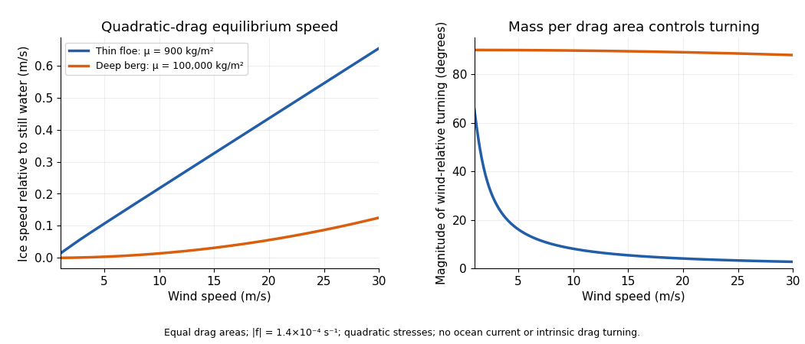

<h1 id="3/solution">Solution</h1>

↑ **Parent:** [3](../3.md)

Let $\mathbf u$ be ice velocity, $\mathbf W$ air velocity and $\mathbf U_o$ water velocity in an Earth-fixed frame. Put $J\mathbf v=\widehat{\mathbf z}\times\mathbf v$ and $f=2\Omega\sin\phi$. For effective air and water drag areas $A_a,A_w$, a [quadratic drag](../../../../../quadratic-drag.md) convention commonly used for geophysical stresses gives

$$
m\frac{d\mathbf u}{dt}=K_a|\mathbf W-\mathbf u|(\mathbf W-\mathbf u)
+K_w|\mathbf U_o-\mathbf u|(\mathbf U_o-\mathbf u)-mfJ\mathbf u,
\qquad K_a=\rho_a C_aA_a,\quad K_w=\rho_wC_wA_w.
$$

The [Coriolis force](../../../../../coriolis-force.md) magnitude is $m|f||\mathbf u|$, while its sign is retained in the vector equation. The coefficients here incorporate any conventional factor $1/2$; if one uses $\frac12\rho C_DA|\mathbf v|\mathbf v$, then $C_D=2C$ describes the same resistance. Windage and water drag areas must be declared: an [iceberg](../../../../../iceberg.md) can have pressure drag on its exposed and submerged faces as well as basal skin drag. They cannot generally be inferred from ice mass alone.

To obtain an explicit [quadratic-drag turning angle](../../../../../quadratic-drag-turning-angle.md), first take still water and no sea-surface slope, and suppose $|\mathbf u|\ll W$. Then the wind force is approximately $D\mathbf e_x$ with $D=K_aW^2$, while water resistance remains quadratic. Steady free drift satisfies

$$
D\mathbf e_x=K_wU\mathbf u+B J\mathbf u,\qquad U=|\mathbf u|,\quad B=mf.
$$

In the northern hemisphere write $\mathbf u=U(\cos\theta,-\sin\theta)$ with $0\leq\theta<\pi/2$. Resolving parallel to the drift and toward its left gives

$$
D\cos\theta=K_wU^2,\qquad D\sin\theta=BU.
$$

Squaring and adding eliminates $\theta$, rather than replacing water resistance by a fixed linear coefficient:

$$
K_w^2U^4+B^2U^2-D^2=0.
$$

The positive root and angle are therefore

$$
\boxed{U^2=\frac{2D^2}{B^2+\sqrt{B^4+4K_w^2D^2}},\qquad
\theta=\tan^{-1}\!\left(\frac{|B|}{K_wU}\right)}.
$$

The stable root displayed avoids subtracting nearly equal large quantities. The drift is to the right of the wind for $f>0$ and to the left for $f<0$. Define the [mass per drag area](../../../../../mass-per-drag-area.md) $\mu=m/A_w$, the area ratio $r=A_a/A_w$, the wind stress scale $a=\rho_a C_arW^2$ and the water-drag coefficient $b=\rho_wC_w$. Dividing the force balance by $A_w$ gives

$$
b^2U^4+(\mu f)^2U^2=a^2,\qquad
\boxed{\tan\theta=\frac{\mu|f|}{bU}}.
$$

In particular, $\mu$ has units $\mathrm{kg\,m^{-2}}$, not metres. A convenient dimensionless form is

$$
\chi=\frac{(\mu f)^2}{ba}
=\frac{m^2f^2}{\rho_wC_wA_w\,\rho_aC_aA_aW^2},\qquad
\boxed{\cos\theta=\frac{2}{\sqrt{\chi^2+4}+\chi}}.
$$

The cosine follows by substituting $U=D\sin\theta/B$ into the along-drift equation, giving $1-\cos^2\theta=\chi\cos\theta$. Thus wind speed, drag coefficients and latitude are insufficient without mass and area normalization.

For $\chi\ll1$, water drag dominates the turning correction:

$$
U\simeq\sqrt{\frac{K_a}{K_w}}W,
\qquad \theta\simeq\frac{m|f|}{\sqrt{K_wK_a}\,W}.
$$

For $\chi\gg1$, [Coriolis force](../../../../../coriolis-force.md) dominates the cross-wind balance:

$$
U\simeq\frac{K_aW^2}{m|f|},\qquad \theta\longrightarrow90^\circ.
$$

The cross-wind force does no work. Multiplying the original equilibrium equation by $\mathbf u$ gives $D U\cos\theta=K_wU^3$, which independently verifies the along-drift relation.

If the small ice-speed approximation is unsuitable, retain relative wind in the original equation. In still water the two exact steady component equations, with $\mathbf u=(u_x,u_y)$ and $R=[(W-u_x)^2+u_y^2]^{1/2}$, are

$$
K_aR(W-u_x)-K_wUu_x+B u_y=0,
\qquad -K_aRu_y-K_wUu_y-Bu_x=0.
$$

Consequently $\tan\theta=|B|/(K_aR+K_wU)$ and $U=K_aRW/[(K_aR+K_wU)^2+B^2]^{1/2}$, together with the definition of $R$. These equations determine the exact angle and speed implicitly and reduce to the explicit formulas above when $R\simeq W$ and $K_aR\ll K_wU$. A nonzero current also changes the water-relative velocity; a current-frame reduction needs the corresponding sea-surface pressure force, not merely replacement of absolute velocity in the [Coriolis force](../../../../../coriolis-force.md).

A thin [ice floe](../../../../../ice-floe.md) has small $\mu$, so appreciable wind produces relatively rapid, nearly downwind motion in this idealized model. A deep [iceberg](../../../../../iceberg.md) generally has a much larger $\mu$ and often a smaller effective windage-to-water-drag ratio. Its wind-driven motion relative to the ocean is slower and more nearly across the wind; ambient currents can then dominate its absolute trajectory. For example, taking $\rho_a=1.3$, $\rho_w=1025\ \mathrm{kg\,m^{-3}}$, $C_a=1.5\times10^{-3}$, $C_w=4\times10^{-3}$, $r=1$, $|f|=1.4\times10^{-4}\ \mathrm{s^{-1}}$ and $W=10\ \mathrm{m\,s^{-1}}$, the formulas give about $U=0.217\ \mathrm{m\,s^{-1}}$, $\theta=8.1^\circ$ for $\mu=900\ \mathrm{kg\,m^{-2}}$, versus $U=0.0139\ \mathrm{m\,s^{-1}}$, $\theta=89.8^\circ$ for $\mu=10^5\ \mathrm{kg\,m^{-2}}$. These are examples with the stated areas and coefficients, not universal observed turning angles. Boundary-layer turning, form drag and pack stresses can change them. The mass and wind dependence also appears in [an independently developed analytical iceberg-drift model](https://doi.org/10.1175/JPO-D-16-0262.1).

**[Figure 2](#3/image-wind-dependent-quadratic-drag-drift-speed-and-turning-angle-for-a-thin-floe-and-a-deep-iceberg). Wind-dependent quadratic-drag drift speed and turning angle for a thin floe and a deep iceberg**.

In the Antarctic, $f<0$ reverses the wind-relative turning. Large tabular [icebergs](../../../../../iceberg.md) mostly follow the depth-averaged currents acting on their draft rather than simply tracing the surface wind. The westward coastal circulation can retain or carry them around the continent, whereas offshore access to the eastward circumpolar circulation enables long-range export. Bathymetric grounding, capture by [sea ice](../../../../../sea-ice.md), calving location, fragmentation and melt also control where bergs occur. As a berg breaks into smaller pieces its mass-to-drag-area and windage ratios change, so the wind response can change before it melts. The derived turning tendency alone cannot predict a distribution map.

Other forces should be compared as forces per horizontal area, using the same normalization. For an illustrative $10\ \mathrm{m\,s^{-1}}$ wind and the above air parameters, the wind stress is $0.195\ \mathrm{Pa}$ when the air drag area equals the horizontal area.

- Water currents and tides change [quadratic drag](../../../../../quadratic-drag.md). A relative water speed $0.1\ \mathrm{m\,s^{-1}}$ gives $\rho_wC_wv^2=0.041\ \mathrm{Pa}$, about one fifth of this wind stress; $0.5\ \mathrm{m\,s^{-1}}$ gives $1.025\ \mathrm{Pa}$, over five times as large. Currents and tides are therefore often leading-order, particularly for deep [icebergs](../../../../../iceberg.md).
- A sea-surface slope produces a horizontal [pressure gradient](../../../../../pressure-gradient.md) force $-mg\nabla\eta$, or stress magnitude $\mu g|\nabla\eta|$. With a representative [geostrophic balance](../../../../../geostrophic-balance.md), $g|\nabla\eta|\sim|f|U_o$. For $U_o=0.1\ \mathrm{m\,s^{-1}}$, this is $0.0126\ \mathrm{Pa}$ for the floe and $1.4\ \mathrm{Pa}$ for the deep berg above. Much of this force balances the [Coriolis force](../../../../../coriolis-force.md) associated with following the ocean current; counting it as an independent extra wind driver would double-count that balance.
- Acceleration matters during changes of forcing: its stress scale is $\mu\Delta U/\Delta t$. Changing speed by $0.2\ \mathrm{m\,s^{-1}}$ in six hours requires $0.0083\ \mathrm{Pa}$ for the floe, but $0.93\ \mathrm{Pa}$ for the deep berg. Thus large bergs adjust slowly and a steady solution need not apply to a short wind event.
- Contact forces and internal pack stress invalidate free drift in compact ice. An illustrative integrated compressive stress $10^4\ \mathrm{N\,m^{-1}}$ changing across $10\ \mathrm{km}$ gives $1\ \mathrm{Pa}$, larger than the reference wind stress. Floe collisions and grounding can momentarily exceed it by much more; grounded ice can remain stationary regardless of the free-drift angle.
- Waves transfer momentum when absorbed or reflected. For a wave of amplitude $a_w=1\ \mathrm m$, energy per area is about $\rho_wga_w^2/2\simeq5.0\times10^3\ \mathrm{J\,m^{-2}}$. With deep-water phase speed $c=10\ \mathrm{m\,s^{-1}}$ and group speed $c/2$, complete absorption across a width gives force per unit width $E/2$, about $2.5\times10^3\ \mathrm{N\,m^{-1}}$. Dividing by an along-wave floe length $1\ \mathrm{km}$ gives $2.5\ \mathrm{Pa}$, but this is an absorption bound; transmitting most of the waves reduces it greatly. Reflection, wave spectrum, ice attenuation and geometry must be specified before assigning an actual wave force. The same perimeter force divided by a giant berg's much larger area is relatively smaller.

These estimates declare their scales; there is no single universal ratio for every floe, iceberg and sea state. Direct atmospheric pressure-gradient stress, for comparison, is roughly ice thickness times atmospheric pressure gradient: $1\ \mathrm m\times(1000\ \mathrm{Pa}/100\ \mathrm{km})=0.01\ \mathrm{Pa}$ for a thin floe. Wind stress, currents, ocean pressure gradients, contact forces and waves usually require separate treatment.

For the towing estimate, use the specified basal area

$$
A=(3\times10^5)(2\times10^5)=6\times10^{10}\ \mathrm{m^2}.
$$

With the declared stress convention and $2\ \mathrm{m\,s^{-1}}$ relative water speed, [quadratic drag](../../../../../quadratic-drag.md) is

$$
\boxed{F_w=\rho_wC_wAU^2
=1025(4\times10^{-3})(6\times10^{10})(2)^2
=9.84\times10^{11}\ \mathrm N}.
$$

The tug fraction is $3\times10^6/F_w=3.05\times10^{-6}$. In a one-dimensional incremental drag balance, even a favourably aligned pull changes speed only by

$$
\delta U\simeq\frac{F_{\mathrm{tug}}}{2\rho_wC_wAU}
=3.05\times10^{-6}\ \mathrm{m\,s^{-1}}.
$$

Interpreting the printed coefficient with an explicit $1/2$ convention instead gives $4.92\times10^{11}\ \mathrm N$ and doubles these tiny fractions, without changing the conclusion. Buoyancy gives $m\simeq\rho_wA(100\ \mathrm m)=6.15\times10^{15}\ \mathrm{kg}$; a high-latitude [Coriolis force](../../../../../coriolis-force.md) at $|f|=1.4\times10^{-4}\ \mathrm{s^{-1}}$ is $1.72\times10^{12}\ \mathrm N$, also far beyond the tug force. With resistance ignored altogether, the tug acceleration is only $4.88\times10^{-10}\ \mathrm{m\,s^{-2}}$.

There is a further source qualification. Sustaining this giant berg at $2\ \mathrm{m\,s^{-1}}$ relative to still water would require an unusually enormous driving force; ordinary winds with the illustrative coefficients supply only $0.195A=1.17\times10^{10}\ \mathrm N$. A measured $2\ \mathrm{m\,s^{-1}}$ absolute velocity may primarily follow a current, in which case the drag calculation needs its relative velocity rather than $2$. Under the stipulated relative-motion interpretation, **one such tug cannot significantly change the motion, and these numbers provide no support for a long-distance tow of this giant berg**. They do not disprove towing every smaller iceberg: feasibility changes with area, draft, relative tow speed, available tug force, currents and melt losses.

## ↑ Ancestors (10)

1. [3](../3.md)
2. [Paper 80](../../paper-80-split.md)
3. [Iii](../../split.md)
4. [2012](../../../split.md)
5. [Past exam of the mathematics course of the University of Cambridge](../../../../split.md)
6. [Mathematics course of the University of Cambridge](../../../../../mathematics-course-of-the-university-of-cambridge.md)
7. [Course of the University of Cambridge](../../../../../course-of-the-university-of-cambridge.md)
8. [University of Cambridge](../../../../../university-of-cambridge-split.md)
9. [List of universities](../../../../../list-of-universities.md)
10. [Codex Wiki](../../../../../split.md)
