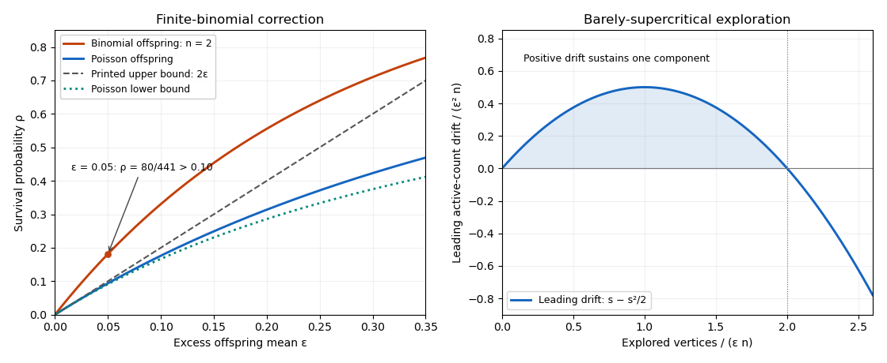

# Paper 9

↑ **Parent:** [Iii](../iii.md)

[https://www.maths.cam.ac.uk/postgrad/part-iii/files/pastpapers/2012/paper_9.pdf](https://www.maths.cam.ac.uk/postgrad/part-iii/files/pastpapers/2012/paper_9.pdf)

**Table of contents**

- [1](#1)
  - [i](#1/i)
    - [Solution](#1/i/solution)
  - [ii](#1/ii)
    - [Solution](#1/ii/solution)
- [2](#2)
  - [i](#2/i)
    - [Solution](#2/i/solution)
  - [ii](#2/ii)
    - [Solution](#2/ii/solution)
- [3](#3)
  - [i](#3/i)
    - [Solution](#3/i/solution)
  - [ii](#3/ii)
    - [Solution](#3/ii/solution)
- [4](#4)
  - [i](#4/i)
    - [Solution](#4/i/solution)
  - [ii](#4/ii)
    - [Solution](#4/ii/solution)
- [5](#5)
  - [i](#5/i)
    - [Solution](#5/i/solution)
  - [ii](#5/ii)
    - [Solution](#5/ii/solution)

## 1

↑ **Parent:** [Paper 9](paper-9.md)

<h3 id="1/i">i</h3>

↑ **Parent:** [1](#1)

<h4 id="1/i/solution">Solution</h4>

↑ **Parent:** [I](#1/i)

Put $d=np=\gamma\log n$ and $\mu=n^{1-\gamma}$. The hypothesis implies $\mu\geq e^{\omega(n)}\to\infty$. For the number $I$ of [isolated vertices](../../../graph-theory.md#isolated-vertex), the [isolated vertices in the Erdős-Rényi model](../../../graph-theory.md#isolated-vertices-in-the-erdos-renyi-model) formulas give

$$
\mathbb EI=n(1-p)^{n-1}=(1+o(1))\mu,\qquad
\frac{\operatorname{var}I}{(\mathbb EI)^2}\leq\frac1{\mathbb EI}+\frac p{1-p}=o(1).
$$

Thus the [Chebyshev inequality](../../../probability-inequality.md#chebyshev-inequality) gives $I=(1+o(1))\mu$ [with high probability](../../../probabilistic-combinatorics.md#with-high-probability), uniformly over the specified $\gamma$ range.

The [Cayley formula](../../../combinatorics.md#cayley-s-formula) supplies a [spanning tree](../../../combinatorics.md#spanning-tree) on any connected vertex set. Consequently the [expected value](../../../probability-theory.md#expected-value) $C_j$ of the number of [graph components](../../../graph.md#component-graph-theory) of order $j\geq2$ is bounded by

$$
\mathbb EC_j\leq\binom nj j^{j-2}p^{j-1}(1-p)^{j(n-j)}.
$$

Choose a fixed $\eta\in(0,1/2)$ with $\gamma_0(1-\eta)(k+1)>1$. For $k+1\leq j\leq\eta n$, with $j\geq2$, the [binomial coefficient](../../../combinatorics.md#binomial-coefficient) bound $\binom nj\leq(en/j)^j$ gives

$$
\mathbb EC_j\leq\frac n{d j^2}\left(ed\,e^{-d(1-\eta)}\right)^j.
$$

Here $ed\,e^{-d(1-\eta)}\leq e\log n\,n^{-\gamma_0(1-\eta)}\to0$. The [geometric series](../../../real-analysis.md#geometric-series) and a [union bound](../../../probability-inequality.md#boole-s-inequality) therefore exclude this entire size range, since $n[ e\log n\,n^{-\gamma_0(1-\eta)}]^{k+1}=o(1)$. For $\eta n\leq j\leq n/2$, an empty [graph cut](../../../graph.md#graph-cut) would be necessary. Its total [probability](../../../probability-theory.md#probability) is at most

$$
2^n e^{-p\eta n^2/2}=o(1).
$$

There are consequently no [graph components](../../../graph.md#component-graph-theory) of orders between $k+1$ and $n/2$, [with high probability](../../../probabilistic-combinatorics.md#with-high-probability).

For each fixed $2\leq j\leq k$, a [graph component](../../../graph.md#component-graph-theory) containing a [graph cycle](../../../graph-theory.md#cycle-in-a-graph) has a [spanning tree](../../../combinatorics.md#spanning-tree) and at least one extra [edge](../../../graph-theory.md#edge-of-a-graph). Counting that extra [edge](../../../graph-theory.md#edge-of-a-graph) gives an [expected value](../../../probability-theory.md#expected-value) $O_k(d^j e^{-dj})=o(1)$; hence every small [graph component](../../../graph.md#component-graph-theory) is a [tree component](../../../graph.md#tree-component). The total number $R_2$ of [vertices](../../../graph.md#vertex-graph-theory) in [tree components](../../../graph.md#tree-component) of orders $2,\ldots,k$ satisfies

$$
\mathbb ER_2=O_k\left(n d e^{-2d}\right)=O_k(\mu d e^{-d})=o(\mu).
$$

The [Markov inequality](../../../probability-inequality.md#markov-inequality) gives $R_2=o(\mu)$ [with high probability](../../../probabilistic-combinatorics.md#with-high-probability). When $k=1$, this sum is empty and $R_2=0$. Since $\mu=o(n)$, the remaining [vertices](../../../graph.md#vertex-graph-theory) must lie in one [graph component](../../../graph.md#component-graph-theory) larger than $n/2$. It is unique, and its order is **$n-(1+o(1))n^{1-\gamma}$**. Every other [graph component](../../../graph.md#component-graph-theory) is a [tree](../../../combinatorics.md#tree-graph-theory) with at most $k$ [vertices](../../../graph.md#vertex-graph-theory). This is the [logarithmic-regime giant component](../../../graph-theory.md#logarithmic-regime-giant-component) mechanism: almost all missing [vertices](../../../graph.md#vertex-graph-theory) are isolated.

<h3 id="1/ii">ii</h3>

↑ **Parent:** [1](#1)

<h4 id="1/ii/solution">Solution</h4>

↑ **Parent:** [Ii](#1/ii)

It suffices to prove the assertion after replacing $\omega$ by $\min\{\omega,\sqrt{\log n}\}$: that replacement gives a tighter interval. Thus assume $\omega\to\infty$ and $\omega=o(\log n)$, and put

$$
p_\pm=\frac{\log n\pm\omega/2}{2n},\qquad
m_\pm=\frac n4(\log n\pm\omega).
$$

At $p_-$, let $J$ count [isolated vertices](../../../graph-theory.md#isolated-vertex) in $L$. The same [indicator random variable](../../../probability-theory.md#indicator-random-variable) calculation as for all [isolated vertices](../../../graph-theory.md#isolated-vertex) gives

$$
\mathbb EJ=\ell(1-p_-)^{n-1}=(1+o(1))e^{\omega/4}\to\infty,\qquad
\frac{\operatorname{var}J}{(\mathbb EJ)^2}\leq\frac1{\mathbb EJ}+\frac{p_-}{1-p_-}=o(1).
$$

By the [Chebyshev inequality](../../../probability-inequality.md#chebyshev-inequality), $J>0$ [with high probability](../../../probabilistic-combinatorics.md#with-high-probability). Since $\ell\geq2$ eventually, the marked [vertices](../../../graph.md#vertex-graph-theory) are then not all connected.

At $p_+$, the [logarithmic-regime giant component](../../../graph-theory.md#logarithmic-regime-giant-component) result applies with $k=2$ and any fixed $\gamma_0\in(1/3,1/2)$. Its unique [giant component](../../../graph-theory.md#giant-component) misses $(1+o(1))n^{1/2}e^{-\omega/4}$ [vertices](../../../graph.md#vertex-graph-theory). On the event that it misses at most twice that number, [exchangeability](../../../probability-theory.md#exchangeable-random-variables) makes the missed vertex set uniform conditional on its size. A [union bound](../../../probability-inequality.md#boole-s-inequality) therefore gives

$$
\mathbb P(L\text{ meets the complement of the giant})
\leq o(1)+2\ell n^{-1/2}e^{-\omega/4}=o(1).
$$

Thus all of $L$ is connected at $p_+$ [with high probability](../../../probabilistic-combinatorics.md#with-high-probability).

For the [uniform random graph process](../../../graph-theory.md#uniform-random-graph-process), assign uniform labels to the [edges](../../../graph-theory.md#edge-of-a-graph) of the [complete graph](../../../graph-theory.md#complete-graph) as [independent random variables](../../../random-variable.md#independent-random-variables) and reveal them in label order. The [binomial random graph](../../../graph-theory.md#binomial-random-graph) $G(n,p)$ is the prefix containing the $M(p)$ labels at most $p$, where $M(p)$ has a [binomial distribution](../../../discrete-probability-distribution.md#binomial-distribution) with parameters $N=\binom n2$ and $p$. Its [variance](../../../variance.md) at $p_\pm$ is $O(n\log n)$, whereas the gap between $\mathbb EM(p_\pm)$ and the relevant endpoint $m_\pm$ is $(1+o(1))\omega n/8$. The [Chebyshev inequality](../../../probability-inequality.md#chebyshev-inequality) gives $M(p_-)\geq m_-$ and $M(p_+)\leq m_+$ [with high probability](../../../probabilistic-combinatorics.md#with-high-probability), with harmless integer rounding. The [monotone graph property](../../../graph-theory.md#monotone-graph-property) that all marked [vertices](../../../graph.md#vertex-graph-theory) are connected now implies

$$
\boxed{\frac n4(\log n-\omega)\leq\tau\leq\frac n4(\log n+\omega)\quad\text{with high probability}.}
$$

The [marked-set connectivity threshold](../../../graph-theory.md#marked-set-connectivity-threshold) is lower than the threshold for connecting every [vertex](../../../graph.md#vertex-graph-theory), because only about $\sqrt n$ specified [vertices](../../../graph.md#vertex-graph-theory) need to avoid the small [graph components](../../../graph.md#component-graph-theory).

## 2

↑ **Parent:** [Paper 9](paper-9.md)

<h3 id="2/i">i</h3>

↑ **Parent:** [2](#2)

<h4 id="2/i/solution">Solution</h4>

↑ **Parent:** [I](#2/i)

Let $a=kn/(2k+1)$, $u=(k+1)n/(2k+1)$ and $b=u/k$. A [graph cut](../../../graph.md#graph-cut) with no crossing [edges](../../../graph-theory.md#edge-of-a-graph) is obtained by assigning whole [graph components](../../../graph.md#component-graph-theory) to its two sides. Among all such assignments, maximize the smaller side's size $S\leq n/2$, and write $T=n-S$ for the other side.

Suppose $S<a$. Then $T>u=kb$. If a [graph component](../../../graph.md#component-graph-theory) on the larger side had size $0<w<n-2S$, moving it to the smaller side would make both $S+w$ and $T-w$ greater than $S$. That contradicts maximality. Hence every [graph component](../../../graph.md#component-graph-theory) on the larger side has at least $n-2S$ [vertices](../../../graph.md#vertex-graph-theory). Since each has at most $b$ [vertices](../../../graph.md#vertex-graph-theory) and their total exceeds $kb$, there must be at least $k+1$ of them. Consequently

$$
n-S=T\geq(k+1)(n-2S),\qquad S\geq\frac{kn}{2k+1}=a,
$$

a contradiction. Thus $a\leq S\leq T\leq u$, proving the **required empty cut with both sides at most $(k+1)n/(2k+1)$**. This [balanced component cut](../../../graph.md#balanced-component-cut) argument works for arbitrary positive component weights as well; it does not require divisibility of $n$.

<h3 id="2/ii">ii</h3>

↑ **Parent:** [2](#2)

<h4 id="2/ii/solution">Solution</h4>

↑ **Parent:** [Ii](#2/ii)

If some choice $\omega$ produced a [graph](../../../graph.md) with [largest component of a graph](../../../graph.md#largest-component-of-a-graph) smaller than $2n/3$, the [balanced component cut](../../../graph.md#balanced-component-cut) result with packing parameter one would give an empty [graph cut](../../../graph.md#graph-cut) whose sides both have at least $n/3$ [vertices](../../../graph.md#vertex-graph-theory). For any fixed such vertex [set partition](../../../combinatorics.md#set-partition), a uniform [edge](../../../graph-theory.md#edge-of-a-graph) of the [complete graph](../../../graph-theory.md#complete-graph) crosses with [probability](../../../probability-theory.md#probability)

$$
q=\frac{2|V_1||V_2|}{n(n-1)}\geq\frac49.
$$

To avoid crossing in row $i$, at least one of its $k$ offered [edges](../../../graph-theory.md#edge-of-a-graph) must be noncrossing. The row's [probability](../../../probability-theory.md#probability) is $1-q^k\leq1-(4/9)^k$. The rows consist of [independent random variables](../../../random-variable.md#independent-random-variables), so at $m=cn$ a [union bound](../../../probability-inequality.md#boole-s-inequality) over at most $2^n$ vertex [set partitions](../../../combinatorics.md#set-partition) gives

$$
\mathbb P(\exists\omega:\ L_1(G_\omega)<2n/3)
\leq 2^n[1-(4/9)^k]^{cn}.
$$

For example, the positive integer

$$
\boxed{c_k=\left\lceil\frac{\log2+1}{-\log[1-(4/9)^k]}\right\rceil}
$$

makes this bound at most $e^{-n}$. Therefore **every choice has a component of order at least $2n/3$, with probability tending to one**. The [simultaneous giant for fixed random-edge choice](../../../graph-theory.md#simultaneous-giant-for-fixed-random-edge-choice) estimate includes choices made after seeing the entire array; it does not assume a particular online selection rule.

## 3

↑ **Parent:** [Paper 9](paper-9.md)

<h3 id="3/i">i</h3>

↑ **Parent:** [3](#3)

<h4 id="3/i/solution">Solution</h4>

↑ **Parent:** [I](#3/i)

Assume $0<\lambda=1-\varepsilon<1$, as required for this nontrivial subcritical [binomial random graph](../../../graph-theory.md#binomial-random-graph). Put $\delta=\lambda-1-\log\lambda>0$. A [breadth-first exploration of a binomial random graph](../../../graph-theory.md#breadth-first-exploration-of-a-binomial-random-graph) is dominated by a [Galton-Watson process](../../../probability-and-statistics.md#galton-watson-process) whose offspring counts are [independent random variables](../../../random-variable.md#independent-random-variables) with law $\operatorname{Bin}(n,\lambda/n)$. If its [total progeny](../../../probability-and-statistics.md#total-progeny-of-a-branching-process) $T$ is at least $j$, the first $j-1$ offspring counts sum to at least $j-1$. Their [moment-generating function](../../../probability-theory.md#moment-generating-function) is bounded by that of a [Poisson distribution](../../../discrete-probability-distribution.md#poisson-distribution) of mean $\lambda(j-1)$. The exponential [Markov inequality](../../../probability-inequality.md#markov-inequality), optimized at $t=-\log\lambda$, yields

$$
\mathbb P(T\geq j)\leq e^{-\delta(j-1)}.
$$

Taking $j=\lceil(1+\eta)\log n/\delta\rceil$ for any fixed $\eta>0$, a [union bound](../../../probability-inequality.md#boole-s-inequality) over all starting [vertices](../../../graph.md#vertex-graph-theory) gives $\mathbb P(L_1\geq j)=o(1)$.

For the matching lower bound, let $X_j$ count [tree components](../../../graph.md#tree-component) of order $j$. The [tree-component expectation in the Erdős-Rényi model](../../../graph-theory.md#tree-component-expectation-in-the-erdos-renyi-model) is exactly

$$
\mathbb EX_j=\binom nj j^{j-2}p^{j-1}(1-p)^{j(n-j)+\binom j2-j+1}.
$$

For $j=O(\log n)$, the [Stirling formula](../../../real-analysis.md#stirling-formula) gives

$$
\mathbb EX_j=(1+o(1))\frac{n}{\lambda\sqrt{2\pi}\,j^{5/2}}e^{-\delta j}.
$$

Choose $j=\lfloor(1-\eta)\log n/\delta\rfloor$, with $0<\eta<1$. Then $\mathbb EX_j\to\infty$. Distinct overlapping vertex sets cannot both be [graph components](../../../graph.md#component-graph-theory). For disjoint sets, the joint [probability](../../../probability-theory.md#probability) differs from the product only because the $j^2$ between-set [edges](../../../graph-theory.md#edge-of-a-graph) were counted twice as absent. Thus

$$
\frac{\mathbb E[X_j(X_j-1)]}{(\mathbb EX_j)^2}
=\frac{\binom{n-j}j}{\binom nj}(1-p)^{-j^2}
=1+O(j^2/n).
$$

It follows that $\operatorname{var}X_j/(\mathbb EX_j)^2=o(1)$. The [second moment method](../../../probability-inequality.md#second-moment-method) gives $X_j>0$ [with high probability](../../../probabilistic-combinatorics.md#with-high-probability). Combining both bounds, and then taking arbitrarily small fixed $\eta$, proves the [sharp subcritical largest-component scale](../../../probabilistic-combinatorics.md#sharp-subcritical-largest-component-scale)

$$
\boxed{L_1=(1+o(1))\frac{\log n}{\delta}=(1+o(1))\ell_0\quad\text{with high probability}.}
$$

Finally the [Taylor expansion](../../../calculus.md#taylor-expansion) of $-\log(1-\varepsilon)$ gives $\delta=\varepsilon^2/2+\varepsilon^3/3+\cdots$. The endpoint $\lambda=0$ has no [edges](../../../graph-theory.md#edge-of-a-graph) and is excluded from this logarithmic asymptotic.

<h3 id="3/ii">ii</h3>

↑ **Parent:** [3](#3)

<h4 id="3/ii/solution">Solution</h4>

↑ **Parent:** [Ii](#3/ii)

The function $x e^{-x}$ is strictly increasing on $(0,1)$ and strictly decreasing on $(1,\infty)$. Hence for each $\lambda>1$ there is a unique $\theta=\lambda^*\in(0,1)$ with $\theta e^{-\theta}=\lambda e^{-\lambda}$.

Apply the subcritical component estimates to $G(n,\theta/n)$. For a specified [vertex](../../../graph.md#vertex-graph-theory), the exact [tree-component expectation in the Erdős-Rényi model](../../../graph-theory.md#tree-component-expectation-in-the-erdos-renyi-model) gives the limiting [probability](../../../probability-theory.md#probability) that it lies in a [tree component](../../../graph.md#tree-component) of order $j$:

$$
a_j=\frac{j^{j-1}}{j!}\theta^{j-1}e^{-\theta j}.
$$

For each fixed $j$, the [probability](../../../probability-theory.md#probability) of a non-tree [graph component](../../../graph.md#component-graph-theory) of that size is $O_j(1/n)$: a [spanning tree](../../../combinatorics.md#spanning-tree) and one extra [edge](../../../graph-theory.md#edge-of-a-graph) are necessary. Moreover the [Galton-Watson process](../../../probability-and-statistics.md#galton-watson-process) exploration estimate from the preceding proof bounds the [probability](../../../probability-theory.md#probability) of order greater than $K$ by $e^{-\delta_\theta(K-1)}$, uniformly in $n$, where $\delta_\theta=\theta-1-\log\theta>0$. First let $n\to\infty$ for fixed $K$, then let $K\to\infty$. No [probability](../../../probability-theory.md#probability) mass escapes to large components or non-tree components, so $\sum_{j\geq1}a_j=1$. Multiplying by $\theta$ and using its defining identity gives

$$
\boxed{\sum_{j=1}^\infty\frac{j^{j-1}}{j!}(\lambda e^{-\lambda})^j=\lambda^*.}
$$

Equivalently, the [rooted-tree generating function](../../../combinatorics.md#rooted-tree-generating-function) selects the smaller solution of $T e^{-T}=\lambda e^{-\lambda}$. The choice of that branch is essential; the larger solution $\lambda$ is not the value of this convergent series.

## 4

↑ **Parent:** [Paper 9](paper-9.md)

<h3 id="4/i">i</h3>

↑ **Parent:** [4](#4)

<h4 id="4/i/solution">Solution</h4>

↑ **Parent:** [I](#4/i)

For the [binomial branching process](../../../probability-and-statistics.md#binomial-branching-process), the offspring [probability generating function](../../../probability-theory.md#probability-generating-function) is $f(s)=(1-p+ps)^n$. The [Galton-Watson extinction fixed point](../../../probability-and-statistics.md#galton-watson-extinction-fixed-point) gives $1-\rho=f(1-\rho)=(1-p\rho)^n$.

**The printed finite-binomial upper bound is false without an additional asymptotic qualification.** For $n=2$ and $p=(1+\varepsilon)/2$, solving the fixed-point equation exactly gives

$$
\rho=\frac{4\varepsilon}{(1+\varepsilon)^2}.
$$

For instance $\varepsilon=1/20$ gives $\rho=80/441>1/10=2\varepsilon$. More generally, at every fixed $n>1$ the [Taylor expansion](../../../calculus.md#taylor-expansion) gives $\rho=2n\varepsilon/(n-1)+O_n(\varepsilon^2)$, again contradicting that upper bound for sufficiently small positive $\varepsilon$.

Here is the corrected [binomial branching survival correction](../../../probability-and-statistics.md#binomial-branching-survival-correction). The [Poisson branching process](../../../probability-and-statistics.md#poisson-branching-process) of mean $1+\varepsilon$ has [branching survival probability](../../../probability-and-statistics.md#survival-probability-of-a-branching-process) $r$ satisfying $-\log(1-r)=(1+\varepsilon)r$. Expanding the [logarithm](../../../calculus.md#logarithm) gives

$$
\varepsilon=\sum_{j\geq1}\frac{r^j}{j+1},\qquad
\frac r2\leq\varepsilon\leq\frac r{2(1-r)}.
$$

Thus $2\varepsilon/(1+2\varepsilon)\leq r\leq2\varepsilon$, which implies the requested lower estimate $r\geq2\varepsilon-4\varepsilon^2$. Since $(1-p+ps)^n\leq e^{np(s-1)}$ on $[0,1]$, iteration of the two offspring [probability generating functions](../../../probability-theory.md#probability-generating-function) gives $\rho\geq r$.

For the actual [binomial branching process](../../../probability-and-statistics.md#binomial-branching-process), expansion of its exact fixed-point equation gives

$$
\varepsilon=\sum_{j\geq1}\frac{1-np^{j+1}}{j+1}\rho^j.
$$

If $(1+\varepsilon)^2<n$, all coefficients are nonnegative. Keeping the first term proves

$$
\boxed{\frac{2\varepsilon}{1+2\varepsilon}\leq\rho\leq
\frac{2\varepsilon}{1-(1+\varepsilon)^2/n}.}
$$

In particular, for $n\to\infty$ and $\varepsilon=o(1)$ this gives $\rho=2\varepsilon+O(\varepsilon^2+\varepsilon/n)$. The printed bounds also hold for the [binomial branching process](../../../probability-and-statistics.md#binomial-branching-process) in an explicit large-$n$ regime: $0<\varepsilon\leq1/4$ and $n\varepsilon\geq2$. Indeed these conditions give $np^2\leq\varepsilon$ and $np^3\leq1/4$. In the preceding nonnegative series, evaluation at $x=2\varepsilon$ gives

$$
\sum_{j\geq1}\frac{1-np^{j+1}}{j+1}x^j
\geq\varepsilon(1-np^2)+\frac43\varepsilon^2(1-np^3)
\geq\varepsilon-\varepsilon^2+\varepsilon^2=\varepsilon.
$$

The series is increasing, and its value at the actual [branching survival probability](../../../probability-and-statistics.md#survival-probability-of-a-branching-process) $\rho$ is $\varepsilon$, so $\rho\leq2\varepsilon$. Together with the lower bound already proved, this recovers $2\varepsilon-4\varepsilon^2\leq\rho\leq2\varepsilon$ in that regime. In particular it applies eventually to part (ii). The counterexample shows why a regime condition is needed for a literal finite-$n$ statement.

**[Figure 1](#4/i/image-finite-binomial-survival-exceeds-the-printed-upper-bound-while-poisson-survival-lies-between-the-corrected-comparison-bounds). Finite-binomial survival exceeds the printed upper bound, while Poisson survival lies between the corrected comparison bounds**.

<h3 id="4/ii">ii</h3>

↑ **Parent:** [4](#4)

<h4 id="4/ii/solution">Solution</h4>

↑ **Parent:** [Ii](#4/ii)

Write $\mu=1+\varepsilon$, $p=\mu/n$, $q=1-p$, and let $T$ be the [total progeny](../../../probability-and-statistics.md#total-progeny-of-a-branching-process) of a [binomial branching process](../../../probability-and-statistics.md#binomial-branching-process). The preceding [binomial branching survival correction](../../../probability-and-statistics.md#binomial-branching-survival-correction) gives $\rho=(2+o(1))\varepsilon$. For a [branching process conditioned on extinction](../../../probability-and-statistics.md#branching-process-conditioned-on-extinction), the offspring [probability generating function](../../../probability-theory.md#probability-generating-function) is $f((1-\rho)s)/(1-\rho)$, with mean

$$
f'(1-\rho)=(1+\varepsilon)(1-p\rho)^{n-1}
=1-\varepsilon+O(\varepsilon^2+\varepsilon/n)\leq1-\varepsilon/2
$$

for sufficiently large $n$. Summing expected generation sizes therefore gives $\mathbb E[T;T<\infty]=(1-\rho)/(1-f'(1-\rho))=O(1/\varepsilon)$.

Put $K=\lceil\varepsilon^{-3}\rceil$ and let $N_{\geq K}$ count [vertices](../../../graph.md#vertex-graph-theory) in [graph components](../../../graph.md#component-graph-theory) of order at least $K$. A [breadth-first exploration of a binomial random graph](../../../graph-theory.md#breadth-first-exploration-of-a-binomial-random-graph) is dominated by $T$. The [Markov inequality](../../../probability-inequality.md#markov-inequality) applied to finite [total progeny](../../../probability-and-statistics.md#total-progeny-of-a-branching-process) gives

$$
\mathbb EN_{\geq K}\leq n\mathbb P(T\geq K)
\leq n\rho+O\left(\frac n{\varepsilon K}\right).
$$

Always $L_1\leq K+N_{\geq K}$. Since $n\varepsilon^4\geq n^{1/3}\to\infty$, we have $K=o(\varepsilon n)$ and $n/(\varepsilon K)=O(n\varepsilon^2)=o(\varepsilon n)$. Hence $\mathbb EL_1\leq(2+o(1))\varepsilon n$. This bound controls the [expected value](../../../probability-theory.md#expected-value) directly, including rare large [graph components](../../../graph.md#component-graph-theory).

For the lower bound, use the [breadth-first exploration of a binomial random graph](../../../graph-theory.md#breadth-first-exploration-of-a-binomial-random-graph) with $U_t$ unseen [vertices](../../../graph.md#vertex-graph-theory), $A_t$ active [vertices](../../../graph.md#vertex-graph-theory) and $t$ explored [vertices](../../../graph.md#vertex-graph-theory), starting from $U_0=n$, $A_0=0$. Let $b_t=\mathbf1_{\{A_{t-1}=0\}}$ indicate a new root. Conditional on the past, the newly discovered count $Z_t$ has a [binomial distribution](../../../discrete-probability-distribution.md#binomial-distribution) $\operatorname{Bin}(U_{t-1}-b_t,p)$. Put $D_t=Z_t-p(U_{t-1}-b_t)$. The unseen-count recursion gives

$$
A_t=F(t)+\sum_{j=1}^tq^{t-j+1}b_j+q^t M_t,
\quad F(t)=n-t-nq^t,\quad M_t=\sum_{j=1}^tq^{-j}D_j.
$$

Here $M_t$ is a [martingale](../../../martingale.md). Up to $T_0=\lceil3\varepsilon n\rceil$, [martingale-difference orthogonality](../../../martingale.md#martingale-difference-orthogonality) gives $\mathbb EM_{T_0}^2\leq C\varepsilon n$, since each conditional [variance](../../../variance.md) is at most $np<2$ and $q^{-2T_0}$ is bounded.

Take $h=\sqrt\varepsilon+(n\varepsilon^3)^{-1/8}$. Then $h\to0$, $\varepsilon=o(h)$ and $h^2 n\varepsilon^3\to\infty$. The [Doob L2 maximal inequality](../../../martingale.md#doob-l2-maximal-inequality) implies

$$
\mathbb P\left(\max_{t\leq T_0}|M_t|>h\varepsilon^2n/6\right)
\leq\frac{C}{h^2n\varepsilon^3}=o(1).
$$

The [Taylor expansion](../../../calculus.md#taylor-expansion), uniformly for $t\leq T_0$, gives $F(t)=\varepsilon t-t^2/(2n)+O(\varepsilon^3n+\varepsilon)$. Thus $F(t)\geq h\varepsilon^2n/3$ throughout the integer interval $[\lceil h\varepsilon n\rceil,\lfloor(2-h)\varepsilon n\rfloor]$ for large $n$. The new-root sum is nonnegative, so on the preceding event $A_t>0$ throughout this interval. No [graph component](../../../graph.md#component-graph-theory) finishes there: all these explored [vertices](../../../graph.md#vertex-graph-theory) belong to one [graph component](../../../graph.md#component-graph-theory), of order at least $(2-2h)\varepsilon n-O(1)$, [with high probability](../../../probabilistic-combinatorics.md#with-high-probability). Its [expected value](../../../probability-theory.md#expected-value) is therefore at least $(2-o(1))\varepsilon n$. Combining both inequalities proves

$$
\boxed{\mathbb EL_1(G(n,p))=(2+o(1))\varepsilon n.}
$$

The [barely-supercritical largest-component expectation](../../../graph-theory.md#barely-supercritical-largest-component-expectation) uses both a positive exploration window and a finite-progeny bound; a bare convergence-in-probability assertion would not by itself justify this expectation.

## 5

↑ **Parent:** [Paper 9](paper-9.md)

<h3 id="5/i">i</h3>

↑ **Parent:** [5](#5)

<h4 id="5/i/solution">Solution</h4>

↑ **Parent:** [I](#5/i)

Use the standard [Achlioptas process](../../../graph-theory.md#achlioptas-process) with two independent uniform candidate [edges](../../../graph-theory.md#edge-of-a-graph) per step and a rule choosing one. The [component-band vertex count](../../../graph-theory.md#component-band-vertex-count) $N_{[k,Dk)}$ counts [vertices](../../../graph.md#vertex-graph-theory), not the number of [graph components](../../../graph.md#component-graph-theory). Integer time rounding changes the arguments below by $O(1)$ steps.

First, at $t_k$ the eventual [graph component](../../../graph.md#component-graph-theory) of order at least $\delta n$ is assembled from [graph components](../../../graph.md#component-graph-theory) already present at $t_k$. Contract those initial [graph components](../../../graph.md#component-graph-theory). During $s=t_c-t_k$ steps, at most $s$ new [edges](../../../graph-theory.md#edge-of-a-graph) are added, so the eventual connected contracted [graph](../../../graph.md) contains at most $s+1$ initial [graph components](../../../graph.md#component-graph-theory). Initial [graph components](../../../graph.md#component-graph-theory) of order less than $k$ can therefore contribute at most

$$
(s+1)(k-1)\leq\delta n/2
$$

[vertices](../../../graph.md#vertex-graph-theory), for sufficiently large $n$ and fixed $k$, since $s=\delta n/(2k)+O(1)$. For $k=1$ their contribution is zero. Consequently $N_{\geq k}(G_{t_k})\geq\delta n/2$.

We now use [forced merging of large components](../../../graph-theory.md#forced-merging-of-large-components). If at a time $m$ the [graph components](../../../graph.md#component-graph-theory) of order at least $K$ contain at least $an$ [vertices](../../../graph.md#vertex-graph-theory), then after at most $A(a)n/K+O(1)$ steps there is a [graph component](../../../graph.md#component-graph-theory) of order at least $an/3$, except on an event of [probability](../../../probability-theory.md#probability) exponentially small in $n/K$. One explicit choice is $A(a)=81(\log2+2)/a^4$. The proof is a [union bound](../../../probability-inequality.md#boole-s-inequality) over [set partitions](../../../combinatorics.md#set-partition) of the at most $n/K$ initial large [graph components](../../../graph.md#component-graph-theory): if all final [graph components](../../../graph.md#component-graph-theory) were small, a [balanced component cut](../../../graph.md#balanced-component-cut) would split their initial [vertices](../../../graph.md#vertex-graph-theory) into sets of size at least $an/3$, and both candidate [edges](../../../graph-theory.md#edge-of-a-graph) cross that fixed cut with [probability](../../../probability-theory.md#probability) at least $a^4/81$ in every step. The rule cannot avoid such a forced crossing. The failure bound is $e^{-2n/K}$, and a [union bound](../../../probability-inequality.md#boole-s-inequality) makes the estimate simultaneous over all starting times at most $3n$, for each fixed $K$.

Set $a=\delta/4$ and choose a fixed integer $D\geq2$ with $D\geq4A(a)/\delta$. If $N_{\geq Dk}(G_{t_k})\geq\delta n/4$, this lemma would produce a [graph component](../../../graph.md#component-graph-theory) of order at least $\delta n/12$ by time

$$
t_k+\frac{A(a)n}{Dk}+O(1)\leq t_c-\frac{\delta n}{4k}+O(1)<t'_c.
$$

That contradicts the assumed $L_1(G_{t'_c})=o(n)$. Thus $N_{\geq Dk}(G_{t_k})<\delta n/4$, and subtraction gives

$$
\boxed{N_{[k,Dk)}(G_{t_k})\geq\delta n/4\quad\text{with high probability}.}
$$

The same $D$ works for every fixed $k$; it depends only on $\delta$, with the number of offered [edges](../../../graph-theory.md#edge-of-a-graph) fixed at two.

<h3 id="5/ii">ii</h3>

↑ **Parent:** [5](#5)

<h4 id="5/ii/solution">Solution</h4>

↑ **Parent:** [Ii](#5/ii)

The [persistence of unsampled graph components](../../../graph-theory.md#persistence-of-unsampled-graph-components) prevents the mass from each size band from disappearing entirely before $t_c$. More precisely, a band $[k,Dk)$ containing at least $\delta n/4$ [vertices](../../../graph.md#vertex-graph-theory) retains at least $\beta n$ [vertices](../../../graph.md#vertex-graph-theory) in that same band after at most $n/k$ steps, [with high probability](../../../probabilistic-combinatorics.md#with-high-probability), for a fixed $\beta>0$ depending only on $\delta,D$. To see why, each initial [graph component](../../../graph.md#component-graph-theory) in that band has a fixed positive [probability](../../../probability-theory.md#probability) that none of the offered [edge](../../../graph-theory.md#edge-of-a-graph) endpoints touches it during the interval. Such a [graph component](../../../graph.md#component-graph-theory) remains unchanged regardless of the selection rule. The [McDiarmid inequality](../../../probability-inequality.md#mcdiarmid-s-inequality) concentrates the total mass of these untouched [graph components](../../../graph.md#component-graph-theory). The reusable lemma supplies the full uniform-in-starting-time argument, including the version that samples absent [edges](../../../graph-theory.md#edge-of-a-graph).

Choose finitely many disjoint bands $[D^j,D^{j+1})$, $j=0,\ldots,J$, with $(J+1)\beta>1$. Part (i) provides at least $\delta n/4$ [vertices](../../../graph.md#vertex-graph-theory) in band $j$ at its time $t_{D^j}$. Each interval from that time to $t_c$ has length at most $n/D^j$, so persistence leaves at least $\beta n$ [vertices](../../../graph.md#vertex-graph-theory) in every one of these disjoint bands at the common time $t_c$. A [union bound](../../../probability-inequality.md#boole-s-inequality) over this fixed finite number of bands makes all the conclusions simultaneous. Their total exceeds $n$, a contradiction. **No fixed two-choice Achlioptas rule satisfies the explosive percolation hypothesis.**

This [continuity of fixed-choice percolation](../../../graph-theory.md#continuity-of-fixed-choice-percolation) is the fixed-choice obstruction proved by Riordan and Warnke; their [original research paper](https://arxiv.org/abs/1102.5306) also treats a broader class of rules. The argument here does not apply when the number of offered choices grows with $n$.

## ↑ Ancestors (8)

1. [Iii](../iii.md)
2. [2012](../../2012.md)
3. [Past exam of the mathematics course of the University of Cambridge](../../../past-exam-of-the-mathematics-course-of-the-university-of-cambridge.md)
4. [Mathematics course of the University of Cambridge](../../../university-of-cambridge.md#mathematics-course-of-the-university-of-cambridge)
5. [Course of the University of Cambridge](../../../university-of-cambridge.md#course-of-the-university-of-cambridge)
6. [University of Cambridge](../../../university-of-cambridge.md)
7. [List of universities](../../../README.md#list-of-universities)
8. [Codex Wiki](../../../README.md)
