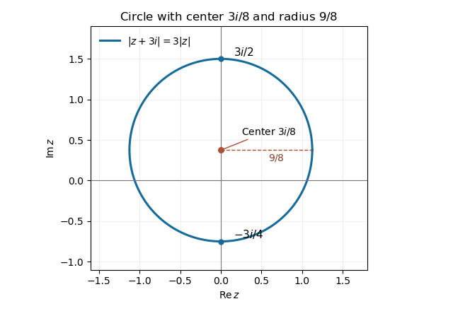

# Paper 1

↑ **Parent:** [Ia](../ia.md)

[https://www.maths.cam.ac.uk/undergrad/pastpapers/files/2013/PaperIA_1.pdf](https://www.maths.cam.ac.uk/undergrad/pastpapers/files/2013/PaperIA_1.pdf)

**Table of contents**

- [1C](#1c)
  - [a](#1c/a)
    - [Solution](#1c/a/solution)
  - [b](#1c/b)
    - [Solution](#1c/b/solution)
- [2A](#2a)
  - [i](#2a/i)
    - [Solution](#2a/i/solution)
  - [ii](#2a/ii)
    - [Solution](#2a/ii/solution)
  - [iii](#2a/iii)
    - [Solution](#2a/iii/solution)
  - [iv](#2a/iv)
    - [Solution](#2a/iv/solution)
- [3D](#3d)
  - [Solution](#3d/solution)
- [4F](#4f)
  - [a](#4f/a)
    - [Solution](#4f/a/solution)
  - [b](#4f/b)
    - [Solution](#4f/b/solution)
- [5C](#5c)
  - [Solution](#5c/solution)
  - [i](#5c/i)
    - [Solution](#5c/i/solution)
  - [ii](#5c/ii)
    - [Solution](#5c/ii/solution)
- [6A](#6a)
  - [Solution](#6a/solution)
- [7B](#7b)
  - [a](#7b/a)
    - [Solution](#7b/a/solution)
  - [b](#7b/b)
    - [Solution](#7b/b/solution)
- [8B](#8b)
  - [a](#8b/a)
    - [i](#8b/a/i)
      - [Solution](#8b/a/i/solution)
    - [ii](#8b/a/ii)
      - [Solution](#8b/a/ii/solution)
    - [iii](#8b/a/iii)
      - [Solution](#8b/a/iii/solution)
  - [b](#8b/b)
    - [Solution](#8b/b/solution)
  - [c](#8b/c)
    - [Solution](#8b/c/solution)
- [9D](#9d)
  - [a](#9d/a)
    - [Solution](#9d/a/solution)
  - [b](#9d/b)
    - [Solution](#9d/b/solution)
- [10E](#10e)
  - [a](#10e/a)
    - [Solution](#10e/a/solution)
  - [b](#10e/b)
    - [Solution](#10e/b/solution)
    - [i](#10e/b/i)
      - [Solution](#10e/b/i/solution)
    - [ii](#10e/b/ii)
      - [Solution](#10e/b/ii/solution)
    - [iii](#10e/b/iii)
      - [Solution](#10e/b/iii/solution)
- [11E](#11e)
  - [i](#11e/i)
    - [Solution](#11e/i/solution)
  - [ii](#11e/ii)
    - [Solution](#11e/ii/solution)
  - [iii](#11e/iii)
    - [Solution](#11e/iii/solution)
  - [iv](#11e/iv)
    - [Solution](#11e/iv/solution)
- [12F](#12f)
  - [Solution](#12f/solution)

## 1C

↑ **Parent:** [Paper 1](paper-1.md)

<h3 id="1c/a">a</h3>

↑ **Parent:** [1C](#1c)

<h4 id="1c/a/solution">Solution</h4>

↑ **Parent:** [A](#1c/a)

[De Moivre's theorem](../../../analysis.md#de-moivre-s-theorem) states that $(\cos\theta+i\sin\theta)^n=\cos(n\theta)+i\sin(n\theta)$ for integer $n$. For $z\ne0$, write its [polar form](../../../complex-analysis.md#polar-form-of-a-complex-number) as $z=re^{i\theta}$, where $r=|z|>0$. If $w=se^{i\varphi}$ and $w^n=z$, equality of moduli gives $s=r^{1/n}$ and equality of arguments gives $n\varphi=\theta+2\pi k$. Thus the distinct [roots of a complex number](../../../complex-analysis.md#root-of-a-complex-number) are

$$
\boxed{w_k=r^{1/n}\left(\cos\frac{\theta+2\pi k}{n}+i\sin\frac{\theta+2\pi k}{n}\right),\qquad k=0,\ldots,n-1.}
$$

Changing the chosen argument of $z$ only permutes these roots. For $z=0$ the only root is zero. Taking $r=8$ and $\theta=\pi$ gives the cube roots

$$
\boxed{1+i\sqrt3,\quad-2,\quad1-i\sqrt3.}
$$

Cubing any of them returns $-8$; geometrically they are equally spaced on the circle of radius two.

<h3 id="1c/b">b</h3>

↑ **Parent:** [1C](#1c)

<h4 id="1c/b/solution">Solution</h4>

↑ **Parent:** [B](#1c/b)

Put $z=x+iy$. Squaring the two nonnegative moduli and expanding gives $x^2+(y+3)^2=9(x^2+y^2)$. Completing the square yields

$$
\boxed{x^2+\left(y-\frac38\right)^2=\left(\frac98\right)^2.}
$$

Thus the locus is an [Apollonius circle](../../../geometry-and-topology.md#circles-of-apollonius) with **center $3i/8$ and radius $9/8$**. No extraneous points were introduced by squaring, because both original sides are nonnegative. Its intersections with the imaginary axis are $-3i/4$ and $3i/2$, useful landmarks for the sketch. It surrounds zero but does not pass through zero:

**[Figure 1](#1c/b/image-apollonius-circle-centered-at-three-eighths-i-with-radius-nine-eighths-and-imaginary-axis-intercepts-minus-three-quarters-i-and-three-halves-i). Apollonius circle centered at three eighths i with radius nine eighths and imaginary-axis intercepts minus three quarters i and three halves i**.

## 2A

↑ **Parent:** [Paper 1](paper-1.md)

<h3 id="2a/i">i</h3>

↑ **Parent:** [2A](#2a)

<h4 id="2a/i/solution">Solution</h4>

↑ **Parent:** [I](#2a/i)

Left multiplication by the given [Givens rotation](../../../numerical-analysis.md#givens-rotation) mixes rows two and three, so $b_{31}=a_{21}\sin\theta_1+a_{31}\cos\theta_1$. If $r_1=\sqrt{a_{21}^2+a_{31}^2}>0$, choose

$$
\boxed{\cos\theta_1=\frac{a_{21}}{r_1},\qquad\sin\theta_1=-\frac{a_{31}}{r_1}.}
$$

Equivalently $\theta_1=\operatorname{atan2}(-a_{31},a_{21})$ modulo $2\pi$. Substitution gives $b_{31}=0$ and $b_{21}=r_1$. If $a_{21}=a_{31}=0$, take $\theta_1=0$; the desired zero is already present. This also covers singular matrices without division by zero.

<h3 id="2a/ii">ii</h3>

↑ **Parent:** [2A](#2a)

<h4 id="2a/ii/solution">Solution</h4>

↑ **Parent:** [Ii](#2a/ii)

The second [Givens rotation](../../../numerical-analysis.md#givens-rotation) leaves row three unchanged, so $\boxed{c_{31}=b_{31}=0}$. Its other relevant entry is $c_{21}=b_{11}\sin\theta_2+b_{21}\cos\theta_2$. For $r_2=\sqrt{b_{11}^2+b_{21}^2}>0$, take

$$
\boxed{\cos\theta_2=\frac{b_{11}}{r_2},\qquad\sin\theta_2=-\frac{b_{21}}{r_2}.}
$$

Then $c_{21}=0$ and $c_{11}=r_2$. If both entries vanish, choose $\theta_2=0$. The first column now has zeros below its diagonal.

<h3 id="2a/iii">iii</h3>

↑ **Parent:** [2A](#2a)

<h4 id="2a/iii/solution">Solution</h4>

↑ **Parent:** [Iii](#2a/iii)

Rows two and three of $C$ both have zero in column one. Any rotation of these rows therefore preserves those zeros, so $\boxed{d_{21}=d_{31}=0}$. In column two, $d_{32}=c_{22}\sin\theta_3+c_{32}\cos\theta_3$. For $r_3=\sqrt{c_{22}^2+c_{32}^2}>0$, choose

$$
\boxed{\cos\theta_3=\frac{c_{22}}{r_3},\qquad\sin\theta_3=-\frac{c_{32}}{r_3}.}
$$

This gives $d_{32}=0$. Again choose $\theta_3=0$ if both relevant entries are zero. Thus the successive [Givens rotations](../../../numerical-analysis.md#givens-rotation) have eliminated all entries below the diagonal without recreating earlier ones.

<h3 id="2a/iv">iv</h3>

↑ **Parent:** [2A](#2a)

<h4 id="2a/iv/solution">Solution</h4>

↑ **Parent:** [Iv](#2a/iv)

Each plane rotation satisfies $R_j^TR_j=I$. Hence $U=R_3R_2R_1$ is an [orthogonal matrix](../../../linear-algebra.md#orthogonal-matrix) and $D=UA$ is an [upper triangular matrix](../../../linear-algebra.md#upper-triangular-matrix). Multiplication by $U^T$ gives the [QR decomposition](../../../linear-algebra.md#qr-decomposition)

$$
\boxed{A=QD,\qquad Q=R_1^TR_2^TR_3^T,\qquad Q^TQ=I.}
$$

The zero-pair cases already handled make this construction valid for every real $3\times3$ matrix, including rank-deficient matrices. Orthogonality follows from the product identity, not from any invertibility assumption on $A$.

## 3D

↑ **Parent:** [Paper 1](paper-1.md)

<h3 id="3d/solution">Solution</h3>

↑ **Parent:** [3D](#3d)

For $x\geq0$, the function $h(x)=e^x-1-x$ has $h(0)=0$ and $h'(x)=e^x-1\geq0$, because the [exponential function](../../../calculus.md#exponential-function) is increasing and $e^0=1$. Therefore $\boxed{e^x\geq1+x}$.

Write $S_n=\sum_{j=1}^n a_j$ and $P_n=\prod_{j=1}^n(1+a_j)$. Expanding the product produces $1+S_n$ and additional nonnegative terms, giving $P_n\geq1+S_n\geq S_n$. Applying the exponential inequality to every factor gives

$$
\boxed{S_n\leq P_n\leq\prod_{j=1}^n e^{a_j}=e^{S_n}.}
$$

Both sequences are increasing, since the terms $a_j$ are positive. If $S_n$ converges to a finite value $S$, then $P_n\leq e^S$, so the convergence theorem for [monotone bounded sequences](../../../real-analysis.md#monotone-bounded-sequence) makes $P_n$ converge. Conversely, if $P_n$ has a finite limit, then $S_n\leq P_n$ is bounded and increasing, hence converges by the same theorem. Thus **the positive series and the product both converge to finite limits, or both diverge to $+\infty$**. This proves the [positive sum-product convergence criterion](../../../real-analysis.md#positive-sum-product-convergence-criterion). The word limit here means a finite real limit; allowing extended infinite limits would make the conclusion vacuous for these [monotone sequences](../../../real-analysis.md#monotone-sequence).

## 4F

↑ **Parent:** [Paper 1](paper-1.md)

<h3 id="4f/a">a</h3>

↑ **Parent:** [4F](#4f)

<h4 id="4f/a/solution">Solution</h4>

↑ **Parent:** [A](#4f/a)

Let $s_N=\sum_{n=1}^N(-1)^{n-1}b_n$. Pairing consecutive terms shows $s_{2m}\geq0$ and

$$
s_{2m+2}-s_{2m}=b_{2m+1}-b_{2m+2}\geq0,
\qquad s_{2m+3}-s_{2m+1}=-b_{2m+2}+b_{2m+3}\leq0.
$$

The even [partial sums](../../../real-analysis.md#partial-sum) increase and the odd [partial sums](../../../real-analysis.md#partial-sum) decrease. They satisfy $s_{2m}\leq s_{2m+1}\leq b_1$, while

$$
s_{2m+1}-s_{2m}=b_{2m+1}\longrightarrow0.
$$

Both are [monotone bounded sequences](../../../real-analysis.md#monotone-bounded-sequence) and hence have limits, and the displayed difference makes their limits equal. Every partial sum belongs to one subsequence, so **the alternating series converges**. This is a proof of the [alternating series test](../../../real-analysis.md#alternating-series-test); the monotonicity and zero-limit hypotheses play separate roles.

<h3 id="4f/b">b</h3>

↑ **Parent:** [4F](#4f)

<h4 id="4f/b/solution">Solution</h4>

↑ **Parent:** [B](#4f/b)

The summand is positive, so it suffices to show that its [partial sums](../../../real-analysis.md#partial-sum) are unbounded. On the block $2^k\leq n<2^{k+1}$, for $k\geq1$,

$$
\frac1{n\log n}\geq\frac1{2^{k+1}(k+1)\log2}.
$$

There are $2^k$ terms in that block, so its sum is at least $1/[2(k+1)\log2]$. Adding blocks gives a constant multiple of the divergent [harmonic series](../../../real-analysis.md#harmonic-series). Hence

$$
\boxed{\sum_{n=2}^\infty\frac1{n\log n}=+\infty.}
$$

Equivalently the [integral test for convergence](../../../real-analysis.md#integral-test-for-convergence) gives $\int_2^R dx/(x\log x)=\log\log R-\log\log2\to\infty$. The block proof supplies the divergence without assuming the integral test.

## 5C

↑ **Parent:** [Paper 1](paper-1.md)

<h3 id="5c/solution">Solution</h3>

↑ **Parent:** [5C](#5c)

Two nonzero vectors are [linearly independent](../../../vector-space.md#linear-independence) when $s\mathbf x+t\mathbf y=0$ forces $s=t=0$. Their [linear span](../../../vector-space.md#linear-span) then has dimension two. If they are [linearly dependent](../../../vector-space.md#linear-dependence), one is a nonzero scalar multiple of the other, and their span has dimension one. Thus the two requested dimensions are $\boxed{2\text{ and }1}$.

The Euclidean [scalar product](../../../linear-algebra.md#dot-product) and its [norm](../../../functional-analysis.md#norm) are $\mathbf x\cdot\mathbf y=\sum_{j=1}^n x_jy_j$ and $\|\mathbf x\|=\sqrt{\mathbf x\cdot\mathbf x}$. To prove the [Cauchy-Schwarz inequality](../../../probability-and-statistics.md#cauchy-schwarz-inequality), first handle $\mathbf y=0$ trivially. Otherwise the squared [norm](../../../functional-analysis.md#norm)

$$
0\leq\left\|\mathbf x-\frac{\mathbf x\cdot\mathbf y}{\|\mathbf y\|^2}\mathbf y\right\|^2
=\|\mathbf x\|^2-\frac{(\mathbf x\cdot\mathbf y)^2}{\|\mathbf y\|^2}
$$

gives

$$
\boxed{|\mathbf x\cdot\mathbf y|\leq\|\mathbf x\|\|\mathbf y\|.}
$$

Equality holds exactly when the residual vector is zero, meaning the vectors are [linearly dependent](../../../vector-space.md#linear-dependence); this includes the zero-vector cases. Expanding $\|\mathbf x+\mathbf y\|^2$ and applying [Cauchy-Schwarz](../../../probability-and-statistics.md#cauchy-schwarz-inequality) then gives

$$
\|\mathbf x+\mathbf y\|^2\leq\|\mathbf x\|^2+2\|\mathbf x\|\|\mathbf y\|+\|\mathbf y\|^2,
\qquad\boxed{\|\mathbf x+\mathbf y\|\leq\|\mathbf x\|+\|\mathbf y\|}.
$$

Taking nonnegative square roots proves the [triangle inequality](../../../topological-analysis.md#triangle-inequality).

For the unit-vector optimization, let $\mathbf w=\mathbf x+\mathbf y$. Independence ensures $\mathbf w\ne0$. The variable part of $S$ is $\mathbf z\cdot\mathbf w$, which [Cauchy-Schwarz](../../../probability-and-statistics.md#cauchy-schwarz-inequality) bounds below by $-\|\mathbf w\|$. Equality occurs only for the antiparallel unit vector. Thus

$$
\boxed{\mathbf z_*=-\frac{\mathbf x+\mathbf y}{\|\mathbf x+\mathbf y\|},\qquad
\lambda=-\frac1{\|\mathbf x+\mathbf y\|},\qquad
S_{\min}=\mathbf x\cdot\mathbf y-\sqrt{2+2\mathbf x\cdot\mathbf y}.}
$$

This is [minimizing a linear functional on a sphere](../../../linear-algebra.md#minimizing-a-linear-functional-on-a-sphere). The two consequences follow below.

<h3 id="5c/i">i</h3>

↑ **Parent:** [5C](#5c)

<h4 id="5c/i/solution">Solution</h4>

↑ **Parent:** [I](#5c/i)

The [triangle inequality](../../../topological-analysis.md#triangle-inequality) gives $0<\|\mathbf x+\mathbf y\|\leq\|\mathbf x\|+\|\mathbf y\|=2$. Taking its negative reciprocal gives

$$
\boxed{\lambda=-1/\|\mathbf x+\mathbf y\|\leq-\frac12.}
$$

In fact independence excludes the equality case $\mathbf x=\mathbf y$, so the inequality is strict under the stated independence hypothesis. The weaker requested bound holds for every permitted pair.

<h3 id="5c/ii">ii</h3>

↑ **Parent:** [5C](#5c)

<h4 id="5c/ii/solution">Solution</h4>

↑ **Parent:** [Ii](#5c/ii)

When $\mathbf x\cdot\mathbf y=\cos(2\pi/3)=-1/2$, the squared [norm](../../../functional-analysis.md#norm) of their sum is $2+2(-1/2)=1$. Therefore

$$
\boxed{\lambda=-1,\qquad\mathbf z_*=-\mathbf x-\mathbf y,\qquad S_{\min}=-\frac12-1=-\frac32.}
$$

The minimizing vector is indeed a unit vector. All three pairwise [scalar products](../../../linear-algebra.md#dot-product) then equal $-1/2$, so these three unit vectors lie in a plane, separated by $120$ degrees.

## 6A

↑ **Parent:** [Paper 1](paper-1.md)

<h3 id="6a/solution">Solution</h3>

↑ **Parent:** [6A](#6a)

For a [linear map](../../../vector-space.md#linear-map) $\alpha:\mathbb R^m\to\mathbb R^n$, its [kernel](../../../linear-algebra.md#kernel-of-a-linear-map) and [image of a linear map](../../../vector-space.md#image-of-a-linear-map) are

$$
\ker\alpha=\{v:\alpha(v)=0\},\qquad\operatorname{im}\alpha=\{\alpha(v):v\in\mathbb R^m\}.
$$

The kernel is a subspace of the domain and the image a subspace of the codomain. Given the stated bases, define the [matrix of a linear map](../../../vector-space.md#matrix-representation-of-a-linear-map) by

$$
\alpha(e_j)=\sum_{i=1}^n A_{ij}f_i.
$$

Its $j$th column is the coordinate vector of $\alpha(e_j)$; if $v=\sum_jv_je_j$, the output coordinates are $(\alpha v)_i=\sum_jA_{ij}v_j$.

For the [change of basis](../../../linear-algebra.md#change-of-basis), write $e'_j=\sum_k P_{kj}e_k$ and $f'_i=\sum_\ell Q_{\ell i}f_\ell$. The matrices $P,Q$ are invertible. Input coordinates change by $v_{\rm old}=Pv_{\rm new}$ and output coordinates by $w_{\rm old}=Qw_{\rm new}$, so

$$
\boxed{A'=Q^{-1}AP,\qquad A'_{ij}=\sum_{\ell=1}^n\sum_{k=1}^m(Q^{-1})_{i\ell}A_{\ell k}P_{kj}.}
$$

The domain and codomain basis changes need not be the same matrix.

For $\beta$, the two input vectors form a basis of $\mathbb R^2$, so its image is the span of $v=(1,2,3)^T$ and $w=(6,4,2)^T$. The vector $n=(1,-2,1)^T$ is [orthogonal](../../../linear-algebra.md#orthogonal-vectors) to both, since $n\cdot v=n\cdot w=0$. Every possible output therefore satisfies $n\cdot\beta x=0$, whereas the target itself is $n$ and $n\cdot n=6$. Hence **there is no $x$ with the required output**. This uses an [image obstruction by an annihilating functional](../../../vector-space.md#image-obstruction-by-an-annihilating-functional), rather than an inconsistent guessed input.

For $\gamma$, use the input basis $v_1=(1,2,0)^T$, $v_2=(0,1,1)^T$, $v_3=(0,1,0)^T$. Its determinant is $-1$, so it is genuinely a basis. Write $x=sv_1+tv_2+wv_3$. Then

$$
\gamma x=(s-2t,\ 3s+t+w)^T=0
\quad\Longleftrightarrow\quad s=2t,\quad w=-7t.
$$

Substitution back into physical coordinates gives

$$
\boxed{\ker\gamma=\{t(2,-2,1)^T:t\in\mathbb R\}.}
$$

For a direct check, its standard matrix is $\begin{pmatrix}1&0&-2\\1&1&0\end{pmatrix}$, which annihilates exactly that line.

## 7B

↑ **Parent:** [Paper 1](paper-1.md)

<h3 id="7b/a">a</h3>

↑ **Parent:** [7B](#7b)

<h4 id="7b/a/solution">Solution</h4>

↑ **Parent:** [A](#7b/a)

We prove [independence of eigenvectors for distinct eigenvalues](../../../linear-operator-theory.md#independence-of-eigenvectors-for-distinct-eigenvalues) by induction on the number of vectors. A single [eigenvector](../../../linear-operator-theory.md#eigenvector) is nonzero and hence independent. Suppose the first $d-1$ are independent, and let $\sum_{j=1}^d c_jv_j=0$. Applying $A-\lambda_dI$ gives

$$
\sum_{j=1}^{d-1}c_j(\lambda_j-\lambda_d)v_j=0.
$$

By the induction hypothesis every coefficient in this shorter relation vanishes. The [eigenvalues](../../../linear-operator-theory.md#eigenvalue) are distinct, so $c_j=0$ for $j<d$. The original relation becomes $c_dv_d=0$, and $v_d\ne0$ gives $c_d=0$. Thus **the entire family of [eigenvectors](../../../linear-operator-theory.md#eigenvector) is [linearly independent](../../../vector-space.md#linear-independence)**. The argument works over either the real or complex field.

<h3 id="7b/b">b</h3>

↑ **Parent:** [7B](#7b)

<h4 id="7b/b/solution">Solution</h4>

↑ **Parent:** [B](#7b/b)

Represent the [quadratic form](../../../linear-algebra.md#quadratic-form) by the [symmetric matrix](../../../linear-algebra.md#symmetric-matrix)

$$
H=\begin{pmatrix}2&-2&0\\-2&5&0\\0&0&-1\end{pmatrix}.
$$

The $xy$ block has [characteristic polynomial](../../../linear-operator-theory.md#characteristic-polynomial) $(2-\mu)(5-\mu)-4=(\mu-1)(\mu-6)$. Corresponding orthonormal [eigenvectors](../../../linear-operator-theory.md#eigenvector), together with the $z$ direction, are

$$
\boxed{\widetilde e_1=\frac1{\sqrt5}(2,1,0)^T,\qquad
\widetilde e_2=\frac1{\sqrt5}(-1,2,0)^T,\qquad
\widetilde e_3=(0,0,1)^T.}
$$

The [eigenvalues](../../../linear-operator-theory.md#eigenvalue) are $1,6,-1$. To eliminate the linear term, solve $H\widetilde O=-(0,3\sqrt5,0)^T$, obtaining

$$
\boxed{\widetilde O=(-\sqrt5,-\sqrt5,0)^T.}
$$

Indeed the first equation gives $x=y$, and the second then gives $3y=-3\sqrt5$. Define the new coordinates by $X=\widetilde O+\widetilde x\,\widetilde e_1+\widetilde y\,\widetilde e_2+\widetilde z\,\widetilde e_3$. The original polynomial takes the value $-15$ at the center, so its translated and orthogonally diagonalized form is

$$
\widetilde x^2+6\widetilde y^2-\widetilde z^2=15.
$$

Thus

$$
\boxed{\alpha=\frac1{15},\qquad\beta=\frac25,\qquad\gamma=-\frac1{15}.}
$$

The surface is an **elliptic [one-sheet hyperboloid](../../../differential-geometry.md#one-sheet-hyperboloid)**, centered at $\widetilde O$, with axis parallel to $\widetilde e_3$. Its waist at $\widetilde z=0$ is an ellipse with semiaxes $\sqrt{15}$ and $\sqrt{5/2}$. Every constant-$\widetilde z$ section is a nonempty ellipse, so the two signs of $\widetilde z$ belong to the same connected sheet. This is an application of [principal-axis reduction of a quadric](../../../linear-algebra.md#principal-axis-reduction-of-a-quadric).

## 8B

↑ **Parent:** [Paper 1](paper-1.md)

<h3 id="8b/a">a</h3>

↑ **Parent:** [8B](#8b)

<h4 id="8b/a/i">i</h4>

↑ **Parent:** [A](#8b/a)

<h5 id="8b/a/i/solution">Solution</h5>

↑ **Parent:** [I](#8b/a/i)

Construct the [matrix of a linear map](../../../vector-space.md#matrix-representation-of-a-linear-map) by expressing the images of the basis vectors in that same basis:

$$
Le_j=\sum_{i=1}^2A_{ij}e_i.
$$

Thus the $j$th column is $[Le_j]_B$. For $v=v_1e_1+v_2e_2$, linearity gives

$$
\boxed{[Lv]_B=A[v]_B.}
$$

The column $[Lv]_B$ is a coordinate vector; reconstructing the actual vector requires $Lv=(A[v]_B)_1e_1+(A[v]_B)_2e_2$. This distinguishes the [linear map](../../../vector-space.md#linear-map) from its basis-dependent matrix.

<h4 id="8b/a/ii">ii</h4>

↑ **Parent:** [A](#8b/a)

<h5 id="8b/a/ii/solution">Solution</h5>

↑ **Parent:** [Ii](#8b/a/ii)

By the given [matrix similarity](../../../linear-algebra.md#matrix-similarity), $A'=P^{-1}AP$ for an invertible $P$. Hence

$$
\det(tI-A')=\det\{P^{-1}(tI-A)P\}
=\det(P^{-1})\det(tI-A)\det(P)=\det(tI-A).
$$

The [characteristic polynomials](../../../linear-operator-theory.md#characteristic-polynomial) are identical. Therefore **the characteristic equations and [eigenvalues](../../../linear-operator-theory.md#eigenvalue), including algebraic multiplicities, agree**. The conclusion is independent of the choice between $\det(tI-A)$ and $\det(A-tI)$ conventions.

<h4 id="8b/a/iii">iii</h4>

↑ **Parent:** [A](#8b/a)

<h5 id="8b/a/iii/solution">Solution</h5>

↑ **Parent:** [Iii](#8b/a/iii)

Rescaling the first basis vector gives the [change-of-basis matrix](../../../linear-algebra.md#change-of-basis-matrix) $P=\operatorname{diag}(k,1)$, invertible because $k\ne0$. Direct multiplication gives

$$
\boxed{P^{-1}\begin{pmatrix}a&c\\b&d\end{pmatrix}P
=\begin{pmatrix}a&c/k\\bk&d\end{pmatrix}.}
$$

Thus the matrices are related by [matrix similarity](../../../linear-algebra.md#matrix-similarity). In terms of basis images, the coefficient along the rescaled first basis vector is divided by $k$, while the second component of its image is multiplied by $k$.

<h3 id="8b/b">b</h3>

↑ **Parent:** [8B](#8b)

<h4 id="8b/b/solution">Solution</h4>

↑ **Parent:** [B](#8b/b)

Let the repeated [eigenvalue](../../../linear-operator-theory.md#eigenvalue) be $a$, and choose an [eigenvector](../../../linear-operator-theory.md#eigenvector) $v_1\ne0$. Complete it to a basis $(v_1,v_2)$ of $\mathbb C^2$. In this basis the matrix is an [upper triangular matrix](../../../linear-algebra.md#upper-triangular-matrix), with first column $(a,0)^T$, say $T=\begin{pmatrix}a&c\\0&d\end{pmatrix}$. Its [characteristic polynomial](../../../linear-operator-theory.md#characteristic-polynomial) is $(t-a)(t-d)$. By part (a)(ii), this must equal $(t-a)^2$, so $d=a$.

If $c=0$, the matrix is already $aI$. If $c\ne0$, rescale the first basis vector by $k=c$ and apply part (a)(iii); the upper-right entry becomes one. Thus

$$
\boxed{M\sim aI\quad\text{or}\quad M\sim\begin{pmatrix}a&1\\0&a\end{pmatrix}.}
$$

The second possibility is a size-two [Jordan block](../../../linear-operator-theory.md#jordan-block). It has only one independent [eigenvector](../../../linear-operator-theory.md#eigenvector), whereas $aI$ has a two-dimensional eigenspace, so the two types cannot be related by [matrix similarity](../../../linear-algebra.md#matrix-similarity). This [repeated-eigenvalue classification in dimension two](../../../linear-operator-theory.md#repeated-eigenvalue-classification-in-dimension-two) proves the required result without assuming the general [Jordan normal form](../../../linear-operator-theory.md#jordan-normal-form) theorem.

<h3 id="8b/c">c</h3>

↑ **Parent:** [8B](#8b)

<h4 id="8b/c/solution">Solution</h4>

↑ **Parent:** [C](#8b/c)

Use the orthonormal right-handed basis

$$
u=\frac1{\sqrt2}(1,1,0)^T,\qquad
v=\frac1{\sqrt2}(-1,1,0)^T,\qquad w=(0,0,1)^T.
$$

Direct multiplication gives $B(r)u=u$, $B(r)v=rv+w/\sqrt2$ and $B(r)w=-v/\sqrt2+rw$. Thus the matrix in this basis is

$$
\begin{pmatrix}1&0&0\\0&r&-1/\sqrt2\\0&1/\sqrt2&r\end{pmatrix}.
$$

The last two columns are [orthogonal](../../../linear-algebra.md#orthogonal-vectors) and both have squared [norm](../../../functional-analysis.md#norm) $r^2+1/2$. Therefore $B(r)$ is an [orthogonal matrix](../../../linear-algebra.md#orthogonal-matrix) precisely when $r^2+1/2=1$, giving the unique positive value

$$
\boxed{r_0=1/\sqrt2.}
$$

Its determinant is $r_0^2+1/2=1$, so it is a proper [rotation matrix](../../../linear-algebra.md#rotation-matrix), not a reflection. The transverse block has cosine and sine both $1/\sqrt2$. Consequently

$$
\boxed{\text{axis }\{t(1,1,0):t\in\mathbb R\},\qquad\text{angle }\pi/4.}
$$

With the oriented axis $u$, the angle is positive by the right-hand rule, since $u\times v=w$. The axis also follows from the unit-[eigenvalue](../../../linear-operator-theory.md#eigenvalue) eigenspace. As a check, $\operatorname{tr}B(r_0)=1+\sqrt2=1+2\cos(\pi/4)$.

## 9D

↑ **Parent:** [Paper 1](paper-1.md)

<h3 id="9d/a">a</h3>

↑ **Parent:** [9D](#9d)

<h4 id="9d/a/solution">Solution</h4>

↑ **Parent:** [A](#9d/a)

For a nonzero $x$, the absolute successive-term ratio in the exponential series is $|x|/(n+1)\to0$, so the first series converges for every $x$. For the factorial series the ratio is $(n+1)|x|\to\infty$, so its terms fail to tend to zero for every $x\ne0$.

The third series is sparse: its exponent is $n^2$, as in the PDF. If $t_n=(n!)^2|x|^{n^2}$, then

$$
\frac{t_{n+1}}{t_n}=(n+1)^2|x|^{2n+1}\longrightarrow0\qquad(0<|x|<1).
$$

For $|x|>1$, the terms grow without bound; at $|x|=1$ their moduli are $(n!)^2$, so they again fail the term test. Equivalently, the [Cauchy-Hadamard theorem](../../../real-analysis.md#cauchy-hadamard-theorem) for the sparse coefficients uses $(n!)^{2/n^2}\to1$, not $(n!)^{2/n}\to\infty$. Thus the three [radii of convergence](../../../real-analysis.md#radius-of-convergence) are

$$
\boxed{R_1=\infty,\qquad R_2=0,\qquad R_3=1.}
$$

Zeros at non-square coefficient indices do not change the relevant limsup in the last root test. This illustrates the [radius of convergence of a sparse power series](../../../real-analysis.md#radius-of-convergence-of-a-sparse-power-series).

<h3 id="9d/b">b</h3>

↑ **Parent:** [9D](#9d)

<h4 id="9d/b/solution">Solution</h4>

↑ **Parent:** [B](#9d/b)

The [Taylor theorem with Lagrange remainder](../../../calculus.md#taylor-theorem-with-lagrange-remainder) says that, if $f$ has $N+1$ [continuous](../../../calculus.md#continuous-function) derivatives on the interval joining $0$ and $x$, then for some $\xi$ strictly between them,

$$
f(x)=\sum_{j=0}^N\frac{f^{(j)}(0)}{j!}x^j+
\frac{f^{(N+1)}(\xi)}{(N+1)!}x^{N+1}.
$$

More generally the expansion is about any base point, replacing $x$ by its displacement. The displayed regularity is a sufficient hypothesis for the theorem.

For $f(t)=(1+t)^{1/2}$ and $t>-1$, repeated differentiation gives

$$
f^{(n)}(t)=\left[\frac12\left(\frac12-1\right)\cdots\left(\frac12-n+1\right)\right](1+t)^{1/2-n}.
$$

Therefore the requested coefficients are $c_n=f^{(n)}(0)/n!$. For a fixed $0<x<1$, the remainder has

$$
|R_N(x)|=|c_{N+1}|(1+\xi)^{-N-1/2}x^{N+1}\leq |c_{N+1}|x^{N+1},\qquad0<\xi<x.
$$

Now $|c_1|=1/2$ and $|c_{n+1}/c_n|=(n-1/2)/(n+1)<1$ for $n\geq1$, so $|c_{N+1}|\leq1/2$. Hence $|R_N(x)|\leq x^{N+1}/2\to0$. Passing to the limit proves, rather than merely formally suggests, the [binomial series](../../../real-analysis.md#binomial-series)

$$
\boxed{\sqrt{1+x}=1+\sum_{n=1}^\infty c_nx^n\qquad(0<x<1).}
$$

The restriction $x>0$ makes the remainder bound especially direct, since $1+\xi\geq1$.

## 10E

↑ **Parent:** [Paper 1](paper-1.md)

<h3 id="10e/a">a</h3>

↑ **Parent:** [10E](#10e)

<h4 id="10e/a/solution">Solution</h4>

↑ **Parent:** [A](#10e/a)

Suppose [continuity](../../../calculus.md#continuous-function) at $y$ failed. The negation of the relative-domain epsilon-delta definition gives an $\varepsilon_0>0$ such that for every $\delta>0$ there is an $x\in[a,b]$ with $|x-y|<\delta$ but $|f(x)-f(y)|\geq\varepsilon_0$. Choosing $\delta=1/n$ produces a sequence $x_n\to y$ whose image does not converge to $f(y)$, contradicting the hypothesis. Thus **$f$ is [continuous](../../../calculus.md#continuous-function) at $y$**.

This proves the [sequential characterization of continuity in metric spaces](../../../topological-analysis.md#sequential-characterization-of-continuity-in-metric-spaces). At $a$ or $b$, the same argument uses points only in $[a,b]$, giving the appropriate one-sided [continuity](../../../calculus.md#continuous-function) automatically.

<h3 id="10e/b">b</h3>

↑ **Parent:** [10E](#10e)

<h4 id="10e/b/solution">Solution</h4>

↑ **Parent:** [B](#10e/b)

The [intermediate value theorem](../../../calculus.md#intermediate-value-theorem) states that a real-valued [continuous function](../../../calculus.md#continuous-function) on a closed interval takes every value between its endpoint values. Explicitly, if $v$ lies between $f(s)$ and $f(t)$, there exists $u\in[s,t]$ with $f(u)=v$. No monotonicity is assumed.

<h4 id="10e/b/i">i</h4>

↑ **Parent:** [B](#10e/b)

<h5 id="10e/b/i/solution">Solution</h5>

↑ **Parent:** [I](#10e/b/i)

If $f$ is a [strictly increasing function](../../../calculus.md#strictly-increasing-function) and $x\ne y$, one of $x<y$ or $y<x$ holds. The corresponding strict inequality of function values shows that $f$ is [injective](../../../algebra.md#injective-function). Conversely, if $f(x)<f(y)$, then $x=y$ is impossible and $x>y$ would imply $f(x)>f(y)$. Thus

$$
\boxed{f(x)<f(y)\ \Longrightarrow\ x<y.}
$$

Together with strict increase, this says that such a function preserves and reflects the ordering of points.

<h4 id="10e/b/ii">ii</h4>

↑ **Parent:** [B](#10e/b)

<h5 id="10e/b/ii/solution">Solution</h5>

↑ **Parent:** [Ii](#10e/b/ii)

Fix $a<x<b$. Injectivity excludes $f(x)=c$ or $d$. If $f(x)<c$, the [intermediate value theorem](../../../calculus.md#intermediate-value-theorem) on $[x,b]$ gives a point other than $a$ with value $c$, contradicting [injective function](../../../algebra.md#injective-function). If $f(x)>d$, the same theorem on $[a,x]$ gives a point other than $b$ with value $d$. Therefore

$$
\boxed{c<f(x)<d\qquad(a<x<b).}
$$

To prove strict increase, take $x<y$. If $x=a$, the displayed endpoint ordering already gives $f(x)<f(y)$. Otherwise $f(a)<f(y)$, and the same interior-point argument on the subinterval $[a,y]$ yields $f(a)<f(x)<f(y)$. Hence **$f$ is a [strictly increasing function](../../../calculus.md#strictly-increasing-function)**. This is the [interval order theorem for continuous injections](../../../calculus.md#interval-order-theorem-for-continuous-injections); the assumed endpoint order rules out strict decrease.

<h4 id="10e/b/iii">iii</h4>

↑ **Parent:** [B](#10e/b)

<h5 id="10e/b/iii/solution">Solution</h5>

↑ **Parent:** [Iii](#10e/b/iii)

First prove [continuity](../../../calculus.md#continuous-function) at $b$. Given $\varepsilon>0$, choose $v$ with $\max(c,d-\varepsilon)<v<d$. Surjectivity gives $x_v\in[a,b]$ with $f(x_v)=v$. Strict increase implies $x_v<b$. For $b-(b-x_v)<x\leq b$,

$$
v<f(x)\leq d,\qquad |f(x)-f(b)|<\varepsilon.
$$

Thus $\delta=b-x_v$ proves left [continuity](../../../calculus.md#continuous-function) at $b$. At $a$, choose $c<v<\min(d,c+\varepsilon)$ and use its preimage to prove right [continuity](../../../calculus.md#continuous-function) by the same ordering argument.

For $a<x_0<b$, choose values $v_-,v_+$ in the range such that

$$
\max(c,f(x_0)-\varepsilon)<v_-<f(x_0)<v_+<\min(d,f(x_0)+\varepsilon).
$$

Their preimages satisfy $x_-<x_0<x_+$. If $\delta=\min(x_0-x_-,x_+-x_0)$ and $|x-x_0|<\delta$, strict increase traps $f(x)$ between $v_-$ and $v_+$, so $|f(x)-f(x_0)|<\varepsilon$. Therefore **$f$ is [continuous](../../../calculus.md#continuous-function) on the entire closed interval**. This is [continuity of an increasing interval surjection](../../../calculus.md#continuity-of-an-increasing-interval-surjection): a jump would omit values, contradicting the stated surjectivity.

## 11E

↑ **Parent:** [Paper 1](paper-1.md)

<h3 id="11e/i">i</h3>

↑ **Parent:** [11E](#11e)

<h4 id="11e/i/solution">Solution</h4>

↑ **Parent:** [I](#11e/i)

[Rolle's theorem](../../../calculus.md#rolle-theorem) states that, if $f$ is [continuous](../../../calculus.md#continuous-function) on $[a,b]$, [differentiable](../../../analysis.md#differentiable-function) on $(a,b)$, $a<b$, and $f(a)=f(b)$, then

$$
\boxed{\text{there exists }\xi\in(a,b)\text{ with }f'(\xi)=0.}
$$

The endpoint equality and both regularity hypotheses are part of the assertion.

<h3 id="11e/ii">ii</h3>

↑ **Parent:** [11E](#11e)

<h4 id="11e/ii/solution">Solution</h4>

↑ **Parent:** [Ii](#11e/ii)

The [mean value theorem](../../../calculus.md#mean-value-theorem) states that a function [continuous](../../../calculus.md#continuous-function) on $[a,b]$ and [differentiable](../../../analysis.md#differentiable-function) on $(a,b)$, where $a<b$, has a point $\xi\in(a,b)$ such that

$$
\boxed{f'(\xi)=\frac{f(b)-f(a)}{b-a}.}
$$

To prove it using [Rolle's theorem](../../../calculus.md#rolle-theorem), subtract the secant line:

$$
h(t)=f(t)-f(a)-\frac{f(b)-f(a)}{b-a}(t-a).
$$

This function has the required [continuity](../../../calculus.md#continuous-function) and [differentiability](../../../analysis.md#differentiability), with $h(a)=h(b)=0$. [Rolle's theorem](../../../calculus.md#rolle-theorem) gives $h'(\xi)=0$, which is exactly the claimed equation. Thus a tangent slope somewhere in the interval equals the overall secant slope.

<h3 id="11e/iii">iii</h3>

↑ **Parent:** [11E](#11e)

<h4 id="11e/iii/solution">Solution</h4>

↑ **Parent:** [Iii](#11e/iii)

First $g(b)\ne g(a)$: otherwise [Rolle's theorem](../../../calculus.md#rolle-theorem) would produce a point with $g'=0$, contrary to the hypothesis. Define

$$
h(t)=[f(b)-f(a)][g(t)-g(a)]-[g(b)-g(a)][f(t)-f(a)].
$$

It is [continuous](../../../calculus.md#continuous-function) on $[a,b]$, [differentiable](../../../analysis.md#differentiable-function) inside, and vanishes at both endpoints. [Rolle's theorem](../../../calculus.md#rolle-theorem) gives a $\xi\in(a,b)$ with

$$
[f(b)-f(a)]g'(\xi)-[g(b)-g(a)]f'(\xi)=0.
$$

The two denominators are nonzero, so this proves [Cauchy's mean value theorem](../../../calculus.md#cauchy-mean-value-theorem):

$$
\boxed{\frac{f'(\xi)}{g'(\xi)}=\frac{f(b)-f(a)}{g(b)-g(a)}.}
$$

When $f(a)=g(a)=0$, apply that theorem on $[a,x]$ for each $a<x\leq b$. [Rolle's theorem](../../../calculus.md#rolle-theorem) again ensures $g(x)\ne0$, and some $\xi_x\in(a,x)$ satisfies $f(x)/g(x)=f'(\xi_x)/g'(\xi_x)$. As $x\downarrow a$, the trapped point $\xi_x$ also tends to $a$. Therefore

$$
\boxed{\frac{f(x)}{g(x)}\longrightarrow\ell\quad\text{as }x\downarrow a.}
$$

This proves the stated endpoint case of [L'Hôpital's rule](../../../calculus.md#l-hopital-s-rule). It does not assume [continuity](../../../calculus.md#continuous-function) of the derivatives; only the indicated derivative-ratio limit is used. The same trapping argument also works for an extended infinite limit if that convention is allowed.

<h3 id="11e/iv">iv</h3>

↑ **Parent:** [11E](#11e)

<h4 id="11e/iv/solution">Solution</h4>

↑ **Parent:** [Iv](#11e/iv)

Set $F(h)=f(a+h)+f(a-h)-2f(a)$ and $G(h)=h^2$. Both vanish at zero. For $h\ne0$, their derivative ratio is

$$
\frac{F'(h)}{G'(h)}=\frac{f'(a+h)-f'(a-h)}{2h}
=\frac12\left(\frac{f'(a+h)-f'(a)}h+\frac{f'(a)-f'(a-h)}h\right).
$$

Twice [differentiability](../../../analysis.md#differentiability) at $a$ makes both quotients tend to $f''(a)$. Apply the endpoint [L'Hôpital's rule](../../../calculus.md#l-hopital-s-rule) proved in part (iii) for $h\downarrow0$. For the other side use the reflected positive variable $t=-h$; $F$ and $G$ are even, so their quotient is unchanged. Thus the two-sided limit is

$$
\boxed{\lim_{h\to0}\frac{f(a+h)+f(a-h)-2f(a)}{h^2}=f''(a).}
$$

This is the [second-order central difference](../../../finite-difference.md#second-order-central-difference) limit. The proof only uses [differentiability](../../../analysis.md#differentiability) of $f'$ at $a$ and [differentiability](../../../analysis.md#differentiability) nearby; it does not incorrectly assume $f''$ is [continuous](../../../calculus.md#continuous-function).

## 12F

↑ **Parent:** [Paper 1](paper-1.md)

<h3 id="12f/solution">Solution</h3>

↑ **Parent:** [12F](#12f)

For a partition $D=\{a=x_0<x_1<\cdots<x_n=b\}$, put $\Delta x_k=x_k-x_{k-1}$ and

$$
m_k=\inf_{[x_{k-1},x_k]}f,\qquad M_k=\sup_{[x_{k-1},x_k]}f.
$$

Boundedness makes these finite. The [lower Darboux sum](../../../real-analysis.md#lower-darboux-sum) and [upper Darboux sum](../../../real-analysis.md#upper-darboux-sum) are

$$
\boxed{s(f,D)=\sum_{k=1}^nm_k\Delta x_k,\qquad S(f,D)=\sum_{k=1}^nM_k\Delta x_k.}
$$

Since $m_k\leq M_k$ and the widths are positive, $s(f,D)\leq S(f,D)$.

Splitting a partition interval into smaller intervals can only increase each infimum and decrease each supremum. The smaller widths sum to the original width. Its new lower contribution is therefore at least its old lower contribution, and its new upper contribution at most its old upper contribution. Repeating this for every inserted point proves [Darboux sum refinement monotonicity](../../../real-analysis.md#darboux-sum-refinement-monotonicity):

$$
\boxed{D\subseteq D'\ \Longrightarrow\ s(f,D)\leq s(f,D'),\quad S(f,D')\leq S(f,D).}
$$

For arbitrary partitions, take their common [partition refinement](../../../real-analysis.md#partition-refinement) $D_*=D_1\cup D_2$. Then

$$
\boxed{s(f,D_1)\leq s(f,D_*)\leq S(f,D_*)\leq S(f,D_2).}
$$

No compatibility of the original partitions is required.

Finally suppose $f\geq0$ is [Riemann integrable](../../../real-analysis.md#riemann-integrable-function). Then $t_k=m_k\Delta x_k\geq0$, so every product factor is nonnegative and the exponential inequality can be multiplied safely:

$$
p(f,D)=\prod_k(1+t_k)\leq\prod_ke^{t_k}=e^{s(f,D)}.
$$

A lower Darboux sum is no greater than the [Riemann integral](../../../real-analysis.md#riemann-integral), since the integral equals the supremum of all lower sums. Monotonicity of the exponential therefore gives the [exponential bound for a lower-sum product](../../../real-analysis.md#exponential-bound-for-a-lower-sum-product)

$$
\boxed{p(f,D)\leq\exp\left(\int_a^b f(x)\,dx\right).}
$$

For a degenerate interval $a=b$, the empty product and the exponential are both one.

## ↑ Ancestors (8)

1. [Ia](../ia.md)
2. [2013](../../2013.md)
3. [Past exam of the mathematics course of the University of Cambridge](../../../past-exam-of-the-mathematics-course-of-the-university-of-cambridge.md)
4. [Mathematics course of the University of Cambridge](../../../university-of-cambridge.md#mathematics-course-of-the-university-of-cambridge)
5. [Course of the University of Cambridge](../../../university-of-cambridge.md#course-of-the-university-of-cambridge)
6. [University of Cambridge](../../../university-of-cambridge.md)
7. [List of universities](../../../README.md#list-of-universities)
8. [Codex Wiki](../../../README.md)
