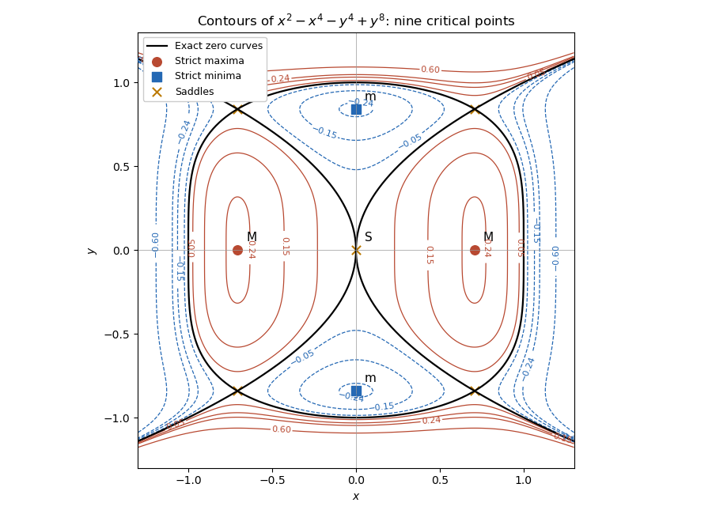

# Paper 2

↑ **Parent:** [Ia](../ia.md)

[https://www.maths.cam.ac.uk/undergrad/pastpapers/files/2013/PaperIA_2.pdf](https://www.maths.cam.ac.uk/undergrad/pastpapers/files/2013/PaperIA_2.pdf)

**Table of contents**

- [1A](#1a)
  - [Solution](#1a/solution)
- [2A](#2a)
  - [Solution](#2a/solution)
- [3F](#3f)
  - [Solution](#3f/solution)
- [4F](#4f)
  - [i](#4f/i)
    - [Solution](#4f/i/solution)
  - [ii](#4f/ii)
    - [Solution](#4f/ii/solution)
- [5A](#5a)
  - [Solution](#5a/solution)
- [6A](#6a)
  - [Solution](#6a/solution)
- [7A](#7a)
  - [Solution](#7a/solution)
- [8A](#8a)
  - [Solution](#8a/solution)
- [9F](#9f)
  - [Solution](#9f/solution)
- [10F](#10f)
  - [Solution](#10f/solution)
- [11F](#11f)
  - [Solution](#11f/solution)
- [12F](#12f)
  - [Solution](#12f/solution)
  - [a](#12f/a)
    - [Solution](#12f/a/solution)
  - [b](#12f/b)
    - [Solution](#12f/b/solution)

## 1A

↑ **Parent:** [Paper 2](paper-2.md)

<h3 id="1a/solution">Solution</h3>

↑ **Parent:** [1A](#1a)

The [characteristic polynomial](../../../linear-operator-theory.md#characteristic-polynomial) factors as $(r-2)(r+1)$, so the [complementary solution](../../../differential-equation.md#homogeneous-solution) is $Ae^{2t}+Be^{-t}$. Each exponential forcing resonates with a homogeneous mode; the [method of undetermined coefficients](../../../differential-equation.md#method-of-undetermined-coefficients) therefore uses $te^{2t}$ and $te^{-t}$. Substitution gives the [particular solution](../../../differential-equation.md#particular-solution) $te^{2t}-te^{-t}-3t$. Thus

$$
y=(A+t)e^{2t}+(B-t)e^{-t}-3t.
$$

The [initial conditions](../../../differential-equation.md#initial-condition) give $A+B=0$ and $2A-B-3=0$. Hence

$$
\boxed{y(t)=(t+1)e^{2t}-(t+1)e^{-t}-3t}.
$$

The factors of $t$ in the [particular solution](../../../differential-equation.md#particular-solution) are essential: an unmodified exponential trial lies in the [kernel](../../../linear-algebra.md#kernel-of-a-linear-map) of the differential operator.

## 2A

↑ **Parent:** [Paper 2](paper-2.md)

<h3 id="2a/solution">Solution</h3>

↑ **Parent:** [2A](#2a)

Set $x=e^z>0$. The [chain rule](../../../calculus.md#chain-rule) gives $\ddot x=x(\ddot z+\dot z^2)$, so the transformed equation is the forced [harmonic oscillator](../../../classical-mechanics.md#simple-harmonic-motion) $\ddot x+x=-1$, with $x(0)=1$ and $\dot x(0)=V$. Therefore

$$
\boxed{z(t)=\log(2\cos t+V\sin t-1)}.
$$

This real solution is defined only where its [logarithm](../../../calculus.md#logarithm) has positive argument. Put $R=\sqrt{V^2+4}$ and $\delta=\arctan(V/2)$. Then $x+1=R\cos(t-\delta)$, and the connected interval containing zero is $|t-\delta|<\arccos(1/R)$.

Since $\dot z=\dot x/x$, a [stationary point](../../../calculus-of-variations.md#stationary-point) requires $\dot x=0$. The positive branch cannot contain the oscillator minimum $x=-R-1$. It contains the maximum $x=R-1$, attained first at $t=\delta$. Hence

$$
\boxed{z=\log(\sqrt{V^2+4}-1)}.
$$

At the endpoints where $x\downarrow0$, $z$ tends to minus infinity; the oscillator solution cannot be continued through those zeros as a finite real $z$.

## 3F

↑ **Parent:** [Paper 2](paper-2.md)

<h3 id="3f/solution">Solution</h3>

↑ **Parent:** [3F](#3f)

Expand around the [expectation](../../../probability-theory.md#expected-value) $\mu$:

$$
G(a)=\mathbb E[(X-\mu)^2]+2(\mu-a)\mathbb E[X-\mu]+(\mu-a)^2
=\sigma^2+(\mu-a)^2.
$$

Thus [variance as the minimum mean squared error of a constant](../../../variance.md#variance-as-the-minimum-mean-squared-error-of-a-constant) gives

$$
\boxed{G(a)\geq\sigma^2,\quad\text{with equality exactly at }a=\mu}.
$$

The finite [second moment](../../../probability-theory.md#second-moment) also guarantees the finite first absolute moment needed below.

For a [probability density function](../../../continuous-probability-distribution.md#probability-density-function) $f$, splitting at $a$ gives

$$
H(a)=\int_{-\infty}^a(a-x)f(x)\,dx+
\int_a^\infty(x-a)f(x)\,dx.
$$

Let $F$ be the [cumulative distribution function](../../../probability-theory.md#cumulative-distribution-function). Since a density gives no mass at a singleton, differentiating under this integral yields $H'(a)=F(a)-(1-F(a))=2F(a)-1$. This [derivative](../../../calculus.md#derivative) is nondecreasing, so $H$ is [convex](../../../real-analysis.md#convex-function) and

$$
\boxed{H\text{ is minimized at every }a\text{ with }F(a)=\frac12}.
$$

This is the [median minimizes expected absolute loss](../../../probability-theory.md#median-minimizes-expected-absolute-loss) property. The minimizer need not be unique: a gap in the density can give an interval of [medians](../../../probability-theory.md#median), all with the same loss.

## 4F

↑ **Parent:** [Paper 2](paper-2.md)

<h3 id="4f/i">i</h3>

↑ **Parent:** [4F](#4f)

<h4 id="4f/i/solution">Solution</h4>

↑ **Parent:** [I](#4f/i)

For $t>0$, monotonicity gives $\{X\geq k\}=\{e^{tX}\geq e^{tk}\}$. Apply [Markov inequality](../../../probability-inequality.md#markov-inequality) to the nonnegative variable $e^{tX}$:

$$
\boxed{\mathbb P(X\geq k)\leq e^{-tk}\mathbb E[e^{tX}]}.
$$

If the [expectation](../../../probability-theory.md#expected-value) is infinite, the bound remains true but uninformative. At $t=0$ the right side is one, so that endpoint follows directly. Minimizing over $t\geq0$ gives the [Chernoff bound](../../../probability-inequality.md#chernoff-bound).

<h3 id="4f/ii">ii</h3>

↑ **Parent:** [4F](#4f)

<h4 id="4f/ii/solution">Solution</h4>

↑ **Parent:** [Ii](#4f/ii)

The [Poisson distribution](../../../discrete-probability-distribution.md#poisson-distribution) with unit parameter has mass $e^{-1}/j!$. Its [moment-generating function](../../../probability-theory.md#moment-generating-function) is

$$
\boxed{\mathbb E[e^{tX}]=e^{-1}\sum_{j=0}^\infty\frac{e^{tj}}{j!}
=\exp(e^t-1)}.
$$

For an integer $k\geq1$, multiply the exponential [probability](../../../probability-theory.md#probability) bound by $e$ to obtain $\sum_{j=k}^\infty1/j!\leq\exp(e^t-kt)$. The exponent is minimized at $e^t=k$, hence $t=\log k\geq0$, including $t=0$ when $k=1$. Consequently

$$
\boxed{\sum_{j=k}^\infty\frac1{j!}\leq e^{k-k\log k}=\left(\frac ek\right)^k}.
$$

## 5A

↑ **Parent:** [Paper 2](paper-2.md)

<h3 id="5a/solution">Solution</h3>

↑ **Parent:** [5A](#5a)

For the normalized second-order equation, an [ordinary point](../../../complex-analysis.md#ordinary-point-criterion-for-a-second-order-equation) is one where both coefficient functions $p,q$ are analytic. A [singular point of a second-order linear ODE](../../../differential-equation.md#singular-point-of-a-second-order-linear-ode) is a point that is not ordinary. It is a [regular singular point](../../../complex-analysis.md#regular-singular-point) if $(x-x_0)p(x)$ and $(x-x_0)^2q(x)$ extend analytically to $x_0$; a singular point failing that condition is irregular.

Here $p=0$, $q=1/x$. Thus zero is singular but regular, because $xp=0$ and $x^2q=x$ are analytic. Write the analytic solution as $y=\sum_{n\geq0}a_nx^n$. Its constant equation gives $a_0=0$, and for $n\geq1$,

$$
n(n+1)a_{n+1}+a_n=0.
$$

Using $a_1=1$ gives

$$
\boxed{y(x)=\sum_{n=1}^\infty\frac{(-1)^{n-1}x^n}{(n-1)!n!}
=x-\frac{x^2}{2}+\frac{x^3}{12}-\frac{x^4}{144}+\cdots}.
$$

The factorial denominators show convergence for every finite $x$.

For the other branch, integrating the first correction equation twice and imposing its two conditions gives $y_1'=-\log x$ and

$$
\boxed{y_1=x-x\log x}.
$$

Then $y_2''=\log x-1$, so $y_2'=x\log x-2x+2$ and

$$
\boxed{y_2=\frac{x^2}{2}\log x-\frac{5x^2}{4}+2x}.
$$

Each correction tends to zero at the origin and its [derivative](../../../calculus.md#derivative) vanishes at one. Although the second solution has a finite limiting value one, it has a [logarithmically divergent endpoint derivative](../../../complex-analysis.md#logarithmically-divergent-derivative-at-a-regular-singular-endpoint). Indeed the differential equation gives $y''\sim-1/x$, and integration gives

$$
\boxed{y'(x)\sim-\log x\longrightarrow+\infty\quad(x\downarrow0)}.
$$

A finite initial [derivative](../../../calculus.md#derivative) cannot be prescribed for this second branch. The [logarithm](../../../calculus.md#logarithm) is consistent with the integer separation of the two exponents in the [Frobenius method](../../../complex-analysis.md#frobenius-method); this is not the repeated-exponent case.

## 6A

↑ **Parent:** [Paper 2](paper-2.md)

<h3 id="6a/solution">Solution</h3>

↑ **Parent:** [6A](#6a)

Expand the function into separated terms: $f=g(x)+h(y)$, where $g=x^2-x^4$ and $h=y^8-y^4$. Then

$$
f_x=2x(1-2x^2),\qquad f_y=4y^3(2y^4-1).
$$

Put $a=2^{-1/2}$ and $b=2^{-1/4}$. The nine [critical points](../../../analysis.md#critical-point) are all pairs from $x\in\{0,\pm a\}$ and $y\in\{0,\pm b\}$. The diagonal [Hessian matrix](../../../calculus.md#hessian-matrix) has entries $2-12x^2$ and $56y^6-12y^2$.

At $(0,\pm b)$ both entries are positive, giving strict [local minima](../../../analysis.md#local-minimum) of value $-1/4$. At $(\pm a,\pm b)$ they have opposite signs, giving four [saddle points](../../../analysis.md#saddle-point) of value zero. At the three points on $y=0$ the Hessian is degenerate, so its sign alone does not classify them. Use the [higher-order test for separated extrema](../../../calculus.md#higher-order-test-for-separated-extrema): $h(y)=-y^4+O(y^8)$ is negative for small nonzero $y$. At $(0,0)$ the positive $x^2$ term and negative $y^4$ term give a saddle. At $(\pm a,0)$, $g-1/4=-(x^2-1/2)^2$, so every sufficiently small nonzero displacement decreases $f$ and these are strict [local maxima](../../../analysis.md#local-maximum).

**There are two maxima at $(\pm a,0)$, two minima at $(0,\pm b)$, and five [saddle points](../../../analysis.md#saddle-point): $(0,0)$ and $(\pm a,\pm b)$.**

For the [level curves](../../../topology.md#level-curve), the exact zero set consists of the two parabolas $x=\pm y^2$ and the oval $x^2+y^4=1$. They cross at the four nondegenerate [saddle points](../../../analysis.md#saddle-point). Small positive levels enclose each maximum; small negative levels enclose each minimum. The degenerate central saddle has quartic narrowing, locally $x^2-y^4=c$. Far along the $x$ axis the function is negative, while far along the $y$ axis it is positive. These signs and zero curves determine the connectivity shown in the sketch.

**[Figure 1](#6a/image-level-curves-exact-zero-set-and-all-nine-classified-critical-points-of-the-separated-quartic-octic-function). Level curves, exact zero set and all nine classified critical points of the separated quartic-octic function**.

## 7A

↑ **Parent:** [Paper 2](paper-2.md)

<h3 id="7a/solution">Solution</h3>

↑ **Parent:** [7A](#7a)

Retain the [derivative](../../../calculus.md#derivative) marks and coefficients from the printed system. In matrix form it is $M\dot u+Ku=b(t)$, with

$$
M=\begin{pmatrix}3&1\\1&4\end{pmatrix},\qquad
K=\begin{pmatrix}5&-1\\-2&7\end{pmatrix}.
$$

Since $\det M=11$, multiplication by its inverse gives

$$
\dot x+2x-y=e^{-t}+e^{-3t},\qquad
\dot y-x+2y=-e^{-t}+e^{-3t}.
$$

The [linear transformation](../../../vector-space.md#linear-map) $u=x+y$, $v=x-y$ diagonalizes this system:

$$
\dot u+u=2e^{-3t},\qquad \dot v+3v=2e^{-t}.
$$

Both start at zero. An [integrating factor](../../../differential-equation.md#integrating-factor) gives $u=v=e^{-t}-e^{-3t}$, so

$$
\boxed{x(t)=e^{-t}-e^{-3t},\qquad y(t)=0}.
$$

Direct substitution into the two original equations confirms the different forcing coefficients; the exact cancellation in $y$ depends on those coefficients.

## 8A

↑ **Parent:** [Paper 2](paper-2.md)

<h3 id="8a/solution">Solution</h3>

↑ **Parent:** [8A](#8a)

Let $\Delta=\theta_1-\theta_0>0$, with $\alpha,\beta_{\max}>0$. [Newton law of cooling](../../../differential-equation.md#newton-s-law-of-cooling) gives the warming and cooling profiles

$$
\theta(t)-\theta_0=\begin{cases}
\Delta(1-e^{-\alpha t}),&0\leq t\leq T,\\
\Delta(1-e^{-\alpha T})e^{-\alpha(t-T)},&T\leq t\leq2T.
\end{cases}
$$

In the stipulated linear model, $\beta(t)=\beta_{\max}(\theta(t)-\theta_0)/\Delta$. The bacterial count obeys $\dot N=-\beta(t)N$, so its logarithmic reduction is the [cumulative thermal destruction under exponential warming and cooling](../../../differential-equation.md#cumulative-thermal-destruction-under-exponential-warming-and-cooling):

$$
\log\frac{N(0)}{N(2T)}=\int_0^{2T}\beta(t)\,dt.
$$

Writing $q=e^{-\alpha T}$, the warming integral divided by $\beta_{\max}$ is $T-(1-q)/\alpha$ and the cooling contribution is $(1-q)^2/\alpha$. Hence the required implicit equation is

$$
\boxed{\beta_{\max}\left[T-\frac{e^{-\alpha T}(1-e^{-\alpha T})}{\alpha}\right]=20\log10}.
$$

The bracket is zero at zero and has [derivative](../../../calculus.md#derivative) $(1-q)(1+2q)>0$ for $T>0$, tending to infinity with $T$. There is therefore one positive solution.

**For the hardier species, $T$ is unchanged in this model if $\alpha$ and the achieved $\beta_{\max}$ remain the same.** Raising the oven temperature changes $\Delta$, but its factor cancels against the changed slope of the linear destruction law. The entire normalized temperature history and hence the destruction integral remain the same; the comparison uses both the warming and equal-duration cooling stages.

## 9F

↑ **Parent:** [Paper 2](paper-2.md)

<h3 id="9f/solution">Solution</h3>

↑ **Parent:** [9F](#9f)

The [exponential distribution](../../../continuous-probability-distribution.md#exponential-distribution) has survival [probability](../../../probability-theory.md#probability) $e^{-u}$ for $u\geq0$. [Conditional probability](../../../probability-theory.md#conditional-probability) therefore gives

$$
\mathbb P(Z>s+t\mid Z>s)=\frac{e^{-(s+t)}}{e^{-s}}=e^{-t},
$$

which proves the [memoryless property](../../../continuous-probability-distribution.md#memorylessness-of-the-exponential-distribution). Let $K=\lfloor Z\rfloor$ and $U=Z-K$. With $q=e^{-1}$,

$$
\boxed{\mathbb P(K=m)=(1-q)q^m,\quad m=0,1,2,\ldots}.
$$

The [geometric distribution](../../../discrete-probability-distribution.md#geometric-distribution) here starts at zero. Summing its first moment gives

$$
\boxed{\mathbb E[K]=\frac q{1-q}=\frac1{e-1}}.
$$

For $0\leq u<1$, sum the density over all integer translates:

$$
\boxed{f_U(u)=\sum_{m=0}^\infty e^{-m-u}=\frac{e^{-u}}{1-e^{-1}}},
$$

with zero density outside that interval. The [integer and fractional parts of an exponential variable](../../../continuous-probability-distribution.md#integer-and-fractional-parts-of-an-exponential-variable) are independent, because for every integer $m\geq0$ and measurable $A\subseteq[0,1)$,

$$
\mathbb P(K=m,U\in A)=\int_Ae^{-m-u}\,du
=\mathbb P(K=m)\int_A f_U(u)\,du.
$$

This factorization proves [independence](../../../random-variable.md#independent-random-variables) of the discrete and continuous components, beyond just checking their separate marginals.

## 10F

↑ **Parent:** [Paper 2](paper-2.md)

<h3 id="10f/solution">Solution</h3>

↑ **Parent:** [10F](#10f)

For the [probability generating function](../../../probability-theory.md#probability-generating-function) $G(t)=\mathbb E[t^X]$, differentiation gives

$$
\boxed{G'(1)=\mathbb E[X]=\mu,\qquad
G''(1)=\mathbb E[X(X-1)]=\sigma^2+\mu^2-\mu}.
$$

The second [derivative](../../../calculus.md#derivative) is a [factorial moment](../../../markov-process.md#factorial-moment), not the raw [second moment](../../../probability-theory.md#second-moment).

In the [Galton-Watson process](../../../probability-and-statistics.md#galton-watson-process), condition on $X_n=m$. The next generation is a sum of $m$ independent offspring counts, and so its conditional generating function is $G(t)^m$. Averaging over $X_n$ gives

$$
\boxed{G_{n+1}(t)=\mathbb E[G(t)^{X_n}]=G_n(G(t))}.
$$

The conditional mean is $m\mu$ and the [conditional variance](../../../variance.md#conditional-variance) is $m\sigma^2$. Thus iterated [expectation](../../../probability-theory.md#expected-value) gives $\mathbb E[X_n]=\mu^n$ from one ancestor, and the [law of total variance](../../../probability-theory.md#law-of-total-variance) gives $v_{n+1}=\mu^2v_n+\sigma^2\mu^n$, $v_0=0$. Iterating yields the [branching-process generation moments](../../../probability-and-statistics.md#mean-and-variance-of-a-galton-watson-generation)

$$
\boxed{v_n=\sigma^2\mu^{n-1}\sum_{j=0}^{n-1}\mu^j
=\sigma^2\frac{\mu^{n-1}(\mu^n-1)}{\mu-1}\quad(\mu\ne1,\ n\geq1)}.
$$

For the critical case $\mu=1$, the correct limiting value is $v_n=n\sigma^2$. If $\mu=0$, nonnegative offspring are zero almost surely, so every later generation has zero mean and [variance](../../../variance.md); handle this directly rather than use an ambiguous zero power. At generation zero the mean is one and [variance](../../../variance.md) zero.

The [branching-process extinction criterion](../../../probability-and-statistics.md#branching-process-extinction-criterion) states that extinction [probability](../../../probability-theory.md#probability) is the smallest fixed point of $G$ in $[0,1]$: probabilities of extinction by successive generations are the iterates of $G$ from zero, increasing to that fixed point. Here the equation is $4q^3-7q+3=0$, factoring as $(q-1)(2q-1)(2q+3)=0$. The two admissible roots are $1/2$ and one, so

$$
\boxed{\mathbb P(\text{eventual extinction})=\frac12}.
$$

## 11F

↑ **Parent:** [Paper 2](paper-2.md)

<h3 id="11f/solution">Solution</h3>

↑ **Parent:** [11F](#11f)

Use the positive-support [geometric distribution](../../../discrete-probability-distribution.md#geometric-distribution), $\mathbb P(X=j)=p(1-p)^{j-1}$ for $j\geq1$, $0<p\leq1$. Differentiating the geometric series supplies

$$
\boxed{\mathbb E[X]=\frac1p,\qquad
\mathbb E[X^2]=\frac{2-p}{p^2},\qquad
\operatorname{Var}(X)=\frac{1-p}{p^2}}.
$$

For the jar, let $W_r$ be the waiting time to remove one red ball when exactly $r$ red balls remain. Every draw has success [probability](../../../probability-theory.md#probability) $r/n$, so $W_r$ is geometric with that parameter. The $W_r$ are independent: after each success, fresh independent draws begin a new stage, and its conditional waiting distribution depends only on the deterministic count $r$, not on earlier waiting times. Replacing a green ball leaves that stage's count unchanged.

Thus the [coupon collector problem](../../../discrete-probability-distribution.md#coupon-collector-problem) decomposition is $T=\sum_{r=1}^nW_r$, and

$$
\boxed{\mathbb E[T]=n\sum_{r=1}^n\frac1r},\qquad
\boxed{\operatorname{Var}(T)=n^2\sum_{r=1}^n\frac1{r^2}-n\sum_{r=1}^n\frac1r}.
$$

This is the [coupon collector waiting-time variance](../../../discrete-probability-distribution.md#coupon-collector-waiting-time-variance). For $n=1$, the formula correctly gives zero [variance](../../../variance.md) and a deterministic one-minute completion.

## 12F

↑ **Parent:** [Paper 2](paper-2.md)

<h3 id="12f/solution">Solution</h3>

↑ **Parent:** [12F](#12f)

By the partition and the [law of total probability](../../../probability-theory.md#law-of-total-probability), $\mathbb P(A)=\sum_j\mathbb P(A\cap B_j)=\sum_j\mathbb P(A\mid B_j)\mathbb P(B_j)$. Also $\mathbb P(B_i\mid A)=\mathbb P(A\cap B_i)/\mathbb P(A)$. Combining these identities proves [Bayes' theorem](../../../probability-theory.md#bayes-theorem):

$$
\boxed{\mathbb P(B_i\mid A)=\frac{\mathbb P(A\mid B_i)\mathbb P(B_i)}{\sum_j\mathbb P(A\mid B_j)\mathbb P(B_j)}}.
$$

The assumed positive probabilities make the conditional expressions well defined.

<h3 id="12f/a">a</h3>

↑ **Parent:** [12F](#12f)

<h4 id="12f/a/solution">Solution</h4>

↑ **Parent:** [A](#12f/a)

Let $B$ mean that the selected coin is biased and $F$ that it is fair. Both have prior [probability](../../../probability-theory.md#probability) $1/2$. Conditional on either coin, tosses are independent. For the observed head count, the two [binomial distribution](../../../discrete-probability-distribution.md#binomial-distribution) [likelihoods](../../../statistical-modelling.md#likelihood-function) are $\binom nk p^k(1-p)^{n-k}$ and $\binom nk2^{-n}$. [Bayes' theorem](../../../probability-theory.md#bayes-theorem) cancels the common coefficient and equal prior weights, giving

$$
\boxed{\mathbb P(B\mid k\text{ heads in }n\text{ tosses})
=\frac{p^k(1-p)^{n-k}}{p^k(1-p)^{n-k}+2^{-n}}}.
$$

This applies for $0\leq k\leq n$, including endpoint coin biases with zero-power factors interpreted by the corresponding [likelihood](../../../statistical-modelling.md#likelihood-function). The fair-coin [likelihood](../../../statistical-modelling.md#likelihood-function) is positive, so the denominator cannot vanish.

<h3 id="12f/b">b</h3>

↑ **Parent:** [12F](#12f)

<h4 id="12f/b/solution">Solution</h4>

↑ **Parent:** [B](#12f/b)

For a finite stopping time $n$ with target $k\geq1$, necessarily $n\geq k$. The last toss must be a head and the preceding $n-1$ tosses must contain $k-1$ heads. The [negative binomial stopping argument](../../../discrete-probability-distribution.md#negative-binomial-stopping-argument) therefore gives [likelihood](../../../statistical-modelling.md#likelihood-function) $\binom{n-1}{k-1}p^k(1-p)^{n-k}$ for the biased coin, and $\binom{n-1}{k-1}2^{-n}$ for the fair coin. Applying [Bayes' theorem](../../../probability-theory.md#bayes-theorem) again yields

$$
\boxed{\mathbb P(B\mid\text{the }k\text{th head occurs at toss }n)
=\frac{p^k(1-p)^{n-k}}{p^k(1-p)^{n-k}+2^{-n}}}.
$$

The two experiments have different combinatorial coefficients, but each coefficient is independent of the coin parameter. Thus [posterior equality for proportional likelihoods](../../../probability-theory.md#posterior-equality-for-proportional-likelihoods) explains their identical posterior formula. If $p=0$, a finite positive-head stopping observation has zero [likelihood](../../../statistical-modelling.md#likelihood-function) under the biased coin, consistently giving posterior zero. If the target is $k=0$, the experiment stops at $n=0$ without a toss and the posterior remains $1/2$; a positive stopping time would then be impossible.

## ↑ Ancestors (8)

1. [Ia](../ia.md)
2. [2013](../../2013.md)
3. [Past exam of the mathematics course of the University of Cambridge](../../../past-exam-of-the-mathematics-course-of-the-university-of-cambridge.md)
4. [Mathematics course of the University of Cambridge](../../../university-of-cambridge.md#mathematics-course-of-the-university-of-cambridge)
5. [Course of the University of Cambridge](../../../university-of-cambridge.md#course-of-the-university-of-cambridge)
6. [University of Cambridge](../../../university-of-cambridge.md)
7. [List of universities](../../../README.md#list-of-universities)
8. [Codex Wiki](../../../README.md)
