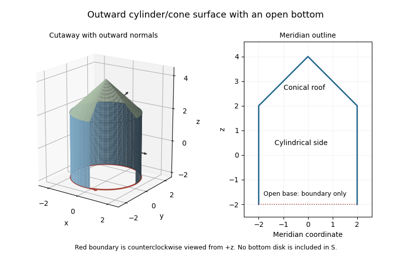

<h1 id="10c/solution">Solution</h1>

↑ **Parent:** [10C](../10c.md)

Take the [normal vector](../../../../../normal-vector.md) outward from the cylinder-and-cone solid. The surface consists of the cylindrical side and conical roof, with no bottom disk; this convention fixes the otherwise unspecified [orientation of a surface](../../../../../orientation-of-a-surface.md). The boundary is the radius-two circle at $z=-2$. Reversing every [normal vector](../../../../../normal-vector.md) reverses the final sign.

**[Figure 2](#10c/image-outward-oriented-cylindrical-side-and-conical-roof-with-the-open-bottom-circle-as-the-sole-boundary). Outward-oriented cylindrical side and conical roof, with the open bottom circle as the sole boundary**.

For $\mathbf F=(yz^2,0,0)$, its [curl](../../../../../curl.md) is $(0,2yz,-z^2)$. For the cylindrical [parametrized surface](../../../../../parametrized-surface.md), use $\mathbf r_c=(2\cos\theta,2\sin\theta,z)$, with $-2\le z\le2$, and use $\mathbf r_{c,\theta}\times\mathbf r_{c,z}=(2\cos\theta,2\sin\theta,0)$ as the outward area vector. Its flux is

$$
I_c=\int_{-2}^{2}\int_0^{2\pi}8z\sin^2\theta\,d\theta\,dz=0.
$$

For the cone, let $q=4-z$, $2\le z\le4$ and $\mathbf r_k=(q\cos\theta,q\sin\theta,z)$. Its outward area vector is $\mathbf r_{k,\theta}\times\mathbf r_{k,z}=(q\cos\theta,q\sin\theta,q)$. Thus

$$
\begin{aligned}
I_k&=\int_2^4\int_0^{2\pi}(2q^2z\sin^2\theta-qz^2)\,d\theta\,dz\\
&=2\pi\int_2^4(16z-12z^2+2z^3)\,dz=-16\pi.
\end{aligned}
$$

The total [surface integral](../../../../../surface-integral.md) is therefore **$-16\pi$ with the outward convention**, or $+16\pi$ for the opposite convention.

For [Stokes theorem](../../../../../stokes-theorem.md), the induced bottom-circle orientation is counterclockwise as viewed from above, opposite to the orientation of an outward bottom cap. Use $\mathbf r=(2\cos\theta,2\sin\theta,-2)$ with increasing $\theta$. Then

$$
\boxed{\oint_{\partial S}\mathbf F\cdot d\mathbf r
=\int_0^{2\pi}(8\sin\theta)(-2\sin\theta)\,d\theta=-16\pi,}
$$

agreeing with the two parametrized fluxes. The seam at $z=2$ is internal and cancels between the two pieces; the cone tip does not supply another boundary curve.

## ↑ Ancestors (10)

1. [10C](../10c.md)
2. [Paper 3](../../paper-3-split.md)
3. [Ia](../../split.md)
4. [2013](../../../split.md)
5. [Past exam of the mathematics course of the University of Cambridge](../../../../split.md)
6. [Mathematics course of the University of Cambridge](../../../../../mathematics-course-of-the-university-of-cambridge.md)
7. [Course of the University of Cambridge](../../../../../course-of-the-university-of-cambridge.md)
8. [University of Cambridge](../../../../../university-of-cambridge-split.md)
9. [List of universities](../../../../../list-of-universities.md)
10. [Codex Wiki](../../../../../split.md)
