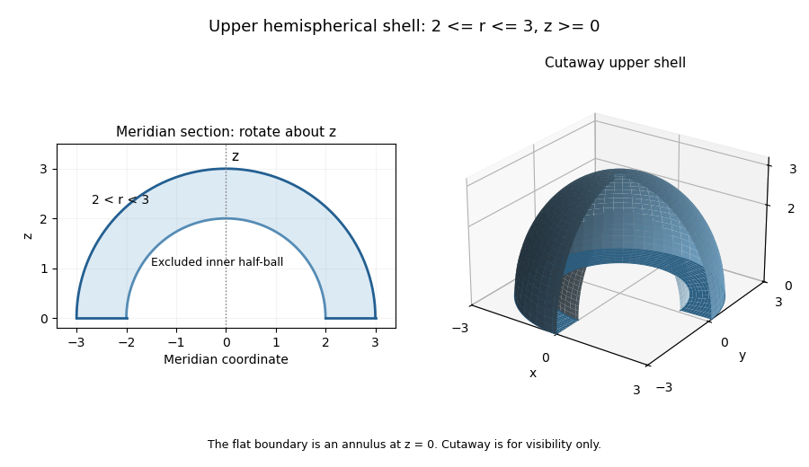

<h1 id="9c/solution">Solution</h1>

↑ **Parent:** [9C](../9c.md)

For a smooth one-to-one coordinate transformation with nonsingular derivative, the [Jacobian determinant](../../../../../jacobian-determinant.md) is

$$
\boxed{J=\det\begin{pmatrix}x_u&x_v&x_w\\y_u&y_v&y_w\\z_u&z_v&z_w\end{pmatrix}.}
$$

Locally a small coordinate box maps, to first order, to a parallelepiped whose volume is the absolute [determinant](../../../../../determinant.md) of the derivative times the original volume. Summing these local volume approximations gives the [change of variables formula](../../../../../change-of-variables-formula.md), with $|J|$ accounting for either orientation. The usual regularity and nonsingularity hypotheses are part of this substitution theorem.

The region is the upper half of the spherical shell between radii two and three, including its annular flat boundary in the equatorial plane. Use [spherical coordinates](../../../../../spherical-coordinate-system.md) $x=r\sin\theta\cos\phi$, $y=r\sin\theta\sin\phi$, $z=r\cos\theta$ with $2\le r\le3$, $0\le\theta\le\pi/2$, $0\le\phi<2\pi$. Their [Jacobian determinant](../../../../../jacobian-determinant.md) is $r^2\sin\theta$; the polar axis and azimuth seam have measure zero, so do not obstruct this integration.

**[Figure 1](#9c/image-upper-hemispherical-shell-between-radii-two-and-three-with-a-meridian-cross-section-and-a-cutaway-view). Upper hemispherical shell between radii two and three, with a meridian cross-section and a cutaway view**.

The integrand is $x^2+y^2=r^2\sin^2\theta$. Consequently

$$
\boxed{\int_D(x^2+y^2)\,dV
=\int_2^3r^4\,dr\int_0^{\pi/2}\sin^3\theta\,d\theta\int_0^{2\pi}d\phi
=\frac{211}{5}\frac23(2\pi)=\frac{844\pi}{15}.}
$$

## ↑ Ancestors (10)

1. [9C](../9c.md)
2. [Paper 3](../../paper-3-split.md)
3. [Ia](../../split.md)
4. [2013](../../../split.md)
5. [Past exam of the mathematics course of the University of Cambridge](../../../../split.md)
6. [Mathematics course of the University of Cambridge](../../../../../mathematics-course-of-the-university-of-cambridge.md)
7. [Course of the University of Cambridge](../../../../../course-of-the-university-of-cambridge.md)
8. [University of Cambridge](../../../../../university-of-cambridge-split.md)
9. [List of universities](../../../../../list-of-universities.md)
10. [Codex Wiki](../../../../../split.md)
