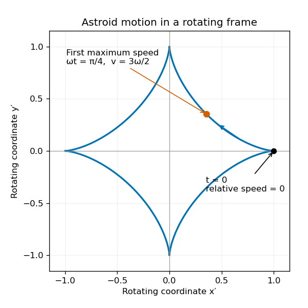

# Paper 4

↑ **Parent:** [Ia](../ia.md)

[https://www.maths.cam.ac.uk/undergrad/pastpapers/files/2013/PaperIA_4.pdf](https://www.maths.cam.ac.uk/undergrad/pastpapers/files/2013/PaperIA_4.pdf)

**Table of contents**

- [1E](#1e)
  - [Solution](#1e/solution)
- [2E](#2e)
  - [Solution](#2e/solution)
- [3B](#3b)
  - [Solution](#3b/solution)
- [4B](#4b)
  - [Solution](#4b/solution)
- [5E](#5e)
  - [i](#5e/i)
    - [Solution](#5e/i/solution)
  - [ii](#5e/ii)
    - [Solution](#5e/ii/solution)
  - [iii](#5e/iii)
    - [Solution](#5e/iii/solution)
- [6E](#6e)
  - [i](#6e/i)
    - [Solution](#6e/i/solution)
  - [ii](#6e/ii)
    - [Solution](#6e/ii/solution)
  - [iii](#6e/iii)
    - [Solution](#6e/iii/solution)
- [7E](#7e)
  - [i](#7e/i)
    - [Solution](#7e/i/solution)
  - [ii](#7e/ii)
    - [Solution](#7e/ii/solution)
  - [iii](#7e/iii)
    - [Solution](#7e/iii/solution)
- [8E](#8e)
  - [i](#8e/i)
    - [Solution](#8e/i/solution)
  - [ii](#8e/ii)
    - [Solution](#8e/ii/solution)
  - [iii](#8e/iii)
    - [Solution](#8e/iii/solution)
- [9B](#9b)
  - [a](#9b/a)
    - [i](#9b/a/i)
      - [Solution](#9b/a/i/solution)
    - [ii](#9b/a/ii)
      - [Solution](#9b/a/ii/solution)
  - [b](#9b/b)
    - [Solution](#9b/b/solution)
- [10B](#10b)
  - [a](#10b/a)
    - [Solution](#10b/a/solution)
  - [b](#10b/b)
    - [Solution](#10b/b/solution)
- [11B](#11b)
  - [i](#11b/i)
    - [Solution](#11b/i/solution)
  - [ii](#11b/ii)
    - [Solution](#11b/ii/solution)
- [12B](#12b)
  - [a](#12b/a)
    - [Solution](#12b/a/solution)
  - [b](#12b/b)
    - [Solution](#12b/b/solution)

## 1E

↑ **Parent:** [Paper 4](paper-4.md)

<h3 id="1e/solution">Solution</h3>

↑ **Parent:** [1E](#1e)

The [greatest common divisor](../../../number-theory.md#greatest-common-divisor) $d=\gcd(m,n)$ is the largest positive integer dividing both $m$ and $n$. To prove [Bézout's identity](../../../algebra.md#bezout-identity) without assuming a factorization theorem, consider the nonempty set of positive integer linear combinations

$$
\mathcal L=\{am+bn>0:a,b\in\mathbb Z\}.
$$

It contains $m$, so the [well-ordering principle](../../../arithmetic.md#well-ordering-principle-for-the-natural-numbers) gives a least element $d_0=am+bn$. By [Euclidean division](../../../number-theory.md#euclidean-division), write $m=qd_0+r$ with $0\leq r<d_0$. Then

$$
r=(1-qa)m-qbn
$$

is another integer linear combination. If $r>0$, it contradicts minimality, so $r=0$ and $d_0\mid m$. Applying the same argument to $n$ gives $d_0\mid n$. Conversely, every common divisor divides every integer linear combination and therefore divides $d_0$. In particular every positive common divisor is at most $d_0$. Thus $d_0=d$ and

$$
\boxed{\gcd(m,n)=am+bn\quad\text{for some }a,b\in\mathbb Z.}
$$

This also proves the requested divisibility implication for any integer $k$: if $k\mid m$ and $k\mid n$, then $k\mid(am+bn)=d$.

For the [scaling identity for greatest common divisors](../../../number-theory.md#scaling-identity-for-greatest-common-divisors), put $D=\gcd(km,kn)$ with $k>0$. Since $kd$ divides $km$ and $kn$, $D\geq kd$. On the other hand, multiplying [Bézout's identity](../../../algebra.md#bezout-identity) by $k$ expresses $kd$ as $a(km)+b(kn)$, so $D\mid kd$. Positivity gives $D\leq kd$. Therefore **without using prime factorization**,

$$
\boxed{\gcd(km,kn)=k\gcd(m,n).}
$$

## 2E

↑ **Parent:** [Paper 4](paper-4.md)

<h3 id="2e/solution">Solution</h3>

↑ **Parent:** [2E](#2e)

A real [sequence](../../../real-analysis.md#sequence) converges to a finite limit $L$ if

$$
\forall\varepsilon>0\ \exists N\ \forall n\geq N:\quad |x_n-L|<\varepsilon.
$$

A [series](../../../real-analysis.md#series-mathematics) converges when its [partial sums](../../../real-analysis.md#partial-sum) $s_N=\sum_{n=1}^N x_n$ form a [convergent sequence](../../../real-analysis.md#convergent-sequence) with a finite limit. These are different conditions: a [series](../../../real-analysis.md#series-mathematics) concerns accumulated terms, whereas [sequence](../../../real-analysis.md#sequence) convergence concerns the terms themselves.

If $s_N\to S$, then $s_{N-1}\to S$ as well and $x_N=s_N-s_{N-1}\to0$. Explicitly, choose $N$ large enough that both [partial sums](../../../real-analysis.md#partial-sum) lie within $\varepsilon/2$ of $S$; the [triangle inequality](../../../topological-analysis.md#triangle-inequality) gives $|x_N|<\varepsilon$. Hence **convergence of a series forces its terms to tend to zero**.

For the converse, take $x_n=1/n$. This is a [null sequence](../../../real-analysis.md#null-sequence), but its [harmonic series](../../../real-analysis.md#harmonic-series) diverges. In each block $2^{j-1}<n\leq2^j$, there are $2^{j-1}$ terms each at least $2^{-j}$, so the block contributes at least $1/2$. Thus

$$
s_{2^k}\geq1+\frac k2\longrightarrow\infty.
$$

**A zero limit for the terms is necessary, but not sufficient, for [convergent series](../../../real-analysis.md#convergent-series).**

## 3B

↑ **Parent:** [Paper 4](paper-4.md)

<h3 id="3b/solution">Solution</h3>

↑ **Parent:** [3B](#3b)

Use [zero-relative-velocity mass shedding](../../../classical-mechanics.md#zero-relative-velocity-mass-shedding): the released sand initially shares the balloon's vertical [velocity](../../../classical-mechanics.md#velocity), rather than being actively ejected. Let $q=M+m(t)$ and let a positive mass $\delta m$ be shed in a short interval $dt$. The [momentum](../../../classical-mechanics.md#momentum) of the balloon and that newly released sand changes by

$$
(q-\delta m)(v+dv)+\delta m\,v-qv=q\,dv+O(dt^2).
$$

The leading external impulse is $(T-qg)dt$. [Newton's second law](../../../classical-mechanics.md#newton-s-second-law) applied to this combined material system therefore gives

$$
\boxed{(M+m)\dot v=T-(M+m)g.}
$$

Writing $\frac d{dt}(qv)=T-qg$ for the remaining balloon alone would omit the outgoing [momentum](../../../classical-mechanics.md#momentum) flux. A nonzero relative ejection [velocity](../../../classical-mechanics.md#velocity) would instead produce a [rocket equation](../../../classical-mechanics.md#rocket-equation) thrust term.

Initial mechanical equilibrium gives $T=(M+m_0)g$. Write $\lambda=m_0/t_0$, so $m=m_0-\lambda t$ up to depletion. Then

$$
\dot v=g\frac{\lambda t}{M+m_0-\lambda t}
=g\frac{t}{A-t},\qquad A=\frac{M+m_0}{\lambda}>t_0.
$$

Integrating from rest,

$$
v(t)=g\left[A\log\frac{A}{A-t}-t\right].
$$

Since $A/t_0=1+M/m_0$ and $A/(A-t_0)=1+m_0/M$, the final upward [speed](../../../classical-mechanics.md#speed) is

$$
\boxed{v(t_0)=gt_0\left[\left(1+\frac{M}{m_0}\right)
\log\left(1+\frac{m_0}{M}\right)-1\right].}
$$

The acceleration is nonnegative throughout release, consistent with the upward motion.

## 4B

↑ **Parent:** [Paper 4](paper-4.md)

<h3 id="4b/solution">Solution</h3>

↑ **Parent:** [4B](#4b)

Use the inverse [Lorentz transformation](../../../special-relativity.md#lorentz-transformation)

$$
x=\gamma_v(x'+vt'),\qquad
t=\gamma_v(t'+vx'/c^2).
$$

Along the particle's worldline $dx'=u'\,dt'$, so the [relativistic velocity-addition formula](../../../special-relativity.md#velocity-addition-formula) is

$$
\boxed{u=\frac{u'+v}{1+u'v/c^2}.}
$$

For subluminal collinear [velocities](../../../classical-mechanics.md#velocity), put $u/c=\tanh\varphi_u$, $u'/c=\tanh\varphi_{u'}$ and $v/c=\tanh\varphi_v$. The [hyperbolic tangent](../../../calculus.md#hyperbolic-tangent) addition formula, obtained by dividing the supplied sine/cosine addition formulas, gives

$$
\tanh\varphi_u=\tanh(\varphi_{u'}+\varphi_v).
$$

Because [hyperbolic tangent](../../../calculus.md#hyperbolic-tangent) is [injective](../../../algebra.md#injective-function) on the real line,

$$
\boxed{\varphi_u=\varphi_{u'}+\varphi_v.}
$$

Thus [rapidity](../../../special-relativity.md#rapidity) is additive even though [velocity](../../../classical-mechanics.md#velocity) is not.

Each positive increment in the instantaneous rest frame adds the same [rapidity](../../../special-relativity.md#rapidity) $\alpha=\operatorname{artanh}(1/2)=\tfrac12\log3$. Starting from zero [rapidity](../../../special-relativity.md#rapidity), [iterated collinear boosts with equal rapidity](../../../special-relativity.md#iterated-collinear-boosts-with-equal-rapidity) give

$$
\boxed{u_n=c\tanh(n\alpha)
=c\frac{e^{2n\alpha}-1}{e^{2n\alpha}+1}
=c\frac{3^n-1}{3^n+1}.}
$$

Every finite number of increments leaves $u_n<c$; the [speed of light](../../../special-relativity.md#speed-of-light) is approached as $n\to\infty$.

## 5E

↑ **Parent:** [Paper 4](paper-4.md)

<h3 id="5e/i">i</h3>

↑ **Parent:** [5E](#5e)

<h4 id="5e/i/solution">Solution</h4>

↑ **Parent:** [I](#5e/i)

A [function](../../../function.md) is [injective](../../../algebra.md#injective-function) when $f(x)=f(x')$ implies $x=x'$. It is [surjective](../../../algebra.md#surjective-function) when every element of its codomain equals $f(x)$ for at least one element of its domain.

If $g\circ f$ is [injective](../../../algebra.md#injective-function), then $f(x)=f(x')$ implies

$$
(g\circ f)(x)=(g\circ f)(x'),
$$

hence $x=x'$. Thus **injectivity of the composition implies injectivity of the first map**.

If $g\circ f$ is [surjective](../../../algebra.md#surjective-function), then for every $z\in Z$ there is an $x\in X$ with $z=g(f(x))$. Taking $y=f(x)$ proves that $z$ lies in the image of $g$. Thus **surjectivity of the composition implies surjectivity of the second map**. The arguments include empty domains and codomains whenever the specified [functions](../../../function.md) exist.

<h3 id="5e/ii">ii</h3>

↑ **Parent:** [5E](#5e)

<h4 id="5e/ii/solution">Solution</h4>

↑ **Parent:** [Ii](#5e/ii)

The [empty-set cases for Cartesian projections](../../../function.md#empty-set-cases-for-cartesian-projections) matter here. For $p_i$, write $X_j$ for the other factor. If $X_j$ is nonempty, any $x_i\in X_i$ can be paired with an element of $X_j$, so $p_i$ is [surjective](../../../algebra.md#surjective-function). If $X_j$ is empty, the [Cartesian product](../../../set-theory.md#cartesian-product) is empty and its image is empty. Consequently

$$
\boxed{p_i\text{ is surjective}\iff X_i=\varnothing
\ \text{or}\ X_j\ne\varnothing.}
$$

The possibility $X_i=\varnothing$ is included because the empty [function](../../../function.md) onto the empty set is [surjective](../../../algebra.md#surjective-function).

If $X_i$ is empty, $p_i$ has empty domain and is [injective](../../../algebra.md#injective-function). If $X_j$ has at most one element, an ordered pair is determined by its $i$th coordinate, so $p_i$ is also [injective](../../../algebra.md#injective-function). Conversely, when $X_i$ is nonempty and $X_j$ contains two different elements, pairing those two elements with one fixed $x_i$ gives distinct ordered pairs with the same [projection map](../../../function.md#projection-map). Therefore

$$
\boxed{p_i\text{ is injective}\iff X_i=\varnothing
\ \text{or}\ |X_j|\leq1.}
$$

<h3 id="5e/iii">iii</h3>

↑ **Parent:** [5E](#5e)

<h4 id="5e/iii/solution">Solution</h4>

↑ **Parent:** [Iii](#5e/iii)

The [universal property of Cartesian products](../../../set-theory.md#universal-property-of-cartesian-products) constructs the desired map pointwise:

$$
\boxed{g(y)=(f_1(y),f_2(y)).}
$$

Its coordinate [projection maps](../../../function.md#projection-map) are $f_1$ and $f_2$. Any other map with those [projection maps](../../../function.md#projection-map) must have the same two coordinates at every $y$, and hence must equal $g$. This also covers $Y=\varnothing$.

For [joint injectivity of a pair of functions](../../../set-theory.md#joint-injectivity-of-a-pair-of-functions), equality $g(y)=g(y')$ means equality of both coordinate images. If either coordinate [function](../../../function.md) is [injective](../../../algebra.md#injective-function), it follows that $y=y'$, so $g$ is [injective](../../../algebra.md#injective-function). The converse fails: take $Y=\{a,b,c\}$ and map these points to $(0,0),(0,1),(1,0)$ in $\{0,1\}^2$. The paired map is [injective](../../../algebra.md#injective-function), but the first coordinate identifies $a,b$ and the second identifies $a,c$.

There is an empty-factor defect in the printed surjectivity implication. If both $X_1$ and $X_2$ are nonempty and $g$ is [surjective](../../../algebra.md#surjective-function), every element of either factor can be completed to a pair and then lifted through $g$. Hence both $f_i$ are [surjective](../../../algebra.md#surjective-function). If both factors are empty, existence of the $f_i$ forces $Y$ to be empty and both coordinate maps are again [surjective](../../../algebra.md#surjective-function). But take

$$
Y=X_2=\varnothing,\qquad X_1=\{0\}.
$$

Then $g:\varnothing\to X_1\times X_2=\varnothing$ is [surjective](../../../algebra.md#surjective-function), while $f_1:\varnothing\to\{0\}$ is not. **Without a nonempty-factor assumption, the printed implication is false.** This is exactly the exception found for the [projection maps](../../../function.md#projection-map) in part (ii).

Even when both factors are nonempty, the reverse implication fails. For $Y=X_1=X_2=\{0,1\}$, let $f_1(y)=f_2(y)=y$. Both coordinate maps are [surjective](../../../algebra.md#surjective-function), but $g(y)=(y,y)$ misses $(0,1)$ and $(1,0)$. Thus **coordinate surjectivity does not guarantee that every pair is attained**.

## 6E

↑ **Parent:** [Paper 4](paper-4.md)

<h3 id="6e/i">i</h3>

↑ **Parent:** [6E](#6e)

<h4 id="6e/i/solution">Solution</h4>

↑ **Parent:** [I](#6e/i)

Use a [stars and bars](../../../combinatorics.md#stars-and-bars-combinatorics) [bijection](../../../function.md#bijection). For a tuple, place $N$ stars in $r+1$ consecutive blocks of lengths $n_0,\ldots,n_r$, separated by $r$ bars. The bar positions form an $r$-element subset of $\{1,\ldots,N+r\}$. Explicitly,

$$
b_j=n_0+\cdots+n_{j-1}+j,\qquad 1\leq j\leq r.
$$

They satisfy $1\leq b_1<\cdots<b_r\leq N+r$. Conversely, such a subset determines

$$
n_0=b_1-1,\quad
n_j=b_{j+1}-b_j-1\ (1\leq j<r),\quad
n_r=N+r-b_r.
$$

These numbers are nonnegative and sum to $N$, proving that the two constructions are inverse. Hence

$$
\boxed{|S|=\binom{N+r}{r}.}
$$

Zero-length blocks are permitted, so the [bijection](../../../function.md#bijection) also covers $N=0$.

<h3 id="6e/ii">ii</h3>

↑ **Parent:** [6E](#6e)

<h4 id="6e/ii/solution">Solution</h4>

↑ **Parent:** [Ii](#6e/ii)

For finitely many finite sets $A_1,\ldots,A_k$, the [inclusion-exclusion principle](../../../combinatorics.md#inclusion-exclusion-principle) states

$$
\boxed{\left|\bigcup_{i=1}^kA_i\right|
=\sum_{\varnothing\ne J\subseteq\{1,\ldots,k\}}
(-1)^{|J|+1}\left|\bigcap_{j\in J}A_j\right|.}
$$

To see why, an element belonging to exactly $t\geq1$ of the sets contributes

$$
\sum_{j=1}^t(-1)^{j+1}\binom tj=1
$$

by the [binomial theorem](../../../combinatorics.md#binomial-theorem). Elements outside the union contribute zero. Equivalently, if these sets lie in a finite universe $U$, the number avoiding all of them is

$$
|U|+\sum_{\varnothing\ne J}(-1)^{|J|}
\left|\bigcap_{j\in J}A_j\right|.
$$

<h3 id="6e/iii">iii</h3>

↑ **Parent:** [6E](#6e)

<h4 id="6e/iii/solution">Solution</h4>

↑ **Parent:** [Iii](#6e/iii)

For [bounded weak compositions](../../../combinatorics.md#bounded-weak-compositions), start with the unrestricted [stars and bars](../../../combinatorics.md#stars-and-bars-combinatorics) set $S$ and let $A_i$ be its subset where $n_i\geq a_i$. For an index subset $J\subseteq\{0,\ldots,r\}$, subtract $a_i$ from each coordinate with $i\in J$. This is a [bijection](../../../function.md#bijection) from $\bigcap_{i\in J}A_i$ to nonnegative tuples summing to

$$
N-\sum_{i\in J}a_i.
$$

Thus

$$
\left|\bigcap_{i\in J}A_i\right|
=\binom{N+r-\sum_{i\in J}a_i}{r},
$$

where a negative remaining sum gives zero, in accordance with the stipulated convention. Apply the avoidance form of the [inclusion-exclusion principle](../../../combinatorics.md#inclusion-exclusion-principle):

$$
\boxed{\#\{(n_i):\textstyle\sum_i n_i=N,\ 0\leq n_i<a_i\}
=\sum_{J\subseteq\{0,\ldots,r\}}(-1)^{|J|}
\binom{N+r-\sum_{i\in J}a_i}{r}.}
$$

Expanding by subset size gives the alternating single-index, pair-index and higher-index sums. The empty subset supplies $\binom{N+r}{r}$.

## 7E

↑ **Parent:** [Paper 4](paper-4.md)

<h3 id="7e/i">i</h3>

↑ **Parent:** [7E](#7e)

<h4 id="7e/i/solution">Solution</h4>

↑ **Parent:** [I](#7e/i)

Use “countable” to include finite and empty sets: a [countable set](../../../set-theory.md#countable-set) admits an [injection](../../../algebra.md#injective-function) into $\mathbb N_0$. If $B\subseteq A$ and $j:A\to\mathbb N_0$ is [injective](../../../algebra.md#injective-function), restricting $j$ to $B$ proves that $B$ is a [countable set](../../../set-theory.md#countable-set).

For a [countable union of countable sets](../../../set-theory.md#countable-union-of-countable-sets), index the family as $A_0,A_1,\ldots$ and choose an [injection](../../../algebra.md#injective-function) $j_i:A_i\to\mathbb N_0$ for each member. For an element $a$ of the union, let $i(a)$ be the least index containing it, and assign

$$
a\longmapsto\bigl(i(a),j_{i(a)}(a)\bigr).
$$

This is [injective](../../../algebra.md#injective-function): equality of the pair gives the same set index and then the same element. Finally the [Cantor pairing function](../../../set-theory.md#cantor-pairing-function)

$$
(i,j)\longmapsto\frac{(i+j)(i+j+1)}2+j
$$

injects $\mathbb N_0^2$ into $\mathbb N_0$. **The union is therefore countable.** The proof uses chosen injections for the family, as in the usual set-theoretic framework with [axiom of countable choice](../../../set-theory.md#axiom-of-countable-choice).

<h3 id="7e/ii">ii</h3>

↑ **Parent:** [7E](#7e)

<h4 id="7e/ii/solution">Solution</h4>

↑ **Parent:** [Ii](#7e/ii)

For the [cardinality of integer-periodic function spaces](../../../function.md#cardinality-of-integer-periodic-function-spaces), fix a positive period $n$ first. A [periodic function](../../../function.md#periodic-function) $\mathbb Z\to\mathbb Z$ with that period is completely and uniquely determined by its $n$ values at $0,\ldots,n-1$, so this class is in [bijection](../../../function.md#bijection) with $\mathbb Z^n$. The integers are a [countable set](../../../set-theory.md#countable-set), and repeated pairing shows that a finite [Cartesian product](../../../set-theory.md#cartesian-product) of countable sets is countable. Taking the union over positive $n$ and using the [countable union of countable sets](../../../set-theory.md#countable-union-of-countable-sets) proves that **the integer-domain periodic [functions](../../../function.md) form a [countable set](../../../set-theory.md#countable-set)**.

For the rational domain, even period one leaves infinitely many independent choices. Let $q_k=1/(k+2)$ for $k\in\mathbb N_0$; these are distinct members of $\mathbb Q\cap[0,1)$. For every subset $A\subseteq\mathbb N_0$, define

$$
f_A(q)=
\begin{cases}
1,&q-\lfloor q\rfloor=q_k\text{ for some }k\in A,\\
0,&\text{otherwise}.
\end{cases}
$$

The [fractional part](../../../calculus.md#fractional-part) is unchanged by adding one, so $f_A$ is an integer-valued [periodic function](../../../function.md#periodic-function) on $\mathbb Q$. Distinct subsets give distinct [functions](../../../function.md) because $f_A(q_k)$ records whether $k\in A$. Thus the uncountable [power set](../../../set.md#power-set) of $\mathbb N_0$ injects into these [functions](../../../function.md). **The rational-domain periodic [functions](../../../function.md) form an [uncountable set](../../../set-theory.md#uncountable-set).** The difference is that $\mathbb Z$ has only finitely many residue classes modulo a fixed integer period, whereas $\mathbb Q$ has infinitely many.

<h3 id="7e/iii">iii</h3>

↑ **Parent:** [7E](#7e)

<h4 id="7e/iii/solution">Solution</h4>

↑ **Parent:** [Iii](#7e/iii)

Use the [parabola obstruction to countable line coverings](../../../set-theory.md#parabola-obstruction-to-countable-line-coverings). The curve

$$
\mathcal P=\{(t,t^2):t\in\mathbb R\}
$$

is in [bijection](../../../function.md#bijection) with the real line and hence is an [uncountable set](../../../set-theory.md#uncountable-set). A vertical line meets $\mathcal P$ in one point. A nonvertical line $y=ax+b$ meets it only where $t^2-at-b=0$, so it meets $\mathcal P$ in at most two points.

If countably many lines covered the plane, their intersections with $\mathcal P$ would cover $\mathcal P$. That would express $\mathcal P$ as a [countable union of countable sets](../../../set-theory.md#countable-union-of-countable-sets), indeed of sets with at most two elements, contradicting its uncountability. Therefore **no countable collection of lines covers the plane**.

## 8E

↑ **Parent:** [Paper 4](paper-4.md)

<h3 id="8e/i">i</h3>

↑ **Parent:** [8E](#8e)

<h4 id="8e/i/solution">Solution</h4>

↑ **Parent:** [I](#8e/i)

For [Fermat's little theorem](../../../number-theory.md#fermat-little-theorem), first suppose $p\nmid x$. Multiplication by $x$ permutes the nonzero residue classes modulo $p$: if $xa\equiv xb\pmod p$, the prime cannot divide $x$, so cancellation gives $a\equiv b\pmod p$. Multiplying the representatives in this permutation,

$$
x^{p-1}(p-1)!\equiv(p-1)!\pmod p.
$$

Every factor of the factorial is nonzero modulo the prime, so the factorial has a [modular inverse](../../../number-theory.md#modular-multiplicative-inverse) and can be cancelled. Thus $x^{p-1}\equiv1\pmod p$ and $x^p\equiv x\pmod p$. If $p\mid x$, both sides are zero modulo $p$. Hence for every integer $x$,

$$
\boxed{x^p\equiv x\pmod p.}
$$

For completeness, the cancellation used above follows from [Bézout's identity](../../../algebra.md#bezout-identity): a number relatively prime to $p$ has an inverse modulo $p$.

<h3 id="8e/ii">ii</h3>

↑ **Parent:** [8E](#8e)

<h4 id="8e/ii/solution">Solution</h4>

↑ **Parent:** [Ii](#8e/ii)

The [prime-power contraction under pth powers](../../../number-theory.md#prime-power-contraction-under-pth-powers) is the key step. If $a=b+p^k h$ with $k\geq1$, the [binomial theorem](../../../combinatorics.md#binomial-theorem) gives

$$
a^p-b^p
=p^{k+1}hb^{p-1}
+\sum_{j=2}^{p}\binom pj p^{kj}h^j b^{p-j}.
$$

The first term is divisible by $p^{k+1}$. Each later term is also divisible by that power because $kj\geq k+1$ for $j\geq2$. This includes $p=2$ and $k=1$. Therefore

$$
a\equiv b\pmod{p^k}\quad\Longrightarrow\quad
a^p\equiv b^p\pmod{p^{k+1}}.
$$

Start with $x\equiv y\pmod{p^n}$ and apply this implication $r$ times, increasing both the exponent and modulus at each step:

$$
\boxed{x^{p^r}\equiv y^{p^r}\pmod{p^{n+r}}\qquad(r\geq0).}
$$

The case $r=0$ is precisely the original congruence.

By [Fermat's little theorem](../../../number-theory.md#fermat-little-theorem), $x^p\equiv x\pmod p$. Apply the same result with initial modulus $p$ and $r=n-1$:

$$
\boxed{x^{p^n}\equiv x^{p^{n-1}}\pmod{p^n}.}
$$

<h3 id="8e/iii">iii</h3>

↑ **Parent:** [8E](#8e)

<h4 id="8e/iii/solution">Solution</h4>

↑ **Parent:** [Iii](#8e/iii)

The [finite prime-power Teichmuller representative](../../../arithmetic.md#finite-prime-power-teichmuller-representative) has an explicit description. Let $y$ be the unique least nonnegative residue satisfying

$$
\boxed{y\equiv x^{p^{n-1}}\pmod{p^n}.}
$$

Repeated [Fermat's little theorem](../../../number-theory.md#fermat-little-theorem) gives $y\equiv x\pmod p$. Part (ii) gives

$$
y^p\equiv x^{p^n}\equiv x^{p^{n-1}}\equiv y\pmod{p^n},
$$

so this residue has both required properties.

For uniqueness, suppose $z$ also has them. From $z^p\equiv z\pmod{p^n}$, raising congruences to the $p$th power repeatedly gives $z^{p^j}\equiv z\pmod{p^n}$ for every $j\geq0$. Meanwhile $z\equiv x\pmod p$ and the lifting result with $r=n-1$ imply

$$
z^{p^{n-1}}\equiv x^{p^{n-1}}\pmod{p^n}.
$$

Hence $z\equiv y\pmod{p^n}$. Both lie between zero and $p^n-1$, so $z=y$. Thus **existence and uniqueness hold for every residue class, including zero**, without needing a general [Hensel lemma](../../../arithmetic.md#hensel-s-lemma).

## 9B

↑ **Parent:** [Paper 4](paper-4.md)

<h3 id="9b/a">a</h3>

↑ **Parent:** [9B](#9b)

<h4 id="9b/a/i">i</h4>

↑ **Parent:** [A](#9b/a)

<h5 id="9b/a/i/solution">Solution</h5>

↑ **Parent:** [I](#9b/a/i)

The [central force](../../../physics.md#central-force) has no transverse component. Its angular equation is therefore

$$
r\ddot\theta+2\dot r\dot\theta=0
\quad\Longrightarrow\quad
\frac d{dt}(r^2\dot\theta)=0.
$$

Thus the specific [angular momentum](../../../classical-mechanics.md#angular-momentum) is the constant

$$
\boxed{l=r^2\dot\theta.}
$$

The radial equation is

$$
\ddot r-r\dot\theta^2=-V'(r).
$$

Substitute $\dot\theta=l/r^2$:

$$
\ddot r=\frac{l^2}{r^3}-V'(r)
=-\frac d{dr}\left[V(r)+\frac{l^2}{2r^2}\right].
$$

Consequently the radial motion for $r>0$ is exactly a unit-mass one-dimensional motion in the [effective potential](../../../physics.md#effective-potential)

$$
\boxed{V_{\rm eff}(r)=V(r)+\frac{l^2}{2r^2}.}
$$

Its conserved [energy](../../../classical-mechanics.md#energy) is $\tfrac12\dot r^2+V_{\rm eff}(r)$; the second term in the [effective potential](../../../physics.md#effective-potential) accounts for the angular [kinetic energy](../../../classical-mechanics.md#kinetic-energy).

<h4 id="9b/a/ii">ii</h4>

↑ **Parent:** [A](#9b/a)

<h5 id="9b/a/ii/solution">Solution</h5>

↑ **Parent:** [Ii](#9b/a/ii)

For [circular orbits in an exponential central potential](../../../classical-mechanics.md#circular-orbits-in-an-exponential-central-potential), a constant positive radius requires $V_{\rm eff}'(r)=0$, or

$$
l^2=r^3e^{-r}.
$$

Let $h(r)=r^3e^{-r}$. Its derivative is $h'(r)=r^2e^{-r}(3-r)$: it rises from zero to $h(3)=27/e^3$, then falls back to zero. Hence

$$
\boxed{0<l^2<27/e^3\quad\Longrightarrow\quad
0<r_1<3<r_2.}
$$

The strict lower bound matters: the printed upper bound also allows $l=0$, but then there is no finite-radius [circular orbit](../../../classical-mechanics.md#circular-orbit). Nonzero [angular momentum](../../../classical-mechanics.md#angular-momentum) is an implicit hypothesis of the two-orbit claim.

At a [circular orbit](../../../classical-mechanics.md#circular-orbit), use $l^2=r^3e^{-r}$ to obtain

$$
V_{\rm eff}''(r)=-e^{-r}+\frac{3l^2}{r^4}
=e^{-r}\left(\frac3r-1\right).
$$

A small radial displacement $\eta$ satisfies $\ddot\eta=-V_{\rm eff}''(r)\eta$. Therefore **the inner [circular orbit](../../../classical-mechanics.md#circular-orbit) is radially stable at fixed [angular momentum](../../../classical-mechanics.md#angular-momentum), while the outer orbit is unstable**. The inner perturbation oscillates with squared frequency $e^{-r_1}(3/r_1-1)$; the outer perturbation has an exponentially growing solution. At the limiting value $l^2=27/e^3$, the radii coalesce at $r=3$ and the linear restoring coefficient vanishes.

<h3 id="9b/b">b</h3>

↑ **Parent:** [9B](#9b)

<h4 id="9b/b/solution">Solution</h4>

↑ **Parent:** [B](#9b/b)

For [inferring an inverse-square force from Kepler laws](../../../classical-mechanics.md#inferring-an-inverse-square-force-from-kepler-laws), first use the area swept by an infinitesimal radius sector:

$$
\dot{\mathcal A}=\frac12r^2\dot\theta.
$$

[Kepler's second law](../../../physics.md#kepler-s-second-law) makes the [areal velocity](../../../classical-mechanics.md#areal-velocity) constant, so $l=r^2\dot\theta$ is constant. Then $r\ddot\theta+2\dot r\dot\theta=0$, meaning that the acceleration has no transverse component. [Newton's second law](../../../classical-mechanics.md#newton-s-second-law) therefore gives a [central force](../../../physics.md#central-force) directed along the Sun–planet line.

For the radial dependence, set $u=1/r$. Since $\dot\theta=lu^2$,

$$
\dot r=-l u_\theta,\qquad
\ddot r=-l^2u^2u_{\theta\theta},\qquad
r\dot\theta^2=l^2u^3.
$$

The radial acceleration is the [Binet equation](../../../classical-mechanics.md#binet-equation) expression

$$
a_r=-l^2u^2(u_{\theta\theta}+u).
$$

The focus-based [ellipse](../../../geometry-and-topology.md#ellipse) has $u=(1+\varepsilon\cos\theta)/A$, hence $u_{\theta\theta}+u=1/A$. Thus

$$
\boxed{a_r=-\frac{l^2}{A r^2}.}
$$

For a planet of mass $m$, the [force](../../../classical-mechanics.md#force) is $F_r=-ml^2/(Ar^2)$: it is attractive and obeys the [inverse-square law](../../../physics.md#inverse-square-law). This deduction uses both the shape of the orbit and its constant [areal velocity](../../../classical-mechanics.md#areal-velocity); the orbit shape alone would not determine its time-dependent acceleration.

## 10B

↑ **Parent:** [Paper 4](paper-4.md)

<h3 id="10b/a">a</h3>

↑ **Parent:** [10B](#10b)

<h4 id="10b/a/solution">Solution</h4>

↑ **Parent:** [A](#10b/a)

Let $M_{\rm tot}=\sum_i m_i$ and introduce positions relative to the [centre of mass](../../../classical-mechanics.md#center-of-mass), $\boldsymbol\rho_i=\boldsymbol r_i-\boldsymbol R$. The definition gives $\sum_i m_i\boldsymbol\rho_i=0$, and differentiation gives $\sum_i m_i\dot{\boldsymbol\rho}_i=0$. Expand the total [kinetic energy](../../../classical-mechanics.md#kinetic-energy):

$$
\begin{aligned}
T&=\frac12\sum_i m_i|\dot{\boldsymbol R}+\dot{\boldsymbol\rho}_i|^2\\
&=\frac12M_{\rm tot}|\dot{\boldsymbol R}|^2
+\dot{\boldsymbol R}\cdot\sum_i m_i\dot{\boldsymbol\rho}_i
+\frac12\sum_i m_i|\dot{\boldsymbol\rho}_i|^2.
\end{aligned}
$$

The cross term vanishes. This proves the [kinetic energy decomposition about the center of mass](../../../classical-mechanics.md#kinetic-energy-decomposition-about-the-center-of-mass):

$$
\boxed{T=T_1+T_2,\qquad
T_1=\frac12M_{\rm tot}|\dot{\boldsymbol R}|^2,\quad
T_2=\frac12\sum_i m_i|\dot{\boldsymbol\rho}_i|^2.}
$$

The decomposition itself holds without rigidity.

For a [rigid body](../../../classical-mechanics.md#rigid-body-dynamics) rotating about its [centre of mass](../../../classical-mechanics.md#center-of-mass), $\dot{\boldsymbol\rho}_i=\boldsymbol\omega\times\boldsymbol\rho_i$. With unit axis vector $\boldsymbol n=\boldsymbol\omega/|\boldsymbol\omega|$, the [moment of inertia](../../../classical-mechanics.md#moment-of-inertia) about that axis is

$$
I=\sum_i m_i\left[|\boldsymbol\rho_i|^2-(\boldsymbol n\cdot\boldsymbol\rho_i)^2\right]
=\sum_i m_i d_i^2,
$$

where $d_i$ is the perpendicular distance from the axis. Therefore

$$
\boxed{T_2=\frac12 I\omega^2,\qquad \omega=|\boldsymbol\omega|.}
$$

<h3 id="10b/b">b</h3>

↑ **Parent:** [10B](#10b)

<h4 id="10b/b/solution">Solution</h4>

↑ **Parent:** [B](#10b/b)

Use the arch geometry of [two hinged rods sliding on a floor](../../../classical-mechanics.md#two-hinged-rods-sliding-on-a-floor), with $A=O=(0,0)$ and $C$ on the other side of $B$. As long as $C$ remains in contact with the floor,

$$
B=(2l\cos\theta,2l\sin\theta),\qquad
C=(4l\cos\theta,0).
$$

The [centres of mass](../../../classical-mechanics.md#center-of-mass) of the two rods are $(l\cos\theta,l\sin\theta)$ and $(3l\cos\theta,l\sin\theta)$. Their squared [speeds](../../../classical-mechanics.md#speed) are respectively $l^2\dot\theta^2$ and $l^2(9\sin^2\theta+\cos^2\theta)\dot\theta^2$. Each uniform rod has [moment of inertia](../../../classical-mechanics.md#moment-of-inertia) $Ml^2/3$ about its midpoint, and their angular [velocities](../../../classical-mechanics.md#velocity) are $\dot\theta$ and $-\dot\theta$. Applying the [kinetic energy decomposition about the center of mass](../../../classical-mechanics.md#kinetic-energy-decomposition-about-the-center-of-mass) to each rod gives

$$
T=\frac M2l^2\dot\theta^2
+\frac M2l^2(9\sin^2\theta+\cos^2\theta)\dot\theta^2
+2\left(\frac12\frac{Ml^2}{3}\dot\theta^2\right)
=\frac43Ml^2(1+3\sin^2\theta)\dot\theta^2.
$$

The gravitational [potential energy](../../../classical-mechanics.md#potential-energy) is $U=2Mgl\sin\theta$. The fixed pivot does no work; neither does the frictionless floor reaction while $C$ slides horizontally. [Conservation of energy](../../../physics.md#conservation-of-energy) from rest therefore gives

$$
\boxed{\dot\theta^2=\frac{3g}{2l}
\frac{\sin\alpha-\sin\theta}{1+3\sin^2\theta}.}
$$

On the falling branch $\dot\theta$ is the negative square root. Just before the hinge reaches the floor, $\theta=0$, and its [speed](../../../classical-mechanics.md#speed) is $|\dot B|=2l|\dot\theta|$. Thus, under the maintained-contact interpretation,

$$
\boxed{v_B=\sqrt{6gl\sin\alpha}.}
$$

**[Figure 1](#10b/b/image-geometry-and-centers-of-mass-of-two-hinged-rods-sliding-on-a-floor). Geometry and centers of mass of two hinged rods sliding on a floor**.

There is a contact hypothesis behind this calculation. A floor can push upward but cannot pull downward. For $s=\sin\theta$ and $a=\sin\alpha$, the required normal reaction at $C$, found from the second rod's linear and angular equations, is

$$
\frac{N_C}{Mg}
=\frac{\tfrac14+\tfrac{33}4s^2+9s^4-\tfrac92as}
{(1+3s^2)^2}.
$$

For the usual acute arch, this stays nonnegative throughout $0\leq\theta\leq\alpha$ exactly when $\sin\alpha\leq35/54$. Indeed, for $s>0$, its nonnegativity is $a\leq 1/(18s)+11s/6+2s^3$, whose minimum is $35/54$ at $s=1/6$. For larger initial angles, the endpoint lifts before the hinge hits the floor, and the one-coordinate formula no longer governs the whole motion. **The displayed impact [speed](../../../classical-mechanics.md#speed) is the intended floor-constrained answer; for unrestricted initial angles, maintained contact is an additional assumption.** Subsequent free motion and possible reimpact would require a different model and contact/impact conditions.

## 11B

↑ **Parent:** [Paper 4](paper-4.md)

<h3 id="11b/i">i</h3>

↑ **Parent:** [11B](#11b)

<h4 id="11b/i/solution">Solution</h4>

↑ **Parent:** [I](#11b/i)

Write the position in the rotating basis as $\boldsymbol r=\sum_i x_i'\boldsymbol e_i'$. Differentiating with respect to time in the inertial frame,

$$
\frac{d\boldsymbol r}{dt}
=\sum_i\dot x_i'\boldsymbol e_i'
+\sum_i x_i'\frac{d\boldsymbol e_i'}{dt}
=\boldsymbol v'
+\boldsymbol\omega\times\sum_i x_i'\boldsymbol e_i'.
$$

Here $\boldsymbol v'=\sum_i\dot x_i'\boldsymbol e_i'$ is the relative [velocity](../../../classical-mechanics.md#velocity) measured in the [rotating reference frame](../../../physics.md#rotating-reference-frame). Consequently

$$
\boxed{\boldsymbol v=\boldsymbol v'+\boldsymbol\omega\times\boldsymbol r.}
$$

This is the vector differentiation rule for a [rotating reference frame](../../../physics.md#rotating-reference-frame) with a common origin: the extra term accounts for the changing basis, not a translational motion of that origin.

<h3 id="11b/ii">ii</h3>

↑ **Parent:** [11B](#11b)

<h4 id="11b/ii/solution">Solution</h4>

↑ **Parent:** [Ii](#11b/ii)

The PDF gives initial position $(x',y',z')=(1,0,0)$ and initial rotating-frame [velocity](../../../classical-mechanics.md#velocity) zero. Use those values; the TeX erroneously places dots over the position coordinates.

For rotation about the third axis, the supplied acceleration relation and [Newton's second law](../../../classical-mechanics.md#newton-s-second-law) give the [equations of motion in a rotating frame](../../../classical-mechanics.md#equation-of-motion-in-a-rotating-frame)

$$
\ddot x'-2\omega\dot y'+3\omega^2x'=0,\qquad
\ddot y'+2\omega\dot x'+3\omega^2y'=0,\qquad
\ddot z'+4\omega^2z'=0.
$$

Thus $z'=0$. Set $\zeta=x'+iy'$ to combine the planar equations:

$$
\ddot\zeta+2i\omega\dot\zeta+3\omega^2\zeta=0.
$$

The two characteristic roots are $i\omega$ and $-3i\omega$. From $\zeta(0)=1$ and $\dot\zeta(0)=0$,

$$
\zeta=\frac34e^{i\omega t}+\frac14e^{-3i\omega t}.
$$

The triple-angle formulas therefore give the particularly simple [astroid motion of a harmonic oscillator in a rotating frame](../../../classical-mechanics.md#astroid-motion-of-a-harmonic-oscillator-in-a-rotating-frame)

$$
\boxed{x'=\cos^3(\omega t),\qquad
y'=\sin^3(\omega t),\qquad z'=0.}
$$

The orbit satisfies $|x'|^{2/3}+|y'|^{2/3}=1$; the zero [speed](../../../classical-mechanics.md#speed) at each cusp is consistent with the smooth time-parametrized motion.

Its rotating-frame [speed](../../../classical-mechanics.md#speed) is

$$
|\boldsymbol v'|^2
=9\omega^2\sin^2(\omega t)\cos^2(\omega t)
=\frac94\omega^2\sin^2(2\omega t).
$$

Hence, for $\omega>0$, **the first maximum occurs at $t=\pi/(4\omega)$**, and

$$
\boxed{v'_{\max}=\frac32\omega.}
$$

The maximum repeats periodically. For a signed negative angular frequency, use $\pi/(4|\omega|)$ and $3|\omega|/2$; at $\omega=0$ the particle remains at rest.

**[Figure 2](#11b/ii/image-astroid-orbit-and-the-first-maximum-speed-in-the-rotating-frame). Astroid orbit and the first maximum speed in the rotating frame**.

## 12B

↑ **Parent:** [Paper 4](paper-4.md)

<h3 id="12b/a">a</h3>

↑ **Parent:** [12B](#12b)

<h4 id="12b/a/solution">Solution</h4>

↑ **Parent:** [A](#12b/a)

Use [four-momentum](../../../special-relativity.md#four-momentum) with components $(E/c,p_x,p_y)$, suppressing the identically zero third spatial component. The [photon](../../../quantum-mechanics.md#photon) in the primed frame has

$$
\boxed{P'=\frac{h\nu'}c(1,\cos\theta',\sin\theta').}
$$

Its [energy](../../../classical-mechanics.md#energy) is $h\nu'$ and its spatial [momentum](../../../classical-mechanics.md#momentum) has magnitude $h\nu'/c$. Apply the same [Lorentz transformation](../../../special-relativity.md#lorentz-transformation) as for the spacetime coordinates. With $\beta=v/c$,

$$
P=\frac{h\nu'}c
\left(\gamma(1+\beta\cos\theta'),\
\gamma(\cos\theta'+\beta),\
\sin\theta'\right).
$$

The time component gives the [relativistic Doppler effect](../../../physics.md#relativistic-doppler-effect)

$$
\boxed{\nu=\gamma\nu'(1+\beta\cos\theta').}
$$

The [aberration of light](../../../physics.md#relativistic-aberration) follows by dividing spatial components by $E/c$:

$$
\boxed{\cos\theta=\frac{\cos\theta'+\beta}{1+\beta\cos\theta'},\qquad
\sin\theta=\frac{\sin\theta'}{\gamma(1+\beta\cos\theta')}.}
$$

In particular

$$
\tan\theta=\frac{\sin\theta'}{\gamma(\cos\theta'+\beta)}
=\frac{\tan\theta'}{\gamma(1+\beta\sec\theta')},
$$

where the tangent expression is understood only when its denominators exist. The sine and cosine equations determine the correct quadrant and also cover directions where the tangent/secant expression is undefined.

For the [photon-number half-cone under relativistic aberration](../../../physics.md#photon-number-half-cone-under-relativistic-aberration), the forward half of the primed emission angles is $-\pi/2\leq\theta'\leq\pi/2$. The [aberration of light](../../../physics.md#relativistic-aberration) is monotone on this interval, and its endpoints have $\cos\theta=\beta$. Thus exactly half of a uniform angular [photon](../../../quantum-mechanics.md#photon) distribution lies within the lab-frame cone

$$
\boxed{|\theta|\leq\alpha,\qquad \cos\alpha=\frac vc.}
$$

As $v\to c^-$, $\alpha=\arcsin(1/\gamma)\sim1/\gamma$, so the cone becomes narrow. Here “half” counts emitted photons or ray directions; it is not a claim that half of the observed [energy](../../../classical-mechanics.md#energy) or power lies there, since the [relativistic Doppler effect](../../../physics.md#relativistic-doppler-effect) changes the [photon](../../../quantum-mechanics.md#photon) energies with angle.

<h3 id="12b/b">b</h3>

↑ **Parent:** [12B](#12b)

<h4 id="12b/b/solution">Solution</h4>

↑ **Parent:** [B](#12b/b)

The total relativistic [energy](../../../classical-mechanics.md#energy) and [momentum](../../../classical-mechanics.md#momentum) in the original frame are

$$
E=c^2(m_1\gamma_1+m_2\gamma_2),\qquad
p=m_1\gamma_1u_1+m_2\gamma_2u_2.
$$

A [Lorentz boost](../../../special-relativity.md#lorentz-boost) of signed [velocity](../../../classical-mechanics.md#velocity) $V$ makes the total spatial [momentum](../../../classical-mechanics.md#momentum) $p'=\gamma_V(p-VE/c^2)$. Setting it to zero gives the [centre-of-momentum frame](../../../special-relativity.md#center-of-momentum-frame) [velocity](../../../classical-mechanics.md#velocity)

$$
\boxed{V=\frac{c^2p}{E}
=\frac{m_1\gamma_1u_1+m_2\gamma_2u_2}
{m_1\gamma_1+m_2\gamma_2}.}
$$

It is a positive-weighted average of subluminal [velocities](../../../classical-mechanics.md#velocity), so $|V|<c$.

In the [rest mass of a coalescing relativistic collision](../../../special-relativity.md#rest-mass-of-a-coalescing-relativistic-collision), [four-momentum conservation](../../../special-relativity.md#four-momentum-conservation) gives $P_3=P_1+P_2$ provided no [energy](../../../classical-mechanics.md#energy) or [momentum](../../../classical-mechanics.md#momentum) escapes in additional radiation. For the single outgoing particle, $u_3=c^2p/E=V$, so **its [speed](../../../classical-mechanics.md#speed) in the original frame is $|V|$**. Its [rest mass](../../../special-relativity.md#invariant-mass) is the invariant norm of the total [four-momentum](../../../special-relativity.md#four-momentum):

$$
m_3^2=\frac{E^2}{c^4}-\frac{p^2}{c^2}.
$$

Expanding and using $\gamma_i^2(1-u_i^2/c^2)=1$ gives

$$
\boxed{m_3^2=m_1^2+m_2^2
+2m_1m_2\gamma_1\gamma_2
\left(1-\frac{u_1u_2}{c^2}\right).}
$$

The positive square root is taken for $m_3$. The factor multiplying $2m_1m_2$ is the relative [Lorentz factor](../../../special-relativity.md#lorentz-factor), at least one. Therefore $m_3\geq m_1+m_2$, with equality when $u_1=u_2$; otherwise the initial relative [kinetic energy](../../../classical-mechanics.md#kinetic-energy) becomes internal [rest energy](../../../special-relativity.md#rest-energy).

## ↑ Ancestors (8)

1. [Ia](../ia.md)
2. [2013](../../2013.md)
3. [Past exam of the mathematics course of the University of Cambridge](../../../past-exam-of-the-mathematics-course-of-the-university-of-cambridge.md)
4. [Mathematics course of the University of Cambridge](../../../university-of-cambridge.md#mathematics-course-of-the-university-of-cambridge)
5. [Course of the University of Cambridge](../../../university-of-cambridge.md#course-of-the-university-of-cambridge)
6. [University of Cambridge](../../../university-of-cambridge.md)
7. [List of universities](../../../README.md#list-of-universities)
8. [Codex Wiki](../../../README.md)
