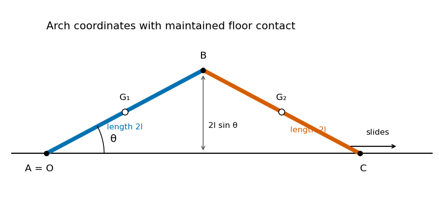

<h1 id="10b/b/solution">Solution</h1>

↑ **Parent:** [B](../b.md)

Use the arch geometry of [two hinged rods sliding on a floor](../../../../../../two-hinged-rods-sliding-on-a-floor.md), with $A=O=(0,0)$ and $C$ on the other side of $B$. As long as $C$ remains in contact with the floor,

$$
B=(2l\cos\theta,2l\sin\theta),\qquad
C=(4l\cos\theta,0).
$$

The [centres of mass](../../../../../../center-of-mass.md) of the two rods are $(l\cos\theta,l\sin\theta)$ and $(3l\cos\theta,l\sin\theta)$. Their squared [speeds](../../../../../../speed.md) are respectively $l^2\dot\theta^2$ and $l^2(9\sin^2\theta+\cos^2\theta)\dot\theta^2$. Each uniform rod has [moment of inertia](../../../../../../moment-of-inertia.md) $Ml^2/3$ about its midpoint, and their angular [velocities](../../../../../../velocity.md) are $\dot\theta$ and $-\dot\theta$. Applying the [kinetic energy decomposition about the center of mass](../../../../../../kinetic-energy-decomposition-about-the-center-of-mass.md) to each rod gives

$$
T=\frac M2l^2\dot\theta^2
+\frac M2l^2(9\sin^2\theta+\cos^2\theta)\dot\theta^2
+2\left(\frac12\frac{Ml^2}{3}\dot\theta^2\right)
=\frac43Ml^2(1+3\sin^2\theta)\dot\theta^2.
$$

The gravitational [potential energy](../../../../../../potential-energy.md) is $U=2Mgl\sin\theta$. The fixed pivot does no work; neither does the frictionless floor reaction while $C$ slides horizontally. [Conservation of energy](../../../../../../conservation-of-energy.md) from rest therefore gives

$$
\boxed{\dot\theta^2=\frac{3g}{2l}
\frac{\sin\alpha-\sin\theta}{1+3\sin^2\theta}.}
$$

On the falling branch $\dot\theta$ is the negative square root. Just before the hinge reaches the floor, $\theta=0$, and its [speed](../../../../../../speed.md) is $|\dot B|=2l|\dot\theta|$. Thus, under the maintained-contact interpretation,

$$
\boxed{v_B=\sqrt{6gl\sin\alpha}.}
$$

**[Figure 1](#10b/b/image-geometry-and-centers-of-mass-of-two-hinged-rods-sliding-on-a-floor). Geometry and centers of mass of two hinged rods sliding on a floor**.

There is a contact hypothesis behind this calculation. A floor can push upward but cannot pull downward. For $s=\sin\theta$ and $a=\sin\alpha$, the required normal reaction at $C$, found from the second rod's linear and angular equations, is

$$
\frac{N_C}{Mg}
=\frac{\tfrac14+\tfrac{33}4s^2+9s^4-\tfrac92as}
{(1+3s^2)^2}.
$$

For the usual acute arch, this stays nonnegative throughout $0\leq\theta\leq\alpha$ exactly when $\sin\alpha\leq35/54$. Indeed, for $s>0$, its nonnegativity is $a\leq 1/(18s)+11s/6+2s^3$, whose minimum is $35/54$ at $s=1/6$. For larger initial angles, the endpoint lifts before the hinge hits the floor, and the one-coordinate formula no longer governs the whole motion. **The displayed impact [speed](../../../../../../speed.md) is the intended floor-constrained answer; for unrestricted initial angles, maintained contact is an additional assumption.** Subsequent free motion and possible reimpact would require a different model and contact/impact conditions.

## ↑ Ancestors (11)

1. [B](../b.md)
2. [10B](../../10b.md)
3. [Paper 4](../../../paper-4-split.md)
4. [Ia](../../../split.md)
5. [2013](../../../../split.md)
6. [Past exam of the mathematics course of the University of Cambridge](../../../../../split.md)
7. [Mathematics course of the University of Cambridge](../../../../../../mathematics-course-of-the-university-of-cambridge.md)
8. [Course of the University of Cambridge](../../../../../../course-of-the-university-of-cambridge.md)
9. [University of Cambridge](../../../../../../university-of-cambridge-split.md)
10. [List of universities](../../../../../../list-of-universities.md)
11. [Codex Wiki](../../../../../../split.md)
