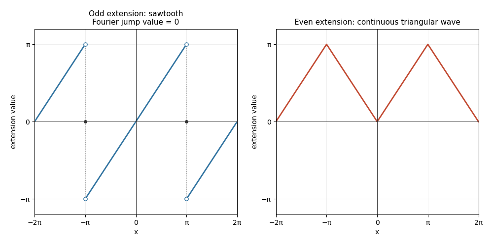

<h1 id="14b/i/solution">Solution</h1>

↑ **Parent:** [I](../i.md)

Integration by parts gives the [Fourier sine series](../../../../../../fourier-sine-series.md) coefficients

$$
b_n=\frac2\pi\int_0^\pi x\sin(nx)\,dx=\frac{2(-1)^{n+1}}n.
$$

Hence

$$
\boxed{x=2\sum_{n=1}^\infty\frac{(-1)^{n+1}}n\sin(nx),\qquad0<x<\pi.}
$$

The odd periodic extension is a sawtooth, equal to $x$ on $(-\pi,\pi)$ and repeated every $2\pi$; its jumps at odd multiples of $\pi$ have midpoint value zero in the Fourier series. In particular the sine series equals zero, rather than the specified endpoint value $\pi$, at $x=\pi$. The even periodic extension is the continuous triangular wave equal to $|x|$ on $[-\pi,\pi]$. Their sketches are below.

The [Parseval identity for a Hilbertian basis](../../../../../../parseval-identity-for-a-hilbertian-basis.md) for this sine expansion gives

$$
\frac2\pi\int_0^\pi x^2\,dx=\sum_{n\ge1}b_n^2
=4\sum_{n\ge1}\frac1{n^2},\qquad
\boxed{\sum_{n\ge1}n^{-2}=\pi^2/6.}
$$

**[Figure 2](#14b/i/image-odd-sawtooth-and-even-triangular-periodic-extensions-on-minus-two-pi-to-two-pi). Odd sawtooth and even triangular periodic extensions on minus two pi to two pi**.

## ↑ Ancestors (11)

1. [I](../i.md)
2. [14B](../../14b.md)
3. [Paper 1](../../../paper-1-split.md)
4. [Ib](../../../split.md)
5. [2013](../../../../split.md)
6. [Past exam of the mathematics course of the University of Cambridge](../../../../../split.md)
7. [Mathematics course of the University of Cambridge](../../../../../../mathematics-course-of-the-university-of-cambridge.md)
8. [Course of the University of Cambridge](../../../../../../course-of-the-university-of-cambridge.md)
9. [University of Cambridge](../../../../../../university-of-cambridge-split.md)
10. [List of universities](../../../../../../list-of-universities.md)
11. [Codex Wiki](../../../../../../split.md)
