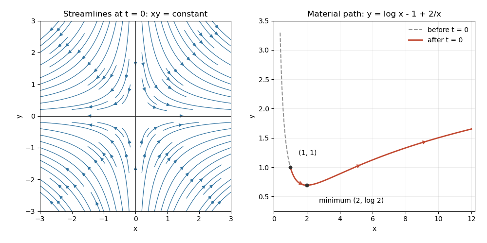

<h1 id="5a/solution">Solution</h1>

↑ **Parent:** [5A](../5a.md)

The divergence is $\partial_xu_x+\partial_yu_y=1-1=0$, while the scalar vorticity is $\partial_xu_y-\partial_yu_x=0$. The flow is therefore [incompressible flow](../../../../../incompressible-flow.md) and [irrotational flow](../../../../../irrotational-flow.md). Integrating the [streamfunction](../../../../../stream-function.md) equations gives

$$
\boxed{\psi(x,y,t)=x(y-t)+C(t).}
$$

The time dependence must be retained: no time-independent function $\psi(x,y)$ represents this unsteady field for every $t$. At $t=0$ the [streamlines](../../../../../streamline.md) are $xy=\mathrm{constant}$, with the coordinate axes as separatrices. Their arrows point towards increasing $|x|$ and decreasing $|y|$, as shown below.

A [pathline](../../../../../pathline.md) solves the material ODEs, giving

$$
x(t)=x_0e^t,\qquad y(t)=t-1+(y_0+1)e^{-t}.
$$

For $x_0\ne0$, elimination of time yields

$$
\boxed{y=\log(x/x_0)-1+(y_0+1)\frac{x_0}{x},\qquad x/x_0>0.}
$$

If $x_0=0$, the [pathline](../../../../../pathline.md) stays on the $y$ axis and the parametric expression remains valid; it cannot in general be written as a single-valued $y=f(x)$ along that vertical trajectory. For $x_0=y_0=1$, the path is $y=\log x-1+2/x$: it initially descends, reaches its minimum $(2,\log2)$, then rises. Unlike a frozen [streamline](../../../../../streamline.md), it records the time-varying flow.

**[Figure 1](#5a/image-frozen-saddle-streamlines-at-time-zero-and-the-material-path-through-1-1). Frozen saddle streamlines at time zero and the material path through (1,1)**

## ↑ Ancestors (10)

1. [5A](../5a.md)
2. [Paper 1](../../paper-1-split.md)
3. [Ib](../../split.md)
4. [2013](../../../split.md)
5. [Past exam of the mathematics course of the University of Cambridge](../../../../split.md)
6. [Mathematics course of the University of Cambridge](../../../../../mathematics-course-of-the-university-of-cambridge.md)
7. [Course of the University of Cambridge](../../../../../course-of-the-university-of-cambridge.md)
8. [University of Cambridge](../../../../../university-of-cambridge-split.md)
9. [List of universities](../../../../../list-of-universities.md)
10. [Codex Wiki](../../../../../split.md)
