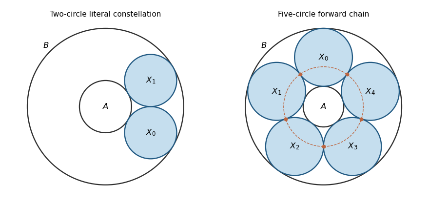

<h1 id="14f/solution">Solution</h1>

↑ **Parent:** [14F](../14f.md)

First normalize the two [circles](../../../../../circle.md) by translation and rotation so their centres are $0,d$ and radii $a,b$. If $d=0$ nothing further is needed. Otherwise choose real $s,t$ satisfying

$$
st=a^2,\qquad s+t=\frac{d^2+a^2-b^2}{d}.
$$

The discriminant of this quadratic is

$$
\frac{(d^2-(a+b)^2)(d^2-(a-b)^2)}{d^2}>0,
$$

since two disjoint [circle](../../../../../circle.md) boundaries are either externally separated or strictly nested. Thus $s\ne t$, and $M(z)=(z-s)/(z-t)$ is a [Möbius transformation](../../../../../mobius-transformation.md). Direct expansion shows that on the first [circle](../../../../../circle.md) $|M(z)|^2=s/t$, and on the second $|M(z)|^2=(s-d)/(t-d)$. Both constants are positive; the pole is on neither [circle](../../../../../circle.md). Their images are distinct concentric [circles](../../../../../circle.md). This proves the [concentric normalization of disjoint circles](../../../../../concentric-normalization-of-disjoint-circles.md).

For a construction with $n\geq3$, use inner radius $\rho=1$, outer radius

$$
R=\frac{1+\sin(\pi/n)}{1-\sin(\pi/n)},\qquad r=\frac{R-1}{2},\qquad d=\frac{R+1}{2},
$$

and small [circles](../../../../../circle.md) of radius $r$ centred at $d e^{2\pi ij/n}$. Each touches the two boundaries, and adjacent centre distances are $2d\sin(\pi/n)=2r$. All other distances are at least $2r$, so there are no unwanted intersections. These are [Steiner chains](../../../../../steiner-chain.md). For the literal $n=2$ requirement, take $\rho=1$, $R=3$, and two radius-one [circles](../../../../../circle.md) centred at $2e^{\pm i\pi/6}$. Their centre distance is $2$, so this gives two distinct mutually tangent [circles](../../../../../circle.md) touching both boundaries. **Existence holds for every $n\geq2$**, but the two-[circle](../../../../../circle.md) case has only one tangency between neighbours, repeated by the cyclic indexing.

**[Figure 1](#14f/image-two-mutually-tangent-circles-and-a-five-circle-steiner-chain-between-concentric-boundaries). Two mutually tangent circles and a five-circle Steiner chain between concentric boundaries**.

For an annular [circle](../../../../../circle.md) touching radii $\rho,R$, its radius and centre distance are $r=(R-\rho)/2$ and $d=(R+\rho)/2$. Two neighbouring such [circles](../../../../../circle.md) have angular separation $\delta=2\arcsin(r/d)$; their tangency point is the midpoint of their centres. Its distance from the common centre is

$$
d\cos(\delta/2)=\sqrt{d^2-r^2}=\sqrt{R\rho}.
$$

Thus **the tangency locus in concentric coordinates is a [circle](../../../../../circle.md) of radius $\sqrt{R\rho}$**. For $n\geq3$, disjointness forces the constellation to use these annular [circles](../../../../../circle.md). Indeed, the other family of [circles](../../../../../circle.md) touching both boundaries has radius $d$ and centre distance $r$, enclosing the inner boundary. Two members of that larger family intersect. One such [circle](../../../../../circle.md) can be disjoint from an annular [circle](../../../../../circle.md) only at the two opposite centre directions where their boundaries are tangent; those two annular [circles](../../../../../circle.md) cannot be tangent to each other. Hence this family cannot occur in a constellation of three or more [circles](../../../../../circle.md).

Under the inverse [Möbius transformation](../../../../../mobius-transformation.md), the tangency locus is a [generalized circle](../../../../../generalized-circle-under-a-mobius-transformation.md), which can be an ordinary [circle](../../../../../circle.md) or a straight line. **The printed claim that it is always an ordinary [circle](../../../../../circle.md) is false without this qualification.** For an explicit counterexample, use the above $n=3$ construction, put $L=\sqrt R$, and apply $w=1/(z-L)$. Its pole lies on the tangency locus but on none of the original boundary or chain [circles](../../../../../circle.md). Consequently all the transformed individual [circles](../../../../../circle.md) remain ordinary [circles](../../../../../circle.md). The three distinct tangency points transform to three points on the line $\operatorname{Re}w=-1/(2L)$, so they cannot lie on an ordinary [circle](../../../../../circle.md).

The usual closure assertion is [Steiner's porism](../../../../../steiner-porism.md), with two essential conventions: stay in the annular family and always choose the next tangent [circle](../../../../../circle.md) in the same angular direction. For a disjoint closed chain with $n\geq3$, distinctness prevents reversing direction: a reversed step would return immediately to the preceding [circle](../../../../../circle.md). Thus every step has the same sign and closure gives $n\delta=2\pi m$ for an integer $m\geq1$. If $m>1$, the $n$ distinct centres have some angular gap $2\pi/n<\delta$, making two [circles](../../../../../circle.md) intersect. Hence $m=1$ and $\delta=2\pi/n$. Starting at any new angle $\theta_0$ produces centres $de^{i(\theta_0+j\delta)}$, a rotation of the original chain, so

$$
\boxed{Y_n=Y_0\quad\text{for the consistently directed annular chain}.}
$$

Mapping back proves the same porism on the corresponding branch of [circles](../../../../../circle.md) for the original pair.

The literal final request, with arbitrary tangent choices and $n=2$ included, is stronger and false. In the two-[circle](../../../../../circle.md) example above, the forward angular step is $\pi/3$. Starting at angle $0$, a next [circle](../../../../../circle.md) at $\pi/3$ and then one at $2\pi/3$ satisfy every inductive tangency requirement, but $Y_2\ne Y_0$. Even for $n\geq3$, allowing backtracking lets the construction reverse instead of completing the chain. Thus the genuine geometric conclusion is the qualified porism, not unrestricted closure under the printed induction.

## ↑ Ancestors (10)

1. [14F](../14f.md)
2. [Paper 2](../../paper-2-split.md)
3. [Ib](../../split.md)
4. [2013](../../../split.md)
5. [Past exam of the mathematics course of the University of Cambridge](../../../../split.md)
6. [Mathematics course of the University of Cambridge](../../../../../mathematics-course-of-the-university-of-cambridge.md)
7. [Course of the University of Cambridge](../../../../../course-of-the-university-of-cambridge.md)
8. [University of Cambridge](../../../../../university-of-cambridge-split.md)
9. [List of universities](../../../../../list-of-universities.md)
10. [Codex Wiki](../../../../../split.md)
