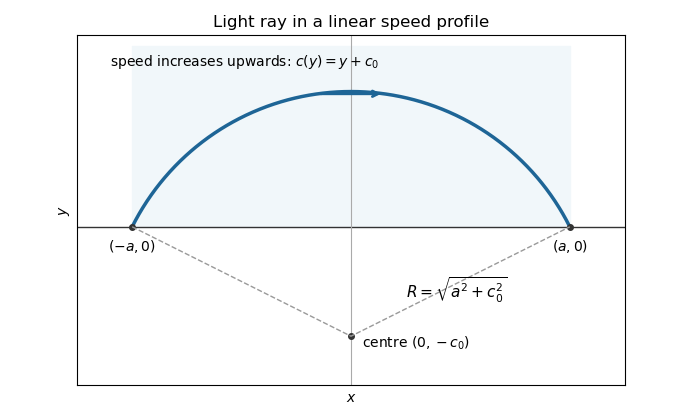

<h1 id="15a/solution">Solution</h1>

↑ **Parent:** [15A](../15a.md)

The [Euler-Lagrange equation](../../../../../euler-lagrange-equation.md) is $f_y-d(f_{y'})/dx=0$. Since $f$ has no explicit $x$ dependence,

$$
\frac d{dx}(f-y'f_{y'})=y'\left(f_y-\frac d{dx}f_{y'}\right)=0.
$$

Thus a stationary curve satisfies the [Beltrami identity](../../../../../beltrami-identity.md), $f-y'f_{y'}=C$.

By [Fermat principle](../../../../../fermat-principle.md), the [light ray](../../../../../light-ray.md) makes the travel time $\int\sqrt{1+y'^2}/(y+c_0)\,dx$ stationary. Its [Beltrami identity](../../../../../beltrami-identity.md) becomes

$$
\frac1{(y+c_0)\sqrt{1+y'^2}}=C>0.
$$

Writing $R=1/C$ and integrating the resulting first-order equation gives $(x-x_0)^2+(y+c_0)^2=R^2$. Both endpoints have height zero, so subtracting their equations gives $x_0=0$, and then $R^2=a^2+c_0^2$. The arc lying in $y>0$ is

$$
\boxed{y(x)=\sqrt{a^2+c_0^2-x^2}-c_0,\qquad -a\leq x\leq a.}
$$

Its maximum height is $\sqrt{a^2+c_0^2}-c_0$. The ray rises into the faster region before returning to the boundary; its [circle](../../../../../circle.md) centre is $(0,-c_0)$. The prescribed boundary endpoints are understood by continuity from the open half-plane. This is the [circular light ray in a linear speed profile](../../../../../circular-light-ray-in-a-linear-speed-profile.md).

**[Figure 2](#15a/image-circular-light-ray-arching-into-a-region-where-propagation-speed-increases-with-height). Circular light ray arching into a region where propagation speed increases with height**.

## ↑ Ancestors (10)

1. [15A](../15a.md)
2. [Paper 2](../../paper-2-split.md)
3. [Ib](../../split.md)
4. [2013](../../../split.md)
5. [Past exam of the mathematics course of the University of Cambridge](../../../../split.md)
6. [Mathematics course of the University of Cambridge](../../../../../mathematics-course-of-the-university-of-cambridge.md)
7. [Course of the University of Cambridge](../../../../../course-of-the-university-of-cambridge.md)
8. [University of Cambridge](../../../../../university-of-cambridge-split.md)
9. [List of universities](../../../../../list-of-universities.md)
10. [Codex Wiki](../../../../../split.md)
