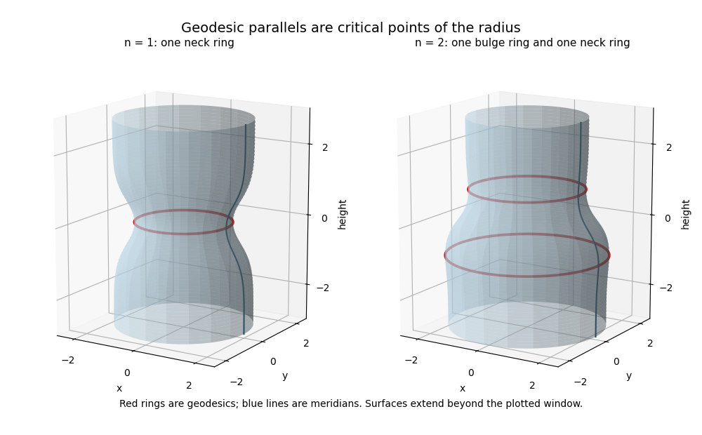

<h1 id="15f/solution">Solution</h1>

↑ **Parent:** [15F](../15f.md)

Parametrize the [surface of revolution](../../../../../surface-of-revolution.md) by $X(s,\theta)=(f(s)\cos\theta,f(s)\sin\theta,g(s))$. The coordinate tangent vectors have squared lengths $f'^2+g'^2=1$ and $f^2$, and inner product zero. Thus the [first fundamental form of an arc-length surface of revolution](../../../../../first-fundamental-form-of-an-arc-length-surface-of-revolution.md) is **$I=ds^2+f(s)^2d\theta^2$**.

For an arc-length parameter $t$, the [geodesic equations](../../../../../geodesic-equation.md) are

$$
\boxed{\ddot s-ff'\dot\theta^2=0,\qquad \ddot\theta+2\frac{f'}f\dot s\dot\theta=0,\qquad \dot s^2+f^2\dot\theta^2=1.}
$$

These follow either from the metric's [Christoffel symbols](../../../../../christoffel-symbol.md) or from the [Euler-Lagrange equation](../../../../../euler-lagrange-equation.md) for $\tfrac12(\dot s^2+f^2\dot\theta^2)$. On a parallel $s=s_0$, unit speed requires $\dot\theta=\pm1/f(s_0)$; the first [geodesic equation](../../../../../geodesic-equation.md) then holds exactly when $f'(s_0)=0$. Thus [geodesic parallels of a surface of revolution](../../../../../geodesic-parallels-of-a-surface-of-revolution.md) are precisely the critical points of the radius function.

To obtain any prescribed positive integer $n$, set

$$
H(s)=e^{-s^2}\prod_{j=1}^n(s-j),\qquad f(s)=R+\varepsilon\int_0^sH(t)\,dt,\qquad g(s)=\int_0^s\sqrt{1-f'(t)^2}\,dt.
$$

The function $H$ is bounded and integrable. Choose $\varepsilon>0$ so $\varepsilon\sup|H|<1$, and choose $R>\varepsilon\int_{\mathbb R}|H|$. Then $f>0$, $g$ is smooth, and $f'^2+g'^2=1$. The derivative $f'=\varepsilon H$ vanishes at exactly $1,\ldots,n$. Also $g'>0$, so different meridian parameters give different heights. **The resulting surface has exactly $n$ geodesic parallels.**

For explicit sketches, use the following two radius functions, again with $g'=\sqrt{1-f'^2}$:

$$
\begin{aligned}
f_1(s)&=2-0.6e^{-s^2},\\
f_2(s)&=2+0.6\left(-\frac12se^{-s^2}-\frac{\sqrt\pi}{4}\operatorname{erf}(s)\right).
\end{aligned}
$$

Here $f_1'=1.2se^{-s^2}$ has only the zero $0$, while $f_2'=0.6(s^2-1)e^{-s^2}$ has exactly the zeros $-1,1$. Both radii stay positive and both derivatives have absolute value below one. The highlighted rings are the geodesic parallels; the surfaces continue beyond the displayed window.

**[Figure 1](#15f/image-surfaces-of-revolution-with-exactly-one-and-exactly-two-geodesic-parallels). Surfaces of revolution with exactly one and exactly two geodesic parallels**.

If every parallel is a [geodesic](../../../../../geodesic.md), then $f'=0$ everywhere, so $f=R$ is a positive constant. The arc-length condition gives $g'^2=1$; smoothness forces a constant sign, hence $g(s)=\pm s+c$. **The surface is a circular cylinder of radius $R$.** It is a [circular cylinder](../../../../../circular-cylinder.md) because the meridian is a straight line parallel to the axis.

## ↑ Ancestors (10)

1. [15F](../15f.md)
2. [Paper 4](../../paper-4-split.md)
3. [Ib](../../split.md)
4. [2013](../../../split.md)
5. [Past exam of the mathematics course of the University of Cambridge](../../../../split.md)
6. [Mathematics course of the University of Cambridge](../../../../../mathematics-course-of-the-university-of-cambridge.md)
7. [Course of the University of Cambridge](../../../../../course-of-the-university-of-cambridge.md)
8. [University of Cambridge](../../../../../university-of-cambridge-split.md)
9. [List of universities](../../../../../list-of-universities.md)
10. [Codex Wiki](../../../../../split.md)
