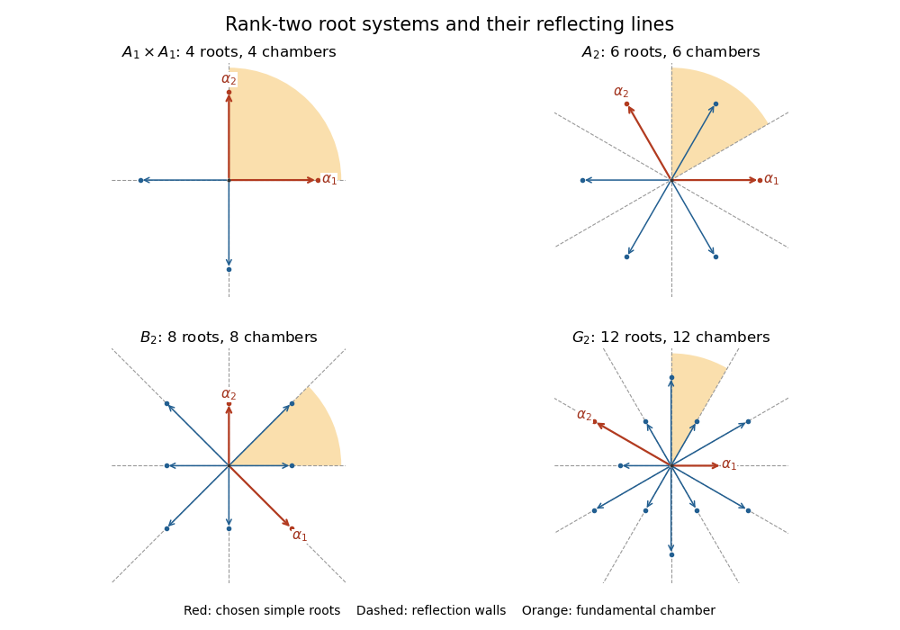

# Paper 1

↑ **Parent:** [Iii](../iii.md)

[https://www.maths.cam.ac.uk/postgrad/part-iii/files/pastpapers/2013/paper_1.pdf](https://www.maths.cam.ac.uk/postgrad/part-iii/files/pastpapers/2013/paper_1.pdf)

**Table of contents**

- [1](#1)
  - [Solution](#1/solution)
- [2](#2)
  - [Solution](#2/solution)
- [3](#3)
  - [Solution](#3/solution)
- [4](#4)
  - [Solution](#4/solution)
- [5](#5)
  - [Solution](#5/solution)
- [6](#6)
  - [Solution](#6/solution)

## 1

↑ **Parent:** [Paper 1](paper-1.md)

<h3 id="1/solution">Solution</h3>

↑ **Parent:** [1](#1)

The [endomorphisms](../../../algebra.md#endomorphism) of the [finite-dimensional vector space](../../../vector-space.md#finite-dimensional-vector-space) $V$ over the [complex numbers](../../../complex-analysis.md#complex-number) form the [general linear Lie algebra](../../../lie-algebra.md#general-linear-lie-algebra) $L=\operatorname{End}_{\mathbb C}(V)$ with the usual addition and scalar multiplication and [Lie bracket](../../../lie-algebra.md#lie-bracket) $[x,y]=xy-yx$. This [commutator](../../../lie-algebra.md#commutator) is bilinear and antisymmetric, and expanding the six products verifies the [Jacobi identity](../../../lie-algebra.md#jacobi-identity).

For a [Lie subalgebra](../../../lie-algebra.md#lie-subalgebra) $\mathfrak g=L_1$, being an [abelian Lie algebra](../../../lie-algebra.md#abelian-lie-algebra) means $[\mathfrak g,\mathfrak g]=0$. A [nilpotent Lie algebra](../../../lie-algebra.md#nilpotent-lie-algebra) has $\gamma_1=\mathfrak g$, $\gamma_{j+1}=[\mathfrak g,\gamma_j]$ eventually zero; a [solvable Lie algebra](../../../lie-algebra.md#solvable-lie-algebra) has $\mathfrak g^{(0)}=\mathfrak g$, $\mathfrak g^{(j+1)}=[\mathfrak g^{(j)},\mathfrak g^{(j)}]$ eventually zero. These are the [lower central series of a Lie algebra](../../../lie-algebra.md#lower-central-series-of-a-lie-algebra) and [derived series of a Lie algebra](../../../lie-algebra.md#derived-series-of-a-lie-algebra), respectively. Nilpotence is a condition on the [Lie bracket](../../../lie-algebra.md#lie-bracket), and does not require every member to be a [nilpotent endomorphism](../../../linear-operator-theory.md#nilpotent-linear-map): a nonzero scalar multiple of the identity spans an [abelian Lie algebra](../../../lie-algebra.md#abelian-lie-algebra).

A [flag of a vector space](../../../vector-space.md#flag-linear-algebra) is an increasing chain of [vector subspaces](../../../vector-space.md#vector-subspace). The flag we construct is a [complete flag](../../../vector-space.md#complete-flag), $0=V_0\subset V_1\subset\cdots\subset V_d=V$, where $\dim V_i=i$, and each $V_i$ is an [invariant subspace](../../../representation-theory.md#invariant-subspace) for $\mathfrak g$. We first prove the common-[eigenvector](../../../linear-operator-theory.md#eigenvector) assertion in the [Lie theorem](../../../lie-algebra.md#lie-s-theorem), by induction on $\dim\mathfrak g$; the zero algebra is immediate. For nonzero solvable $\mathfrak g$, its [derived algebra](../../../lie-algebra.md#derived-algebra) is proper, so there is a codimension-one [ideal of a Lie algebra](../../../lie-algebra.md#ideal-of-a-lie-algebra) $\mathfrak k$ containing $[\mathfrak g,\mathfrak g]$. Write $\mathfrak g=\mathfrak k\oplus\mathbb Cx$. By induction there are $v\ne0$ and a [linear functional](../../../linear-algebra.md#linear-functional) $\lambda$ on $\mathfrak k$ such that $kv=\lambda(k)v$ for every $k\in\mathfrak k$.

Let $W$ be the [cyclic subspace](../../../linear-operator-theory.md#cyclic-subspace) spanned by $v,xv,x^2v,\ldots$. The [commutator derivation identity](../../../lie-algebra.md#commutator-derivation-identity) and $[\mathfrak k,x]\subseteq\mathfrak k$ show inductively that

$$
kx^jv\equiv\lambda(k)x^jv\pmod{\operatorname{span}\{v,xv,\ldots,x^{j-1}v\}}.
$$

Thus $W$ and all its initial cyclic spans are $\mathfrak k$-invariant. If $m=\dim W$, the first $m$ cyclic vectors form a [basis](../../../vector-space.md#basis), $W$ is also $x$-invariant, and $\operatorname{tr}_W k=m\lambda(k)$. For $k\in\mathfrak k$, the [trace of a matrix commutator](../../../lie-algebra.md#trace-of-a-matrix-commutator) gives

$$
0=\operatorname{tr}_W[k,x]=m\lambda([k,x]).
$$

Hence $\lambda([k,x])=0$, since the field has [characteristic zero](../../../algebra.md#characteristic-zero). The nonzero common [weight space](../../../semisimple-lie-algebra.md#weight-space)

$$
V_\lambda=\{w\in V:kw=\lambda(k)w\text{ for all }k\in\mathfrak k\}
$$

is $x$-invariant: $k(xw)=x(kw)+[k,x]w=\lambda(k)xw$. The restriction of $x$ to $V_\lambda$ has an [eigenvector](../../../linear-operator-theory.md#eigenvector), because $\mathbb C$ is an [algebraically closed field](../../../algebra.md#algebraically-closed-field). This is a common [eigenvector](../../../linear-operator-theory.md#eigenvector) for $\mathfrak g$. Its line is invariant, and repeating the argument on the [quotient vector space](../../../vector-space.md#quotient-vector-space) gives the complete invariant flag. Equivalently, this proves [simultaneous triangularization of a Lie algebra representation](../../../lie-algebra.md#simultaneous-triangularization-of-a-lie-algebra-representation).

In a [basis](../../../vector-space.md#basis) adapted to this [complete flag](../../../vector-space.md#complete-flag), every member of $\mathfrak g$ is upper triangular, so every member of its [derived algebra](../../../lie-algebra.md#derived-algebra) is strictly upper triangular. Products of $d$ [strictly upper triangular matrices](../../../linear-algebra.md#strictly-upper-triangular-matrix) vanish, and each iterated [Lie bracket](../../../lie-algebra.md#lie-bracket) of $d$ such matrices is a sum of these products. Consequently the [derived algebra](../../../lie-algebra.md#derived-algebra) is a [nilpotent Lie algebra](../../../lie-algebra.md#nilpotent-lie-algebra). We may therefore take **$L_2=[L_1,L_1]$**: it is an ideal, and the [quotient Lie algebra](../../../lie-algebra.md#quotient-lie-algebra) $L_1/L_2$ is abelian. This also covers $\dim V=0$.

## 2

↑ **Parent:** [Paper 1](paper-1.md)

<h3 id="2/solution">Solution</h3>

↑ **Parent:** [2](#2)

A [linear map](../../../vector-space.md#linear-map) $\alpha$ is a [nilpotent endomorphism](../../../linear-operator-theory.md#nilpotent-linear-map) if $\alpha^q=0$ for some positive integer $q$, and a [semisimple endomorphism](../../../linear-operator-theory.md#diagonalizable-matrix) if it is [diagonalizable](../../../linear-operator-theory.md#diagonalizable-matrix) over $\mathbb C$. Decompose $V$ into its [generalized eigenspaces](../../../linear-operator-theory.md#generalized-eigenspace) $V_\lambda=\ker(\alpha-\lambda I)^d$, where $d=\dim V$. Define $\alpha_s$ on $V_\lambda$ to be $\lambda I$, and set $\alpha_n=\alpha-\alpha_s$. Then $\alpha_s$ is diagonalizable, $\alpha_n$ is nilpotent, and both preserve these [vector subspaces](../../../vector-space.md#vector-subspace) and commute. Thus

$$
\boxed{\alpha=\alpha_s+\alpha_n,\qquad[\alpha_s,\alpha_n]=0.}
$$

For uniqueness, suppose $\alpha=S+N$ with $S$ semisimple, $N$ nilpotent and $SN=NS$. Both commute with $\alpha$, so preserve each $V_\lambda$. On an [eigenspace](../../../linear-operator-theory.md#eigenspace) of $S$ of [eigenvalue](../../../linear-operator-theory.md#eigenvalue) $\mu$ inside $V_\lambda$, the map $\alpha$ is $\mu I+N$ and has only the [eigenvalue](../../../linear-operator-theory.md#eigenvalue) $\mu$. Since the same subspace lies in $V_\lambda$, $\mu=\lambda$. Hence $S=\lambda I$ on $V_\lambda$, proving $S=\alpha_s$ and $N=\alpha_n$. This is the additive [Jordan–Chevalley decomposition](../../../linear-operator-theory.md#jordan-chevalley-decomposition).

We need a polynomial consequence of this decomposition. [Hermite interpolation](../../../algebra.md#hermite-interpolation) supplies a [polynomial](../../../polynomial.md) $p$ with $p(\alpha)=\alpha_s$, by prescribing $p(t)\equiv\lambda\pmod{(t-\lambda)^d}$ for each [eigenvalue](../../../linear-operator-theory.md#eigenvalue). For any endomorphism $T$, its semisimple part can likewise be expressed as a [polynomial](../../../polynomial.md) in $T$ with zero constant term: if zero is an [eigenvalue](../../../linear-operator-theory.md#eigenvalue), its interpolation condition already forces this; if not, add the independent condition $p(0)=0$.

On $\operatorname{End}(V)$, the maps $\operatorname{ad}\alpha_s$ and $\operatorname{ad}\alpha_n$ commute. The first is diagonalizable, with [eigenvalues](../../../linear-operator-theory.md#eigenvalue) $\lambda-\mu$ on $\operatorname{Hom}(V_\mu,V_\lambda)$. The second is nilpotent, since

$$
(\operatorname{ad}N)^k(T)=\sum_{j=0}^k(-1)^j\binom kj N^{k-j}TN^j,
$$

which vanishes for $k\ge2q-1$ when $N^q=0$. Uniqueness therefore proves [adjoint compatibility of additive Jordan decomposition](../../../linear-operator-theory.md#adjoint-compatibility-of-additive-jordan-decomposition): $\operatorname{ad}\alpha_s=(\operatorname{ad}\alpha)_s$.

Now assume $\alpha\in M$. The condition $[\alpha,W]\subseteq U\subseteq W$ implies that both $W$ and $U$ are invariant under $\operatorname{ad}\alpha$, and every [polynomial](../../../polynomial.md) in $\operatorname{ad}\alpha$ with zero constant term maps $W$ into $U$. Define $\beta$ to be multiplication by $\overline\lambda$ on $V_\lambda$. It commutes with $\alpha$. On $\operatorname{Hom}(V_\mu,V_\lambda)$, $\operatorname{ad}\beta$ acts by $\overline{\lambda-\mu}$. [Polynomial interpolation](../../../numerical-analysis.md#polynomial-interpolation) on the finite set of differences gives $\operatorname{ad}\beta=q(\operatorname{ad}\alpha_s)$ with $q(0)=0$. The preceding paragraph then expresses $\operatorname{ad}\beta$ as a [polynomial](../../../polynomial.md) in $\operatorname{ad}\alpha$ with zero constant term. Consequently $[\beta,W]\subseteq U$, so $\beta\in M$.

The assumed [trace orthogonality nilpotence lemma](../../../linear-algebra.md#trace-orthogonality-nilpotence-lemma) now follows directly. On $V_\lambda$, $\alpha=\lambda I+\alpha_n$ and $\beta=\overline\lambda I$, while the [matrix trace](../../../linear-algebra.md#matrix-trace) of the nilpotent restriction of $\alpha_n$ is zero. Hence

$$
0=\operatorname{tr}(\alpha\beta)=\sum_\lambda\dim(V_\lambda)|\lambda|^2.
$$

Every summand is nonnegative, so every [eigenvalue](../../../linear-operator-theory.md#eigenvalue) of $\alpha$ is zero. Its [Jordan–Chevalley decomposition](../../../linear-operator-theory.md#jordan-chevalley-decomposition) therefore has $\alpha_s=0$, and **$\alpha$ is nilpotent**. Notice that neither $U$ nor $W$ was required to be a Lie subalgebra.

## 3

↑ **Parent:** [Paper 1](paper-1.md)

<h3 id="3/solution">Solution</h3>

↑ **Parent:** [3](#3)

A finite-dimensional [Lie algebra](../../../lie-algebra.md) over the [complex numbers](../../../complex-analysis.md#complex-number) $L$ is a [semisimple Lie algebra](../../../semisimple-lie-algebra.md) when its [solvable radical](../../../lie-algebra.md#radical-of-a-lie-algebra) is zero, equivalently when it has no nonzero solvable ideals. Its [Killing form](../../../lie-algebra.md#killing-form) is

$$
B_L(x,y)=\operatorname{tr}_L(\operatorname{ad}x\operatorname{ad}y).
$$

The [cyclic property of the trace](../../../linear-algebra.md#cyclic-property-of-the-trace) makes this [bilinear form](../../../linear-algebra.md#bilinear-form) symmetric and gives its [invariance of a bilinear form on a Lie algebra](../../../lie-algebra.md#invariance-of-a-bilinear-form-on-a-lie-algebra):

$$
B_L([x,y],z)=B_L(x,[y,z]).
$$

It follows that $R=\{x:B_L(x,L)=0\}$ is an [ideal of a Lie algebra](../../../lie-algebra.md#ideal-of-a-lie-algebra). For $x\in R$, $\operatorname{ad}x$ induces the zero map on $L/R$. Therefore, for $x,y\in R$, the [matrix trace](../../../linear-algebra.md#matrix-trace) splits over the invariant subspace $R$ and the quotient to give $B_R(x,y)=B_L(x,y)=0$. In particular $B_R([R,R],R)=0$. The [Cartan solvability criterion](../../../lie-algebra.md#cartan-solvability-criterion) implies that $R$ is solvable. Since $L$ is semisimple, $R=0$: **the Killing form is nondegenerate**.

For completeness, the trace step in the [Cartan solvability criterion](../../../lie-algebra.md#cartan-solvability-criterion) is precisely the mechanism of the previous solution. For a complex matrix [Lie algebra](../../../lie-algebra.md) $\mathfrak a$ with $\operatorname{tr}(xy)=0$ for $x\in[\mathfrak a,\mathfrak a]$, $y\in\mathfrak a$, set $U=[\mathfrak a,\mathfrak a]$ and $W=\mathfrak a$. If $\beta\in M$ and $x=[a,b]$, then $\operatorname{tr}(x\beta)=\operatorname{tr}(a[b,\beta])=0$, since $[b,\beta]\in U$. Linearity and the [trace orthogonality nilpotence lemma](../../../linear-algebra.md#trace-orthogonality-nilpotence-lemma) show that every member of $U$ is nilpotent. The [Engel theorem](../../../lie-algebra.md#engel-s-theorem) makes $U$ nilpotent and hence $\mathfrak a$ solvable. Apply this to $\mathfrak a=\operatorname{ad}R$; the kernel of this [Adjoint representation of a Lie algebra](../../../lie-algebra.md#adjoint-representation-of-a-lie-algebra) is the abelian center of $R$, so $R$ is solvable as claimed.

For an arbitrary complex [Lie algebra](../../../lie-algebra.md), a [Cartan subalgebra](../../../semisimple-lie-algebra.md#cartan-subalgebra) $H$ means a [nilpotent Lie algebra](../../../lie-algebra.md#nilpotent-lie-algebra) that is self-normalizing: $N_L(H)=\{x:[x,H]\subseteq H\}=H$. This definition does not assume that $H$ is abelian. We prove that it is abelian when $L$ is semisimple.

Use the [generalized-weight decomposition for a nilpotent Lie algebra](../../../semisimple-lie-algebra.md#generalized-weight-decomposition-for-a-nilpotent-lie-algebra) for the action of $H$ on $L$. Its zero generalized [weight space](../../../semisimple-lie-algebra.md#weight-space) is

$$
L^0=\{x:(\operatorname{ad}h)^{\dim L}x=0\text{ for every }h\in H\}.
$$

We have $H\subseteq L^0$, since $H$ is nilpotent. If $L^0/H\ne0$, the [Engel theorem](../../../lie-algebra.md#engel-s-theorem) gives a nonzero coset annihilated by every $h\in H$. Its representative $x$ satisfies $[H,x]\subseteq H$, contradicting $N_L(H)=H$. Thus $L^0=H$.

For a nonzero generalized [weight](../../../semisimple-lie-algebra.md#weight-representation-theory) $\lambda$, choose $h_0\in H$ with $\lambda(h_0)\ne0$. The operator $\operatorname{ad}h_0$ is invertible on $L^\lambda$ and nilpotent on $H$. For $h\in H$, $z\in L^\lambda$, write $z=(\operatorname{ad}h_0)^m w$ with $m$ large enough that $(\operatorname{ad}h_0)^m h=0$. Invariance of the [Killing form](../../../lie-algebra.md#killing-form) gives

$$
B_L(h,z)=(-1)^mB_L((\operatorname{ad}h_0)^m h,w)=0.
$$

On the other hand, $H$ is solvable, so the [Lie theorem](../../../lie-algebra.md#lie-s-theorem) triangularizes its action on $L$. For $a,b,h\in H$, the matrix $\operatorname{ad}[a,b]$ is strictly upper triangular, while $\operatorname{ad}h$ is upper triangular. Thus $B_L([H,H],H)=0$. Together with $L=H\oplus\bigoplus_{\lambda\ne0}L^\lambda$, this yields $B_L([H,H],L)=0$. Nondegeneracy gives $[H,H]=0$.

Finally, if $x$ commutes with $H$, it normalizes $H$, hence lies in $H$. Any abelian subalgebra containing $H$ consists of such elements. Thus **$H$ is a maximal abelian subalgebra**, indeed $C_L(H)=H$.

## 4

↑ **Parent:** [Paper 1](paper-1.md)

<h3 id="4/solution">Solution</h3>

↑ **Parent:** [4](#4)

Here a [reduced root system](../../../semisimple-lie-algebra.md#reduced-root-system) is crystallographic, as appropriate to a [semisimple Lie algebra](../../../semisimple-lie-algebra.md). It is a finite spanning set $\Phi\subset E\setminus\{0\}$ in a real [inner product space](../../../linear-algebra.md#inner-product-space) of dimension $r$, invariant under each [Weyl reflection](../../../semisimple-lie-algebra.md#weyl-reflection)

$$
s_\alpha(x)=x-\frac{2(x,\alpha)}{(\alpha,\alpha)}\alpha,
$$

with $2(\beta,\alpha)/(\alpha,\alpha)\in\mathbb Z$ for every pair of roots and $\Phi\cap\mathbb R\alpha=\{\alpha,-\alpha\}$. A [base of a root system](../../../semisimple-lie-algebra.md#fundamental-system-of-a-root-system) $\Delta=(\alpha_1,\ldots,\alpha_r)$ is a [basis](../../../vector-space.md#basis) such that the coefficients of every root are integers that are either all nonnegative or all nonpositive. These define the [positive system of a root system](../../../semisimple-lie-algebra.md#positive-system-of-a-root-system). We use the existing [Cartan matrix](../../../semisimple-lie-algebra.md#cartan-matrix) convention

$$
A_{ij}=\langle\alpha_i,\alpha_j^\vee\rangle=\frac{2(\alpha_i,\alpha_j)}{(\alpha_j,\alpha_j)}.
$$

Using the alternative denominator $(\alpha_i,\alpha_i)$ transposes all the matrices below.

The [classification of rank-two root systems](../../../semisimple-lie-algebra.md#classification-of-rank-two-root-systems) gives **$A_1\times A_1$, $A_2$, $B_2=C_2$, and $G_2$**. In orthonormal coordinates we may choose the following [simple roots](../../../semisimple-lie-algebra.md#simple-root) and [Cartan matrices](../../../semisimple-lie-algebra.md#cartan-matrix):

- For $A_1\times A_1$, take $\alpha_1=(1,0)$, $\alpha_2=(0,1)$ and $A=\begin{pmatrix}2&0\\0&2\end{pmatrix}$. The positive roots are $\alpha_1,\alpha_2$.
- For $A_2$, take $\alpha_1=(1,0)$, $\alpha_2=(-1/2,\sqrt3/2)$ and $A=\begin{pmatrix}2&-1\\-1&2\end{pmatrix}$. The positive roots are $\alpha_1,\alpha_2,\alpha_1+\alpha_2$.
- For $B_2$, take the long root $\alpha_1=(1,-1)$ and short root $\alpha_2=(0,1)$, giving $A=\begin{pmatrix}2&-2\\-1&2\end{pmatrix}$. The positive roots are $\alpha_1,\alpha_2,\alpha_1+\alpha_2,\alpha_1+2\alpha_2$. Interchanging the long and short convention gives type $C_2$, which is the same rank-two classification up to the usual identification.
- For $G_2$, take the short root $\alpha_1=(1,0)$ and long root $\alpha_2=(-3/2,\sqrt3/2)$, giving $A=\begin{pmatrix}2&-1\\-3&2\end{pmatrix}$. The positive roots are $\alpha_1,\alpha_2,\alpha_1+\alpha_2,2\alpha_1+\alpha_2,3\alpha_1+\alpha_2,3\alpha_1+2\alpha_2$.

Each complete [root system](../../../semisimple-lie-algebra.md#root-system) consists of these positive roots and their negatives. To see why the list is exhaustive, the off-diagonal [Cartan matrix](../../../semisimple-lie-algebra.md#cartan-matrix) entries of two distinct simple roots are nonpositive integers, and their product is $4\cos^2\theta<4$. Thus the product is $0,1,2$ or $3$, corresponding to simple-root angles $\pi/2,2\pi/3,3\pi/4$ or $5\pi/6$. These determine the four systems and their length ratios.

The [Weyl group of a rank-two root system](../../../semisimple-lie-algebra.md#weyl-group-of-a-rank-two-root-system) is generated by the two simple [Weyl reflections](../../../semisimple-lie-algebra.md#weyl-reflection). Their product is a rotation of order $m=2,3,4,6$, respectively, so the groups are the [dihedral groups](../../../finite-group-theory.md#dihedral-group) of order $2m=4,6,8,12$. The first is also the [Klein four-group](../../../finite-group-theory.md#klein-four-group) and the second the [symmetric group](../../../finite-group-theory.md#symmetric-group) $S_3$. The root-orthogonal lines cut the plane into $2m$ [Weyl chambers](../../../semisimple-lie-algebra.md#fundamental-chamber-of-a-root-system), each of angle $\pi/m$. A chosen [fundamental chamber of a root system](../../../semisimple-lie-algebra.md#fundamental-chamber-of-a-root-system) is $(x,\alpha_1)>0$, $(x,\alpha_2)>0$; its walls are the two root-orthogonal lines. The [Weyl group](../../../semisimple-lie-algebra.md#weyl-group) acts simply transitively on these open chambers.

**[Figure 1](#4/image-roots-reflecting-lines-and-a-fundamental-chamber-for-the-four-crystallographic-rank-two-root-systems). Roots, reflecting lines and a fundamental chamber for the four crystallographic rank-two root systems**.

The crystallographic hypothesis matters: if the integer-pairing condition is dropped, reduced noncrystallographic systems of type $I_2(m)$ also occur. They are not additional Lie-algebra root systems.

## 5

↑ **Parent:** [Paper 1](paper-1.md)

<h3 id="5/solution">Solution</h3>

↑ **Parent:** [5](#5)

Choose a [positive system of a root system](../../../semisimple-lie-algebra.md#positive-system-of-a-root-system) and the corresponding [triangular decomposition of a Lie algebra](../../../semisimple-lie-algebra.md#triangular-decomposition-of-a-lie-algebra) $L=\mathfrak n^-\oplus H\oplus\mathfrak n^+$. A [primitive element of a Lie algebra representation](../../../semisimple-lie-algebra.md#highest-weight-vector) of [weight](../../../semisimple-lie-algebra.md#weight-representation-theory) $\omega\in H^*$ is a nonzero vector $v$ with $hv=\omega(h)v$ for every $h\in H$ and $\mathfrak n^+v=0$. Thus it is a [highest-weight vector](../../../semisimple-lie-algebra.md#highest-weight-vector); the choice of positive roots is part of this definition. A [highest-weight representation](../../../semisimple-lie-algebra.md#highest-weight-representation) is generated by such a vector.

Let $\mathfrak b=H\oplus\mathfrak n^+$ be the corresponding [Borel subalgebra](../../../semisimple-lie-algebra.md#borel-subalgebra). Define its one-dimensional [Lie algebra representation](../../../lie-algebra.md#lie-algebra-representation) $\mathbb C_\omega$ by the scalar $\omega(h)$ on $H$ and zero on $\mathfrak n^+$. This respects the [Lie bracket](../../../lie-algebra.md#lie-bracket), since $[\mathfrak b,\mathfrak b]\subseteq\mathfrak n^+$. The induced [Verma module](../../../semisimple-lie-algebra.md#verma-module)

$$
M(\omega)=U(L)\otimes_{U(\mathfrak b)}\mathbb C_\omega
$$

is nonzero: the [Poincaré-Birkhoff-Witt theorem](../../../lie-algebra.md#poincare-birkhoff-witt-theorem) identifies its underlying [vector space](../../../vector-space.md) with $U(\mathfrak n^-)$, and $v=1\otimes1$ is a primitive element of weight $\omega$. Its [weight spaces](../../../semisimple-lie-algebra.md#weight-space) are finite dimensional, its top [weight space](../../../semisimple-lie-algebra.md#weight-space) is the line $\mathbb Cv$, and all other [weights](../../../semisimple-lie-algebra.md#weight-representation-theory) are $\omega-\sum n_i\alpha_i$ with $n_i\ge0$ and at least one positive coefficient.

A proper [submodule](../../../module-theory.md#submodule) cannot contain $v$, because $v$ generates $M(\omega)$. More strongly it has no component of weight $\omega$: any finite sum of distinct [weight vectors](../../../semisimple-lie-algebra.md#weight-vector) can be projected onto its individual components by a [polynomial](../../../polynomial.md) in a generic element of $H$. Therefore the sum $N$ of all proper submodules still misses the top weight line and is proper. It contains every proper submodule, so the [irreducible quotient of a Verma module](../../../semisimple-lie-algebra.md#irreducible-quotient-of-a-verma-module)

$$
\boxed{L(\omega)=M(\omega)/N}
$$

is irreducible and retains the nonzero primitive element $v+N$. This constructs the requested representation for every $\omega\in H^*$. It is not asserted to be finite dimensional for arbitrary $\omega$.

For the [sl2 Lie algebra](../../../semisimple-lie-algebra.md#sl2-lie-algebra), use $h=\begin{pmatrix}1&0\\0&-1\end{pmatrix}$, $e=\begin{pmatrix}0&1\\0&0\end{pmatrix}$ and $f=\begin{pmatrix}0&0\\1&0\end{pmatrix}$, with $[h,e]=2e$, $[h,f]=-2f$, $[e,f]=h$. The [classification of finite-dimensional sl2 representations](../../../semisimple-lie-algebra.md#classification-of-finite-dimensional-sl2-representations) gives one irreducible $V_n$ for every integer $n\ge0$. In a [basis](../../../vector-space.md#basis) $v_0,\ldots,v_n$ its action is

$$
hv_j=(n-2j)v_j,\qquad fv_j=v_{j+1},\qquad ev_j=j(n-j+1)v_{j-1},
$$

where $v_{-1}=v_{n+1}=0$. These formulas satisfy the three [Lie brackets](../../../lie-algebra.md#lie-bracket). Any nonzero invariant subspace contains a [weight vector](../../../semisimple-lie-algebra.md#weight-vector) by [polynomial](../../../polynomial.md) projection using $h$; repeated application of $e$ gives $v_0$, and applications of $f$ then give the entire [basis](../../../vector-space.md#basis). Thus $V_n$ is irreducible.

Conversely, in any finite-dimensional irreducible module, start with an [eigenvector](../../../linear-operator-theory.md#eigenvector) of $h$ and apply $e$ until reaching a nonzero vector $v$ with $ev=0$. This process terminates because $e$ increases the [eigenvalue](../../../linear-operator-theory.md#eigenvalue) by two and only finitely many [eigenvalues](../../../linear-operator-theory.md#eigenvalue) occur. Write $hv=av$. The [sl2 highest-weight lowering formula](../../../semisimple-lie-algebra.md#sl2-highest-weight-lowering-formula) gives

$$
hf^jv=(a-2j)f^jv,\qquad ef^jv=j(a-j+1)f^{j-1}v.
$$

Let $f^nv\ne0$ and $f^{n+1}v=0$, which again follows from the finite set of [weights](../../../semisimple-lie-algebra.md#weight-representation-theory). Applying $e$ to the latter identity yields $(n+1)(a-n)f^nv=0$, so $a=n$. The resulting $n+1$ distinct [weight vectors](../../../semisimple-lie-algebra.md#weight-vector) span an invariant subspace, hence the entire irreducible module. Therefore **$\dim V_n=n+1$ and its primitive weight is $\omega_n(h)=n$**, with $n=0,1,2,\ldots$; its weights are $n,n-2,\ldots,-n$.

## 6

↑ **Parent:** [Paper 1](paper-1.md)

<h3 id="6/solution">Solution</h3>

↑ **Parent:** [6](#6)

The [complexification of a Lie algebra](../../../lie-algebra.md#complexification-of-a-lie-algebra) $L_0$ is $L=L_0\otimes_{\mathbb R}\mathbb C$, with the [Lie bracket](../../../lie-algebra.md#lie-bracket) extended complex-bilinearly. Equivalently write $L=L_0\oplus iL_0$, where

$$
[x+iy,z+iw]=[x,z]-[y,w]+i([x,w]+[y,z]).
$$

Complex conjugation is an [antilinear map](../../../vector-space.md#antilinear-map) and a [Lie algebra automorphism](../../../lie-algebra.md#automorphism-of-a-lie-algebra) whose fixed subalgebra is $L_0$.

If the [solvable radical](../../../lie-algebra.md#radical-of-a-lie-algebra) of $L_0$ is nonzero, its complexification is a nonzero solvable ideal of $L$. Conversely the [solvable radical](../../../lie-algebra.md#radical-of-a-lie-algebra) $R$ of $L$ is preserved by [complex conjugation](../../../complex-analysis.md#complex-conjugation), because it is the unique largest solvable ideal. Consequently

$$
R=R_0\oplus iR_0,\qquad R_0=R\cap L_0:
$$

for $z\in R$, both $(z+\overline z)/2$ and $(z-\overline z)/(2i)$ belong to $R_0$. If $R\ne0$, $R_0\ne0$ is a solvable ideal of $L_0$. This proves **$L_0$ is semisimple if and only if $L_0\otimes_{\mathbb R}\mathbb C$ is semisimple**. Consistently, the complex [Killing form](../../../lie-algebra.md#killing-form) is just the complex-bilinear extension of the real one; its determinant in a real [basis](../../../vector-space.md#basis) is unchanged by extending scalars.

Take the [sl2R Lie algebra](../../../semisimple-lie-algebra.md#sl2r-lie-algebra) $\mathfrak{sl}_2(\mathbb R)$ and the [special unitary Lie algebra](../../../lie-algebra.md#special-unitary-lie-algebra) $\mathfrak{su}(2)$. Both complexify to $\mathfrak{sl}_2(\mathbb C)$. This is immediate for the former; for the latter, the real [basis](../../../vector-space.md#basis) $ih,e-f,i(e+f)$ consists of [traceless matrices](../../../linear-algebra.md#traceless-matrix) that are [skew-Hermitian matrices](../../../linear-operator-theory.md#skew-hermitian-matrix) and is also a complex [basis](../../../vector-space.md#basis) of $\mathfrak{sl}_2(\mathbb C)$.

They are not isomorphic as real [Lie algebras](../../../lie-algebra.md). Their [Killing forms](../../../lie-algebra.md#killing-form) are $B(X,Y)=4\operatorname{tr}(XY)$, but on $\mathfrak{su}(2)$ this is negative definite. On $\mathfrak{sl}_2(\mathbb R)$ the [basis](../../../vector-space.md#basis) $h,e+f,e-f$ has a diagonal [Gram matrix](../../../linear-algebra.md#gram-matrix) with entries $8,8,-8$, so the [signature of a quadratic form](../../../linear-algebra.md#signature-of-a-quadratic-form) is $(2,1)$. A [Lie algebra isomorphism](../../../lie-algebra.md#lie-algebra-isomorphism) preserves the [Killing form](../../../lie-algebra.md#killing-form) and therefore its [signature](../../../linear-algebra.md#signature-of-a-quadratic-form).

A real [split semisimple Lie algebra](../../../semisimple-lie-algebra.md#split-semisimple-lie-algebra) has a [Cartan subalgebra](../../../semisimple-lie-algebra.md#cartan-subalgebra) whose [Adjoint representation of a Lie algebra](../../../lie-algebra.md#adjoint-representation-of-a-lie-algebra) is simultaneously diagonalizable over $\mathbb R$, so its [root-space decomposition](../../../semisimple-lie-algebra.md#root-space-decomposition) is defined over $\mathbb R$. The example $\mathfrak{sl}_2(\mathbb R)$ is split: the diagonal [Cartan subalgebra](../../../semisimple-lie-algebra.md#cartan-subalgebra) $\mathbb Rh$ has [eigenvalues](../../../linear-operator-theory.md#eigenvalue) $0,2,-2$ and real [root spaces](../../../semisimple-lie-algebra.md#root-space) $\mathbb Re,\mathbb Rf$. The example $\mathfrak{su}(2)$ is not split. Invariance makes every $\operatorname{ad}x$ skew-adjoint for the positive definite [inner product](../../../linear-algebra.md#inner-product) $-B$, so its [eigenvalues](../../../linear-operator-theory.md#eigenvalue) are purely imaginary. If it were diagonalizable over $\mathbb R$, all these eigenvalues would be zero and $\operatorname{ad}x=0$. The center is zero, so only $x=0$ has this property; no nonzero split [Cartan subalgebra](../../../semisimple-lie-algebra.md#cartan-subalgebra) exists. Thus **$\mathfrak{sl}_2(\mathbb R)$ is split and $\mathfrak{su}(2)$ is not**.

## ↑ Ancestors (8)

1. [Iii](../iii.md)
2. [2013](../../2013.md)
3. [Past exam of the mathematics course of the University of Cambridge](../../../past-exam-of-the-mathematics-course-of-the-university-of-cambridge.md)
4. [Mathematics course of the University of Cambridge](../../../university-of-cambridge.md#mathematics-course-of-the-university-of-cambridge)
5. [Course of the University of Cambridge](../../../university-of-cambridge.md#course-of-the-university-of-cambridge)
6. [University of Cambridge](../../../university-of-cambridge.md)
7. [List of universities](../../../README.md#list-of-universities)
8. [Codex Wiki](../../../README.md)
