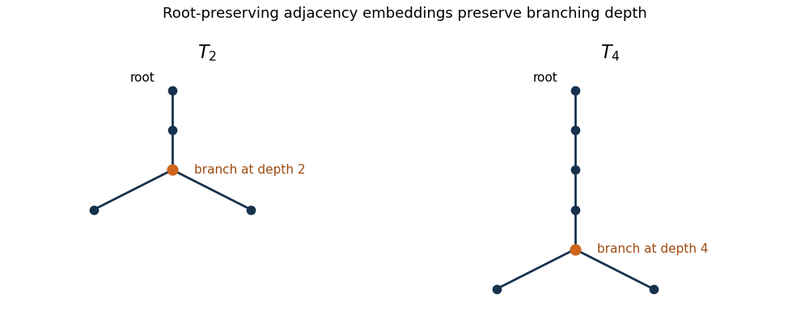

<h1 id="6/solution">Solution</h1>

↑ **Parent:** [6](../6.md)

A [well-quasi-ordering](../../../../../well-quasi-ordering.md) is a reflexive transitive relation such that every infinite sequence $x_0,x_1,\ldots$ has $i<j$ with $x_i\leq x_j$. An infinite sequence without such a pair is a [bad sequence](../../../../../bad-sequence.md). For a finite [rooted tree](../../../../../rooted-tree.md), let $u\wedge v$ denote the [lowest common ancestor](../../../../../lowest-common-ancestor.md) of two vertices. A [homeomorphic embedding of a rooted tree](../../../../../homeomorphic-embedding-of-a-rooted-tree.md) into another is an injective map $h$ with

$$
h(u\wedge v)=h(u)\wedge h(v).
$$

Thus it preserves branching and sends each edge to a nonempty downward path, with different branches separated. The source root may map to a vertex below the target root. **[Kruskal's tree theorem](../../../../../kruskal-s-tree-theorem.md) says that finite [rooted trees](../../../../../rooted-tree.md) are [well-quasi-ordered](../../../../../well-quasi-ordering.md) under these embeddings.**

We first establish the word lemma used in the proof. The [Higman lemma](../../../../../higman-s-lemma.md) says that finite [words](../../../../../string.md) over a [well-quasi-ordering](../../../../../well-quasi-ordering.md) $Q$ are [well-quasi-ordered](../../../../../well-quasi-ordering.md) by subsequence embedding with increased letters. Every infinite sequence in $Q$ has an infinite nondecreasing subsequence. To see this, some term must have infinitely many later terms above it: otherwise, repeatedly choosing past all finitely many successors of earlier chosen terms constructs a [bad sequence](../../../../../bad-sequence.md). Apply this observation again inside that infinite upper cone, and repeat.

If the [Higman lemma](../../../../../higman-s-lemma.md) failed, choose a [minimal bad sequence](../../../../../minimal-bad-sequence.md) of words $w_0,w_1,\ldots$, minimizing length at each position among choices admitting a bad continuation. None is empty. Write $w_i=u_i a_i$, with last letter $a_i$, and choose indices $i_0<i_1<\cdots$ on which the $a_i$ are nondecreasing. Then

$$
w_0,\ldots,w_{i_0-1},u_{i_0},u_{i_1},\ldots
$$

is still a [bad sequence](../../../../../bad-sequence.md). A comparison from the original prefix into some $u_{i_j}$ would give one into $w_{i_j}$. A comparison $u_{i_j}\leq u_{i_k}$ would extend by $a_{i_j}\leq a_{i_k}$ to $w_{i_j}\leq w_{i_k}$. Both contradict the original badness. But the replacement at position $i_0$ is shorter than $w_{i_0}$, contradicting minimality. This proves the [Higman lemma](../../../../../higman-s-lemma.md).

Now suppose [Kruskal's tree theorem](../../../../../kruskal-s-tree-theorem.md) fails and choose a [minimal bad sequence](../../../../../minimal-bad-sequence.md) $T_0,T_1,\ldots$, minimizing the number of vertices at each stage. Let $\mathcal B$ contain all proper descendant-rooted subtrees of all $T_i$. We claim that $\mathcal B$ is [well-quasi-ordered](../../../../../well-quasi-ordering.md) by [rooted-tree homeomorphic embeddings](../../../../../homeomorphic-embedding-of-a-rooted-tree.md). Otherwise take a [bad sequence](../../../../../bad-sequence.md) $U_0,U_1,\ldots$ from it. Each finite set of host trees supplies only finitely many subtrees, so after passing to a subsequence we may arrange that $U_j$ is a proper subtree of $T_{k_j}$ with $k_0<k_1<\cdots$. The sequence

$$
T_0,\ldots,T_{k_0-1},U_0,U_1,\ldots
$$

is bad: a comparison from a prefix tree into $U_j$ would compose with its inclusion into $T_{k_j}$ and contradict the original badness; comparisons among the $U_j$ are excluded by construction. Yet $U_0$ is smaller than $T_{k_0}$, contradicting minimality. This proves the claim.

List the immediate-child subtrees of each $T_i$ in any fixed order. These are finite [words](../../../../../string.md) over $\mathcal B$. By the [Higman lemma](../../../../../higman-s-lemma.md), some earlier child list embeds into a later one with increased letters. The selected child subtrees embed into distinct child branches of the later tree. Map the source root to the target root and use these embeddings in the selected branches. The paths from the target root to the embedded child roots are separated because the target child branches are distinct. The resulting injection preserves [lowest common ancestors](../../../../../lowest-common-ancestor.md), giving $T_i\preceq T_j$, a contradiction. This proves [Kruskal's tree theorem](../../../../../kruskal-s-tree-theorem.md) completely. It also gives the root-preserving homeomorphic version: once the weaker relation is [well-quasi-ordered](../../../../../well-quasi-ordering.md) on all finite [rooted trees](../../../../../rooted-tree.md), apply the [Higman lemma](../../../../../higman-s-lemma.md) to their child lists to obtain a comparison preserving the root.

For the proposed [adjacency-preserving rooted-tree embedding](../../../../../adjacency-preserving-rooted-tree-embedding.md), the answer is **no: it is not a [well-quasi-ordering](../../../../../well-quasi-ordering.md)**. For every $m\geq1$, form $T_m$ from a stem of $m$ edges starting at the root and then attach two leaves to its terminal vertex. The only vertex with two children is at depth $m$. A root-preserving adjacency injection preserves depths: the unique path of length $d$ from the root maps to a simple path of length $d$ from the target root. The image of a vertex with two children must still have two distinct children. Thus an embedding $T_m\to T_n$ must send the branch vertex at depth $m$ to the unique branch vertex at depth $n$, forcing $m=n$. Therefore

$$
\boxed{T_1,T_2,\ldots\text{ is an infinite antichain for root-preserving adjacency embeddings}.}
$$

This is the [branching-depth antichain of rooted trees](../../../../../branching-depth-antichain-of-rooted-trees.md). Homeomorphic embeddings can stretch the stem and hence do not have this obstruction.

**[Figure 1](#6/image-root-preserving-adjacency-embeddings-preserve-the-depth-of-the-branching-vertex). Root-preserving adjacency embeddings preserve the depth of the branching vertex**.

## ↑ Ancestors (10)

1. [6](../6.md)
2. [Paper 20](../../paper-20-split.md)
3. [Iii](../../split.md)
4. [2013](../../../split.md)
5. [Past exam of the mathematics course of the University of Cambridge](../../../../split.md)
6. [Mathematics course of the University of Cambridge](../../../../../mathematics-course-of-the-university-of-cambridge.md)
7. [Course of the University of Cambridge](../../../../../course-of-the-university-of-cambridge.md)
8. [University of Cambridge](../../../../../university-of-cambridge-split.md)
9. [List of universities](../../../../../list-of-universities.md)
10. [Codex Wiki](../../../../../split.md)
