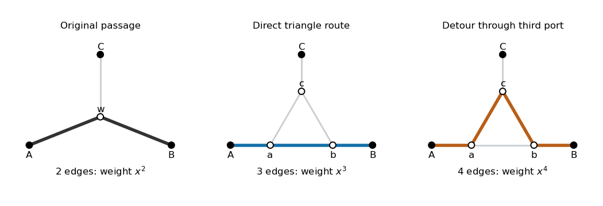

<h1 id="1/iv/solution">Solution</h1>

↑ **Parent:** [Iv](../iv.md)

Consider a walk in the replaced [graph](../../../../../../graph-split.md) that starts and ends in $V_0$. Each passage through a triangle enters at one port and leaves at a different port. It cannot revisit that triangle: the first passage uses at least two of its three vertices, whereas a later completed passage would need two previously unused ports. Nor can it immediately return through its entry port, since that would repeat a [graph vertex](../../../../../../vertex-graph-theory.md). Contracting each passage therefore gives a [self-avoiding walk](../../../../../../self-avoiding-walk.md) in $G$ ending in $V_0$.

Conversely, each length-$2k$ walk of this kind in $G$ visits $k$ distinct vertices of $V_1$. At each one, its incoming and outgoing ports determine exactly two routes through the triangle: the direct internal [edge](../../../../../../edge-of-a-graph.md) or the two internal [edges](../../../../../../edge-of-a-graph.md) through the third port. Including the two external [edges](../../../../../../edge-of-a-graph.md), these have lengths three and four. The choices at distinct triangles are independent combinatorial choices, so that walk contributes $(x^3+x^4)^k$ to the new [generating function](../../../../../../generating-function.md). This [triangle replacement for self-avoiding walks](../../../../../../triangle-replacement-for-self-avoiding-walks.md) gives

$$
\boxed{Z_H^0(x)=\sum_{k\geq0}\sigma_{2k}(x^3+x^4)^k=Z_G^0\bigl(\sqrt{x^3+x^4}\bigr)}.
$$

For $x\geq0$, the square-root argument increases strictly from zero to infinity. Nonnegative coefficients and the radius from part (iii) therefore give the unique positive threshold

$$
\boxed{\rho^3+\rho^4=\mu^{-2}}.
$$

This identifies the radius of the restricted series, without assuming that the new [graph](../../../../../../graph-split.md) has equal counts from every [graph vertex](../../../../../../vertex-graph-theory.md).

**[Figure 1](#1/iv/image-an-original-two-edge-passage-and-its-two-triangle-replacements-of-lengths-three-and-four). An original two-edge passage and its two triangle replacements, of lengths three and four**.

## ↑ Ancestors (11)

1. [Iv](../iv.md)
2. [1](../../1.md)
3. [Paper 26](../../../paper-26-split.md)
4. [Iii](../../../split.md)
5. [2013](../../../../split.md)
6. [Past exam of the mathematics course of the University of Cambridge](../../../../../split.md)
7. [Mathematics course of the University of Cambridge](../../../../../../mathematics-course-of-the-university-of-cambridge.md)
8. [Course of the University of Cambridge](../../../../../../course-of-the-university-of-cambridge.md)
9. [University of Cambridge](../../../../../../university-of-cambridge-split.md)
10. [List of universities](../../../../../../list-of-universities.md)
11. [Codex Wiki](../../../../../../split.md)
