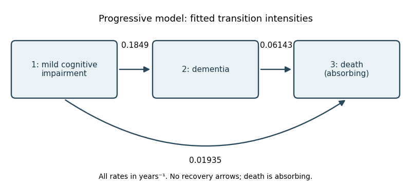

<h1 id="6/b/i/solution">Solution</h1>

↑ **Parent:** [I](../i.md)

The fitted [progressive illness-death model](../../../../../../../progressive-illness-death-model.md) has three allowed arrows: $1\to2$ with estimated [transition intensity](../../../../../../../transition-intensity.md) $0.1849$, $1\to3$ with $0.01935$, and $2\to3$ with $0.06143$, all in years$^{-1}$. State 3 is an [absorbing state](../../../../../../../absorbing-state.md), and state 2 has no return arrow.

**[Figure 1](#6/b/i/image-progressive-three-state-model-with-estimated-annual-transition-intensities). Progressive three-state model with estimated annual transition intensities**.

Once in state 2, the [holding time](../../../../../../../holding-time.md) has an [exponential distribution](../../../../../../../exponential-distribution.md) with rate $q_{23}$, so the [mean holding time from a transition intensity matrix](../../../../../../../mean-holding-time-from-a-transition-intensity-matrix.md) is

$$
\boxed{\widehat E(T_2)=\frac1{0.06143}=16.28\ \text{years}.}
$$

Apply a [confidence interval for an inverse rate](../../../../../../../confidence-interval-for-an-inverse-rate.md) to the printed rate interval $(0.03552,0.1063)$: since inversion reverses order, the approximate 95% interval for the mean is

$$
\boxed{\left(\frac1{0.1063},\frac1{0.03552}\right)=(9.41,28.15)\ \text{years}.}
$$

The [time-homogeneous Markov property](../../../../../../../time-homogeneous-markov-property.md) makes the future depend only on the current state; the [exponential distribution](../../../../../../../exponential-distribution.md) also has the [memoryless property](../../../../../../../memorylessness-of-the-exponential-distribution.md). For a person currently in state 2,

$$
\boxed{p_{23}(2)=1-e^{-2(0.06143)}=0.11561.}
$$

Equivalently, $p_{22}(2)=p_{22}(1)^2\simeq0.9404163^2$. Thus the fitted two-year death [probability](../../../../../../../probability.md) is approximately **11.6%**.

## ↑ Ancestors (12)

1. [I](../i.md)
2. [B](../../b.md)
3. [6](../../../6.md)
4. [Paper 30](../../../../paper-30-split.md)
5. [Iii](../../../../split.md)
6. [2013](../../../../../split.md)
7. [Past exam of the mathematics course of the University of Cambridge](../../../../../../split.md)
8. [Mathematics course of the University of Cambridge](../../../../../../../mathematics-course-of-the-university-of-cambridge.md)
9. [Course of the University of Cambridge](../../../../../../../course-of-the-university-of-cambridge.md)
10. [University of Cambridge](../../../../../../../university-of-cambridge-split.md)
11. [List of universities](../../../../../../../list-of-universities.md)
12. [Codex Wiki](../../../../../../../split.md)
