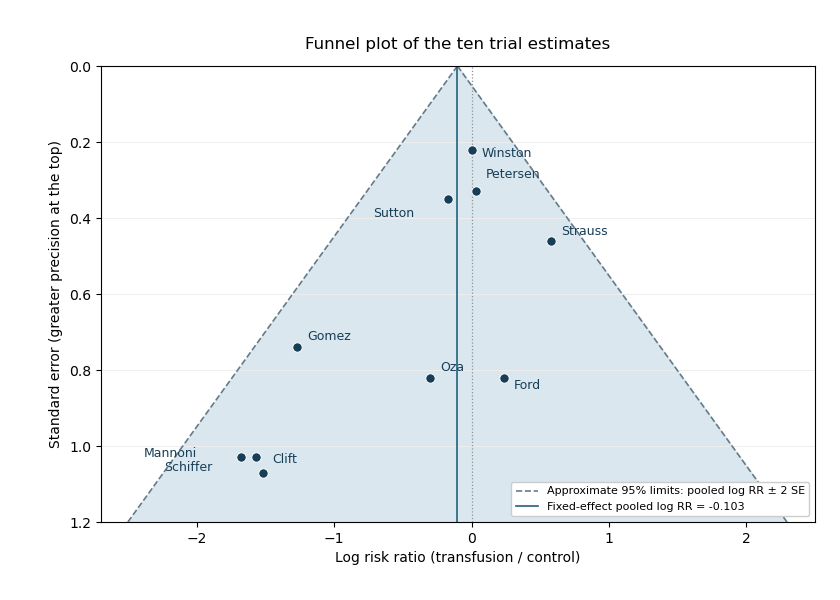

<h1 id="1/d/solution">Solution</h1>

↑ **Parent:** [D](../d.md)

A [funnel plot](../../../../../../funnel-plot.md) places each estimated [log risk ratio](../../../../../../log-risk-ratio.md) horizontally and its [standard error](../../../../../../standard-error.md) vertically, with the most precise studies at the top. Under a common-effect model without selective availability, less precise estimates should spread approximately symmetrically around the underlying effect. The plotted dashed limits are the pooled estimate plus or minus twice the [standard error](../../../../../../standard-error.md); they illustrate the expected sampling spread, not a test of [publication bias](../../../../../../publication-bias.md) by themselves.

**[Figure 1](#1/d/image-funnel-plot-of-the-ten-transfusion-trial-estimates-with-inverse-variance-pooled-effect-and-approximate-sampling-limits). Funnel plot of the ten transfusion trial estimates, with inverse-variance pooled effect and approximate sampling limits**.

The least precise estimates are mostly far to the left, whereas the most precise estimates are close to zero. The reported regression slope means that increasing the [standard error](../../../../../../standard-error.md) by one unit is associated with a decrease of about $1.99$ in the estimated [log risk ratio](../../../../../../log-risk-ratio.md). Its 95% [confidence interval](../../../../../../confidence-interval.md) $(-3.40,-0.59)$ excludes zero, and $P=0.01$ gives evidence against a zero slope under that regression model. This is evidence of a [small-study effect](../../../../../../small-study-effect.md): less precise trials report stronger apparent benefit.

**There is evidence consistent with [publication bias](../../../../../../publication-bias.md), but asymmetry does not identify its cause.** Selective availability of favourable small studies is a plausible explanation. Genuine differences in patient populations, trial quality, interventions or effect modification could also generate the pattern, and there are only ten trials. The given outcome-on-error regression should be interpreted as specified; it is not automatically the original standardized-effect-on-precision form of an Egger test. The plot and slope justify investigating missing studies and sensitivity to selection, rather than concluding that [publication bias](../../../../../../publication-bias.md) has been proved.

## ↑ Ancestors (11)

1. [D](../d.md)
2. [1](../../1.md)
3. [Paper 32](../../../paper-32-split.md)
4. [Iii](../../../split.md)
5. [2013](../../../../split.md)
6. [Past exam of the mathematics course of the University of Cambridge](../../../../../split.md)
7. [Mathematics course of the University of Cambridge](../../../../../../mathematics-course-of-the-university-of-cambridge.md)
8. [Course of the University of Cambridge](../../../../../../course-of-the-university-of-cambridge.md)
9. [University of Cambridge](../../../../../../university-of-cambridge-split.md)
10. [List of universities](../../../../../../list-of-universities.md)
11. [Codex Wiki](../../../../../../split.md)
