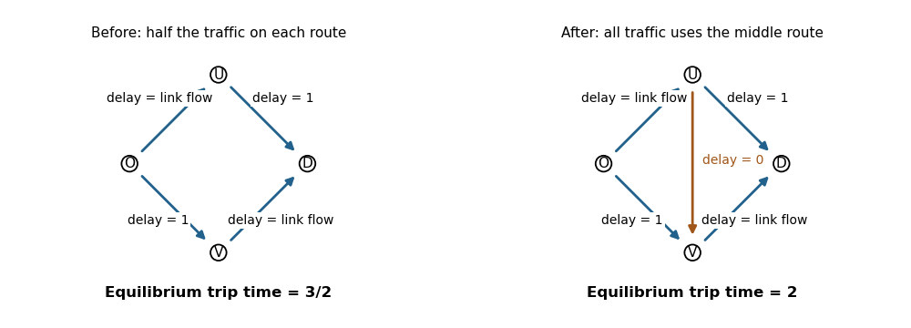

<h1 id="2/c/solution">Solution</h1>

↑ **Parent:** [C](../c.md)

[Braess paradox](../../../../../../braess-s-paradox.md) is the possibility that adding a route reduces the attainable equilibrium performance, despite enlarging the feasible set for a planner.

Take unit demand from $O$ to $D$. Initially the routes are $O\to U\to D$ and $O\to V\to D$. The links $O\to U$ and $V\to D$ have delay equal to their own flow; $U\to D$ and $O\to V$ have constant delay one. If the upper route has flow $h$, its delay is $h+1$, while the lower delay is $2-h$. The [Wardrop equilibrium](../../../../../../wardrop-equilibrium.md) therefore splits traffic equally and has

$$
\boxed{\text{original equilibrium delay}=3/2}.
$$

Now add a directed zero-delay link $U\to V$. Let upper, lower and middle route flows be $a,b,c$ with $a+b+c=1$. Their delays are respectively $2-b$, $2-a$ and $2-a-b$. If $a>0$, its route would be strictly more expensive than the middle route; likewise $b>0$ is impossible at equilibrium. Hence $a=b=0$, $c=1$. All three routes then have delay two, so this is an equilibrium, and

$$
\boxed{\text{new equilibrium delay}=2>3/2}.
$$

The cheaper-looking cross-link tempts everyone onto both flow-dependent links. No individual can improve after congestion has built up. A planner could retain the old split and ignore the new link, so the feasible optimum cannot worsen. The paradox concerns selfish equilibrium, not the physical disappearance of the earlier allocation.

**[Figure 1](#2/c/image-braess-paradox-equilibrium-delay-rises-from-three-halves-to-two-after-adding-a-free-directed-cross-link). Braess paradox: equilibrium delay rises from three halves to two after adding a free directed cross-link**.

## ↑ Ancestors (11)

1. [C](../c.md)
2. [2](../../2.md)
3. [Paper 37](../../../paper-37-split.md)
4. [Iii](../../../split.md)
5. [2013](../../../../split.md)
6. [Past exam of the mathematics course of the University of Cambridge](../../../../../split.md)
7. [Mathematics course of the University of Cambridge](../../../../../../mathematics-course-of-the-university-of-cambridge.md)
8. [Course of the University of Cambridge](../../../../../../course-of-the-university-of-cambridge.md)
9. [University of Cambridge](../../../../../../university-of-cambridge-split.md)
10. [List of universities](../../../../../../list-of-universities.md)
11. [Codex Wiki](../../../../../../split.md)
