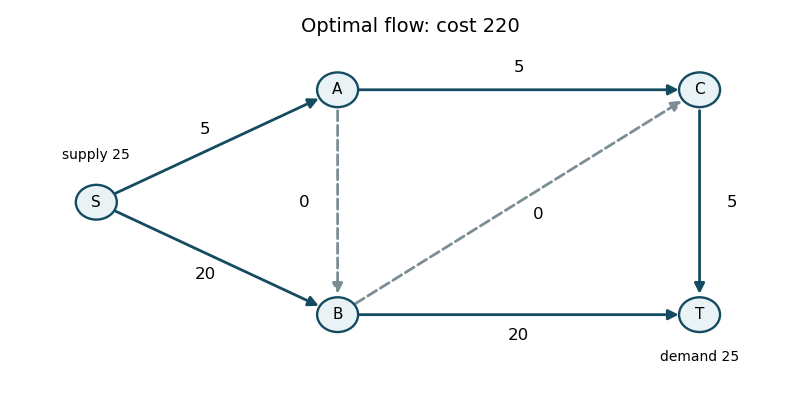

<h1 id="3/a/solution">Solution</h1>

↑ **Parent:** [A](../a.md)

Label the vertices $S$ (left), $A$ (upper middle), $B$ (lower middle), $C$ (upper right), $T$ (lower right). Use the [flow balance](../../../../../../flow-balance.md) convention outgoing minus incoming equals supply. The printed initial flows, in the order $(SA,SB,AB,AC,BC,BT,CT)$, are

$$
x^{(0)}=(25,0,15,10,10,5,20).
$$

They obey all [capacity constraints](../../../../../../capacity-constraint.md) and the [flow balances](../../../../../../flow-balance.md) $(25,0,0,0,-25)$. The four strictly interior edges $SA,AB,BC,BT$ form a [spanning tree](../../../../../../spanning-tree.md). The remaining edges are at a bound: $SB$ at zero, $AC$ and $CT$ at their upper bounds. Thus this is already a feasible [network simplex tree basis](../../../../../../network-simplex-tree-basis.md); no artificial feasibility phase is needed. Its total cost is $340$.

For a tree, choose [network dual potentials](../../../../../../network-dual-potential.md) with $\pi_S=0$ and zero [network reduced cost](../../../../../../network-reduced-cost.md) $r_{ij}=c_{ij}-\pi_i+\pi_j$ on each tree edge. Initially

$$
(\pi_S,\pi_A,\pi_B,\pi_C,\pi_T)=(0,-7,-12,-14,-14).
$$

The nonbasic lower-bound edge $SB$ has [network reduced cost](../../../../../../network-reduced-cost.md) $-6$. Increase its flow and adjust around the [graph cycle](../../../../../../cycle-in-a-graph.md) $S\to B\to A\to S$, reversing $AB$ and $SA$. The available step is $\min(20,15,25)=15$, so $AB$ leaves at zero. This gives

$$
x^{(1)}=(10,15,0,10,10,5,20),\qquad \text{cost}=250.
$$

The tree is now $SA,SB,BC,BT$, and the potentials are $(0,-7,-6,-8,-8)$.

Now $AC$ is at its upper bound but has [network reduced cost](../../../../../../network-reduced-cost.md) $3>0$, so decreasing it improves cost. Its reverse [residual network](../../../../../../residual-network.md) edge enters along the cycle $A\to S\to B\to C\to A$. The forward edges $SB,BC$ increase; $SA,AC$ decrease. The step is

$$
\min(x_{SA},m_{SB}-x_{SB},m_{BC}-x_{BC},x_{AC})
=\min(10,5,10,10)=5.
$$

Thus $SB$ leaves at its upper bound, and

$$
x^{(2)}=(5,20,0,5,15,5,20),\qquad \text{cost}=235.
$$

The new tree $SA,AC,BC,BT$ has potentials $(0,-7,-9,-11,-11)$.

The upper-bound edge $CT$ now has [network reduced cost](../../../../../../network-reduced-cost.md) $1>0$. Enter its reverse direction along $T\to C\to B\to T$, decreasing $CT$ and $BC$ and increasing $BT$. The step is $\min(20,15,25-5)=15$, so $BC$ leaves at zero. The resulting flow is

$$
\boxed{x^*=(5,20,0,5,0,20,5),\qquad \text{minimum cost}=220.}
$$

The tree is $SA,AC,BT,CT$, with potentials $(0,-7,-10,-11,-12)$. The nonbasic edges have [network reduced costs](../../../../../../network-reduced-cost.md) $r_{SB}=-4$ at its upper bound, $r_{AB}=2$ at its lower bound, and $r_{BC}=1$ at its lower bound. All have the correct signs, so there is no improving [network simplex](../../../../../../network-simplex-algorithm.md) pivot. The next part proves these signs certify optimality.

**[Figure 1](#3/a/image-optimal-network-flow-of-total-cost-220-with-zero-flow-edges-dashed). Optimal network flow of total cost 220, with zero-flow edges dashed**.

## ↑ Ancestors (11)

1. [A](../a.md)
2. [3](../../3.md)
3. [Paper 38](../../../paper-38-split.md)
4. [Iii](../../../split.md)
5. [2013](../../../../split.md)
6. [Past exam of the mathematics course of the University of Cambridge](../../../../../split.md)
7. [Mathematics course of the University of Cambridge](../../../../../../mathematics-course-of-the-university-of-cambridge.md)
8. [Course of the University of Cambridge](../../../../../../course-of-the-university-of-cambridge.md)
9. [University of Cambridge](../../../../../../university-of-cambridge-split.md)
10. [List of universities](../../../../../../list-of-universities.md)
11. [Codex Wiki](../../../../../../split.md)
