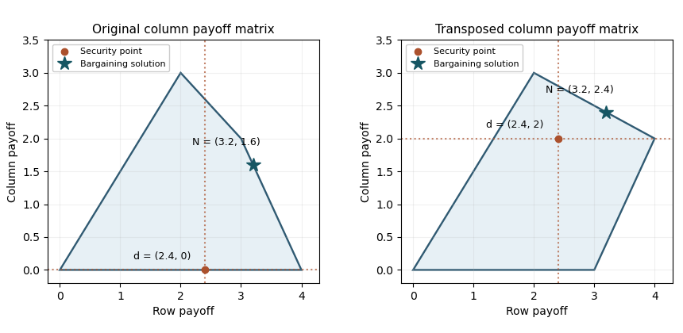

<h1 id="6/c/solution">Solution</h1>

↑ **Parent:** [C](../c.md)

Transposing the second player's matrix leaves the row player's [security level payoff](../../../../../../security-level-payoff.md) at $12/5$. The column player's second action now yields payoffs $2$ and $3$, while its first yields zero for either row. Its [security level payoff](../../../../../../security-level-payoff.md) is therefore $2$, guaranteed by the second action; against the first row no mixture can guarantee more. Thus $d=(12/5,2)$.

The relevant upper [Pareto frontier](../../../../../../pareto-frontier.md) joins the payoff vectors $(4,2)$ and $(2,3)$, so $v=4-u/2$. On the segment satisfying [bargaining individual rationality](../../../../../../bargaining-individual-rationality.md) $12/5\leq u\leq4$, the [Nash product](../../../../../../nash-product.md) becomes

$$
(u-12/5)(v-2)=(u-12/5)(2-u/2).
$$

Its [derivative](../../../../../../derivative.md) is $16/5-u$ and its second [derivative](../../../../../../derivative.md) is $-1$. Hence

$$
\boxed{N(F,d)=(16/5,12/5).}
$$

The implementing [correlated payoff lottery](../../../../../../lottery-over-joint-action-profiles.md) chooses $(4,2)$ with probability $3/5$ and $(2,3)$ with probability $2/5$. Both players' gains are strictly positive: $4/5$ and $2/5$. The new [disagreement point](../../../../../../disagreement-point.md) must be recomputed after transposition; reusing the previous column security payoff would solve a different [Nash bargaining problem](../../../../../../nash-bargaining-problem.md).

**[Figure 2](#6/c/image-feasible-payoff-polygons-security-points-and-nash-bargaining-solutions-before-and-after-transposing-the-column-payoff-matrix). Feasible payoff polygons, security points and Nash bargaining solutions before and after transposing the column payoff matrix**.

## ↑ Ancestors (11)

1. [C](../c.md)
2. [6](../../6.md)
3. [Paper 38](../../../paper-38-split.md)
4. [Iii](../../../split.md)
5. [2013](../../../../split.md)
6. [Past exam of the mathematics course of the University of Cambridge](../../../../../split.md)
7. [Mathematics course of the University of Cambridge](../../../../../../mathematics-course-of-the-university-of-cambridge.md)
8. [Course of the University of Cambridge](../../../../../../course-of-the-university-of-cambridge.md)
9. [University of Cambridge](../../../../../../university-of-cambridge-split.md)
10. [List of universities](../../../../../../list-of-universities.md)
11. [Codex Wiki](../../../../../../split.md)
