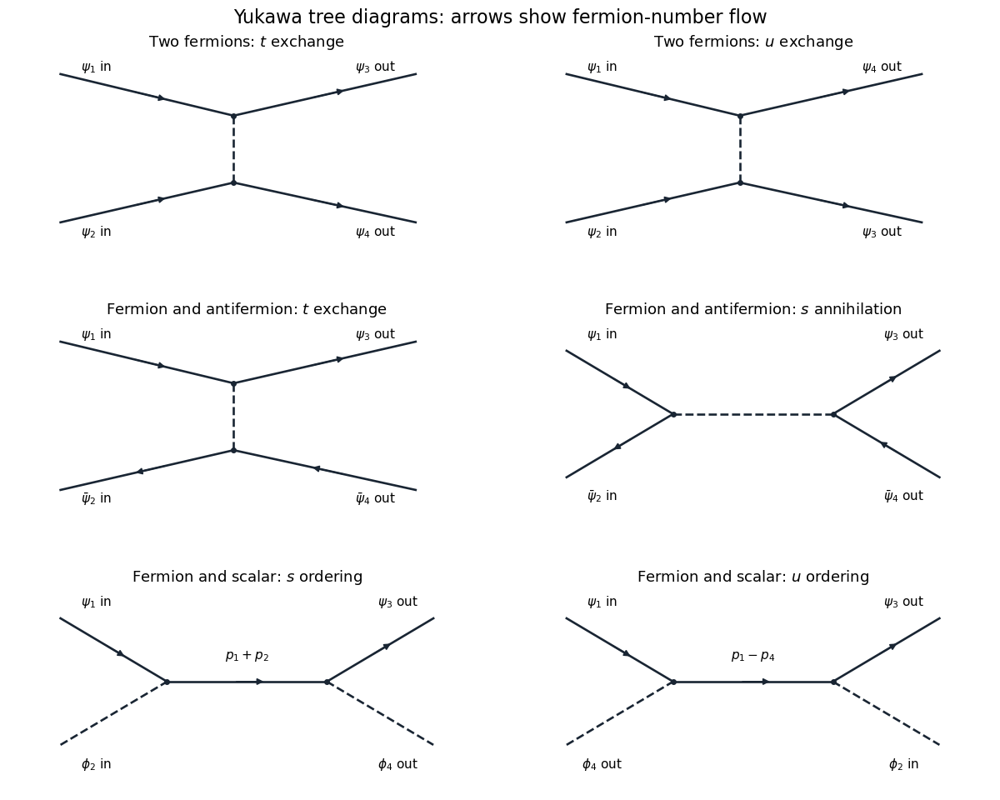

<h1 id="2/solution">Solution</h1>

↑ **Parent:** [2](../2.md)

Variation with respect to the [Dirac adjoint](../../../../../dirac-adjoint.md), the Dirac field, and the real scalar field respectively gives

$$
\boxed{(i\gamma^\mu\partial_\mu-m-g\phi)\psi=0,\qquad i(\partial_\mu\bar\psi)\gamma^\mu+(m+g\phi)\bar\psi=0,\qquad(\Box+m^2)\phi=-g\bar\psi\psi.}
$$

The derivative in the adjoint equation acts to the left; its sign follows by integrating $i\bar\psi\gamma^\mu\partial_\mu\delta\psi$ by parts. The [Yukawa interaction](../../../../../yukawa-interaction.md) supplies a spacetime-dependent effective fermion mass and a scalar source.

Use $\not p=\gamma^\mu p_\mu$ and the convention $S_{fi}^{\rm conn}=i(2\pi)^4\delta^4(p_f-p_i)\mathcal M$. The momentum-space [Feynman rules](../../../../../feynman-rule.md) are: a scalar internal line contributes $i/(p^2-m^2+i0)$; an oriented fermion line contributes $i(\not p+m)/(p^2-m^2+i0)$; and each scalar-fermion vertex contributes $-ig$ times the identity in spinor space. Impose four-momentum conservation at each vertex. Incoming and outgoing fermions supply $u$ and $\bar u$, while incoming and outgoing antifermions supply $\bar v$ and $v$; scalar external legs supply one. Loop momenta are integrated with $d^4p/(2\pi)^4$, a closed fermion loop contributes a minus sign, and graph symmetry factors are included. Relative signs between distinct contractions of identical external fermions follow from their anticommutation relations. These specify the [Feynman rules](../../../../../feynman-rule.md) also beyond the tree approximation.

Label incoming momenta $p_1,p_2$ and outgoing momenta $p_3,p_4$, with all external particles on shell. Write the [Mandelstam variables](../../../../../mandelstam-variables.md) as $s=(p_1+p_2)^2$, $t=(p_1-p_3)^2$, $u=(p_1-p_4)^2$, and abbreviate $D_r=r-m^2+i0$. Spin indices on $u_i,v_i$ are implicit. The six required [tree-level Feynman diagrams](../../../../../tree-level-feynman-diagram.md) are:

**[Figure 1](#2/image-the-six-yukawa-tree-diagrams-for-fermion-antifermion-and-scalar-scattering-with-momentum-labels-and-fermion-number-arrows). The six Yukawa tree diagrams for fermion, antifermion and scalar scattering, with momentum labels and fermion-number arrows**.

For two incoming fermions, the two diagrams exchange a scalar in the $t$ and $u$ channels. With external state ordering $b_1^\dagger b_2^\dagger|0\rangle$ and $b_3^\dagger b_4^\dagger|0\rangle$, the result is

$$
\boxed{\mathcal M_{\psi\psi}=-g^2\left[\frac{(\bar u_3u_1)(\bar u_4u_2)}{D_t}-\frac{(\bar u_4u_1)(\bar u_3u_2)}{D_u}\right].}
$$

Each scalar-exchange contraction has two factors $-ig$ and one scalar [Feynman propagator](../../../../../feynman-propagator.md). Exchanging the final fermions reverses the sign, as required by their identical-particle statistics.

For a fermion and antifermion, there is $t$-channel scalar exchange and $s$-channel annihilation. Take both initial and final states ordered as fermion creator followed by antifermion creator. Then

$$
\boxed{\mathcal M_{\psi\bar\psi}=g^2\left[\frac{(\bar u_3u_1)(\bar v_2v_4)}{D_t}-\frac{(\bar v_2u_1)(\bar u_3v_4)}{D_s}\right].}
$$

The relative minus is not optional. One way to track it is the [antifermion sign of a normal-ordered bilinear](../../../../../antifermion-sign-of-a-normal-ordered-bilinear.md): the antifermion scattering part of $:\bar\psi\psi:$ is $-d^\dagger d\,\bar vv$, whereas its annihilation part is $db\,\bar vu$. Thus the exchange contraction has the opposite fermionic sign to the annihilation contraction before multiplying by $(-ig)^2i/D_r$. A different overall phase convention for external states changes the common sign of this amplitude, but cannot change the relative sign.

For fermion-scalar scattering, the fermion can absorb the incoming scalar before emitting the outgoing one, or emit first and absorb afterwards. The internal momenta are $p_1+p_2$ and $p_1-p_4$ respectively, giving

$$
\boxed{\mathcal M_{\psi\phi}=-g^2\bar u_3\left[\frac{\not p_1+\not p_2+m}{D_s}+\frac{\not p_1-\not p_4+m}{D_u}\right]u_1.}
$$

Both orderings have the same sign: there is only one open fermion line and no exchange of identical external fermions. There is no scalar-exchange $t$ diagram because this [Yukawa interaction](../../../../../yukawa-interaction.md) has no three-scalar vertex. These amplitudes describe [tree scattering in Yukawa theory](../../../../../tree-scattering-in-yukawa-theory.md).

## ↑ Ancestors (10)

1. [2](../2.md)
2. [Paper 41](../../paper-41-split.md)
3. [Iii](../../split.md)
4. [2013](../../../split.md)
5. [Past exam of the mathematics course of the University of Cambridge](../../../../split.md)
6. [Mathematics course of the University of Cambridge](../../../../../mathematics-course-of-the-university-of-cambridge.md)
7. [Course of the University of Cambridge](../../../../../course-of-the-university-of-cambridge.md)
8. [University of Cambridge](../../../../../university-of-cambridge-split.md)
9. [List of universities](../../../../../list-of-universities.md)
10. [Codex Wiki](../../../../../split.md)
