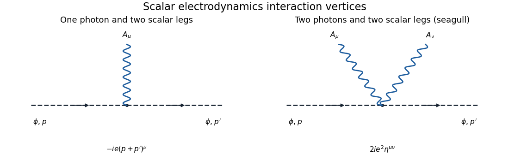
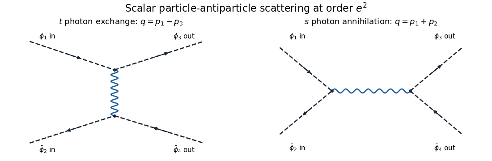

<h1 id="3/solution">Solution</h1>

↑ **Parent:** [3](../3.md)

The conjugate [complex scalar field](../../../../../complex-scalar-field.md) has the opposite charge. Thus the derivative on $\phi^*$ in the kinetic term must mean $(D_\mu\phi)^*=(\partial_\mu-ieA_\mu)\phi^*$, while the derivative on $\phi$ is $D_\mu=\partial_\mu+ieA_\mu$. This is the [conjugate gauge covariant derivative](../../../../../conjugate-gauge-covariant-derivative.md). Applying the same plus-charge differential operator to both fields would not give the stated gauge-invariant theory. For example, take $A=0$, $\phi=x^0$ and $\alpha=cx^0$; the literal plus-charge kinetic product changes from $1$ to $1+2iec x^0$. The opposite-charge interpretation removes this term.

For an arbitrary real function $\alpha(x)$, take

$$
\boxed{\phi' = e^{-ie\alpha}\phi,\qquad\phi'^*=e^{ie\alpha}\phi^*,\qquad A_\mu'=A_\mu+\partial_\mu\alpha.}
$$

Then $D'_\mu\phi'=e^{-ie\alpha}D_\mu\phi$ and the conjugate derivative transforms oppositely. Also $F'_{\mu\nu}=F_{\mu\nu}$ because mixed derivatives commute. The kinetic contraction and $|\phi|^2$ are unchanged, proving local [U(1) gauge symmetry](../../../../../u-1-gauge-symmetry.md).

Expanding the covariant kinetic term identifies the interactions:

$$
\mathcal L_{\rm int}=ieA_\mu\big(\phi\partial^\mu\phi^*-\phi^*\partial^\mu\phi\big)+e^2A_\mu A^\mu\phi^*\phi.
$$

The first term gives the [scalar electrodynamics three-point vertex](../../../../../scalar-electrodynamics-three-point-vertex.md), and the second gives the [seagull vertex](../../../../../seagull-vertex.md). For scalar charge flow from an incoming particle of momentum $p$ to an outgoing one of momentum $p'$, the factors are

$$
\boxed{V_3^\mu=-ie(p+p')^\mu,\qquad V_4^{\mu\nu}=2ie^2\eta^{\mu\nu}.}
$$

The factor two in the second rule comes from the two identical photon fields. Equivalently, with all momenta incoming, the three-point rule is $ie(r-q)^\mu$ for a $\phi$ leg of momentum $q$ and a $\phi^*$ leg of momentum $r$. An antiparticle line has the opposite charge-flow sign. The vertices are shown with dashed scalar lines and wavy photon lines:

**[Figure 2](#3/image-the-one-photon-scalar-vertex-and-the-two-photon-seagull-vertex-in-scalar-electrodynamics-including-their-momentum-space-factors). The one-photon scalar vertex and the two-photon seagull vertex in scalar electrodynamics, including their momentum-space factors**.

For particle-antiparticle scattering, use incoming $p_1,p_2$ and outgoing $p_3,p_4$, with $p_1,p_3$ particle momenta. At order $e^2$, there are exactly two [tree-level Feynman diagrams](../../../../../tree-level-feynman-diagram.md): $t$-channel photon exchange and $s$-channel annihilation. The [seagull vertex](../../../../../seagull-vertex.md) has only two scalar legs and cannot alone provide four external scalar legs.

**[Figure 3](#3/image-the-leading-t-channel-photon-exchange-and-s-channel-annihilation-diagrams-for-scalar-particle-antiparticle-scattering). The leading t-channel photon exchange and s-channel annihilation diagrams for scalar particle-antiparticle scattering**.

Set $q_t=p_1-p_3=p_4-p_2$ and $q_s=p_1+p_2=p_3+p_4$. The external currents are

$$
J_t=p_1+p_3,\quad K_t=p_2+p_4,\qquad J_s=p_1-p_2,\quad K_s=p_3-p_4.
$$

All are transverse to the corresponding exchanged momentum: for instance $q_t\cdot J_t=p_1^2-p_3^2=0$ and $q_s\cdot J_s=p_1^2-p_2^2=0$. This is the on-shell [scalar quantum electrodynamics Ward identity](../../../../../scalar-quantum-electrodynamics-ward-identity.md). With the vertex convention above,

$$
i\mathcal M=e^2J_t^\mu D_{\mu\nu}(q_t)K_t^\nu-e^2J_s^\mu D_{\mu\nu}(q_s)K_s^\nu.
$$

The relative sign comes from the opposite particle/antiparticle charge in the exchange diagram and the two equal annihilation-vertex signs.

To see how the [Coulomb gauge](../../../../../coulomb-gauge.md) expression becomes covariant, let $J,K$ be either pair, $q=(q^0,\mathbf q)$, and initially take $|\mathbf q|\ne0$. The displayed [photon propagator](../../../../../photon-propagator.md) gives

$$
J^\mu D_{\mu\nu}^{\rm C}(q)K^\nu=\frac{iJ^0K^0}{|\mathbf q|^2}+\frac{i}{q^2}\left[\mathbf J\cdot\mathbf K-\frac{(\mathbf J\cdot\mathbf q)(\mathbf K\cdot\mathbf q)}{|\mathbf q|^2}\right].
$$

Current conservation gives $\mathbf J\cdot\mathbf q=q^0J^0$ and the same identity for $K$. Since $q^2=(q^0)^2-|\mathbf q|^2$, the temporal coefficient simplifies as

$$
\frac1{|\mathbf q|^2}-\frac{(q^0)^2}{q^2|\mathbf q|^2}=-\frac1{q^2}.
$$

Therefore

$$
\boxed{J^\mu D_{\mu\nu}^{\rm C}(q)K^\nu=-\frac{i}{q^2}\big(J^0K^0-\mathbf J\cdot\mathbf K\big)=J^\mu\frac{-i\eta_{\mu\nu}}{q^2}K^\nu.}
$$

The common Feynman pole prescription is understood in these formulas. This [Coulomb-gauge propagator between conserved currents](../../../../../coulomb-gauge-propagator-between-conserved-currents.md) identity proves equality of the physical amplitudes despite the noncovariant individual propagator components. It should be formed before taking limits such as $\mathbf q\to0$: individual instantaneous and transverse terms can be undefined separately in that limit while their sum has a finite covariant limit away from a physical pole.

Substitution gives the final [scattering amplitude](../../../../../scattering-amplitude.md)

$$
\boxed{\mathcal M=e^2\left[\frac{(p_1-p_2)\cdot(p_3-p_4)}{s+i0}-\frac{(p_1+p_3)\cdot(p_2+p_4)}{t+i0}\right]=e^2\left[\frac{u-t}{s+i0}-\frac{s-u}{t+i0}\right].}
$$

Here $s,t,u$ are the [Mandelstam variables](../../../../../mandelstam-variables.md) for the equal-mass external scalars. This is [scalar particle-antiparticle tree scattering](../../../../../scalar-particle-antiparticle-tree-scattering.md); overall external-state phases do not affect its relative channel sign.

## ↑ Ancestors (10)

1. [3](../3.md)
2. [Paper 41](../../paper-41-split.md)
3. [Iii](../../split.md)
4. [2013](../../../split.md)
5. [Past exam of the mathematics course of the University of Cambridge](../../../../split.md)
6. [Mathematics course of the University of Cambridge](../../../../../mathematics-course-of-the-university-of-cambridge.md)
7. [Course of the University of Cambridge](../../../../../course-of-the-university-of-cambridge.md)
8. [University of Cambridge](../../../../../university-of-cambridge-split.md)
9. [List of universities](../../../../../list-of-universities.md)
10. [Codex Wiki](../../../../../split.md)
