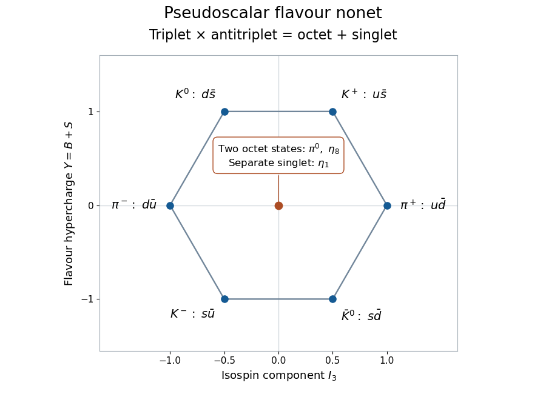

<h1 id="3/solution">Solution</h1>

↑ **Parent:** [3](../3.md)

A [weight of a representation](../../../../../weight-of-a-representation.md) of $SU(3)$ is a joint eigenvalue of two commuting generators spanning a [Cartan subalgebra](../../../../../cartan-subalgebra.md). Equivalently it describes the character by which the diagonal maximal torus acts on a [weight vector](../../../../../weight-vector.md). Use the Hermitian generators

$$
I_3=\operatorname{diag}(1/2,-1/2,0),\qquad Y=\operatorname{diag}(1/3,1/3,-2/3).
$$

Their multiples by $i$ are in the [SU(3) Lie algebra](../../../../../su-3-lie-algebra.md). A vector with weight $(a,b)$ acquires the phase $e^{i(a\theta+b\varphi)}$ under $\exp(i\theta I_3+i\varphi Y)$. The conventional generator $H_8$ is related by $Y=2H_8/\sqrt3$; using $H_8$ instead just rescales the vertical weight coordinate.

In the defining [group representation](../../../../../group-representation.md), the coordinate vectors $e_u,e_d,e_s$ are joint eigenvectors. The [weight diagram of the defining SU(3) representation](../../../../../weight-diagram-of-the-defining-su-3-representation.md) therefore has

$$
\boxed{\mu_u=(1/2,1/3),\qquad\mu_d=(-1/2,1/3),\qquad\mu_s=(0,-2/3).}
$$

Complex conjugation reverses all torus phases, so the weights of $\overline{\mathbf3}$ are **$-\mu_u,-\mu_d,-\mu_s$**, each with multiplicity one. The conjugation bar is essential: the tensor product here is $\mathbf3\otimes\overline{\mathbf3}$.

Weights add in a [tensor product of group representations](../../../../../tensor-product-of-group-representations.md). Thus the nine weights of this product are $\mu_i-\mu_j$. There are three zero weights from $i=j$, and the remaining six are

$$
\boxed{(1,0),\ (-1,0),\ (1/2,1),\ (-1/2,1),\ (-1/2,-1),\ (1/2,-1).}
$$

To turn this weight calculation into a direct-sum decomposition, identify the tensor product with $\operatorname{End}(\mathbb C^3)$ by $v\otimes\overline w\mapsto vw^\dagger$. The group acts by $M\mapsto UMU^{-1}$. This gives two invariant spaces,

$$
\operatorname{End}(\mathbb C^3)=\mathbb C I\oplus\mathfrak{sl}_3(\mathbb C).
$$

The scalar line has weight zero and is the trivial [group representation](../../../../../group-representation.md) $\mathbf1$. The traceless space has the six nonzero weights just computed, represented by the off-diagonal matrix units $E_{ij}$, and two zero weights, represented by traceless diagonal matrices. Its dimension is eight and it is the complex [Adjoint representation](../../../../../adjoint-representation-of-a-lie-algebra.md) $\mathbf8$. Therefore

$$
\boxed{\mathbf3\otimes\overline{\mathbf3}=\mathbf8\oplus\mathbf1.}
$$

This proves the [octet and singlet in a fundamental SU3 tensor product](../../../../../octet-and-singlet-in-a-fundamental-su3-tensor-product.md) with the correct central weight multiplicities.

The singlet is irreducible because it is one-dimensional. For the octet, an invariant complex subspace of $\mathfrak{sl}_3$ is stable under [commutators](../../../../../commutator.md) with the complexified [Lie algebra](../../../../../lie-algebra-split.md). Commuting Cartan generators project it into weight spaces. If it contains any nonzero root vector $E_{ij}$, commutation with $E_{ji}$ produces $E_{ii}-E_{jj}$; further [commutators](../../../../../commutator.md) produce the opposite root and all other matrix units, hence the whole traceless algebra. If it contains only a nonzero diagonal traceless matrix $D$, two diagonal entries differ, so $[E_{ij},D]=(D_{jj}-D_{ii})E_{ij}$ supplies a root vector and reduces to the preceding case. There is no nonzero proper invariant subspace. **The octet is irreducible**, not a sum of six one-dimensional weight spaces and two singlets: the nondiagonal generators connect those spaces.

In the [quark model](../../../../../quark-model.md), take $u,d,s$ as the defining flavour triplet and their antiquarks as the conjugate triplet. A colour-singlet quark-antiquark state with relative orbital angular momentum $L=0$ and total spin $S=0$ has $J=0$ and parity $(-1)^{L+1}=-1$. Thus this flavour decomposition classifies a [pseudoscalar meson nonet](../../../../../pseudoscalar-meson-nonet.md): a [meson octet](../../../../../meson-octet.md) and a singlet. The use of approximate [flavor symmetry](../../../../../flavor-symmetry.md) is important; the strange quark is heavier, so these states need not have equal masses.

In the $(I_3,Y)$ diagram, $Y$ is [flavor hypercharge](../../../../../flavor-hypercharge.md), not electroweak hypercharge. Mesons have baryon number zero, so $Y$ equals their strangeness, and electric charge is $Q=I_3+Y/2$. The outer six weight states are

$$
\begin{array}{c|c|c}
\text{state}&\text{flavour content}&(I_3,Y)\\\hline
\pi^+&u\overline d&(1,0)\\
\pi^-&d\overline u&(-1,0)\\
K^+&u\overline s&(1/2,1)\\
K^0&d\overline s&(-1/2,1)\\
K^-&s\overline u&(-1/2,-1)\\
\overline K^0&s\overline d&(1/2,-1)
\end{array}
$$

The [pions](../../../../../pion.md) form an isospin triplet, completed at the centre by $\pi^0=(u\overline u-d\overline d)/\sqrt2$. The four [kaons](../../../../../kaon.md) occupy the two hypercharge-one and two hypercharge-minus-one weights. In particular electrically neutral kaons are not at the centre of the [weight diagram](../../../../../weight-diagram.md).

**[Figure 1](#3/image-pseudoscalar-meson-weights-in-flavour-isospin-and-hypercharge-showing-the-two-octet-states-and-separate-singlet-at-the-centre). Pseudoscalar meson weights in flavour isospin and hypercharge, showing the two octet states and separate singlet at the centre**.

An orthonormal basis of the three central flavour combinations is

$$
\pi^0=\frac{u\overline u-d\overline d}{\sqrt2},\qquad
\eta_8=\frac{u\overline u+d\overline d-2s\overline s}{\sqrt6},\qquad
\eta_1=\frac{u\overline u+d\overline d+s\overline s}{\sqrt3}.
$$

The [Eta octet state](../../../../../eta-octet-state.md) is the second zero weight of the octet; the [eta singlet state](../../../../../eta-singlet-state.md) is the separate invariant scalar. Both have isospin zero, whereas the neutral pion has isospin one. All have $I_3=Y=Q=0$, so the location of a weight alone does not determine either isospin or irreducible multiplet. Their neutral flavour-diagonal $L=S=0$ states have charge conjugation $C=(-1)^{L+S}=+1$ and hence $J^{PC}=0^{-+}$.

The physical [eta and eta prime mesons](../../../../../eta-and-eta-prime-mesons.md) are mixtures of the octet and singlet combinations, conventionally described at this level by

$$
\eta=\cos\theta\,\eta_8-\sin\theta\,\eta_1,\qquad
\eta'=\sin\theta\,\eta_8+\cos\theta\,\eta_1.
$$

Flavour breaking and the singlet axial anomaly affect their masses and mixing. The neutral pion is much lighter, about $135\,\mathrm{MeV}$, and decays predominantly to two photons. The eta has mass about $548\,\mathrm{MeV}$ and important two-photon and three-pion decay modes; the eta prime has mass about $958\,\mathrm{MeV}$ and important decays to $\eta\pi\pi$. The singlet axial anomaly explains why the eta prime is not an additional light Goldstone boson merely because the flavour tensor product contains a singlet. **The centre contains two octet directions and one singlet direction; physical eta mixing combines the latter two, leaving the isospin-one neutral pion separate to a good approximation.**

## ↑ Ancestors (10)

1. [3](../3.md)
2. [Paper 42](../../paper-42-split.md)
3. [Iii](../../split.md)
4. [2013](../../../split.md)
5. [Past exam of the mathematics course of the University of Cambridge](../../../../split.md)
6. [Mathematics course of the University of Cambridge](../../../../../mathematics-course-of-the-university-of-cambridge.md)
7. [Course of the University of Cambridge](../../../../../course-of-the-university-of-cambridge.md)
8. [University of Cambridge](../../../../../university-of-cambridge-split.md)
9. [List of universities](../../../../../list-of-universities.md)
10. [Codex Wiki](../../../../../split.md)
