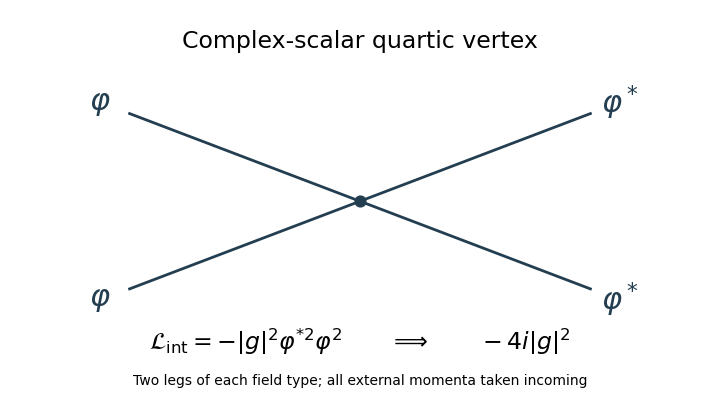

<h1 id="3/solution">Solution</h1>

↑ **Parent:** [3](../3.md)

**Chirality and the component expansion.** A [chiral superfield](../../../../../chiral-superfield.md) is constrained by

$$
\bar D_{\dot\alpha}\Phi=0.
$$

Use [left Grassmann derivatives](../../../../../left-grassmann-derivative.md). The sign from differentiating an odd factor matters:

$$
\bar\partial_{\dot\alpha}(\theta\sigma^\mu\bar\theta)
=-(\theta\sigma^\mu)_{\dot\alpha},\qquad
\bar D_{\dot\alpha}y^\mu=0.
$$

For a general [superfield](../../../../../superfield.md) written in coordinates $(y,\theta,\bar\theta)$, the odd chain rule consequently turns the given [superspace covariant derivative](../../../../../supersymmetric-covariant-derivative.md) into

$$
\bar D_{\dot\alpha}=-\bar\partial_{\dot\alpha}\big|_y.
$$

The chirality constraint removes the explicit $\bar\theta$ dependence at fixed $y$. There are only two components of $\theta$, and their [Grassmann algebra](../../../../../grassmann-algebra.md) allows at most a quadratic monomial. Its finite [chiral-superfield component expansion](../../../../../chiral-superfield-component-expansion.md) is therefore

$$
\boxed{\Phi(y,\theta)=\varphi(y)+\sqrt2\theta\psi(y)+\theta^2F_{\mathrm{aux}}(y).}
$$

Here $\varphi$ is a [complex scalar field](../../../../../complex-scalar-field.md), $\psi$ a [Weyl spinor](../../../../../weyl-spinor.md), and $F_{\mathrm{aux}}$ a complex [auxiliary field](../../../../../auxiliary-field.md); the last label avoids confusing it with the effective superpotential later. The factor $\sqrt2$ is the standard canonical component normalization. In ordinary coordinates the same statement is

$$
\Phi(x,\theta,\bar\theta)=
\exp\left(i\theta\sigma^\mu\bar\theta\,\partial_\mu\right)
\left[\varphi(x)+\sqrt2\theta\psi(x)+\theta^2F_{\mathrm{aux}}(x)\right].
$$

This translation exponential terminates because its shift is nilpotent; it displays the full component dependence without an unstated convention for the barred spinor square.

A [superspace covariant derivative](../../../../../supersymmetric-covariant-derivative.md) obeys the graded product rule. Since an ordinary scalar [chiral superfield](../../../../../chiral-superfield.md) is even, $\bar D(\Phi^n)=n\Phi^{n-1}\bar D\Phi=0$. Linear combinations prove the polynomial claim. More generally, a nonsingular [holomorphic function](../../../../../holomorphic-function.md) of chiral fields is chiral; inserting conjugate fields generally spoils this [holomorphic closure of chiral superfields](../../../../../holomorphic-closure-of-chiral-superfields.md).

**The superspace action.** For a real [Kähler potential](../../../../../kahler-potential.md) and a [holomorphic superpotential](../../../../../superpotential.md), the global chiral-field action has [Lagrangian density](../../../../../lagrangian-density.md)

$$
\boxed{\mathcal L=\int d^2\theta\,d^2\bar\theta\,
K(\Phi^\dagger,\Phi)
+\left[\int d^2\theta\,W(\Phi)+\mathrm{h.c.}\right].}
$$

Full [superspace integration](../../../../../superspace-integration.md) gives a [D-term](../../../../../d-term.md), and chiral [superspace integration](../../../../../superspace-integration.md) an [F-term](../../../../../f-term.md). The action is real, and its supersymmetry variations are spacetime total derivatives. For one field, positive $K_{\varphi\bar\varphi}$ and algebraic elimination give $V=K^{\varphi\bar\varphi}|W_\varphi|^2$. The [Wess–Zumino model](../../../../../wess-zumino-model.md) uses the canonical choice $K=\Phi^\dagger\Phi$ at tree level.

**Scalar potential and the vertex.** In canonical normalization, the auxiliary part of the [Lagrangian density](../../../../../lagrangian-density.md) is

$$
\mathcal L_{\mathrm{aux}}=|F_{\mathrm{aux}}|^2+
(F_{\mathrm{aux}}W_\varphi+\mathrm{h.c.}),\qquad
F_{\mathrm{aux}}=-\overline{W_\varphi}.
$$

Substitution leaves $\mathcal L_{\mathrm{aux}}=-|W_\varphi|^2$. Differentiating the given quadratic-plus-cubic [superpotential](../../../../../superpotential.md) therefore gives the tree-level [effective potential](../../../../../effective-potential.md)

$$
\boxed{V_{\mathrm{tree}}=|m\varphi+g\varphi^2|^2
=|m|^2|\varphi|^2+m^*g\varphi^*\varphi^2
+mg^*\varphi\varphi^{*2}+|g|^2|\varphi|^4.}
$$

This applies for complex $m,g$. In terms of canonically normalized real fields $\varphi=(A+iB)/\sqrt2$, phases may be chosen to make $m,g$ real, in which case

$$
V_{\mathrm{tree}}=\frac{m^2}{2}(A^2+B^2)
+\frac{mg}{\sqrt2}A(A^2+B^2)
+\frac{g^2}{4}(A^2+B^2)^2.
$$

The complex-field quartic interaction is $\mathcal L_{\mathrm{int}}=-|g|^2\varphi^{*2}\varphi^2$. There are two identical external legs of each field type. Differentiating with respect to those four fields, or counting the Wick attachments to the vertex, produces the factor $2!2!$:

$$
\boxed{\text{two }\varphi\text{ and two }\varphi^*\text{ legs}:
\quad -i\,2!2!|g|^2=-4i|g|^2.}
$$

The local [Feynman diagram](../../../../../feynman-diagram.md) for this [quartic complex-scalar vertex in the Wess–Zumino model](../../../../../quartic-complex-scalar-vertex-in-the-wess-zumino-model.md) is

**[Figure 1](#3/image-quartic-complex-scalar-wess-zumino-vertex-with-two-legs-of-each-field-type-and-its-factorial-normalized-feynman-rule). Quartic complex-scalar Wess–Zumino vertex with two legs of each field type and its factorial-normalized Feynman rule**.

If real-field [Feynman rules](../../../../../feynman-rule.md) are preferred, the $AAAA$ and $BBBB$ vertices are $-6i|g|^2$, while the $AABB$ vertex is $-2i|g|^2$. These are the same interaction in a different component basis. They should not be confused with a convention that absorbs $2!2!$ into the coefficient of the complex quartic term.

**Spurion symmetries.** Treat $m,g$ as chiral [spurions](../../../../../spurion.md). An ordinary $U(1)$ acts on $\Phi,m,g$ with charges $(1,-2,-3)$ and leaves $\theta$ neutral. An [R-symmetry](../../../../../r-symmetry.md) gives $\theta$ charge one and $\Phi,m,g$ charges $(1,0,-1)$. Thus

| Quantity | Ordinary $U(1)$ | $U(1)_R$ | Mass dimension |
| --- | --- | --- | --- |
| $\Phi$ | 1 | 1 | 1 |
| $m$ | $-2$ | 0 | 1 |
| $g$ | $-3$ | $-1$ | 0 |
| $\theta$ | 0 | 1 | $-1/2$ |
| $W$ | 0 | 2 | 3 |

Each superpotential term has ordinary charge zero and [R-charge](../../../../../r-charge.md) two; the chiral integration measure has [R-charge](../../../../../r-charge.md) minus two. In particular $m$ is neutral under the specified [R-symmetry](../../../../../r-symmetry.md). These are formal transformations of fields and parameters together, not two exact symmetries of a theory with arbitrary fixed nontransforming numerical couplings. This [Wess–Zumino spurion charge assignment](../../../../../wess-zumino-spurion-charge-assignment.md) is useful because it constrains possible quantum terms.

**The general holomorphic form.** Let $\mathcal F(\Phi,m,g)$ denote the local effective [superpotential](../../../../../superpotential.md), reserving $F_{\mathrm{aux}}$ for the auxiliary component. The [holomorphy argument for superpotential non-renormalization](../../../../../holomorphy-argument-for-superpotential-non-renormalization.md) permits dependence on the chiral [spurions](../../../../../spurion.md), not on their conjugates. The dimensionless combination $z=g\Phi/m$ is neutral under both formal symmetries, whereas $m\Phi^2$ has the required dimension and charges. Hence, for $m\ne0$, their most general allowed form is

$$
\boxed{\mathcal F(\Phi,m,g)=m\Phi^2 f\left(\frac{g\Phi}{m}\right),}
$$

with a holomorphic function $f$ before perturbative regularity and matching conditions are imposed. Equivalently, a monomial $m^a g^b\Phi^c$ must obey

$$
-2a-3b+c=0,\qquad -b+c=2,\qquad a+c=3.
$$

Solving gives $a=1-b$, $c=b+2$. Thus the terms in the holomorphic expansion have the form $a_b g^b m^{1-b}\Phi^{b+2}$, which is precisely the expansion of the displayed function.

**What is and is not renormalized.** Apply the [non-renormalization theorem](../../../../../non-renormalization-theorem.md) to a local [Wilsonian effective action](../../../../../wilsonian-effective-action.md) retaining the elementary field and a nonzero infrared cutoff. Perturbative coefficients are regular as $g\to0$ and $m\to0$: no massless infrared modes have been integrated all the way to zero momentum. Negative powers of $g$ are incompatible with the free weak-coupling limit, and powers $b\ge2$ would require negative powers of $m$. Only the quadratic and cubic structures survive this regularity test. Their coefficients cannot acquire a loop correction here: a quadratic term with no $g$ is the free-theory mass term, while a cubic term only linear in $g$ is already the tree interaction. A loop renormalizing that cubic term requires additional interaction insertions. Such a dependence is excluded by the holomorphic charge constraints; dependence on $g^*$ cannot repair it in a [superpotential](../../../../../superpotential.md). Matching to the specified tree action fixes

$$
f(z)=\frac12+\frac13z,\qquad
\boxed{\mathcal F_{\mathrm{pert}}=\frac12m\Phi^2+\frac13g\Phi^3.}
$$

The $m=0$ limit is taken in the final polynomial, not by evaluating the intermediate ratio $g\Phi/m$. **The holomorphic Wilsonian superpotential and its parameters $m,g$ receive no independent perturbative vertex renormalization.** Symmetries alone would only give the arbitrary function $f$; regularity and the free/tree matching are necessary to reach the stronger conclusion.

The [Kähler potential](../../../../../kahler-potential.md) is not protected by that theorem. In particular a corrected [kinetic term](../../../../../kinetic-term.md) $Z(\mu)\Phi^\dagger\Phi$ leads to [wave-function renormalization](../../../../../wave-function-renormalization.md). Writing $\Phi_c=Z^{1/2}\Phi$ in canonical normalization gives

$$
\boxed{m_c(\mu)=\frac{m}{Z(\mu)},\qquad
 g_c(\mu)=\frac{g}{Z(\mu)^{3/2}}.}
$$

These [holomorphic and canonically normalized superpotential couplings](../../../../../holomorphic-and-canonically-normalized-superpotential-couplings.md) distinguish the two senses of “renormalized”: the physical/canonically normalized parameters can run, entirely through the common field normalization, even when the holomorphic coefficients do not. The scalar effective potential can consequently receive quantum corrections through the [Kähler potential](../../../../../kahler-potential.md). Nor does the local perturbative statement automatically apply to infrared-singular one-particle-irreducible actions or to integrating out whole massive fields. **Non-renormalization protects the local holomorphic F-term, not the complete quantum action or every physically normalized mass and coupling.**

## ↑ Ancestors (10)

1. [3](../3.md)
2. [Paper 43](../../paper-43-split.md)
3. [Iii](../../split.md)
4. [2013](../../../split.md)
5. [Past exam of the mathematics course of the University of Cambridge](../../../../split.md)
6. [Mathematics course of the University of Cambridge](../../../../../mathematics-course-of-the-university-of-cambridge.md)
7. [Course of the University of Cambridge](../../../../../course-of-the-university-of-cambridge.md)
8. [University of Cambridge](../../../../../university-of-cambridge-split.md)
9. [List of universities](../../../../../list-of-universities.md)
10. [Codex Wiki](../../../../../split.md)
