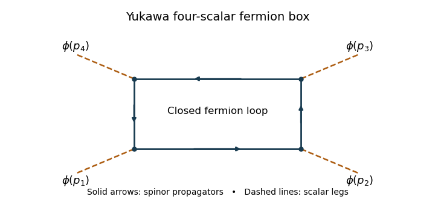

<h1 id="2/solution">Solution</h1>

↑ **Parent:** [2](../2.md)

Normalize the vacuum [path integral](../../../../../path-integral.md) by $Z[0]$. The scalar [two-point correlation function](../../../../../two-point-correlation-function.md) is $Z[0]^{-1}\int\mathcal D\phi\,\phi(x)\phi(0)e^{iS_F}$, and the spinor [two-point correlation function](../../../../../two-point-correlation-function.md) is $Z[0]^{-1}\int\mathcal D\psi\mathcal D\bar\psi\,\psi(x)\bar\psi(0)e^{iS_F}$. Vacuum boundary conditions make these time-ordered [Feynman propagators](../../../../../feynman-propagator.md). After [integration by parts](../../../../../integration-by-parts.md), the scalar quadratic [action](../../../../../action.md) is $-\frac12\int\phi(-\partial^2+m^2)\phi$.

The [Schwinger-Dyson equation](../../../../../schwinger-dyson-equation.md) follows by integrating a [functional derivative](../../../../../functional-derivative.md) of $\phi(0)e^{iS_F}$: the derivative of the insertion supplies $\delta^d(x)$, and the [action](../../../../../action.md) derivative supplies the kinetic operator. The analogous [left Grassmann derivative](../../../../../left-grassmann-derivative.md) calculation, or differentiation of the [Grassmann Gaussian integral](../../../../../grassmann-gaussian-integral.md), gives

$$
(-\partial^2+m^2)G_\phi(x)=-i\delta^d(x),\qquad(\gamma^\mu\partial_\mu+M)G_\psi(x)=-i\delta^d(x).
$$

Using $\partial_\mu\mapsto ip_\mu$ and the [Clifford algebra](../../../../../clifford-algebra.md), $(i\gamma\cdot p+M)(-i\gamma\cdot p+M)=p^2+M^2$. Consequently

$$
\boxed{G_\phi(p)=\frac{-i}{p^2+m^2-i0},\qquad G_\psi(p)=\frac{-i(-i\gamma\cdot p+M)}{p^2+M^2-i0}.}
$$

The free [quantum effective action](../../../../../effective-action.md) is quadratic, so all scalar [one-particle-irreducible vertices](../../../../../one-particle-irreducible-vertex.md) with $n>2$ vanish. Its two-point vertex is the stated inverse kinetic form $-p^2-m^2$.

For the [Yukawa interaction](../../../../../yukawa-interaction.md), two vertices contribute $(-iy)^2$, and a closed [fermion loop](../../../../../fermion-loop.md) contributes an extra minus sign. Tracing the two spinor numerators gives $4[M^2-k\cdot(k-p)]$, since the one-gamma traces vanish. Removing the overall $i$ from the amplitude gives the displayed loop integral. Define

$$
I(M)=\frac1{(2\pi)^di}\int\frac{d^dk}{k^2+M^2-i0},\quad
J(p;M)=\frac1{(2\pi)^di}\int\frac{d^dk}{(k^2+M^2-i0)((k-p)^2+M^2-i0)}.
$$

The numerator decomposition and translation invariance of [dimensional regularization](../../../../../dimensional-regularization.md) reduce it to

$$
\widehat\tau_2^{(1)}=-4y^2\left[\left(2M^2+\frac{p^2}2\right)J(p;M)-I(M)\right].
$$

The supplied tadpole [pole](../../../../../pole.md) is $I(M)\sim-2M^2/(\varepsilon16\pi^2)$. A [Feynman parameter](../../../../../feynman-parameter.md) combines the two bubble denominators. Shifting its loop momentum gives mass squared $M^2+x(1-x)p^2$; differentiating the tadpole integral with respect to this squared mass gives the double-denominator [pole](../../../../../pole.md) $2/(\varepsilon16\pi^2)$, independent of $x$. Thus $J(p;M)\sim2/(\varepsilon16\pi^2)$ and

$$
\boxed{\widehat\tau_2^{(1)}\sim-\frac{y^2}{\varepsilon16\pi^2}(4p^2+24M^2),\qquad a=4,\quad b=24.}
$$

The [counterterms](../../../../../counterterm.md) contribute $-Ap^2-B$, so their minimal [pole](../../../../../pole.md) parts are

$$
A=-\frac{4y^2}{\varepsilon16\pi^2},\qquad B=-\frac{24y^2M^2}{\varepsilon16\pi^2}.
$$

Combining the kinetic terms gives [wavefunction renormalization](../../../../../wave-function-renormalization.md) $Z_\phi=1+A$, and combining the mass terms gives $Z_\phi m_0^2=m^2+B$. Therefore

$$
\boxed{Z_\phi=1-\frac{4y^2}{\varepsilon16\pi^2},\qquad m_0^2=\frac{m^2+B}{Z_\phi}.}
$$

These are the [Yukawa scalar self-energy pole coefficients](../../../../../yukawa-scalar-self-energy-pole-coefficients.md); finite parts depend on the chosen [renormalization condition](../../../../../renormalization-condition.md).

The four-point graph is a [Yukawa fermion box](../../../../../yukawa-fermion-box.md), with four external scalar legs attached to a closed spinor loop:

**[Figure 1](#2/image-fermion-box-with-four-external-scalar-legs-in-a-yukawa-theory). Fermion box with four external scalar legs in a Yukawa theory**.

Each high-momentum [dirac propagator](../../../../../dirac-propagator.md) is $O(k^{-1})$. The product of four is $O(k^{-4})$, and the leading [gamma matrix trace identities](../../../../../gamma-matrix-trace-identities.md) is nonzero. The four-dimensional radial integral therefore contains $\int^\infty dk/k$: a logarithmic [ultraviolet divergence](../../../../../ultraviolet-divergence.md). This local four-scalar divergence cannot be absorbed by scalar mass or field normalization. Add $-\lambda\phi^4/4!$, and, using the stipulated four-point [pole](../../../../../pole.md) normalization, take $\delta\lambda=-8y^4/(\varepsilon16\pi^2)$ so that $-\delta\lambda$ cancels it.

For literal cancellation of every one-loop divergence with $M\ne0$, [counterterm closure of a massive Yukawa theory](../../../../../counterterm-closure-of-a-massive-yukawa-theory.md) also requires the allowed scalar linear and cubic terms. A constant scalar background shifts the fermion mass to $M+y\phi$; the divergent local fermion contribution contains a polynomial proportional to $(M+y\phi)^4$. Its linear and cubic terms are not forbidden by a symmetry when the fermion mass is nonzero. A closed renormalizable family therefore has

$$
\mathcal L=-\frac12(\partial\phi)^2-\bar\psi(\gamma\cdot\partial+M)\psi-y\bar\psi\psi\phi-V(\phi),\qquad
V(\phi)=\Lambda+h\phi+\frac{m^2}2\phi^2+\frac{\kappa}{3!}\phi^3+\frac\lambda{4!}\phi^4,
$$

with field, mass and coupling redefinitions for both scalar and spinor fields. A tadpole condition can set the renormalized $h$ to zero, but its [counterterm](../../../../../counterterm.md) still exists. The vacuum constant is needed if vacuum energy is retained. If an exact discrete chiral symmetry is imposed with $M=0$, the scalar potential can be even and the odd terms are forbidden; the essential new interaction is then the quartic one.

## ↑ Ancestors (10)

1. [2](../2.md)
2. [Paper 44](../../paper-44-split.md)
3. [Iii](../../split.md)
4. [2013](../../../split.md)
5. [Past exam of the mathematics course of the University of Cambridge](../../../../split.md)
6. [Mathematics course of the University of Cambridge](../../../../../mathematics-course-of-the-university-of-cambridge.md)
7. [Course of the University of Cambridge](../../../../../course-of-the-university-of-cambridge.md)
8. [University of Cambridge](../../../../../university-of-cambridge-split.md)
9. [List of universities](../../../../../list-of-universities.md)
10. [Codex Wiki](../../../../../split.md)
