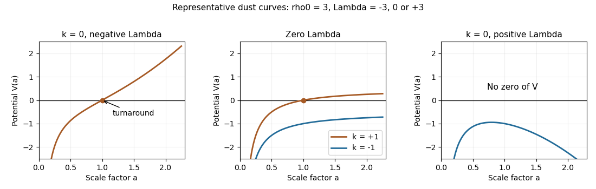

<h1 id="1/a/solution">Solution</h1>

↑ **Parent:** [A](../a.md)

Assume positive fluid density, $\rho_0>0$, and write $m=1+3w>0$. A [perfect fluid](../../../../../../perfect-fluid.md) with constant [equation of state](../../../../../../equation-of-state.md) obeys the [cosmological perfect-fluid continuity equation](../../../../../../cosmological-perfect-fluid-continuity-equation.md), giving

$$
\dot\rho+3H(\rho+P)=0,\qquad\rho=\rho_0a^{-3(1+w)}.
$$

In the stated units the [Friedmann equation](../../../../../../friedmann-equations.md) is $H^2=\rho/3-k/a^2+\Lambda/3$. Multiplication by $a^2/2$ yields the [Friedmann effective potential for a constant-equation-of-state fluid](../../../../../../friedmann-effective-potential-for-a-constant-equation-of-state-fluid.md),

$$
\boxed{\tfrac12\dot a^2+V(a)=0,\qquad V(a)=-\frac{\rho_0}{6}a^{-m}+\frac{k}{2}-\frac{\Lambda}{6}a^2}.
$$

The allowed region has $V\leq0$. The [Friedmann acceleration equation](../../../../../../friedmann-acceleration-equation.md) is equivalently $\ddot a=-V'(a)$, including turning points by continuity. Thus a zero-energy mechanical trajectory reproduces the cosmological evolution, with $a>0$.

For $k=0$, $\Lambda<0$, the potential increases strictly from negative infinity to positive infinity. Its unique zero gives

$$
\boxed{a_{\max}=\left(\frac{\rho_0}{|\Lambda|}\right)^{1/[3(1+w)]}}.
$$

Expansion from the [Big Bang](../../../../../../big-bang.md) stops there, with negative acceleration, then reverses into a [Big Crunch](../../../../../../big-crunch.md). Both the turning point and the final singularity occur in finite [proper time](../../../../../../proper-time.md): $dt=da/\sqrt{-2V}$ is integrable near a simple turning point and behaves as a constant times $a^{m/2}da$ near zero.

For $\Lambda=0$, $k=+1$, $V$ increases from negative infinity to $1/2$ and crosses zero at

$$
\boxed{a_{\max}=\left(\frac{\rho_0}{3}\right)^{1/(1+3w)}}.
$$

This is again expansion followed by finite-time recollapse. For $k=-1$, the same increasing curve has asymptote $-1/2$ and never meets zero. Expansion continues without a finite maximum; asymptotically $\dot a\to1$ and $a\sim t$, as spatial curvature dominates the diluted fluid.

For $k=0$, $\Lambda>0$, $V$ tends to negative infinity at both ends. It has a maximum at

$$
a_*^{m+2}=\frac{m\rho_0}{2\Lambda},\qquad
V(a_*)=-\frac{(m+2)\rho_0}{12}a_*^{-m}<0.
$$

There is no turning point. Expansion initially decelerates, then accelerates once $a>a_*$, and approaches [de Sitter spacetime](../../../../../../de-sitter-spacetime.md) expansion $a\propto e^{\sqrt{\Lambda/3}\,t}$. Thus **positive flat dark-energy expansion is unbounded; negative flat dark energy and positive curvature without dark energy recollapse**.

**[Figure 1](#1/a/image-zero-energy-friedmann-potentials-showing-recollapse-curvature-dominated-expansion-and-positive-cosmological-constant-expansion). Zero-energy Friedmann potentials showing recollapse, curvature-dominated expansion and positive-cosmological-constant expansion**.

## ↑ Ancestors (11)

1. [A](../a.md)
2. [1](../../1.md)
3. [Paper 48](../../../paper-48-split.md)
4. [Iii](../../../split.md)
5. [2013](../../../../split.md)
6. [Past exam of the mathematics course of the University of Cambridge](../../../../../split.md)
7. [Mathematics course of the University of Cambridge](../../../../../../mathematics-course-of-the-university-of-cambridge.md)
8. [Course of the University of Cambridge](../../../../../../course-of-the-university-of-cambridge.md)
9. [University of Cambridge](../../../../../../university-of-cambridge-split.md)
10. [List of universities](../../../../../../list-of-universities.md)
11. [Codex Wiki](../../../../../../split.md)
