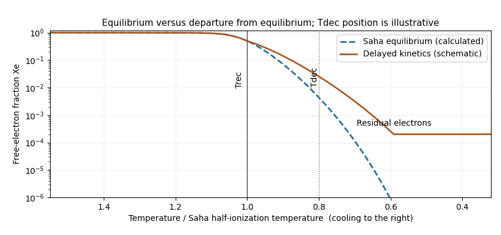

<h1 id="2/c/solution">Solution</h1>

↑ **Parent:** [C](../c.md)

[Photon decoupling](../../../../../../photon-decoupling.md) is a dynamical loss of frequent scattering, distinct from the chemical conversion of charged particles into neutral atoms. Before recombination, [Thomson scattering](../../../../../../thomson-scattering.md) on free [Electrons](../../../../../../electron.md) keeps [photons](../../../../../../photon.md) coupled to the baryon plasma. The physical scattering rate is

$$
\Gamma_\gamma=n_e\sigma_T=X_en_b\sigma_T,
$$

in units with $c=1$. Define the approximate decoupling [temperature](../../../../../../temperature.md) by

$$
\boxed{\Gamma_\gamma(T_{\rm dec})\simeq H(T_{\rm dec})}.
$$

Equivalently the [photon](../../../../../../photon.md) mean scattering time becomes comparable to an expansion time. A refined last-scattering definition uses the optical depth and the maximum of the visibility function; it need not coincide exactly with the local rate criterion. As $X_e$ falls, scattering becomes inefficient, ordinarily after the half-ionized recombination stage, so $T_{\rm dec}<T_{\rm rec}$.

[Residual electron freeze-out](../../../../../../residual-electron-freeze-out.md) concerns the remaining ionized fraction. The [Saha equation](../../../../../../saha-ionization-equation.md) presumes sufficiently rapid forward and reverse reactions to maintain [chemical equilibrium](../../../../../../chemical-equilibrium.md). Real recombination is slowed by radiative bottlenecks and expansion; the free-electron fraction can therefore exceed its equilibrium value. Eventually the effective recombination rate per free [Electron](../../../../../../electron.md), roughly $\alpha_{\rm eff}(T)n_e$, falls below $H$. The remaining [Electrons](../../../../../../electron.md) cannot all find and recombine with [protons](../../../../../../proton.md) within an expansion time. A small nonzero residual fraction survives while the Saha prediction decreases exponentially toward zero.

The sketch shows this lag and residual floor. Its kinetic curve and the position of the decoupling marker are schematic: the data supplied determine the equilibrium curve, but not a quantitative recombination history or an exact $T_{\rm dec}$. Determining those needs the expansion history and atomic transition rates. The horizontal axis decreases toward the right to follow cosmological cooling.

**[Figure 2](#2/c/image-saha-equilibrium-and-a-schematic-delayed-recombination-curve-with-recombination-and-photon-decoupling-temperatures-marked-during-cooling). Saha equilibrium and a schematic delayed recombination curve, with recombination and photon-decoupling temperatures marked during cooling**.

## ↑ Ancestors (11)

1. [C](../c.md)
2. [2](../../2.md)
3. [Paper 48](../../../paper-48-split.md)
4. [Iii](../../../split.md)
5. [2013](../../../../split.md)
6. [Past exam of the mathematics course of the University of Cambridge](../../../../../split.md)
7. [Mathematics course of the University of Cambridge](../../../../../../mathematics-course-of-the-university-of-cambridge.md)
8. [Course of the University of Cambridge](../../../../../../course-of-the-university-of-cambridge.md)
9. [University of Cambridge](../../../../../../university-of-cambridge-split.md)
10. [List of universities](../../../../../../list-of-universities.md)
11. [Codex Wiki](../../../../../../split.md)
