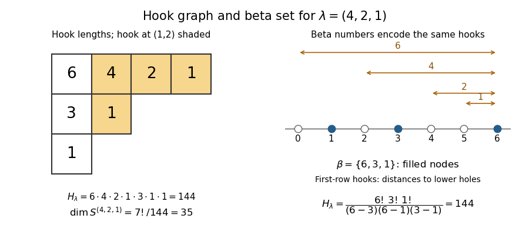

<h1 id="5/solution">Solution</h1>

↑ **Parent:** [5](../5.md)

For a box $(i,j)$ of a [Young diagram](../../../../../young-diagram.md), its [hook of a Young diagram](../../../../../hook-of-a-young-diagram.md) contains that box, all boxes to its right in its row, and all boxes below it in its column. Its [hook length](../../../../../hook-length.md) is $h_{ij}=\lambda_i-j+\lambda'_j-i+1$. The [hook graph of a partition](../../../../../hook-graph-of-a-partition.md) is the diagram with each box labeled by its hook length. Write $H_\lambda=\prod_{(i,j)\in\lambda}h_{ij}$ for the [hook product of a partition](../../../../../hook-product-of-a-partition.md). The [hook-length formula](../../../../../hook-length-formula.md) is

$$
\boxed{f^\lambda=\dim S^\lambda=\frac{n!}{H_\lambda},\qquad n=|\lambda|.}
$$

**[Figure 1](#5/image-hook-lengths-for-the-partition-4-2-1-with-the-four-box-hook-at-1-2-highlighted). Hook lengths for the partition (4,2,1), with the four-box hook at (1,2) highlighted**.

Pad $\lambda$ to $m$ rows and use the [beta set of a partition](../../../../../beta-set-of-a-partition.md) $\ell_i=\lambda_i+m-i$, so $\ell_1>\cdots>\ell_m\ge0$ and $\sum_i\ell_i=n+d$, where $d=\binom m2$. We prove the [beta-set hook-product identity](../../../../../beta-set-hook-product-identity.md) row by row. For $1\le j\le\lambda_i$, put $q_j=m+j-\lambda'_j-1$; then $h_{ij}=\ell_i-q_j$. The $q_j$ are distinct integers in $[0,\ell_i-1]$, and none equals a beta number. Indeed, if $k\le\lambda'_j$ then $\ell_k\ge q_j+1$, whereas if $k>\lambda'_j$ then $\ell_k\le q_j-1$. Exactly $m-i$ beta numbers lie below $\ell_i$, so the remaining $\lambda_i$ integers in that interval are precisely these $q_j$. Therefore

$$
\prod_{j=1}^{\lambda_i}h_{ij}=\frac{\ell_i!}{\prod_{k>i}(\ell_i-\ell_k)},\qquad
H_\lambda=\frac{\prod_i\ell_i!}{\Delta(\ell)},\qquad
\Delta(x)=\prod_{i<j}(x_i-x_j).
$$

This gives the equivalent [Specht module](../../../../../specht-module.md) dimension expression $f^\lambda=n!\Delta(\ell)/\prod_i\ell_i!$.

The standard [Young tableaux](../../../../../young-tableau.md) of shape $\lambda$ form the dimension count for the [Specht module](../../../../../specht-module.md). The largest entry $n$ must occupy a removable corner. Deleting it bijects tableaux with the disjoint union of standard tableaux of the shapes obtained by deleting a corner, proving

$$
f^\lambda=\sum_{i=1}^m f^{\lambda-e_i}.
$$

Set a term to zero whenever $\lambda-e_i$ is not a partition: this includes equal adjacent rows and an attempted deletion from a zero row. The empty diagram has dimension $1$.

For an algebraic proof that the proposed formula has the same recurrence, establish the [Vandermonde shift identity](../../../../../vandermonde-shift-identity.md)

$$
\sum_{i=1}^m x_i\Delta(x_1,\ldots,x_i+t,\ldots,x_m)
=\left(\sum_i x_i+dt\right)\Delta(x).
$$

Its left side is an [alternating polynomial](../../../../../alternating-polynomial.md) in the $x_i$, because permuting the variables permutes the summands and changes the sign of every Vandermonde factor. It is therefore divisible by $\Delta(x)$. The quotient is symmetric in $x$ and homogeneous of total degree one in $(x,t)$, so has the form $a\sum_i x_i+bt$. At $t=0$, $a=1$. Differentiating in $t$ at zero and using the [Euler theorem for homogeneous functions](../../../../../euler-theorem-for-homogeneous-functions.md) gives $\sum_i x_i\partial_i\Delta=d\Delta$, so $b=d$. This proves the identity as a [polynomial](../../../../../polynomial-split.md) identity, including repeated coordinates.

Take $x=\ell$ and $t=-1$. Since $\sum_i\ell_i=n+d$, it gives $\sum_i\ell_i\Delta(\ell-e_i)=n\Delta(\ell)$. For $n\ge1$, this is exactly

$$
\sum_i \frac{(n-1)!\,\ell_i\Delta(\ell-e_i)}{\prod_j\ell_j!}
=\frac{n!\Delta(\ell)}{\prod_j\ell_j!}.
$$

The summand is the proposed dimension for $\lambda-e_i$; if two beta numbers collide its Vandermonde is zero, and if $\ell_i=0$ its coefficient is zero, so no negative factorial is needed. For the empty partition, $\ell=(m-1,\ldots,0)$ and $\Delta(\ell)=\prod_{k=0}^{m-1}k!$, giving initial value $1$. Induction now proves the [hook-length formula](../../../../../hook-length-formula.md) from the tableau recurrence.

For the final sum, tuples with repeated coordinates contribute zero. Sorting each distinct nonnegative tuple with sum $\binom{m+1}{2}$ gives one beta set of a partition of size $m$, since subtracting the staircase removes $\binom m2$ from the sum. Conversely every partition of $m$, padded to $m$ rows, supplies exactly $m!$ ordered tuples, with the same squared summand. Hence the [square-sum identity for shifted partition coordinates](../../../../../square-sum-identity-for-shifted-partition-coordinates.md) is

$$
\sum_{\substack{\ell_i\ge0\\\sum_i\ell_i=m(m+1)/2}}\frac{\Delta(\ell)^2}{\prod_i(\ell_i!)^2}
=\frac{m!}{(m!)^2}\sum_{\lambda\vdash m}(f^\lambda)^2
=\frac{m!}{(m!)^2}\dim\mathbb CS_m=\boxed{1}.
$$

The middle equality uses the [Artin–Wedderburn theorem](../../../../../artin-wedderburn-theorem.md) for the [group algebra](../../../../../group-algebra.md) and the complete classification of its [simple modules](../../../../../irreducible-module.md) by [Specht modules](../../../../../specht-module.md). It explains why the last identity is a representation-dimension count rather than an accidental cancellation.

## ↑ Ancestors (10)

1. [5](../5.md)
2. [Paper 5](../../paper-5-split.md)
3. [Iii](../../split.md)
4. [2013](../../../split.md)
5. [Past exam of the mathematics course of the University of Cambridge](../../../../split.md)
6. [Mathematics course of the University of Cambridge](../../../../../mathematics-course-of-the-university-of-cambridge.md)
7. [Course of the University of Cambridge](../../../../../course-of-the-university-of-cambridge.md)
8. [University of Cambridge](../../../../../university-of-cambridge-split.md)
9. [List of universities](../../../../../list-of-universities.md)
10. [Codex Wiki](../../../../../split.md)
