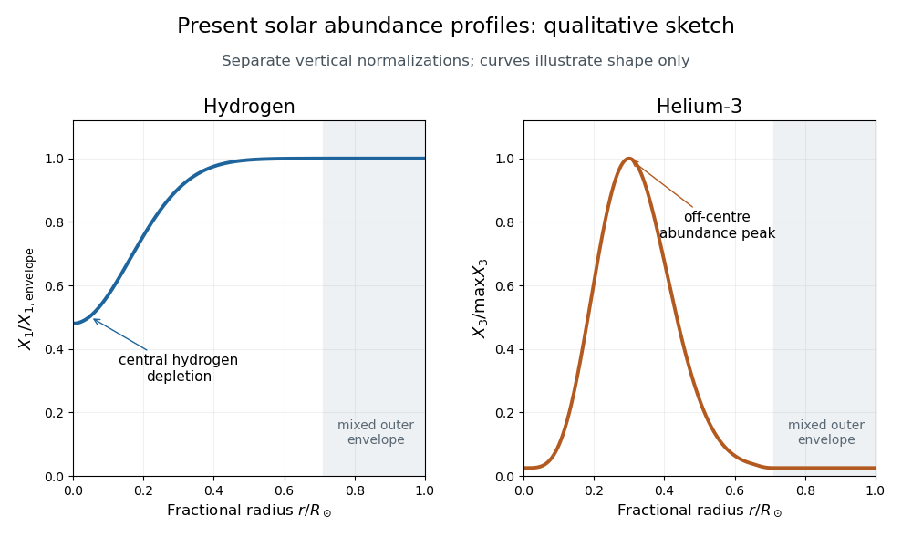

<h1 id="3/solution">Solution</h1>

↑ **Parent:** [3](../3.md)

The supplied rate law gives a local logarithmic [temperature](../../../../../temperature.md) sensitivity, evaluated at fixed [number densities](../../../../../number-density.md). Since $\eta\propto T^{-1/3}$,

$$
\frac{d\log\lambda_{ij}}{d\log T}=2\frac{d\log\eta}{d\log T}-\frac{d\eta}{d\log T}=\frac{\eta-2}{3}.
$$

Thus a power law here describes the tangent logarithmic slope near the chosen [temperature](../../../../../temperature.md), not an exact power law over all temperatures. For the three reactions, the factors $AZ_i^2Z_j^2$ are $1/2$, $24$ and $192/7$, respectively. At $T_6=15$ the [local temperature exponent of a thermonuclear reaction](../../../../../local-temperature-exponent-of-a-thermonuclear-reaction.md) gives

$$
\begin{array}{c|c|c}
\text{reaction}&\eta&d\log r/d\log T\\\hline
11&13.67&\alpha=3.89\\
33&49.68&\beta=15.89\\
34&51.95&\gamma=16.65
\end{array}
$$

Hence **$\alpha\simeq4$, $\beta\simeq16$, $\gamma\simeq16$ and $\gamma>\beta$**. The larger reduced mass for reaction 34 produces the last inequality. Composition changes contribute separately to an evolving reaction rate; they are held fixed for this derivative.

For the [effective proton-proton reaction network](../../../../../effective-proton-proton-reaction-network.md), let the event rates be

$$
R_{11}=\tfrac12\lambda_{11}n_1^2,\quad R_{21}=\lambda_{21}n_2n_1,\quad
R_{33}=\tfrac12\lambda_{33}n_3^2,\quad R_{34}=\lambda_{34}n_3n_4,\quad R_{17}=\lambda_{17}n_1n_7.
$$

The factors of one half count identical pairs once. Event 11 consumes two [protons](../../../../../proton.md) and makes one deuteron; event 21 consumes a deuteron and a [proton](../../../../../proton.md) and makes [helium-3](../../../../../helium-3.md); event 33 consumes two [helium-3](../../../../../helium-3.md) nuclei and makes one [helium-4](../../../../../helium-4.md) nucleus and two [protons](../../../../../proton.md). Under the stipulated fast-capture approximation, event 34 consumes [helium-3](../../../../../helium-3.md) and [helium-4](../../../../../helium-4.md) and supplies one mass-seven nucleus, and event 17 consumes that lithium-7 nucleus and a [proton](../../../../../proton.md) and makes two [helium-4](../../../../../helium-4.md) nuclei. Therefore

$$
\boxed{\begin{aligned}
\dot n_1&=-\lambda_{11}n_1^2-\lambda_{21}n_2n_1+\lambda_{33}n_3^2-\lambda_{17}n_1n_7,\\
\dot n_2&=\tfrac12\lambda_{11}n_1^2-\lambda_{21}n_2n_1,\\
\dot n_3&=\lambda_{21}n_2n_1-\lambda_{33}n_3^2-\lambda_{34}n_3n_4,\\
\dot n_4&=\tfrac12\lambda_{33}n_3^2-\lambda_{34}n_3n_4+2\lambda_{17}n_1n_7.
\end{aligned}}
$$

For closure, $\dot n_7=\lambda_{34}n_3n_4-\lambda_{17}n_1n_7$. The stoichiometry conserves $n_1+2n_2+3n_3+4n_4+7n_7$, the baryon [number density](../../../../../number-density.md) at fixed volume. In particular the mass-seven capture produces two [helium-4](../../../../../helium-4.md) nuclei, not one.

The beryllium-to-lithium step is [electron capture](../../../../../electron-capture.md). Eliminating beryllium assumes that its capture flux tracks its production on the slow evolutionary timescale. More generally one retains $\dot n_{\rm Be}=R_{34}-\lambda_e n_{\rm Be}$ and $\dot n_7=\lambda_e n_{\rm Be}-R_{17}$; setting the former to zero gives the effective equation used above. Fast capture relative to slow evolution alone would not prove that lithium exceeds beryllium: if both reach steady state their ratio is $n_{\rm Be}/n_7=\lambda_{17}n_1/\lambda_e$. The mass-seven abundance assertion is thus part of the stipulated schematic limit, not a consequence to impose on every detailed solar model.

The enormous separation between the one-second [deuterium](../../../../../deuterium.md) destruction time and the other stated timescales justifies [deuterium quasi-equilibrium in proton-proton burning](../../../../../deuterium-quasi-equilibrium-in-proton-proton-burning.md):

$$
\dot n_2\simeq0,\qquad\lambda_{21}n_2n_1\simeq\tfrac12\lambda_{11}n_1^2,\qquad n_2\simeq\frac{\lambda_{11}n_1}{2\lambda_{21}}.
$$

Substitution gives

$$
\boxed{\dot n_1\simeq-\tfrac32\lambda_{11}n_1^2+\lambda_{33}n_3^2-\lambda_{17}n_1n_7,\qquad
\dot n_3\simeq\tfrac12\lambda_{11}n_1^2-\lambda_{33}n_3^2-\lambda_{34}n_3n_4.}
$$

The approximation is to the rapidly adjusting intermediate abundance, not to the slow [proton](../../../../../proton.md) abundance.

Near the centre the [helium-3](../../../../../helium-3.md) relaxation time is also short compared with solar age and with the timescale of significant [hydrogen](../../../../../hydrogen.md) evolution. Put $A=\lambda_{33}$, $B=\lambda_{34}n_4$ and $C=\lambda_{11}n_1^2/2$. For slowly varying background quantities, the stable positive root of $An_3^2+Bn_3-C=0$ gives the [helium-3 equilibrium abundance](../../../../../helium-3-equilibrium-abundance.md)

$$
\boxed{n_{3e}=-\frac{\lambda_{34}n_4}{2\lambda_{33}}+\sqrt{\left(\frac{\lambda_{34}n_4}{2\lambda_{33}}\right)^2+\frac{\lambda_{11}n_1^2}{2\lambda_{33}}}.}
$$

The other root is negative and unphysical. The production-minus-destruction function decreases strictly with positive $n_3$, so this is the unique attracting equilibrium. For $n_3=n_{3e}+x$, with the background held fixed during relaxation,

$$
\dot x=-(2\lambda_{33}n_{3e}+\lambda_{34}n_4)x-\lambda_{33}x^2.
$$

Dropping the quadratic perturbation term gives the [helium-3 relaxation time](../../../../../helium-3-relaxation-time.md)

$$
\boxed{\dot x=-\frac x\tau,\qquad\tau=(2\lambda_{33}n_{3e}+\lambda_{34}n_4)^{-1},\qquad x(t)=x(0)e^{-t/\tau}.}
$$

If the equilibrium itself evolves slowly, an additional forcing term $-\dot n_{3e}$ appears; tracking is accurate when this drift is small over one relaxation time. The given central value $6\times10^5$ years is much shorter than the roughly $4.6\times10^9$-year age of the [Sun](../../../../../sun.md).

To estimate the [temperature for helium-3 freeze-out](../../../../../temperature-for-helium-3-freeze-out.md), take the cooler pp-I-dominated regime and keep the background [proton](../../../../../proton.md) [mass density](../../../../../density.md) approximately fixed for this order-of-magnitude scaling. Then

$$
n_{3e}\simeq n_1\sqrt{\frac{\lambda_{11}}{2\lambda_{33}}},\qquad
\tau^{-1}\simeq n_1\sqrt{2\lambda_{11}\lambda_{33}}.
$$

Using the local exponents four and sixteen, this gives **$n_{3e}\propto T^{-6}$ and $\tau\propto T^{-10}$**, not $\tau\propto T^{-16}$: the equilibrium abundance changes with [temperature](../../../../../temperature.md). Normalizing at the central [temperature](../../../../../temperature.md) gives

$$
\tau(T)\simeq6\times10^5\left(\frac{T}{1.5\times10^7\,\mathrm K}\right)^{-10}\mathrm{yr}.
$$

Setting this equal to solar age yields

$$
\boxed{T\simeq1.5\times10^7\left(\frac{6\times10^5}{4.6\times10^9}\right)^{1/10}\mathrm K\simeq6.1\times10^6\,\mathrm K.}
$$

This is the requested power-law estimate. The exponents were evaluated locally at the central [temperature](../../../../../temperature.md), so extrapolation over this large range is approximate. Keeping the supplied full exponential rate factors in the same fixed-density pp-I estimate gives

$$
\frac{\tau(T)}{\tau(T_c)}=\left(\frac{T}{T_c}\right)^{2/3}\exp\left[\frac{\eta_{11,c}+\eta_{33,c}}2\left(\left(\frac{T_c}{T}\right)^{1/3}-1\right)\right],
$$

which gives about $6.8\times10^6\,\mathrm K$. Thus the robust scale is **a few million kelvin, roughly six to seven million in these estimates**. A unique precise solar transition [temperature](../../../../../temperature.md) cannot be obtained from the given numbers without the [mass density](../../../../../density.md), composition and pp-II contribution as functions of radius.

Finally, use mass fractions $X_i\simeq i m_un_i/\rho$. The [hydrogen mass fraction](../../../../../hydrogen-mass-fraction.md) is depleted most strongly in the central burning region, so $X_1$ increases outward and approaches the nearly unprocessed envelope value. Convective mixing makes the outer envelope composition approximately uniform.

In the hot core [helium-3](../../../../../helium-3.md) is quickly destroyed and remains close to its small equilibrium abundance. Moving outward, its destruction rates fall much faster than its production rate, so the equilibrium ratio $n_{3e}/n_1\propto T^{-6}$ rises. Where the relaxation time becomes comparable with solar age the abundance ceases to follow that rising equilibrium. Farther out, production itself becomes too slow to accumulate much [helium-3](../../../../../helium-3.md), so $X_3$ falls again toward the envelope value. The result is a broad off-centre maximum, rather than a central maximum. These are the [solar hydrogen and helium-3 abundance profiles](../../../../../solar-hydrogen-and-helium-3-abundance-profiles.md) requested by the sketch.

**[Figure 1](#3/image-schematic-present-solar-hydrogen-and-helium-3-radial-abundance-profiles-showing-central-hydrogen-depletion-and-the-off-centre-helium-3-maximum-with-separate-normalizations). Schematic present solar hydrogen and helium-3 radial abundance profiles, showing central hydrogen depletion and the off-centre helium-3 maximum with separate normalizations**.

**[hydrogen](../../../../../hydrogen.md) rises from a depleted centre to an almost uniform envelope; [helium-3](../../../../../helium-3.md) has a small central abundance and an off-centre peak before declining outward.** The figure shows qualitative shapes with independently normalized vertical axes, not a fitted or computed solar model.

## ↑ Ancestors (10)

1. [3](../3.md)
2. [Paper 53](../../paper-53-split.md)
3. [Iii](../../split.md)
4. [2013](../../../split.md)
5. [Past exam of the mathematics course of the University of Cambridge](../../../../split.md)
6. [Mathematics course of the University of Cambridge](../../../../../mathematics-course-of-the-university-of-cambridge.md)
7. [Course of the University of Cambridge](../../../../../course-of-the-university-of-cambridge.md)
8. [University of Cambridge](../../../../../university-of-cambridge-split.md)
9. [List of universities](../../../../../list-of-universities.md)
10. [Codex Wiki](../../../../../split.md)
