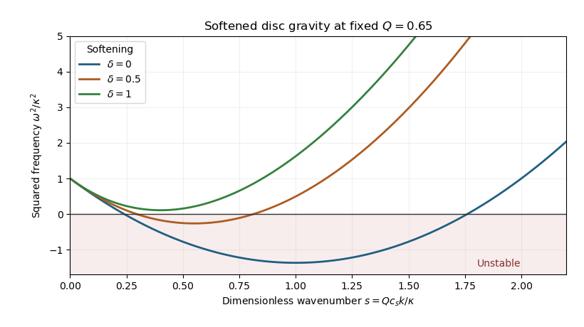

<h1 id="2/d/solution">Solution</h1>

↑ **Parent:** [D](../d.md)

Assume $\kappa,c_s,\Sigma_0>0$, and use the positive [Toomre parameter](../../../../../../toomre-parameter.md). The dimensionless dispersion relation is

$$
\frac{\omega^2}{\kappa^2}=1+\frac{s^2-2se^{-\delta s}}{Q^2}.
$$

At fixed dimensionless [gravitational softening](../../../../../../gravitational-softening.md) $\delta$, maximum growth corresponds to maximizing $F(s)=2se^{-\delta s}-s^2$. Differentiating gives the [most unstable softened disk wavenumber](../../../../../../most-unstable-softened-disk-wavenumber.md)

$$
\boxed{s_*=e^{-\delta s_*}(1-\delta s_*).}
$$

For $\delta>0$, the right side is strictly decreasing on $0<s<1/\delta$, while the left side increases; there is exactly one positive solution. The equation implies $\delta s_*<1$ and $s_*<1-\delta s_*$, so

$$
\boxed{s_*<\frac1{1+\delta}.}
$$

Instability occurs precisely when $Q^2<F(s_*)$. Thus the [critical Toomre parameter with exponential softening](../../../../../../critical-toomre-parameter-with-exponential-softening.md) is

$$
\boxed{Q_c^2=2s_*e^{-\delta s_*}-s_*^2=s_*^2\frac{1+\delta s_*}{1-\delta s_*},\qquad Q<Q_c\ \text{is unstable}.}
$$

The printed description of a minimum $Q$ for instability reverses the threshold: $Q_c$ is the upper boundary of unstable values and the lower boundary of stable ones. Because $s_*<1/(1+\delta)\le1$ and $2s-s^2$ increases on $[0,1]$,

$$
Q_c^2<2s_*-s_*^2<\frac2{1+\delta}-\frac1{(1+\delta)^2}
=\frac{1+2\delta}{(1+\delta)^2}\le1.
$$

Both strict comparisons become equality in the unsoftened limit $\delta=0$: then $s_*=1$ and $Q_c=1$. [Gravitational softening](../../../../../../gravitational-softening.md) suppresses short-wave gravity, shifts the most dangerous mode to a longer [wavelength](../../../../../../wavelength.md) and requires stronger [self-gravity](../../../../../../self-gravity.md), or smaller $Q$, for instability.

**[Figure 1](#2/d/image-exponential-gravitational-softening-narrows-and-can-remove-the-unstable-density-wave-band). Exponential gravitational softening narrows and can remove the unstable density-wave band**.

The plot holds $Q$ fixed and changes [gravitational softening](../../../../../../gravitational-softening.md). If $Q$ is varied physically at fixed $\kappa\epsilon/c_s$, remember $\delta=(\kappa\epsilon/c_s)/Q$: the marginal curve must be evaluated at its corresponding $\delta$, rather than treating these two dimensionless parameters as independently fixed along that physical variation.

## ↑ Ancestors (11)

1. [D](../d.md)
2. [2](../../2.md)
3. [Paper 54](../../../paper-54-split.md)
4. [Iii](../../../split.md)
5. [2013](../../../../split.md)
6. [Past exam of the mathematics course of the University of Cambridge](../../../../../split.md)
7. [Mathematics course of the University of Cambridge](../../../../../../mathematics-course-of-the-university-of-cambridge.md)
8. [Course of the University of Cambridge](../../../../../../course-of-the-university-of-cambridge.md)
9. [University of Cambridge](../../../../../../university-of-cambridge-split.md)
10. [List of universities](../../../../../../list-of-universities.md)
11. [Codex Wiki](../../../../../../split.md)
