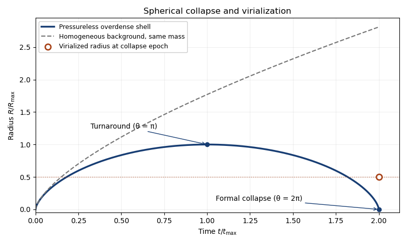

<h1 id="2/solution">Solution</h1>

↑ **Parent:** [2](../2.md)

For a pressureless spherical mass shell with fixed enclosed mass and no shell crossing, the [shell theorem](../../../../../spherical-shell-theorem.md) gives $\ddot R=-GM/R^2$. A [cosmological constant](../../../../../cosmological-constant.md) is absent in the [Einstein-de Sitter universe](../../../../../einstein-de-sitter-universe.md). Parametric differentiation gives

$$
\dot R=\frac AB\frac{\sin\theta}{1-\cos\theta},\qquad
\ddot R=-\frac A{B^2(1-\cos\theta)^2}.
$$

Since $R^2=A^2(1-\cos\theta)^2$, the equation of motion holds provided

$$
\boxed{A^3=GMB^2.}
$$

The expanding branch runs from $\theta=0$ to the [turnaround of spherical collapse](../../../../../turnaround-of-spherical-collapse.md) $\theta=\pi$; the recollapsing branch runs from $\pi$ to $2\pi$. Hence

$$
\boxed{A=\frac{R_{\max}}2,\quad B=\frac{t_{\max}}\pi,\quad t_{\rm coll}=2t_{\max}.}
$$

The common bang-time origin selects the growing overdensity, without an extra arbitrary shift in the time parameter.

**[Figure 1](#2/image-spherical-collapse-radius-versus-time-showing-turnaround-and-the-distinct-virialized-endpoint). Spherical-collapse radius versus time, showing turnaround and the distinct virialized endpoint**.

In the [Einstein-de Sitter universe](../../../../../einstein-de-sitter-universe.md), $H=2/(3t)$ and $\bar\rho=1/(6\pi Gt^2)$. An unperturbed homogeneous sphere containing the same mass thus has $R_{\rm bg}^3=(9/2)GMt^2$. Comparing its volume with the perturbed sphere gives

$$
\frac\rho{\bar\rho}=\frac{R_{\rm bg}^3}{R^3}
=\frac92\frac{(\theta-\sin\theta)^2}{(1-\cos\theta)^3}.
$$

At maximum expansion,

$$
\boxed{\frac{\rho_{\rm ta}}{\bar\rho(t_{\max})}=\frac{9\pi^2}{16}=\left(\frac{3\pi}{4}\right)^2\simeq5.55.}
$$

For the non-dissipative, homologous [spherical-collapse model](../../../../../spherical-collapse-model.md), the potential energy of a uniform sphere is $W=-3GM^2/(5R)$. At turnaround the bulk kinetic energy is zero, so $E=W_{\rm ta}$. At [virial equilibrium](../../../../../virial-equilibrium.md), $2K+W=0$ gives $E=W_{\rm vir}/2$. Conservation of energy implies $W_{\rm vir}=2W_{\rm ta}$, and therefore $R_{\rm vir}=R_{\max}/2$. This comparison assumes the same potential-energy structure coefficient; it is the usual top-hat model rather than an exact claim about every halo profile.

Halving the radius multiplies the density by eight. During the interval to $t_{\rm coll}=2t_{\max}$, the background density falls by four. Thus

$$
\boxed{\Delta_{\rm vir}\equiv\frac{\rho_{\rm vir}}{\bar\rho(t_{\rm coll})}=8\times4\times\frac{9\pi^2}{16}=18\pi^2\simeq178.}
$$

The formal pressureless trajectory reaches zero radius; the physical virialized object instead has a finite radius. Its density is evaluated at the same collapse epoch, not at the instantaneous singular solution's density.

For a physical estimated virial radius and enclosed mass, $\rho_h=3M/(4\pi r_{\rm vir}^3)$. Equating this to $\Delta_{\rm vir}\bar\rho_{m,0}(1+z_f)^3$ gives a [halo density estimate of formation redshift](../../../../../halo-density-estimate-of-formation-redshift.md):

$$
\boxed{1+z_f\simeq\left[\frac{3M}{4\pi r_{\rm vir}^3\Delta_{\rm vir}\bar\rho_{m,0}}\right]^{1/3}.}
$$

In the pure [Einstein-de Sitter universe](../../../../../einstein-de-sitter-universe.md), $\bar\rho_{m,0}$ equals the present [critical density](../../../../../critical-density.md). The inference assumes the measured density retains the collapse-epoch normalization. Later accretion, mergers and a changing virial-radius convention can change it, so it is a model-dependent formation estimate rather than a unique historical date.

## ↑ Ancestors (10)

1. [2](../2.md)
2. [Paper 55](../../paper-55-split.md)
3. [Iii](../../split.md)
4. [2013](../../../split.md)
5. [Past exam of the mathematics course of the University of Cambridge](../../../../split.md)
6. [Mathematics course of the University of Cambridge](../../../../../mathematics-course-of-the-university-of-cambridge.md)
7. [Course of the University of Cambridge](../../../../../course-of-the-university-of-cambridge.md)
8. [University of Cambridge](../../../../../university-of-cambridge-split.md)
9. [List of universities](../../../../../list-of-universities.md)
10. [Codex Wiki](../../../../../split.md)
