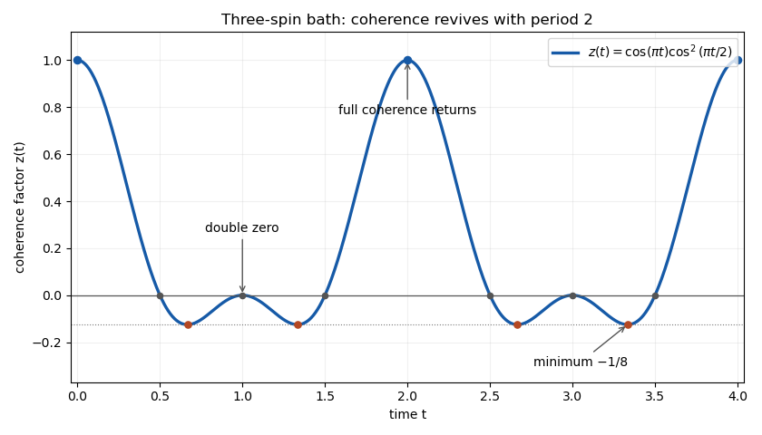

# Paper 57

↑ **Parent:** [Iii](../iii.md)

[https://www.maths.cam.ac.uk/postgrad/part-iii/files/pastpapers/2013/paper_57.pdf](https://www.maths.cam.ac.uk/postgrad/part-iii/files/pastpapers/2013/paper_57.pdf)

**Table of contents**

- [1](#1)
  - [a](#1/a)
    - [i](#1/a/i)
      - [Solution](#1/a/i/solution)
    - [ii](#1/a/ii)
      - [Solution](#1/a/ii/solution)
  - [b](#1/b)
    - [i](#1/b/i)
      - [Solution](#1/b/i/solution)
    - [ii](#1/b/ii)
      - [Solution](#1/b/ii/solution)
- [2](#2)
  - [a](#2/a)
    - [Solution](#2/a/solution)
  - [b](#2/b)
    - [Solution](#2/b/solution)
  - [c](#2/c)
    - [Solution](#2/c/solution)
- [3](#3)
  - [a](#3/a)
    - [Solution](#3/a/solution)
  - [b](#3/b)
    - [Solution](#3/b/solution)
  - [c](#3/c)
    - [i](#3/c/i)
      - [Solution](#3/c/i/solution)
    - [ii](#3/c/ii)
      - [Solution](#3/c/ii/solution)
- [4](#4)
  - [a](#4/a)
    - [Solution](#4/a/solution)
  - [b](#4/b)
    - [Solution](#4/b/solution)
  - [c](#4/c)
    - [Solution](#4/c/solution)
    - [i](#4/c/i)
      - [Solution](#4/c/i/solution)
    - [ii](#4/c/ii)
      - [Solution](#4/c/ii/solution)

## 1

↑ **Parent:** [Paper 57](paper-57.md)

<h3 id="1/a">a</h3>

↑ **Parent:** [1](#1)

<h4 id="1/a/i">i</h4>

↑ **Parent:** [A](#1/a)

<h5 id="1/a/i/solution">Solution</h5>

↑ **Parent:** [I](#1/a/i)

Use the dimensionless [quantum phase](../../../quantum-mechanics.md#quantum-phase) $S$, so that $\psi=R e^{iS}$ with $R\geq0$. Work locally away from [wavefunction](../../../quantum-mechanics.md#wave-function) nodes, where $R$ and $S$ are differentiable. Differentiating the [wavefunction](../../../quantum-mechanics.md#wave-function) for substitution in the [Time-dependent Schrödinger equation](../../../physics.md#time-dependent-schrodinger-equation) gives:

$$
\partial_t\psi=e^{iS}(R_t+iRS_t),\qquad
\nabla^2\psi=e^{iS}\left[\nabla^2R-R|\nabla S|^2+i(2\nabla R\cdot\nabla S+R\nabla^2S)\right].
$$

Cancel $e^{iS}$ in the time-dependent equation and equate real and imaginary parts. The resulting [Madelung equations](../../../physics.md#madelung-equations) are

$$
\boxed{R_t=-\frac{\hbar}{2m}\left(2\nabla R\cdot\nabla S+R\nabla^2S\right)},\qquad
\boxed{\hbar S_t+\frac{\hbar^2}{2m}|\nabla S|^2+V-\frac{\hbar^2}{2m}\frac{\nabla^2R}{R}=0}.
$$

The second equation is a [Hamilton-Jacobi equation](../../../classical-mechanics.md#hamilton-jacobi-equation) for the action $\hbar S$, with an additional [quantum potential](../../../quantum-theory.md#quantum-potential). To see the meaning of the first, multiply it by $2R$ and set $\rho=R^2$. It becomes the [probability continuity equation](../../../quantum-mechanics.md#probability-continuity-equation)

$$
\partial_t\rho+\nabla\cdot\left(\rho\frac{\hbar}{m}\nabla S\right)=0.
$$

Thus the [probability density](../../../quantum-mechanics.md#probability-density) is transported by the velocity field $\hbar\nabla S/m$. The [Madelung equations](../../../physics.md#madelung-equations) are a local rewriting of the linear wave equation; their apparent nonlinearity comes from expressing a complex [wavefunction](../../../quantum-mechanics.md#wave-function) in modulus and phase variables.

<h4 id="1/a/ii">ii</h4>

↑ **Parent:** [A](#1/a)

<h5 id="1/a/ii/solution">Solution</h5>

↑ **Parent:** [Ii](#1/a/ii)

In [Bohmian mechanics](../../../quantum-theory.md#de-broglie-bohm-theory) the particle has a definite position $\mathbf X(t)$ at every time. Its [wavefunction](../../../quantum-mechanics.md#wave-function) obeys the usual autonomous wave equation, while its actual position follows the [guidance equation](../../../quantum-theory.md#guidance-equation)

$$
\dot{\mathbf X}(t)=\mathbf v(\mathbf X(t),t),\qquad
\mathbf v=\frac{\hbar}{m}\nabla S=\frac{\mathbf j}{|\psi|^2}.
$$

Here $\mathbf j$ is the [probability current](../../../quantum-mechanics.md#probability-current). The [Born rule](../../../quantum-mechanics.md#born-rule) is the quantum-equilibrium choice of initial position distribution $\rho=|\psi|^2$; [quantum equilibrium equivariance](../../../quantum-theory.md#quantum-equilibrium-equivariance) ensures that this distribution persists because it obeys the same [probability continuity equation](../../../quantum-mechanics.md#probability-continuity-equation) as the wave amplitude. The [guidance equation](../../../quantum-theory.md#guidance-equation) fixes the initial velocity as well as subsequent velocities: the second-order equation below does not permit an independent arbitrary initial velocity.

Define the [quantum potential](../../../quantum-theory.md#quantum-potential)

$$
\boxed{Q=-\frac{\hbar^2}{2m}\frac{\nabla^2R}{R}}.
$$

Taking the [gradient](../../../calculus.md#gradient) of the real [Madelung equations](../../../physics.md#madelung-equations) gives

$$
\hbar\partial_t\nabla S+\nabla\left(\frac{\hbar^2}{2m}|\nabla S|^2\right)=-\nabla(V+Q).
$$

On any smooth phase patch $\nabla\times\mathbf v=0$, so $\nabla(|\mathbf v|^2/2)=(\mathbf v\cdot\nabla)\mathbf v$. Along the actual path, differentiation is the [material derivative](../../../continuum-mechanics.md#material-derivative) $D/Dt=\partial_t+\mathbf v\cdot\nabla$. Therefore

$$
\boxed{\frac{d(m\dot{\mathbf X})}{dt}=m\frac{D\mathbf v}{Dt}=-\nabla(V+Q)\big|_{\mathbf X(t)}}.
$$

This is the [Bohmian mechanics](../../../quantum-theory.md#de-broglie-bohm-theory) Newton form: the classical force is supplemented by the amplitude-dependent [quantum potential](../../../quantum-theory.md#quantum-potential). Neither division by $R$ nor a smooth phase is justified at a [wavefunction](../../../quantum-mechanics.md#wave-function) node, so the derivation applies on nonzero-amplitude regions. A nonzero circulation around a node is compatible with the locally curl-free [guidance equation](../../../quantum-theory.md#guidance-equation).

<h3 id="1/b">b</h3>

↑ **Parent:** [1](#1)

<h4 id="1/b/i">i</h4>

↑ **Parent:** [B](#1/b)

<h5 id="1/b/i/solution">Solution</h5>

↑ **Parent:** [I](#1/b/i)

The [rotational invariance of a central-potential Hamiltonian](../../../quantum-mechanics.md#rotational-invariance-of-a-central-potential-hamiltonian) allows a simultaneous [eigenstate](../../../quantum-mechanics.md#eigenstate) of energy and the two-dimensional [orbital angular momentum](../../../quantum-mechanics.md#orbital-angular-momentum) $L_z=-i\hbar\partial_\phi$. For a separated [wavefunction](../../../quantum-mechanics.md#wave-function) $F(r)G(\phi)$, the [Laplacian in polar coordinates](../../../calculus.md#laplacian-in-polar-coordinates) gives

$$
\frac{r^2}{F}\left(F''+\frac1rF'\right)+\frac{G''}{G}+\frac{2m r^2}{\hbar^2}(E-V)=0.
$$

The $\phi$ term must be a constant; write $G''/G=-k^2$. The angular [eigenfunctions](../../../linear-operator-theory.md#eigenfunction) can be chosen as $e^{ik\phi}$. Single-valuedness under $\phi\mapsto\phi+2\pi$ imposes $e^{2\pi i k}=1$, hence $k\in\mathbb Z$. The radial equation in the [separation of a two-dimensional central-potential eigenstate](../../../quantum-mechanics.md#separation-of-a-two-dimensional-central-potential-eigenstate) is

$$
-\frac{\hbar^2}{2m}\left(f''+\frac1rf'-\frac{k^2}{r^2}f\right)+V(r)f=Ef.
$$

For a real [central potential](../../../classical-mechanics.md#central-potential) and the usual real self-adjoint radial boundary conditions, the radial equation admits a basis of real solutions: real and imaginary parts of a complex solution obey the same equation and boundary conditions. Choose a real normalized radial [eigenfunction](../../../linear-operator-theory.md#eigenfunction). Since the plane area element in [plane polar coordinates](../../../classical-mechanics.md#plane-polar-coordinates) is $r\,dr\,d\phi$, the normalization is

$$
\int_0^\infty r f(r)^2\,dr=1,\qquad
\boxed{\psi_k(r,\phi)=\frac{f(r)}{\sqrt{2\pi}}e^{ik\phi},\quad k\in\mathbb Z}.
$$

This establishes the intended separated simultaneous [eigenstate](../../../quantum-mechanics.md#eigenstate) form. **It is not the form of every stationary state.** The radial equation depends on $k^2$, so the $k$ and $-k$ sectors have the same energy. For $k\geq1$, their normalized superposition

$$
\psi_{\rm real}(r,\phi)=\frac{f(r)}{\sqrt\pi}\cos(k\phi)
$$

is a single-valued [stationary state](../../../quantum-mechanics.md#stationary-state) with that energy but is not a single angular exponential. [Quantum degeneracy](../../../quantum-mechanics.md#degenerate-energy-levels) is precisely why [separation of variables](../../../partial-differential-equation.md#separation-of-variables) selects a convenient [eigenstate](../../../quantum-mechanics.md#eigenstate) basis rather than all vectors in an energy eigenspace. The printed assertion needs this qualification. The printed polar-coordinate aid also labels a gradient component tuple as a divergence; the [gradient](../../../calculus.md#gradient) used below is the two-dimensional vector $\widehat{\mathbf r}\partial_r+\widehat{\boldsymbol\phi}r^{-1}\partial_\phi$.

<h4 id="1/b/ii">ii</h4>

↑ **Parent:** [B](#1/b)

<h5 id="1/b/ii/solution">Solution</h5>

↑ **Parent:** [Ii](#1/b/ii)

For the separated [stationary state](../../../quantum-mechanics.md#stationary-state), restore its time factor $e^{-iEt/\hbar}$. Away from radial nodes, the [quantum phase](../../../quantum-mechanics.md#quantum-phase) is $S=k\phi-Et/\hbar$, up to a constant $0$ or $\pi$ where the real radial function has fixed sign. The [guidance equation](../../../quantum-theory.md#guidance-equation) in [plane polar coordinates](../../../classical-mechanics.md#plane-polar-coordinates) therefore gives the [Bohmian circulation of an angular-momentum eigenstate](../../../quantum-theory.md#bohmian-circulation-of-an-angular-momentum-eigenstate)

$$
\boxed{v_r=0,\qquad v_\phi=\frac{\hbar k}{mr},\qquad |\mathbf v|=\frac{\hbar|k|}{mr}}.
$$

The direction is $\widehat{\boldsymbol\phi}$ for $k>0$ and $-\widehat{\boldsymbol\phi}$ for $k<0$; the velocity is zero for $k=0$. Each admissible trajectory is a circle:

$$
r(t)=r_0,\qquad \phi(t)=\phi_0+\frac{\hbar k}{m r_0^2}t.
$$

The [orbital angular momentum](../../../quantum-mechanics.md#orbital-angular-momentum) along the trajectory is $mr_0v_\phi=\hbar k$. The origin or any zero-amplitude circle is excluded from this local formula. For the real degenerate superposition constructed above, the spatial [quantum phase](../../../quantum-mechanics.md#quantum-phase) is constant on each nodal sector, so its [Bohmian mechanics](../../../quantum-theory.md#de-broglie-bohm-theory) velocity is instead zero. Thus the circular motion is a conclusion about the separated angular-momentum [eigenstate](../../../quantum-mechanics.md#eigenstate), not an arbitrary energy [eigenstate](../../../quantum-mechanics.md#eigenstate).

## 2

↑ **Parent:** [Paper 57](paper-57.md)

<h3 id="2/a">a</h3>

↑ **Parent:** [2](#2)

<h4 id="2/a/solution">Solution</h4>

↑ **Parent:** [A](#2/a)

The [EPR criterion of reality](../../../quantum-theory.md#epr-criterion-of-reality) says that a physical quantity has an element of reality if its value can be predicted with certainty without physically disturbing the system. The proposed criterion distinguishes what the system possesses from what one happens to measure.

A [local hidden-variable theory](../../../quantum-theory.md#local-hidden-variable-theory) supplements the preparation by a variable $\lambda$, drawn from a distribution $\mu(\lambda)$ independent of the later measurement settings. Its locality assumption is conditional factorization:

$$
P(a,b\mid x,y)=\int d\mu(\lambda)\,P_A(a\mid x,\lambda)P_B(b\mid y,\lambda).
$$

Alice's local response does not depend on Bob's setting $y$, and Bob's does not depend on Alice's $x$. Correlations can arise from the shared past variable $\lambda$. In a [deterministic local hidden-variable model](../../../quantum-theory.md#deterministic-local-hidden-variable-model), the response probabilities are point masses at functions $a=A_x(\lambda)$ and $b=B_y(\lambda)$. In particular, all possible local settings have definite values for a fixed $\lambda$, even when only one setting is used in a trial.

The setting-independence assumption is needed for comparing these predetermined values across different experiments. Conditional factorization is stronger than [quantum no-signalling](../../../quantum-theory.md#quantum-no-signalling): no-signalling constrains observed marginal probabilities, whereas [local hidden-variable theory](../../../quantum-theory.md#local-hidden-variable-theory) constrains their decomposition at fixed $\lambda$. This distinction is what [Bell theorem](../../../quantum-theory.md#bell-theorem) tests.

<h3 id="2/b">b</h3>

↑ **Parent:** [2](#2)

<h4 id="2/b/solution">Solution</h4>

↑ **Parent:** [B](#2/b)

Fix a hidden variable in the [deterministic local hidden-variable model](../../../quantum-theory.md#deterministic-local-hidden-variable-model), so that every $A_j,B_j$ is an integer. Let $[x]_d$ be the representative of $x$ modulo $d$ in $\{0,\ldots,d-1\}$. The terms in the [chained modular Bell inequality](../../../quantum-theory.md#chained-modular-bell-inequality) alternate between the two parties. Before reduction their sum telescopes:

$$
(A_1-B_1)+(B_1-A_2)+(A_2-B_2)+\cdots+(A_N-B_N)+(B_N-A_1-1)=-1.
$$

After reduction, the sum $T$ is a nonnegative integer congruent to $-1$ modulo $d$. For $d\geq2$, the smallest possible such integer is $d-1$. Thus $T\geq d-1$ for each hidden variable separately. Averaging over the setting-independent distribution gives

$$
\boxed{\sum_{j=1}^N\mathbb E\big([A_j-B_j]_d\big)+\sum_{j=1}^{N-1}\mathbb E\big([B_j-A_{j+1}]_d\big)+\mathbb E\big([B_N-A_1-1]_d\big)\geq d-1}.
$$

Here each expectation is the [expectation value](../../../quantum-mechanics.md#expectation-value) of the reduced random variable, not the residue of its expectation. Each term can be measured using one setting at each site. The proof uses their common deterministic assignments rather than any joint quantum measurement of incompatible local settings. Stochastic [local hidden-variable theories](../../../quantum-theory.md#local-hidden-variable-theory) satisfy the same bound: include their local random seeds in $\lambda$ and average the resulting deterministic assignments.

The printed final coefficient in the definition of the average is typographically incomplete. The expectation used here is the usual $\mathbb E X=\sum_{x=0}^{d-1}xP(X=x)$, with final coefficient $d-1$.

<h3 id="2/c">c</h3>

↑ **Parent:** [2](#2)

<h4 id="2/c/solution">Solution</h4>

↑ **Parent:** [C](#2/c)

Take $\alpha^2+\beta^2=1$ and label the first vector of each measurement basis by outcome $0$. Assign the [Pauli measurement](../../../quantum-theory.md#measurement-of-a-pauli-observable) value $+1$ to outcome $0$ and $-1$ to outcome $1$. The four observables are

$$
A_1=Z,\qquad A_2=X,\qquad
B_1=\frac{\sqrt3}{2}X+\frac12 Z,\qquad
B_2=\frac{\sqrt3}{2}X-\frac12 Z.
$$

Here $X$ and $Z$ are the [Pauli X gate](../../../quantum-theory.md#pauli-x-gate) and [Pauli Z gate](../../../quantum-theory.md#pauli-z-gate) matrices. These follow by subtracting the two rank-one basis projectors; a real basis rotated through $\gamma$ has observable $\sin(2\gamma)X+\cos(2\gamma)Z$.

The [Schmidt-basis Pauli correlation tensor](../../../von-neumann-entropy.md#schmidt-basis-pauli-correlation-tensor) of the state gives

$$
\langle Z\otimes Z\rangle=1,\quad \langle X\otimes X\rangle=2\alpha\beta,\quad
\langle X\otimes Z\rangle=\langle Z\otimes X\rangle=0.
$$

Consequently $E_{11}=1/2$, $E_{21}=E_{22}=\sqrt3\alpha\beta$ and $E_{12}=-1/2$, where $E_{jk}=\langle A_j\otimes B_k\rangle$. For binary outcomes, $\mathbb E\big([A-B]_2\big)=P(A\ne B)=(1-E_{AB})/2$, whereas the final offset term has $\mathbb E\big([B-A-1]_2\big)=P(A=B)=(1+E_{AB})/2$. The [chained modular Bell inequality](../../../quantum-theory.md#chained-modular-bell-inequality) left side is therefore

$$
I=\frac{1-E_{11}}2+\frac{1-E_{21}}2+\frac{1-E_{22}}2+\frac{1+E_{12}}2
=\boxed{\frac32-\sqrt3\alpha\beta}.
$$

The local bound is $I\geq1$, so the exact violation condition is

$$
\boxed{\alpha\beta>\frac1{2\sqrt3},\qquad \alpha^2+\beta^2=1}.
$$

Equality saturates the bound. The maximal violation for these fixed measurements occurs at $\alpha=\beta=1/\sqrt2$ or their common negative, giving $I=(3-\sqrt3)/2$. Opposite signs do not violate this particular inequality with these fixed bases, although other measurement choices can reveal the state's [entanglement](../../../bell-state.md#entangled-state). If unnormalized real amplitudes are used, replace $\alpha\beta$ throughout by $\alpha\beta/(\alpha^2+\beta^2)$.

## 3

↑ **Parent:** [Paper 57](paper-57.md)

<h3 id="3/a">a</h3>

↑ **Parent:** [3](#3)

<h4 id="3/a/solution">Solution</h4>

↑ **Parent:** [A](#3/a)

Write the system's $z$ basis as $|0\rangle,|1\rangle$, and use a separate pair of meter [qubits](../../../quantum-mechanics.md#qubit) in the [Bell state](../../../bell-state.md) $|\Phi^+\rangle$. Alice applies a [CNOT gate](../../../quantum-theory.md#controlled-not-gate) from system $A$ to her meter qubit; Bob simultaneously applies a [CNOT gate](../../../quantum-theory.md#controlled-not-gate) from $B$ to his meter qubit. Flipping neither or both meter qubits preserves $|\Phi^+\rangle$, while flipping exactly one gives $|\Psi^+\rangle$. Hence the [entanglement-assisted nondemolition parity measurement](../../../quantum-measurement.md#entanglement-assisted-nondemolition-parity-measurement) interaction produces

$$
|\psi\rangle|\Phi^+\rangle\longmapsto
P_{\rm e}|\psi\rangle|\Phi^+\rangle+P_{\rm o}|\psi\rangle|\Psi^+\rangle,
$$

where $P_{\rm e}=|00\rangle\langle00|+|11\rangle\langle11|$ and $P_{\rm o}=|01\rangle\langle01|+|10\rangle\langle10|$. Each party now measures only their meter qubit in the $z$ basis. If their binary records are $u,v$, the system [Kraus operator](../../../quantum-information-theory.md#kraus-operator) is

$$
K_{uv}=\frac1{\sqrt2}P_{u\mathbin\oplus v},\qquad P_0=P_{\rm e},\quad P_1=P_{\rm o}.
$$

Unequal records verify zero total $z$ spin, since $S_z^{\rm tot}=\hbar(Z_A+Z_B)/2$ vanishes precisely on the odd sector. The probability of success is $\langle\psi|P_{\rm o}|\psi\rangle$, and the successful conditional state is $P_{\rm o}|\psi\rangle/\sqrt{\langle P_{\rm o}\rangle}$. **Every zero-total-$z$-spin state is left unchanged**, including any coherent superposition of $|01\rangle$ and $|10\rangle$. Similarly the even-sector coherence is preserved. This is a [quantum nondemolition measurement](../../../quantum-measurement.md#quantum-nondemolition-measurement) of the parity, rather than separate measurements of both system spins.

All quantum operations and local meter measurements can finish within the spacelike time window. Nevertheless each local meter record is individually uniform: $K_{u0}^\dagger K_{u0}+K_{u1}^\dagger K_{u1}=I/2$. The verification result is obtained only by comparing the records using [local operations and classical communication](../../../bell-state.md#local-operations-and-classical-communication). Thus “instantaneous” refers to the local completion of the joint measurement instrument, not instant access to its nonlocal outcome; [quantum no-signalling](../../../quantum-theory.md#quantum-no-signalling) remains intact.

<h3 id="3/b">b</h3>

↑ **Parent:** [3](#3)

<h4 id="3/b/solution">Solution</h4>

↑ **Parent:** [B](#3/b)

Apply the modulo operation to the [eigenvalues](../../../linear-operator-theory.md#eigenvalue) of $Z_A+Z_B$. The product [eigenstates](../../../quantum-mechanics.md#eigenstate) $|00\rangle,|01\rangle,|10\rangle,|11\rangle$ have ordinary eigenvalues $2,0,0,-2$, respectively, and residues $2,0,0,2$ modulo $4$. The resulting [observable](../../../quantum-mechanics.md#observable) is

$$
\boxed{O=2P_{\rm e}=I+Z_A\otimes Z_B}.
$$

Use the [entanglement-assisted nondemolition parity measurement](../../../quantum-measurement.md#entanglement-assisted-nondemolition-parity-measurement) from part (a). Equal local meter records give $O=2$; unequal records give $O=0$. Its conditional [measurement in quantum mechanics](../../../quantum-measurement.md) maps are $\rho\mapsto P_{\rm e}\rho P_{\rm e}$ and $\rho\mapsto P_{\rm o}\rho P_{\rm o}$, with normalization by their probabilities. The [quantum nondemolition measurement](../../../quantum-measurement.md#quantum-nondemolition-measurement) preserves every vector within each degenerate eigenspace, including superpositions of $|00\rangle$ and $|11\rangle$. Measuring the two system spins separately would destroy that even-sector coherence and would therefore not realize the same [Lüders rule](../../../quantum-measurement.md#luders-rule) instrument. The nonlocal eigenvalue again becomes known only after [local operations and classical communication](../../../bell-state.md#local-operations-and-classical-communication) compares the local records.

<h3 id="3/c">c</h3>

↑ **Parent:** [3](#3)

<h4 id="3/c/i">i</h4>

↑ **Parent:** [C](#3/c)

<h5 id="3/c/i/solution">Solution</h5>

↑ **Parent:** [I](#3/c/i)

Assume the proposed device distinguishes the four displayed [eigenstates](../../../quantum-mechanics.md#eigenstate), as an ideal rank-one [projective measurement](../../../quantum-measurement.md#projective-measurement). This assumption matters: if all four had the same eigenvalue, the identity [observable](../../../quantum-mechanics.md#observable) would admit that eigenbasis but its [Lüders rule](../../../quantum-measurement.md#luders-rule) measurement would do nothing and could not signal. The printed eigenvectors alone do not exclude this degeneracy.

For the complete resolving measurement, let $c=\cos\theta$, $s=\sin\theta$, and $\Pi_j$ be the four rank-one projectors. If the nonlocal outcome is ignored, the [nonselective projective measurement](../../../quantum-measurement.md#nonselective-projective-measurement) channel is $\mathcal D_\theta(\rho)=\sum_j\Pi_j\rho\Pi_j$. Each listed state's local [reduced density matrix](../../../bell-state.md#reduced-density-matrix) is diagonal in $Z_A$, with $Z_A$ expectation $\cos2\theta$ for either plus state and $-\cos2\theta$ for either minus state. Consequently

$$
\langle Z_A\rangle_{\rm out}=\cos2\theta\,\operatorname{Tr}(C_\theta\rho),\qquad
C_\theta=\Pi_{\Phi^+}-\Pi_{\Phi^-}+\Pi_{\Psi^+}-\Pi_{\Psi^-}.
$$

Compute $C_\theta$ in its even and odd two-dimensional blocks: both have diagonal entries $\cos2\theta,-\cos2\theta$ and off-diagonal entries $\sin2\theta$. Thus

$$
C_\theta=\cos2\theta\,Z_A\otimes I+\sin2\theta\,X_A\otimes X_B,
$$

and

$$
\langle Z_A\rangle_{\rm out}=\cos^2(2\theta)\langle Z_A\rangle_{\rm in}
+\sin2\theta\cos2\theta\langle X_A\otimes X_B\rangle_{\rm in}.
$$

To signal, prepare Alice in $|+\rangle$ and Bob initially in $|+\rangle$. Bob encodes a bit by either doing nothing or applying a local [Pauli Z gate](../../../quantum-theory.md#pauli-z-gate), which changes his state to $|-\rangle$. Alice's input [reduced density matrix](../../../bell-state.md#reduced-density-matrix) is identical in both cases, but after the hypothetical instantaneous measurement her local $Z_A$ expectation is

$$
\boxed{\langle Z_A\rangle_{\rm out}=\pm\sin2\theta\cos2\theta=\pm\tfrac12\sin4\theta}.
$$

The two probabilities for Alice's outcome $0$ are $(1\pm\sin2\theta\cos2\theta)/2$, so their difference is $\sin2\theta\cos2\theta$. It is strictly positive for $0<\theta<\pi/4$. Repeated trials let Alice infer Bob's bit while their operations are still spacelike, violating [quantum no-signalling](../../../quantum-theory.md#quantum-no-signalling) and relativistic causality. The [relativistic causality constraint on an ideal nonlocal measurement](../../../quantum-theory.md#relativistic-causality-constraint-on-an-ideal-nonlocal-measurement) therefore permits only

$$
\boxed{\theta=0\quad\text{or}\quad\theta=\pi/4}
$$

within the specified interval. The argument requires no rapid communication of the hypothetical nonlocal outcome: Alice reads her own changed local statistics. It rules out the full ideal instrument, not merely the later classical comparison of locally obtained records.

<h4 id="3/c/ii">ii</h4>

↑ **Parent:** [C](#3/c)

<h5 id="3/c/ii/solution">Solution</h5>

↑ **Parent:** [Ii](#3/c/ii)

At $\theta=0$ the four [eigenstates](../../../quantum-mechanics.md#eigenstate) are the computational product basis, with irrelevant signs on two vectors. Alice and Bob measure their own system qubits in $Z$. These local [projective measurements](../../../quantum-measurement.md#projective-measurement) preserve each product [eigenstate](../../../quantum-mechanics.md#eigenstate); their pair of records identifies the global outcome after [local operations and classical communication](../../../bell-state.md#local-operations-and-classical-communication).

At $\theta=\pi/4$ the four states are the [Bell states](../../../bell-state.md). They are simultaneous [eigenstates](../../../quantum-mechanics.md#eigenstate) of the commuting [Pauli operators](../../../quantum-circuit.md#pauli-operator) $Z_AZ_B$ and $X_AX_B$: $\Phi^+,\Phi^-,\Psi^+,\Psi^-$ have respective pairs $(+,+),(+,-),(-,+),(-,-)$. Their nonlocal parity measurements can be performed without directly distinguishing the local system spins.

Use the first shared [Bell state](../../../bell-state.md) pair to perform the [entanglement-assisted nondemolition parity measurement](../../../quantum-measurement.md#entanglement-assisted-nondemolition-parity-measurement) of $Z_AZ_B$. Use the second shared pair for $X_AX_B$: both parties apply a local [Hadamard gate](../../../quantum-theory.md#hadamard-gate) to their system qubit, execute the same local system-to-meter [CNOT gates](../../../quantum-theory.md#controlled-not-gate) and $z$-meter measurements, then undo the [Hadamard gates](../../../quantum-theory.md#hadamard-gate). This measures $X_AX_B$ because $HZH=X$. The two system parity projectors commute, since anticommutation at both sites cancels:

$$
[Z_AZ_B,X_AX_B]=0,\qquad
P_{z,x}=\frac14(I+zZ_AZ_B)(I+xX_AX_B),\quad z,x\in\{\pm1\}.
$$

Each $P_{z,x}$ is the corresponding rank-one [Bell state](../../../bell-state.md) projector. Every complete tuple of four local meter records has system [Kraus operator](../../../quantum-information-theory.md#kraus-operator) $P_{z,x}/2$ for its two parities. Summing the four record tuples compatible with $(z,x)$ gives the ideal outcome map $\rho\mapsto P_{z,x}\rho P_{z,x}$. **The protocol is a Bell-state nondemolition measurement**: an input [Bell state](../../../bell-state.md) is preserved, while an arbitrary input is projected onto the reported [Bell state](../../../bell-state.md) with the [Born rule](../../../quantum-mechanics.md#born-rule) probability.

The local circuits need no adaptive communication between the laboratories, so both parties can finish inside the specified time window. Global identification of $(z,x)$ still requires later [local operations and classical communication](../../../bell-state.md#local-operations-and-classical-communication). This endpoint protocol respects [quantum no-signalling](../../../quantum-theory.md#quantum-no-signalling), unlike the hypothetical intermediate-angle instrument in part (i).

## 4

↑ **Parent:** [Paper 57](paper-57.md)

<h3 id="4/a">a</h3>

↑ **Parent:** [4](#4)

<h4 id="4/a/solution">Solution</h4>

↑ **Parent:** [A](#4/a)

Let $B=\sum_k g_kZ_k$. In the [Zurek spin-bath model](../../../quantum-theory.md#zurek-spin-bath-model), $H=-Z_D\otimes B$, so [unitary time evolution](../../../quantum-mechanics.md#unitary-time-evolution) with $\hbar=1$ is $U(t)=e^{itZ_D\otimes B}$. The bath Hamiltonian terms commute, and device states $|0\rangle,|1\rangle$ have $Z_D$ eigenvalues $+1,-1$. Hence

$$
|\Psi(t)\rangle=a|0\rangle|E_0(t)\rangle+b|1\rangle|E_1(t)\rangle,
$$

where the two normalized conditional bath states are

$$
|E_0(t)\rangle=\bigotimes_k\left(\alpha_k e^{ig_kt}|\uparrow_k\rangle+\beta_k e^{-ig_kt}|\downarrow_k\rangle\right),\qquad
|E_1(t)\rangle=\bigotimes_k\left(\alpha_k e^{-ig_kt}|\uparrow_k\rangle+\beta_k e^{ig_kt}|\downarrow_k\rangle\right).
$$

Take each bath factor normalized, $|\alpha_k|^2+|\beta_k|^2=1$, and $|a|^2+|b|^2=1$. This entails no restriction: if only the product is initially normalized, divide each nonzero factor by its norm; the product of these norms is one.

Taking the [partial trace](../../../quantum-theory.md#partial-trace) over the bath gives the [reduced density matrix](../../../bell-state.md#reduced-density-matrix)

$$
\boxed{\rho_D(t)=\begin{pmatrix}|a|^2&ab^*z(t)\\a^*b z(t)^*&|b|^2\end{pmatrix}},\qquad
z(t)=\langle E_1(t)|E_0(t)\rangle.
$$

The orientation of this [conditional environment overlap](../../../quantum-theory.md#conditional-environment-overlap) fixes the sign of the phase in the upper-right entry. Factorizing the overlap yields the [decoherence factor](../../../quantum-theory.md#decoherence-factor)

$$
\boxed{z(t)=\prod_{k=1}^N\left(|\alpha_k|^2e^{2ig_kt}+|\beta_k|^2e^{-2ig_kt}\right)
=\prod_{k=1}^N\left[\cos(2g_kt)+i\left(|\alpha_k|^2-|\beta_k|^2\right)\sin(2g_kt)\right]}.
$$

The populations are conserved because $[H,Z_D]=0$. Only phase coherence can be reduced. In particular,

$$
|z(t)|^2=\prod_k\left[1-4|\alpha_k|^2|\beta_k|^2\sin^2(2g_kt)\right]\leq1.
$$

[Quantum decoherence](../../../quantum-theory.md#quantum-decoherence) here results from distinguishable conditional bath states, although the complete system remains in a [pure state](../../../quantum-theory.md#pure-state) under [unitary time evolution](../../../quantum-mechanics.md#unitary-time-evolution).

<h3 id="4/b">b</h3>

↑ **Parent:** [4](#4)

<h4 id="4/b/solution">Solution</h4>

↑ **Parent:** [B](#4/b)

With every bath spin up, the two conditional bath states in the [Zurek spin-bath model](../../../quantum-theory.md#zurek-spin-bath-model) differ only by global phases. The [decoherence factor](../../../quantum-theory.md#decoherence-factor) is

$$
\boxed{z(t)=e^{2it\sum_k g_k},\qquad |z(t)|^2=1}.
$$

There is **no quantum decoherence**, even for a very large bath. The device evolves as the pure state $a e^{it\sum g_k}|0\rangle+b e^{-it\sum g_k}|1\rangle$, while the bath stays in its original product [eigenstate](../../../quantum-mechanics.md#eigenstate) up to phase. Since no device information is imprinted in distinguishable bath states, the [conditional environment overlap](../../../quantum-theory.md#conditional-environment-overlap) has unit modulus. The phase rotation must not be mistaken for decay of off-diagonal magnitude.

<h3 id="4/c">c</h3>

↑ **Parent:** [4](#4)

<h4 id="4/c/solution">Solution</h4>

↑ **Parent:** [C](#4/c)

A pure spin-one-half state on the equator of the [Bloch sphere](../../../quantum-theory.md#bloch-sphere) has $\langle Z_k\rangle=0$, so $|\alpha_k|^2=|\beta_k|^2=1/2$. Its azimuthal phase does not enter the [conditional environment overlap](../../../quantum-theory.md#conditional-environment-overlap), because the interaction is diagonal in $Z_k$. Substitution in the [decoherence factor](../../../quantum-theory.md#decoherence-factor) gives

$$
\boxed{z(t)=\prod_{k=1}^N\cos(2g_kt)}.
$$

The [Zurek spin-bath model](../../../quantum-theory.md#zurek-spin-bath-model) now has a real coherence factor: positive and negative values correspond to opposite relative phases, while suppression of coherence depends on $|z|$.

<h4 id="4/c/i">i</h4>

↑ **Parent:** [C](#4/c)

<h5 id="4/c/i/solution">Solution</h5>

↑ **Parent:** [I](#4/c/i)

For these three couplings, the [decoherence factor](../../../quantum-theory.md#decoherence-factor) becomes

$$
\boxed{z(t)=\cos(\pi t)\cos^2(\pi t/2)=\frac12\cos(\pi t)+\frac14\left(1+\cos(2\pi t)\right)}.
$$

It is periodic with period $2$. To locate its extrema, put $c=\cos\pi t$; then $z=c(1+c)/2$. Its maximum is $1$ at $t=0,2,4$, and its minimum is $-1/8$ where $c=-1/2$, namely $t=2/3,4/3,8/3,10/3$. The zeros on the displayed interval are $t=1/2,1,3/2,5/2,3,7/2$. The half-integer zeros are crossings; the zeros at $1$ and $3$ are double zeros, where the curve touches zero from below.

**[Figure 1](#4/c/i/image-three-spin-coherence-factor-with-exact-period-two-recurrences). Three-spin coherence factor with exact period-two recurrences**.

The [finite spin-bath coherence recurrence](../../../quantum-theory.md#finite-spin-bath-coherence-recurrence) returns the device to full coherence every two time units. Negative $z$ indicates a relative phase change and is not a negative probability. When $ab\ne0$, the device [reduced density matrix](../../../bell-state.md#reduced-density-matrix) becomes diagonal at each zero, but [quantum decoherence](../../../quantum-theory.md#quantum-decoherence) is not irreversible in this finite bath. The sketch explicitly displays both loss of coherence and its revival.

<h4 id="4/c/ii">ii</h4>

↑ **Parent:** [C](#4/c)

<h5 id="4/c/ii/solution">Solution</h5>

↑ **Parent:** [Ii](#4/c/ii)

Write $g_*>0$ for the upper endpoint called $a$ in the question, to distinguish it from the device amplitude. For a single realization of a finite bath,

$$
z_N(t)=\prod_{k=1}^N\cos(2g_kt).
$$

**The literal claim of convergence to zero as time tends to infinity is false for every fixed finite $N$.** [Random-coupling spin-bath decoherence](../../../quantum-theory.md#random-coupling-spin-bath-decoherence) must distinguish individual realizations, ensemble averages and the large-bath limit.

First establish [finite spin-bath coherence recurrence](../../../quantum-theory.md#finite-spin-bath-coherence-recurrence) without assuming commensurate couplings. Fix a reference time $t_0>0$ and consider $Q^N+1$ points with coordinates $j g_k t_0/\pi$ modulo $1$, for $0\leq j\leq Q^N$. Partition the unit cube into $Q^N$ smaller cubes of side $1/Q$. Two points share a cube, so their difference provides an integer $1\leq q\leq Q^N$ with

$$
\operatorname{dist}(q g_k t_0/\pi,\mathbb Z)<1/Q\quad\text{for all }k.
$$

At time $q t_0$ every cosine is arbitrarily close to $1$. As $Q$ increases, either these $q$ have an unbounded subsequence, or a bounded subsequence supplies a fixed $q$ with all distances exactly zero; its arbitrarily large multiples are then exact recurrences. In both cases there are unbounded times $t_j$ such that $z_N(t_j)\to1$. This is the simultaneous [Dirichlet approximation theorem](../../../number-theory.md#dirichlet-s-approximation-theorem) argument; it applies equally to typical irrational random couplings. Part (i) supplies a particularly simple exact periodic counterexample.

The intended suppression is valid after ensemble averaging. Independence and the uniform density give the [ensemble spin-bath coherence](../../../quantum-theory.md#ensemble-spin-bath-coherence)

$$
\boxed{\mathbb E z_N(t)=\left[\frac1{g_*}\int_0^{g_*}\cos(2gt)\,dg\right]^N
=\left[\frac{\sin(2g_*t)}{2g_*t}\right]^N}.
$$

The continuous value at $t=0$ is $1$. For $t\ne0$ its magnitude is strictly below $1$ to the power $N$, and for fixed $N$ it has an envelope of order $(2g_*t)^{-N}$ as $t\to\infty$. Thus **the ensemble mean tends to zero with time**.

The mean square distinguishes actual loss of coherence from cancellation of signs in that mean:

$$
\boxed{\mathbb E|z_N(t)|^2=\left[\frac12+\frac{\sin(4g_*t)}{8g_*t}\right]^N}.
$$

At long times this tends to $2^{-N}$, exponentially small for $N\gg1$, rather than exactly zero for a finite bath. At any fixed $t\ne0$, the bracket $q(t)$ is strictly less than $1$, since $\cos^2(2gt)<1$ on a set of positive measure. The [Markov inequality](../../../probability-inequality.md#markov-inequality) then gives

$$
P(|z_N(t)|>\varepsilon)\leq\varepsilon^{-2}q(t)^N\longrightarrow0\quad(N\to\infty).
$$

This proves small coherence for typical large baths at a fixed nonzero time. An even stronger fixed-time formulation uses the [strong law of large numbers](../../../convergence-of-random-variables.md#strong-law-of-large-numbers):

$$
\frac1N\log|z_N(t)|\longrightarrow\frac1{g_*}\int_0^{g_*}\log|\cos(2gt)|\,dg<0
\quad\text{almost surely}.
$$

The logarithmic singularities at isolated cosine zeros are integrable, and an exact zero has probability zero, so the law applies. Typical coherence consequently decreases exponentially with bath size.

The initial time scale is also explicit. When $g_*|t|\ll1$, $\log\cos(2g_kt)=-2g_k^2t^2+O(g_k^4t^4)$, so the [short-time Gaussian spin-bath decoherence](../../../quantum-theory.md#short-time-gaussian-spin-bath-decoherence) approximation is

$$
z_N(t)=\exp\left[-2t^2\sum_k g_k^2+O(Ng_*^4t^4)\right]
\simeq\boxed{\exp\left[-\frac23Ng_*^2t^2\right]}.
$$

Here $N^{-1}\sum g_k^2\to g_*^2/3$; on the scale $t\sim(g_*\sqrt N)^{-1}$ the displayed remainder tends to zero. The coherence is therefore rapidly suppressed for a large bath and is usually tiny at later fixed times, while rare recurrences still prevent a finite-realization long-time zero limit. **Ensemble decay or a specified large-$N$ limit is the correct qualification of the printed assertion**, consistent with reversible global [unitary time evolution](../../../quantum-mechanics.md#unitary-time-evolution).

## ↑ Ancestors (8)

1. [Iii](../iii.md)
2. [2013](../../2013.md)
3. [Past exam of the mathematics course of the University of Cambridge](../../../past-exam-of-the-mathematics-course-of-the-university-of-cambridge.md)
4. [Mathematics course of the University of Cambridge](../../../university-of-cambridge.md#mathematics-course-of-the-university-of-cambridge)
5. [Course of the University of Cambridge](../../../university-of-cambridge.md#course-of-the-university-of-cambridge)
6. [University of Cambridge](../../../university-of-cambridge.md)
7. [List of universities](../../../README.md#list-of-universities)
8. [Codex Wiki](../../../README.md)
