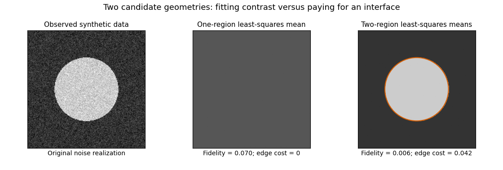

<h1 id="4/solution">Solution</h1>

↑ **Parent:** [4](../4.md)

An [image segmentation](../../../../../image-segmentation.md) separates an observed [image signal](../../../../../image-signal.md) into regions that are smooth within themselves and separated by meaningful [image edges](../../../../../image-edge.md). Pure [image smoothing](../../../../../image-smoothing.md) blurs the very transitions that ought to define these regions. The [Mumford–Shah segmentation model](../../../../../mumford-shah-functional.md) instead chooses the reconstruction and its discontinuity set together. For a bounded planar [Lipschitz domain](../../../../../lipschitz-domain.md) and bounded grey-value data $g$, one standard normalization is

$$
E(u,K)=\int_{\Omega\setminus K}(u-g)^2\,dx+\alpha\int_{\Omega\setminus K}|\nabla u|^2\,dx+\beta\mathcal H^1(K),\qquad\alpha,\beta>0.
$$

Here $K$ is the relatively closed edge set and $u\in H^1(\Omega\setminus K)$ can have different traces on its two sides. The first term is [quadratic fidelity](../../../../../quadratic-fidelity.md), the second penalizes variation within regions, and the [Hausdorff measure](../../../../../hausdorff-measure.md) term charges total edge length. It balances fitting, denoising and economical region geometry. The model was developed by David Mumford and Jayant Shah; their [1989 paper](https://www.dam.brown.edu/people/mumford/vision/papers/1989c--Mumford-Shah-Wiley.pdf) formulates this joint variational approach.

All three terms matter. Without fidelity, a constant reconstruction with no edge has zero energy. Without the [gradient](../../../../../gradient.md) term, smooth data can be fitted exactly with no edge penalty. Without the length term, fine partitions with nearly constant region means can drive fidelity arbitrarily low while creating excessive boundaries. This is [segmentation overfitting without an edge penalty](../../../../../segmentation-overfitting-without-an-edge-penalty.md). Increasing $\alpha$ favors flatter regions; increasing $\beta$ makes extra boundaries more expensive and can remove small features. These parameter effects describe a balance, not a guaranteed monotone evolution of every individual boundary.

For fixed $K$, varying $u$ gives the [fixed-edge Euler-Lagrange equation for Mumford–Shah](../../../../../fixed-edge-euler-lagrange-equation-for-mumford-shah.md):

$$
u-\alpha\Delta u=g\quad\text{in each region},\qquad\partial_nu=0\quad\text{on free region boundaries and the unconstrained outer boundary}.
$$

The boundary condition is a separate one-sided [Neumann boundary condition](../../../../../neumann-boundary-condition.md) on each side of an edge, not [continuity](../../../../../continuous-function.md) of $u$ across it. The fidelity makes this fixed-edge problem [strictly convex](../../../../../strictly-convex-function.md), so its weak solution is unique by the [Lax-Milgram theorem](../../../../../lax-milgram-theorem.md). Optimizing the edge set remains a different geometric problem. The [nonconvexity of Mumford–Shah segmentation](../../../../../nonconvexity-of-mumford-shah-segmentation.md) prevents a general uniqueness assertion or a guarantee that a numerical [stationary point](../../../../../stationary-point.md) is globally optimal.

The [piecewise-constant Mumford–Shah problem](../../../../../piecewise-constant-mumford-shah-problem.md) imposes $u=c_i$ on regions $E_i$. It minimizes

$$
\sum_i\int_{E_i}(c_i-g)^2\,dx+\frac\beta2\sum_i\operatorname{Per}(E_i;\Omega).
$$

The factor $1/2$ counts each shared internal boundary once. The [region means in piecewise-constant segmentation](../../../../../region-means-in-piecewise-constant-segmentation.md) give $c_i=|E_i|^{-1}\int_{E_i}g$, provided $|E_i|>0$. Thus the remaining optimization concerns the partition. For a smooth interface between $i$ and $j$, moving it in the normal pointing out of $i$ changes fidelity by $[(c_i-g)^2-(c_j-g)^2]$ per unit displacement, while length changes by its [curvature](../../../../../curvature.md) $\kappa$. The resulting [segmentation interface curvature balance](../../../../../segmentation-interface-curvature-balance.md) is

$$
\beta\kappa=(c_j-g)^2-(c_i-g)^2.
$$

With equal isotropic interface costs, three freely meeting smooth edges satisfy the [triple-junction angle in isotropic segmentation](../../../../../triple-junction-angle-in-isotropic-segmentation.md): force balance of their unit tangents gives angles of $120$ degrees. These are local stationarity conditions on regular interfaces, not a description of every singular edge configuration.

A simple [piecewise-constant segmentation contrast threshold](../../../../../piecewise-constant-segmentation-contrast-threshold.md) explains why small objects can disappear. On a domain of area $A$, suppose two constant intensities differ by $d$, occupying areas $a$ and $A-a$ with internal boundary length $L$. Keeping that boundary fits the data exactly and costs $\beta L$. Merging both regions costs the within-region squared error $a(A-a)d^2/A$. Among these two candidates, splitting wins precisely when $\beta L

**[Figure 1](#4/image-one-region-and-two-region-reconstructions-balance-contrast-fitting-against-interface-length). One-region and two-region reconstructions balance contrast fitting against interface length**.

This original synthetic example compares those two candidate geometries using their least-squares means. It illustrates the edge cost; it does not claim to compute the globally optimal [Mumford–Shah segmentation](../../../../../mumford-shah-functional.md).

Existence is cleanly stated in the relaxed [SBV space](../../../../../special-bounded-variation-space.md) formulation:

$$
E(u)=\int_\Omega(u-g)^2\,dx+\alpha\int_\Omega|\nabla u|^2\,dx+\beta\mathcal H^1(J_u),
$$

where $J_u$ is the [jump set of a bounded-variation function](../../../../../jump-set-of-a-bounded-variation-function.md) and the [Cantor part of a bounded-variation derivative](../../../../../cantor-part-of-a-bounded-variation-derivative.md) is absent. Clip a minimizing sequence to the bounded data range: this cannot increase fidelity, [gradient](../../../../../gradient.md) energy or jump length. Its values are uniformly bounded, its [gradients](../../../../../gradient.md) bounded in $L^2$, and its jump lengths bounded. The [SBV compactness theorem](../../../../../sbv-compactness-theorem.md) supplies an $L^1$-convergent subsequence staying in the special class; bounded values also give strong $L^2$ convergence. The fidelity then converges, while [gradient](../../../../../gradient.md) energy and jump length are [lower semicontinuous](../../../../../lower-semicontinuity.md). The [direct method in the calculus of variations](../../../../../direct-method-in-the-calculus-of-variations.md) produces a [minimizer](../../../../../global-minimizer.md). The [essential closedness of Mumford–Shah jump sets](../../../../../essential-closedness-of-mumford-shah-jump-sets.md) is the additional regularity result connecting this relaxed [minimizer](../../../../../global-minimizer.md) to a closed-edge formulation; existence in $SBV$ alone does not assert that every edge set is smooth.

A practical [continuous](../../../../../continuous-function.md) approximation is the [Ambrosio–Tortorelli approximation](../../../../../ambrosio-tortorelli-approximation.md), introduced in [Ambrosio and Tortorelli's 1990 paper](https://onlinelibrary.wiley.com/doi/10.1002/cpa.3160430805). An auxiliary field $v\in[0,1]$ is near one in regions and near zero at edges. One normalized energy is

$$
E_\varepsilon(u,v)=\int_\Omega(u-g)^2+\alpha(v^2+\eta_\varepsilon)|\nabla u|^2
+\beta\left(\varepsilon|\nabla v|^2+\frac{(1-v)^2}{4\varepsilon}\right)\,dx,
\qquad0<\eta_\varepsilon=o(\varepsilon).
$$

The edge field weakens smoothing across a narrow transition, and its own energy approximates interface length. The [Gamma-convergence](../../../../../gamma-convergence.md) result, together with the required compactness, relates global minimizing sequences to the limiting segmentation energy; it does not make the finite-parameter problem jointly [convex](../../../../../convex-function.md). Alternating the two fields solves quadratic elliptic subproblems, but initialization and stopping can affect which local stationary configuration is found. The strengths of the model are joint denoising and segmentation, sharp transitions and a geometric cost. Limitations include competing local minima, sensitivity to scale parameters, loss of fine texture, and boundaries driven by intensity rather than semantic object identity.

## ↑ Ancestors (10)

1. [4](../4.md)
2. [Paper 64](../../paper-64-split.md)
3. [Iii](../../split.md)
4. [2013](../../../split.md)
5. [Past exam of the mathematics course of the University of Cambridge](../../../../split.md)
6. [Mathematics course of the University of Cambridge](../../../../../mathematics-course-of-the-university-of-cambridge.md)
7. [Course of the University of Cambridge](../../../../../course-of-the-university-of-cambridge.md)
8. [University of Cambridge](../../../../../university-of-cambridge-split.md)
9. [List of universities](../../../../../list-of-universities.md)
10. [Codex Wiki](../../../../../split.md)
