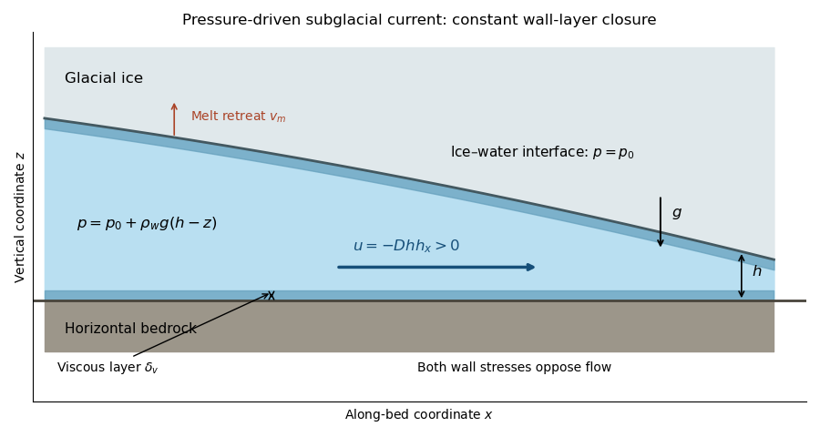

<h1 id="3/a/solution">Solution</h1>

↑ **Parent:** [A](../a.md)

Let $h$ be the water-layer thickness and $z=0$ the horizontal bedrock. In the [hydrostatic approximation](../../../../../../hydrostatic-approximation.md), with constant ice-interface pressure,

$$
p(x,z,t)=p_0+\rho_wg[h(x,t)-z],\qquad p_x=\rho_wg h_x.
$$

The prescribed two-wall stress balance gives

$$
\frac{2\mu u}{\delta_v}=-\rho_wg h h_x,\qquad
\boxed{u=-D h h_x,\quad q=hu=-D h^2h_x,\quad D=\frac{\rho_wg\delta_v}{2\mu}>0.}
$$

In this [subglacial current with constant viscous wall layers](../../../../../../subglacial-current-with-constant-viscous-wall-layers.md), the uniform-pressure ice roof is treated as a movable confining boundary; the closure neglects inertia in comparison with pressure and wall stress. The bulk may be turbulent, while the specified wall [viscous boundary layer](../../../../../../viscous-boundary-layer.md) supplies the linear stress relation. A different turbulent drag law would give a different transport coefficient and similarity exponent.

**[Figure 1](#3/a/image-subglacial-water-layer-with-constant-interface-pressure-hydrostatic-driving-and-two-viscous-wall-layers). Subglacial water layer with constant interface pressure, hydrostatic driving and two viscous wall layers**.

Without melting, the depth-integrated [continuity equation](../../../../../../continuity-equation.md) gives $h_t+q_x=0$, hence

$$
\boxed{h_t=D\partial_x(h^2h_x).}
$$

To write this in the PDF's displayed plus-sign form, its constant must be

$$
\boxed{\gamma=-D=-\frac{\rho_wg\delta_v}{2\mu}.}
$$

The signed value is essential. If the printed $\gamma$ were interpreted as a positive diffusivity, its equation would drive water uphill and be backward parabolic. For example, linearizing around a uniform depth $H$ would give a Fourier perturbation growth rate $+\gamma H^2k^2$, whereas the derived physical equation damps it at $-DH^2k^2$. The plus-sign form is consistent only with the negative $\gamma$ above.

## ↑ Ancestors (11)

1. [A](../a.md)
2. [3](../../3.md)
3. [Paper 65](../../../paper-65-split.md)
4. [Iii](../../../split.md)
5. [2013](../../../../split.md)
6. [Past exam of the mathematics course of the University of Cambridge](../../../../../split.md)
7. [Mathematics course of the University of Cambridge](../../../../../../mathematics-course-of-the-university-of-cambridge.md)
8. [Course of the University of Cambridge](../../../../../../course-of-the-university-of-cambridge.md)
9. [University of Cambridge](../../../../../../university-of-cambridge-split.md)
10. [List of universities](../../../../../../list-of-universities.md)
11. [Codex Wiki](../../../../../../split.md)
