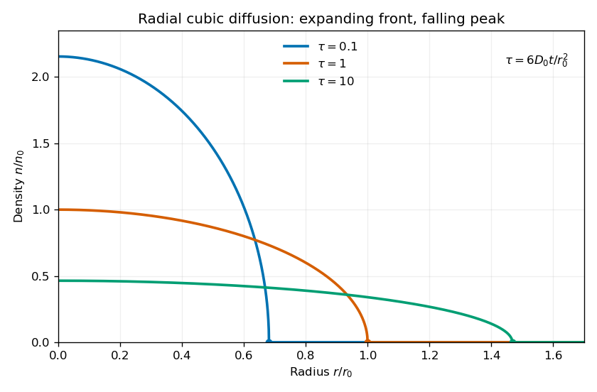

<h1 id="3/solution">Solution</h1>

↑ **Parent:** [3](../3.md)

Assume $D_0,n_0,Q>0$. The density-dependent [diffusion coefficient](../../../../../diffusion-coefficient.md) makes this a cubic [porous medium equation](../../../../../porous-medium-equation.md), since its two-dimensional form is $n_t=[D_0/(3n_0^2)]\Delta(n^3)$. The mass-preserving [similarity solution](../../../../../similarity-solution.md) is a [radial cubic-diffusion source profile](../../../../../radial-cubic-diffusion-source-profile.md). At fixed $r$, the proposed scaled density gives

$$
n_t=-n_0\lambda^{-3}\dot\lambda(2F+\xi F'),\qquad
\frac{D_0}{r}\partial_r\left[r(n/n_0)^2n_r\right]
=\frac{D_0n_0}{r_0^2}\lambda^{-8}\frac1\xi(\xi F^2F')'.
$$

Separation is possible when

$$
\boxed{\lambda^5\dot\lambda=\gamma D_0/r_0^2,}
$$

where $\gamma$ is a constant. The resulting [ordinary differential equation](../../../../../ordinary-differential-equation.md) is

$$
(\xi F^2F')'+\gamma\xi(2F+\xi F')=0.
$$

Recognize the second term as $\gamma(\xi^2F)'$. Regularity and zero radial flux at the origin set the integration constant to zero:

$$
\xi F^2F'+\gamma\xi^2F=0.
$$

In the region $F>0$, this reduces to $FF'=-\gamma\xi$, giving $F^2=1-\gamma\xi^2$ from the central normalization. For a nonnegative profile whose front is precisely at $\xi=1$, the first zero fixes $\gamma=1$. Continuity of the density excludes truncating a positive value at the front. Hence

$$
\boxed{F(\xi)=\begin{cases}\sqrt{1-\xi^2},&0\leq\xi<1,\\0,&\xi\geq1,\end{cases}
\qquad \lambda(t)=\left(\frac{6D_0t}{r_0^2}\right)^{1/6}.}
$$

Here integrating the scale equation gives $\lambda^6=6D_0t/r_0^2+\text{constant}$, and the point-source initial condition requires $\lambda(0)=0$.

Use the planar area element, not the one-dimensional area under the drawn profile. [Mass conservation](../../../../../mass-conservation.md) gives

$$
Q=2\pi\int_0^\infty r n(r,t)\,dr
=2\pi n_0r_0^2\int_0^1\xi\sqrt{1-\xi^2}\,d\xi
=\frac{2\pi n_0r_0^2}{3}.
$$

Thus **the scale and the complete density are**

$$
\boxed{r_0=\sqrt{\frac{3Q}{2\pi n_0}},\qquad
n(r,t)=\frac{n_0}{\lambda(t)^2}\left[1-\frac{r^2}{r_0^2\lambda(t)^2}\right]_+^{1/2},\quad t>0,}
$$

where $[u]_+=\max(u,0)$. The factors of $n_0$ are necessary on dimensional grounds; the length scale is not a function of $Q$ alone.

The front and peak obey

$$
\boxed{R(t)=r_0\lambda(t)\propto t^{1/6},\qquad n(0,t)=n_0\lambda(t)^{-2}\propto t^{-1/3}.}
$$

Each radial profile starts with horizontal tangent at the origin, decreases to a square-root edge, and is identically zero beyond $R(t)$. Later profiles are wider and lower. This is [finite propagation in porous-medium diffusion](../../../../../finite-propagation-in-porous-medium-diffusion.md), because the [diffusion coefficient](../../../../../diffusion-coefficient.md) vanishes at zero density. The sketch uses dimensionless time $\tau=6D_0t/r_0^2$; it preserves the radial integral $2\pi\int rn\,dr$, not the unweighted area under each curve.

**[Figure 1](#3/image-radial-cubic-diffusion-the-population-front-expands-while-the-central-density-falls). Radial cubic diffusion: the population front expands while the central density falls**.

At the front $F'$ diverges, so the profile is a [weak solution](../../../../../weak-solution.md), not a globally smooth classical solution. Nevertheless $F^2F'=-\xi\sqrt{1-\xi^2}$ tends to zero there. The density and flux both match their zero exterior values, so extending the interior solution by zero creates no spurious boundary source in the conservation law. The behavior at the origin is regular because $F'(0)=0$.

Finally, the point release is recovered as a distributional initial condition. For any continuous compactly supported test function $\varphi$ on the plane, the total density remains $Q$ and all its support lies in the shrinking disk $r\leq R(t)$. Therefore

$$
\left|\int_{\mathbb R^2}n(|\mathbf x|,t)\varphi(\mathbf x)\,d^2x-Q\varphi(0)\right|
\leq Q\sup_{|\mathbf x|\leq R(t)}|\varphi(\mathbf x)-\varphi(0)|\longrightarrow0.
$$

Thus $n(\cdot,t)\to Q\delta^{(2)}$ as $t\downarrow0$, in the sense of the [Dirac delta function](../../../../../dirac-delta-function.md).

## ↑ Ancestors (10)

1. [3](../3.md)
2. [Paper 66](../../paper-66-split.md)
3. [Iii](../../split.md)
4. [2013](../../../split.md)
5. [Past exam of the mathematics course of the University of Cambridge](../../../../split.md)
6. [Mathematics course of the University of Cambridge](../../../../../mathematics-course-of-the-university-of-cambridge.md)
7. [Course of the University of Cambridge](../../../../../course-of-the-university-of-cambridge.md)
8. [University of Cambridge](../../../../../university-of-cambridge-split.md)
9. [List of universities](../../../../../list-of-universities.md)
10. [Codex Wiki](../../../../../split.md)
