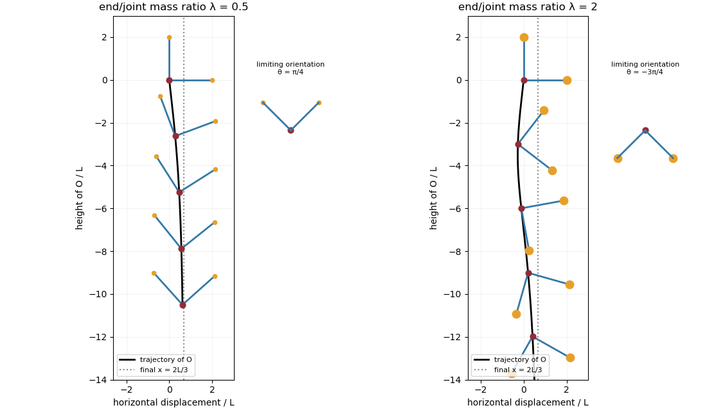

<h1 id="2/solution">Solution</h1>

↑ **Parent:** [2](../2.md)

For two [Stokes flows](../../../../../stokes-flow-split.md) $(u^{(1)},\sigma^{(1)})$ and $(u^{(2)},\sigma^{(2)})$ of the same [dynamic viscosity](../../../../../dynamic-viscosity.md) in the same region, with no volume [force](../../../../../force.md), the [Lorentz reciprocal theorem](../../../../../lorentz-reciprocal-theorem-for-stokes-flow.md) states

$$
\boxed{\int_{\partial V}u^{(1)}\cdot\sigma^{(2)}n\,dS
=\int_{\partial V}u^{(2)}\cdot\sigma^{(1)}n\,dS.}
$$

Indeed, the [divergence](../../../../../divergence.md) of their cross-work difference is

$$
\partial_j\left(u_i^{(1)}\sigma_{ij}^{(2)}-u_i^{(2)}\sigma_{ij}^{(1)}\right)
=2\mu\left(e^{(1)}:e^{(2)}-e^{(2)}:e^{(1)}\right)=0.
$$

The [pressure](../../../../../pressure.md) terms vanish by [incompressible flow](../../../../../incompressible-flow.md), and the derivatives of the [Cauchy stress tensors](../../../../../cauchy-stress-tensor.md) vanish by the [Stokes equation](../../../../../stokes-equation.md). The [divergence theorem](../../../../../divergence-theorem.md) proves the result.

Use the convention that $F,G$ are the [force](../../../../../force.md) and [torque](../../../../../torque.md) exerted by the body on the fluid. By [Linearity of Stokes flow](../../../../../linearity-of-stokes-flow.md), $(F,G)=\mathsf R(U,\Omega)$. Applying the [Lorentz reciprocal theorem](../../../../../lorentz-reciprocal-theorem-for-stokes-flow.md) to two independent rigid motions gives $q_1^T\mathsf Rq_2=q_2^T\mathsf Rq_1$, so the [hydrodynamic resistance matrix](../../../../../hydrodynamic-resistance-matrix.md) is a [symmetric matrix](../../../../../symmetric-matrix.md). The boundary-power identity gives

$$
q^T\mathsf Rq=F\cdot U+G\cdot\Omega=2\mu\int e:e\,dV.
$$

This is strictly positive for nonzero rigid motion: equality would imply $e=0$, hence a rigid motion throughout the connected fluid, which must vanish since the fluid is at rest at infinity. The [no-slip boundary condition](../../../../../no-slip-boundary-condition.md) would then force $q=0$. Therefore $\mathsf R$ is a [positive-definite matrix](../../../../../positive-definite-matrix.md). Reversing to the fluid-on-body [force](../../../../../force.md) changes the sign of the force law, not the positive resistance coefficients.

For the two rods, take the [torque](../../../../../torque.md) about $O$ and use body axes. On the $x$-rod, $X=(s,0,0)$, $0\leq s\leq2L$, and its [slender-body force density](../../../../../slender-body-force-density.md) is

$$
f_x=C\left(\frac{U_x}{2},\ U_y+s\Omega_z,\ U_z-s\Omega_y\right).
$$

On the $y$-rod it is

$$
f_y=C\left(U_x-s\Omega_z,\ \frac{U_y}{2},\ U_z+s\Omega_x\right).
$$

Integrate $f$ and $X\times f$ along both rods, using $\int ds=2L$, $\int s\,ds=2L^2$ and $\int s^2\,ds=8L^3/3$. A convenient dimensionally uniform statement of the complete [right-angle two-rod resistance matrix](../../../../../right-angle-two-rod-resistance-matrix.md) is

$$
\boxed{\begin{pmatrix}F_x\\F_y\\F_z\\G_x/L\\G_y/L\\G_z/L\end{pmatrix}
=CL\begin{pmatrix}
3&0&0&0&0&-2\\
0&3&0&0&0&2\\
0&0&4&2&-2&0\\
0&0&2&8/3&0&0\\
0&0&-2&0&8/3&0\\
-2&2&0&0&0&16/3
\end{pmatrix}
\begin{pmatrix}U_x\\U_y\\U_z\\L\Omega_x\\L\Omega_y\\L\Omega_z\end{pmatrix}.}
$$

In physical coordinates this means translation–translation entries scale as $CL$, the two translation–rotation blocks as $CL^2$, and rotation–rotation entries as $CL^3$. The planar block has inverse

$$
\begin{pmatrix}3&0&-2\\0&3&2\\-2&2&16/3\end{pmatrix}^{-1}
=\begin{pmatrix}1/2&-1/6&1/4\\-1/6&1/2&-1/4\\1/4&-1/4&3/8\end{pmatrix}.
$$

This verifies the printed [hydrodynamic mobility matrix](../../../../../hydrodynamic-mobility-matrix.md) with its third [velocity](../../../../../velocity.md) component $L\Omega_z$; the TeX aid's $\Omega_x$ is an OCR error.

Take laboratory vertical [velocity](../../../../../velocity.md) positive upwards. The body axes are $e_1=(\cos\theta,\sin\theta)$ and $e_2=(-\sin\theta,\cos\theta)$. In quasistatic sedimentation the [force](../../../../../force.md) and [torque](../../../../../torque.md) exerted on the fluid equal the gravitational resultants on the body:

$$
F_x=-(1+2\lambda)mg\sin\theta,\quad F_y=-(1+2\lambda)mg\cos\theta,
\quad G_z=2\lambda mgL(\sin\theta-\cos\theta).
$$

The out-of-plane block is unforced, so its positive [hydrodynamic resistance matrix](../../../../../hydrodynamic-resistance-matrix.md) gives $U_z=\Omega_x=\Omega_y=0$. Substitution in the planar [hydrodynamic mobility matrix](../../../../../hydrodynamic-mobility-matrix.md) gives

$$
\frac{CL}{mg}U_x=\frac{1-\lambda}{6}\cos\theta-\frac{1+\lambda}{2}\sin\theta,\qquad
\frac{CL}{mg}U_y=\frac{1-\lambda}{6}\sin\theta-\frac{1+\lambda}{2}\cos\theta,
$$

and

$$
\boxed{CL^2\dot\theta=\frac{(1-\lambda)mg}{4}(\cos\theta-\sin\theta).}
$$

For $0\leq\lambda<1$, this [ordinary differential equation](../../../../../ordinary-differential-equation.md) has positive right side on $0\leq\theta<\pi/4$, with a stable zero at $\pi/4$. Uniqueness prevents crossing that equilibrium in finite time. For $\lambda>1$ the initial angular [velocity](../../../../../velocity.md) is negative, and the stable equilibrium reached from zero is $-3\pi/4$. **The heavier-end body turns clockwise through $3\pi/4$; it does not settle at $\pi/4$.** More explicitly, with $K=(1-\lambda)mg/(4CL^2)$,

$$
\tan\frac{\theta-\pi/4}{2}=-\tan(\pi/8)e^{-\sqrt2 Kt},
$$

where the continuous branch has $\theta-\pi/4\in(-\pi,0)$. At $\lambda=1$, $\theta$ remains zero.

Transforming the translational [velocity](../../../../../velocity.md) back to laboratory axes gives

$$
\boxed{U_h=\frac{(1-\lambda)mg}{6CL}\cos2\theta},\qquad
U_v=\frac{mg}{CL}\left[-\frac{1+\lambda}{2}+\frac{1-\lambda}{6}\sin2\theta\right]<0.
$$

For $\lambda\ne1$, eliminate time between $U_h$ and the angular [velocity](../../../../../velocity.md):

$$
\frac{dx_O}{d\theta}=\frac{2L}{3}(\cos\theta+\sin\theta),\qquad
x_O(\theta)-x_O(0)=\frac{2L}{3}(1+\sin\theta-\cos\theta).
$$

At either limiting orientation $\sin\theta=\cos\theta$. Thus **both cases have the same net horizontal displacement**,

$$
\boxed{x_O(\infty)-x_O(0)=2L/3.}
$$

For $\lambda<1$ the drift is monotonically rightwards. For $\lambda>1$ it first moves left, reaching $x_O-x_O(0)=(2L/3)(1-\sqrt2)$ at $\theta=-\pi/4$, then reverses. The total horizontal path length in this second case is $(2L/3)(2\sqrt2-1)$, whereas its net displacement is $2L/3$ rightwards. At $\lambda=1$ it falls vertically without rotation or drift; taking the infinite-time limit before $\lambda\to1$ is consequently singular.

For the requested [sedimentation drift of a weighted two-rod body](../../../../../sedimentation-drift-of-a-weighted-two-rod-body.md) sketch, a full parametric trajectory follows by also integrating $U_v/\dot\theta$. Put $\psi=\theta-\pi/4$ and set the initial height to zero:

$$
z_O(\theta)=\frac{2\sqrt2 L(1+2\lambda)}{3(1-\lambda)}
\ln\frac{|\tan(\psi/2)|}{\tan(\pi/8)}
-\frac{2\sqrt2 L}{3}\left(\cos\psi-\frac1{\sqrt2}\right).
$$

It tends to $-\infty$ in either case while $x_O$ tends to $2L/3$. At $\lambda<1$ both rods end pointing upwards from $O$ symmetrically; at $\lambda>1$ they end pointing downwards symmetrically. The asymptotic downward speed is $(1+2\lambda)mg/(3CL)$.

**[Figure 1](#2/image-falling-two-rod-bodies-trajectory-of-o-and-successive-orientations-for-lighter-and-heavier-end-masses). Falling two-rod bodies: trajectory of O and successive orientations for lighter and heavier end masses**.

## ↑ Ancestors (10)

1. [2](../2.md)
2. [Paper 68](../../paper-68-split.md)
3. [Iii](../../split.md)
4. [2013](../../../split.md)
5. [Past exam of the mathematics course of the University of Cambridge](../../../../split.md)
6. [Mathematics course of the University of Cambridge](../../../../../mathematics-course-of-the-university-of-cambridge.md)
7. [Course of the University of Cambridge](../../../../../course-of-the-university-of-cambridge.md)
8. [University of Cambridge](../../../../../university-of-cambridge-split.md)
9. [List of universities](../../../../../list-of-universities.md)
10. [Codex Wiki](../../../../../split.md)
